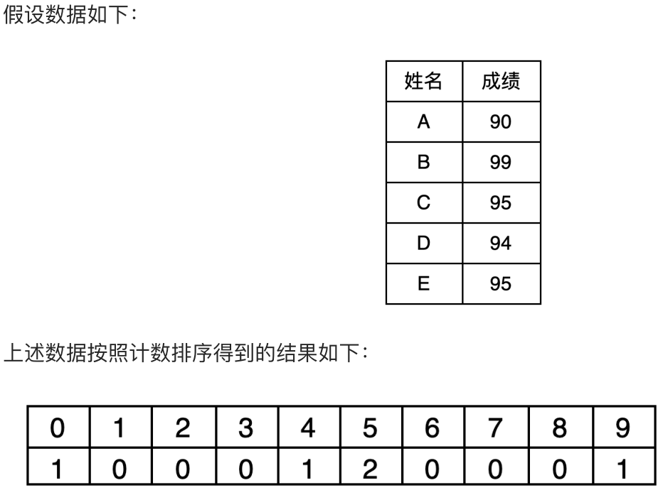
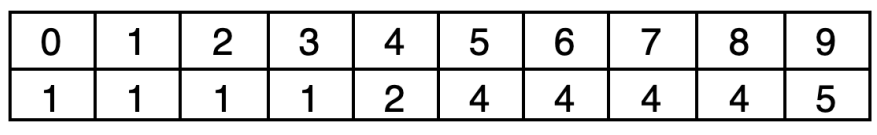
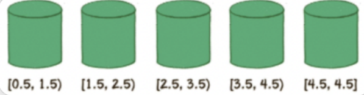

# 计数排序
- 前面介绍的冒泡，选择，插入，归并，快速，希尔，堆排序，都是基于比较的排序，这些基于比较的排序，有以下几个特点：平均时间复杂度最低的是 $O(nlogn)$

- 而计数排序，不是基于比较的排序。其中不基于比较的排序还有桶排序，基数排序等

- 它们是典型的用空间换时间，在某些时候，平均时间复杂度可以比 $O(nlogn)$ 更低，也就是说，在某些时候，这种利用空间换时间的排序算法，性能比前面基于比较的排序算法更快。

---
## 概述

计数排序是在1954年由HaroldH.Seward提出，适合对一定范围内的整数进行排序。
计数排序核心思想

**统计每个整数在序列中出现的次数，进而推导出每个整数在有序序列中的索引**。

我们以数组[1,4,1,2,5,2,4,1,8]为例进行说明。<br>
第一步：建立一个初始化为0，长度为9（原始数组中的最大值8 加 1）的数组`count[]`。<br>
第二步：遍历数组[1,4,1,2,5,2,4,1,8]，访问第一个元素 1，然后将数组下标为 1的元素加 1，表示当前 1 出现了一次，即 `count[1] = 1`;

依次遍历，对`count`进行统计。

伪代码: *类似于数组下标实现的哈希表*

```C++
void 计数排序(vector<int>& arr) {
    int lenMax = 0;
    for (auto& it : arr)
        lenMax = max(it, lenMax);

    // 进行计数
    vector<int> count(lenMax, 0);
    for (auto& it : arr)
        ++count[it];

    // 输出
    for (int i = 0; i < lenMax; ++i)
        for (int j = 0; j < count[i]; ++j)
                printf("%d ", i);
}
```

## 计数排序的改进

上述算法的问题如下：
1. 无法对负整数进行排序
2. 极其浪费内存空间
3. 是一个不稳定排序

### 改进一

只要不再以输入数列的`[最大值+1]`，作为统计数组的长度，而是以数列`[最大值-最小值+1]`作为统计数组的长度即可。数列的最小值作为一个偏移量，用于计算整数在统计数组中的下标。

比如，假设下面的数组的数列：<br>
95,94, 91, 98, 99,90, 99, 93,91, 92

统计出数组的长度为 $99-90+1=10$ ,偏移量等于数列的最小值 $90$。对于第1个整数 $95$，对应的统计数组下标是 $95-90=5$。

### 改进二

---
不用看这里

---



如何判断5中的2个人谁是C谁是E呢? 那么需要进行变形。

这是如何变形的呢？其实就是从统计数组的第2个元素开始，每一个元素都加上**前面所有元素之和**。

这样相加的目的，是让**统计数组**存储的**元素值**，等于**相应整数的最终排序位置的序号**。例如，下标是9的元素值为5，代表原始数列的整数9，最终的排序在第5位。




首先，遍历成绩表最后一行E的成绩，E是95，那么5下标元素是4，表示E在最后的排名在第4位，同时将原来的值减1，表示下次再遇到95的成绩时，最终排名是第3。

~~(*还是不理解*)~~

# 桶排序
~~好像是为了解决上面不能解决小数排序的问题?~~

其实桶排序重要的是它的思想，而不是具体实现，桶排序从字面的意思上看：
1. 若干个桶，说明此类排序将数据放入若干个桶中。
2. 每个桶有容量，桶是有一定容积的容器，所以每个桶中可能有多个元素。
3. 从整体来看，整个排序更希望桶能够更匀称，即既不溢出(太多)又不太少
假设有一个非整数数列，如下：<br>
4.5, 0.84, 3.25, 2.18, 0.5<br>
桶排序的第1步，就是创建这些桶，并确定每一个桶的区间范围。



具体需要建立多少个桶，如何确定桶的区间范围，有很多种不同的方式。我们这里创建的桶数量等于原始数列的元素数量，除最后一个桶只包含数列最大值外，前面各个桶的区间按照比例来确定。

区间跨度= (最大值-最小值） ／ (桶的数量-1)

第2步，遍历原始数列，把元素对号入座放入各个桶中。

第3步，对每个桶内部的元素分别进行排序。

第4步，遍历所有的桶，输出所有元素。

0.5,0.84，2.18,3.25,4.5