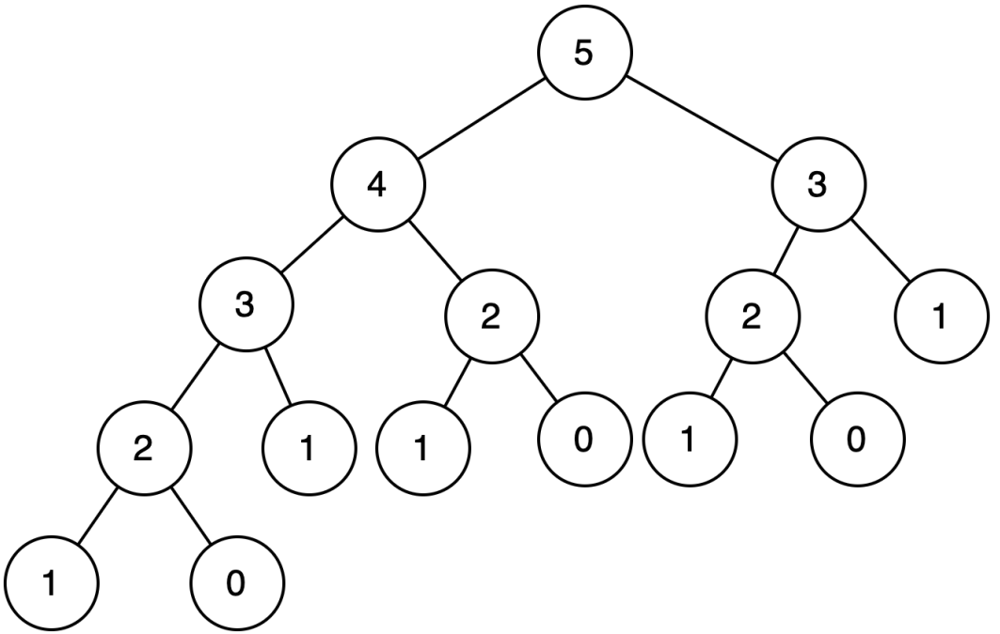

# 初探动态规划
## 1.方法论
在学习动态规划时切忌望文生义，因为其名字与其思想八竿子打不着。你可以自己起一个能让自己记住其思想的名字更好，比如递推公式法，状态转移方程法等等。

与其说动态规划是一个算法，还不如说是解决问题的方法论。

动态规划的一般形式就是求最优值，比如最长公共子序列、最大子段和、最优二叉搜索树等等。

### 1.1 基本思想
动态规划算法与分治法类似，其基本思想就是将待求解问题分解成若干子问题，先求解子问题，然后从这些子问题的解得到原问题的解。

与分治法不同的是，适合动态规划法求解的问题，经分解得到的子问题往往不是相互独立的。若用分治法来解这类问题，则分解得到的子问题数目太多，以至于最后解决原问题需要耗费指数时间。然而，不同子问题的数目常常只有多项式量级。

在用分治法求解时，有些子问题被重复结算了很多次。如果我们能够保存已经解决的子问题的答案，而在需要时再找出已求得的答案，这样就可以避免大量的重复计算，从而得到多项式时间复杂度的算法。为了达到此目的，可以用一个表来记录所有已解决的子问题的答案，不管该子问题以后是否被用到，只要它被计算过，就将其结果填入表中。这就是动态规划的基本思想。

- 基本要点:
    将待求解问题分解成若干子问题，先求解子问题，然后从这些子问题的解得到原问题的解；经分解得到的子问题往往不是相互独立的；保存已经解决的子问题的答案，避免重复计算。

### 1.2 动态规划的基本要素
动态规划算法就是将待求解问题分解成若干子问题，先求解子问题并保存子问题的答案避免重复计算，然后从这些子问题的解得到原问题的解。而如何断定一个问题是否可以用动态规划来解决，就需要掌握动态规划的两个基本要素，「最优子结构性质」和「重叠子问题性质」。

## 2.重叠子问题
在用递归算法自顶向下解决一个问题时，每次产生的子问题并不总是新问题，有些子问题被反复计算多次。动态规划正是利用了这种子问题的重叠性质，对每个子问题只解一次，而后将其解保存到一个表格中，当再次需要解此子问题时，只是简单地用常数时间查看一下结果。

动态规划经分解得到的子问题往往不是相互独立的。如果经分解得到的子问题的解之间相互独立，比如二分查找（Binary Search）经分解得到的子问题之间相互独立，不存在重叠子问题，所以不适合用动态规划，更适合分治算法。而斐波那契数列问题则更适用于动态规划，虽然严格意义上斐波那契数列的解决并不是动态规划的普适应用（动态规划的一般形式是求最优值！），但是对于我们理解动态规划的「重叠子问题性质」大有益!

从斐波那契数列来看：F(n) = F(n－1）+ F(n－ 2)


```C++
unsigned int fib(unsigned int n) {
    cnt++; // 统计fib函数调⽤的次数
    if (n == 0) {
        return 0;
    }
    if (n == 1) {
        return 1;
    }
    return fib(n - 1) + fib(n - 2);
}
```

| ##container## |
|:--:|
||

通过递归树中，可以发现多次重复计算，比如3节点。可以看到，fib(3）被调用了两次，如果我们已经保存fib(3)的值，我们就可以复用保存的 fib(3)的值，而不是重新计算，fib(2)也是同样的道理。保存重叠子问题的解（也就是fib(3)）有以下两种方式。

### 2.1 备忘录 (记忆化搜索表)
备忘录方法用表格保存已解决的子问题的答案，在下次需要解此子问题时，只要简单地查看该子问题的答案，而不必重新计算。备忘录方法的递归方式是自顶向下的，而动态规划表则是自底向上递归的。因此，备忘录方法的控制结构与直接递归方法的控制结构相同，区别在于备忘录方法为每个解过的子问题建立了备忘录以备需要时查看，避免相同子问题的重复求解。

备忘录方法为每一个子问题建立一个记录项，初始时，该记录项存入一个特殊的值，表示该子问题尚未被解决（比如斐波那契数的备忘录版本中将其设置为-1）。

在求解过程中，对每个待求解的子问题，首先查看其相应的记录项。若记录项中存储的是初始化时存入的特殊值，则表示该子问题是第一次遇到，此时计算出该子问题的解，并保存在相应的记录项中，以备以后查看。若记录项中存储的已不是初始化时存入的特殊值，则表示该子问题已被计算过，其相应的记录项存储的是该子问题的答案。此时，只要从记录项中取出该子问题的答案即可，而不必重新计算。

```C++
// memo[i] 记忆了第i个斐波那契数列的值
static unsigned int *memo;
unsigned int fib(unsigned int n) {
    cnt++;
    if (n == 0) {
        return 0;
    }
    if (n == 1) {
        return 1;
    }
  
    if (memo[n] == -1)
        memo[n] = fib(n - 1) + fib(n - 2);
    return memo[n];
}
```

### 2.2 DP table
DP table就是动态规划算法自底向上建立的一个表格，用于保存每一个子问题的解，并返回表中的最后一个解。比如斐波那契数，我们先计算 fib(O)，然后 fib(1)，然后 fib(2)，然后 fib(3)，以此类推,直至计算出fib(n)。

比如我们计算 fib(5)，先由 fib(O)+ fib(1）得到 fib(2)，再由 fib(1)+ fib(2)得到 fib(3)，再由fib(2) + fib(3) 得到 fib(4)，最后由 fib(3) + fib(4) 得到 fib(5)。

也就是说，我们只需要存储子问题的解，而不需要重复计算子问题的解。


```C++
unsigned int fib(unsigned int n) {
    unsigned int *mem = (unsigned int *) malloc(sizeof(unsigned int) * (n + 1));
    mem[0] = 0;
    mem[1] = 1;
    for (int i = 2; i <= n; ++i) {
        mem[i] = mem[i - 1] + mem[i - 2];
    }
    return mem[n];
}
```

当然，斐波那契数列可以非常好理解重复子问题的优化，但实际上，可以将空间复杂度变为O(1)的方式。

```C++
unsigned int fib(unsigned int n) {
    unsigned int result;
    unsigned int fib0 = 0;
    unsigned int fib1 = 1;
    for (int i = 2; i <= n; ++i) {
        result = fib0 + fib1;
        fib0 = fib1;
        fib1 = result;
    }
    return result;
}
```

## 3.如何解决动态规划问题
动态规划（Dynamic Programming，DP）是在多项式时间解决特定类型问题的一套方法论，且远远快于指数级别的蛮力法，而且动态规划的正确性是可以严格证明的。只不过这种证明对于解决动态规划问题并不具有决定性因素，所以略去。

解决动态规划问题四步法：
> 1. 辨别是不是一个动态规划问题;
> 2. 确定状态
> 3. 建立状态之间的关系;
> 4. 为状态添加备忘录或者DP Table。

### 3.1 第一步：如何断定一个问题是动态规划问题？
一般情况下，需要求最优解的问题(最短路径问题，最长公共子序列，最大字段和等等，出现最字就留意),在一定条件下对排列进行计数的计数问题或某些概率问题都可以考虑用动态规划来解决。

所有的动态规划问题都满足重叠子问题性质，大多数经典的动态规划问题还满足最优子结构性质，当我们从一个给定的问题中发现了这些特性，就可以确定其可以用动态规划解决。

### 3.2 第二步：确定状态
DP问题最重要的就是确定所有的状态和状态与状态之间的转移方程。确定状态转移方程是动态规划最难的部分，但也是最基础的，必须非常谨慎地选择状态，因为状态转移方程的确定取决于对问题状态定义的选择。那么，状态到底是个什么鬼呢?

「状态」可以视为一组可以唯一标识给定问题中某个子问题解的参数，这组参数应尽可能的小，以减少状态空间的大小。比如斐波那契数中，0，1，…，n 就可以视为参数，而通过这些参数定义出的`DP[O]，DP[1]，DP[2]，…，DP[n]`就是状态，而状态与状态之间的转移方程就是 `DP(n）= DP(n-1）+ DP(n-2)`。

再比如，经典的背包问题中，状态通过`index`和`weight`两个参数来定义，即`DP[index][weight]`。

`DP[index][weight]`则表示当前从`O`到`index`的物品装入背包 中可以获得的最大重量。因此，参数index和weight可以唯一确定背包问题的一个子问题的解。

所以，当确定给定的问题之后，首当其冲的就是确定问题的状态。动态规划算法就是将待求解问题分解成若干子问题，先求解子问题并保存子问题的答案避免重复计算，然后从这些子问题的解得到原问题的解。既然确定了一个一个的子问题的状态，接下来就是确定前一个状态到当前状态的转移关系式,也称状态转移方程。

### 3.3 第三步：构造状态转移方程
构造状态转移方程是DP问题最难的部分，需要足够敏锐的直觉和观察力，而这两者都是要通过大量的练习来获得。我们用一个简单的问题来理解这个步骤。

> 问题描述：给定3个数{1，3，5}，请问使用这三个数，有多少种方式可以构造出一个给定的数n(允许重复和不同顺序)。
>
> 设 n = 6，使用{1，3，5} 则共有 8 种方式可以构造出n:
>
> 1+1+1+1+1+1 | 1+1+1+3 | 1+1+3+1 | 1+3+1+1 | 3+1+1+1 | 3+3 | 1+5 |5+1

我们现在考虑用动态规划的方法论来解决。首先确定该问题的状态，由于参数n可以唯一标识任意一个子问题，我们用参数n来确定状态。所以，上述问题的状态就可以表示为 DP[n]，代表使用{1，3，5}作为元素可以形成n的总的序列数。接下来就是计算DP[n]了，因为我们仅能使用{1，3，5} 来形成给定的数字n，我们可以先考虑n=1,2,3,4,5,6 的结果，就是求出 n 等于 1，2，3，4，5，6 的状态值。

DP[n = 1] = 1, DP[n = 2] = 1, DP[n = 3] = 2, DP[n = 4] = 3, DP[n = 5] = 5, DP[n = 6] = 8。

现在，我们期望得到DP[n = 7]的值，我可以利用子状态的三种情况得到 n = 7 :

给状态 DP[n= 6] 的序列均加 1，给状态 DP[4] 的序列均加 3，给状态 DP[2] 的序列均加 5。

DP[7] =DP[6] + DP[4] + DP[2] 或者 DP[7] = DP[7 - 1] + DP[7 - 3] + DP[7-5]。

推广下: **DP[n] = DP[n - 1] + DP[n - 3] + DP[n-5]**

#### 3.4 为状态添加备忘录或者DPTable
这个可以说是动态规划最简单的部分，我们仅需要存储子状态的解，以便下次使用子状态时直接查
表从内存中获得。
##### 3.4.1 备忘录方法
...
##### 3.4.2 DP Table
...