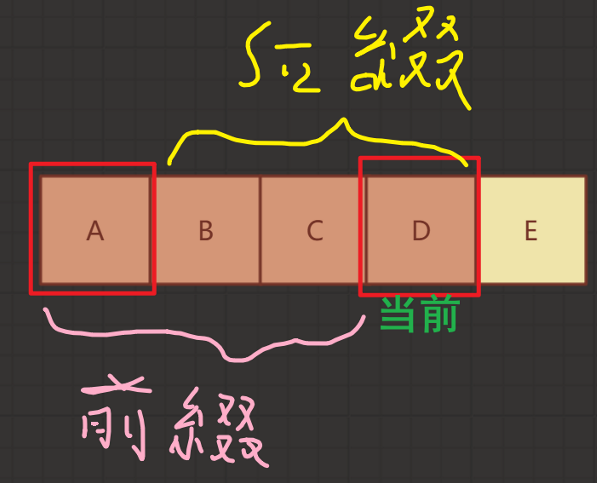
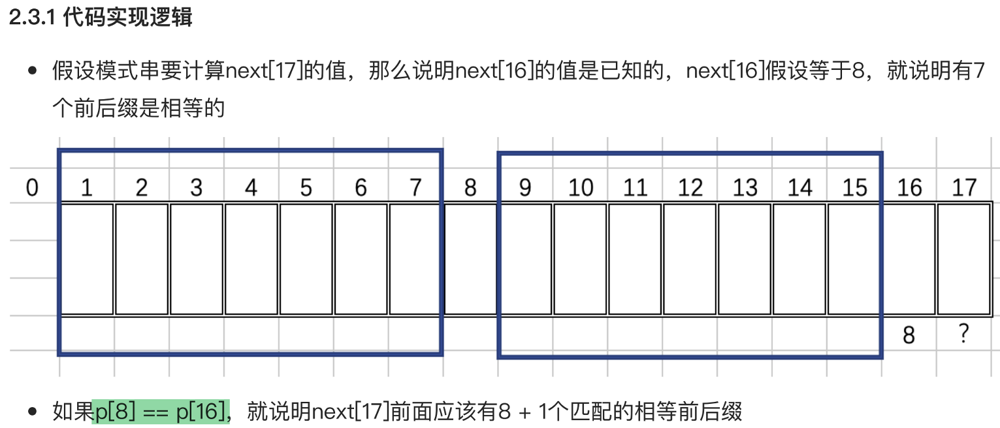
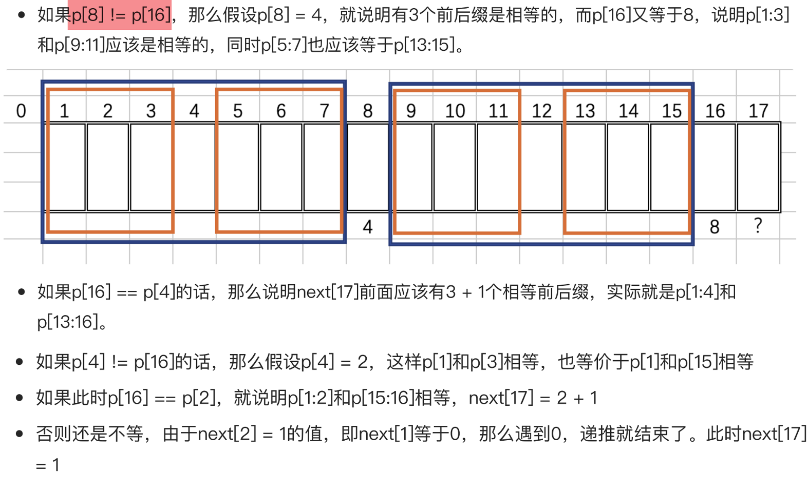

# kmp算法
## 串的定义
串是由零个或者多个字符组成的有限序列。串中字符的个数称为串的长度，含有零个元素的串叫空串。在C语言中，可以用如下语句定义一个名为str的串。

> char str[] = "abcdef";

C语言定义了`'\0'`作为字符串的结束标志，但在描述串的长度时，需要通过扫描整个串才能获得，时间复杂度为O(N)，不如额外定义一个变量专门来存储串的长度，这样求串的长度的时间复杂度为O(1)的操作了。

不同的编程语言，是否用`'\0'`作为串的结束标志，是没有定论的，可以通过`length`来约束空间的长度也会更通用。

```C
typedef struct
{
    char *str; // 索引从1开始
    int length;
} Str;
```

## 串的初始化
与普通变量赋值操作不同，串的赋值操作不能直接用`=`来实现，通过定义初始化函数来实现空间拷贝。

```C
void initStr(Str *str, const char *cn)
{
    if (str->str)
    {
        free(str->str);
        str->str = NULL;
    }

    // 计算长度
    int len = 0;
    while (cn[len]) // cn[len] != '\0'
    {
        ++len;
    }
    str->length = len;

    if (len)
    {
        str->str = (char *)malloc(sizeof(char) * (len + 2)); // +1是不要索引0, +2是在前面基础上为了切合c语言习惯把'\0'放下
        for (int i = 0; i <= len; ++i)
        {
            str->str[i + 1] = cn[i];
        }
    }
}
```

## 串的匹配
字符串模式匹配：在主串中找到与模式串相同的子串，并返回其所在位置，

### 暴力匹配(Brute-Force)
- **暴力匹配~~(BoyFriend算法)~~** 也称之为朴素模式匹配，其思想如下：
    - 以字符为单位，从左到右移动模式串，直到匹配成功为止。
    - 从左到右进行匹配，如果模式串中的第一个字符匹配成功，这继续往后进行匹配，如果匹配失败，则模式串从文本串的下一个字符进行匹配，一直重复。
    - 直到匹配成功或者匹配完所有的文本串为止。

- 朴素模式匹配算法的缺点：
    - 当某些子串与模式串部分匹配，一旦出现失配时，主串的扫描指针i经常回溯，导致时间开销增加。
    - 最坏时间复杂度 $O(n＊m)$

- `for`式
  ```C
  int index_BF(Str *str, Str *p)
  {
      for (int i = 1; i < str->length; ++i)
      {
          int j = 1;
          for (; j <= p->length; ++j)
          {
              if (str->str[i + j - 1] != p->str[j])
                  break;
          }
          
          if (j > p->length)
              return i;
      }
  
      return 0; // 没有匹配成功的
  }
  ```

- `while`式

  ```C
  int index_BF_byWhile(Str *str, Str *p)
  {
      int i = 1;
      int j = 1;
      int k = i;
      while (i <= str->length && j <= p->length)
      {
          if (str->str[i] == p->str[j])
          {
              ++i;
              ++j;
          }
          else
          {
              j = 1;
              i = ++k;
          }
      }
      
      if (j > p->length)
          return k;
      
      return 0;
  }
  ```

### KMP算法
由D.E.Knuth，J.H.Morris和V.R.Pratt提出，因此称为KMP算法，他的思想是，不匹配的字符之前，一定是和模式串一致的，是否可以从这个已知信息来确定模式失配时，下次从模式串的第几个位置开始匹配。

> [B站: KMP字符串匹配算法2](https://www.bilibili.com/video/av16828557/)

#### 跳过不可能成功的字符比较
- 假设模式串为"**ab**c**ab**d"，主串为“abcabxxxx"
    - 从主串s[1]开始匹配时，在p[6]时失配
    - 既然在p[6]处失配，那么说明s[1:5]的信息一定是模式串的p[1:5]，所以按照朴素匹配算法，s[2]、s[3]、开始匹配尝试，是不是可以明确肯定不会成功。
    - 而从s[4]开始，有可能成功

#### KMP算法的思想
- 当*子串和模式串不匹配*时，**主串指针i不回溯，通过改变模式串指针j的值**，来确定子串从失配处和模式串的哪个位置进行比较，因为模式串前面的信息我在前面比较的时候已经知道信息了。

- 如果能够存储子串失配后从模式串的哪个位置上进行比较，就可以实现KMP算法，故引入next数组，专门存放这个值。

- 显然，next数组里的值，只跟模式串有关，因为模式串前面已经成功匹配的字符，就表示子串中已经包含了这些字符。

#### 手动算next数组
- 串的前缀：包含第一个字符，且不包含最后一个字符的子串
- 串的后缀：包含最后一个字符，且不包含第一个字符的子串

| ##container## |
|:--:|
||

- 当第j个字符匹配失败，由前[1，j-1]个字符组成的串记为S，手动计算就是根据这个S来决定的
- next[j]的值：S = 最长相等前后缀的长度 + 1，表示对于子串中前j - 1个字符而言

#### next数组值的规律
- next[j]的值每次最多增加1
- 模式串的最后一位字符不影响next数组的结果
- next数组的定义：当主串与模式串的某一位字符不匹配时，模式串要回退到的位置

#### next数组代码实现
| ##container## |
|:--:|
||
||

对于确认 p[17]的next数组, 与p[17]是什么 没有关系

而和 p[17 - 1] (前一个元素) 和 p[next[17 - 1]] (前一个元素的回溯元素) 有关

因为是next[17]的回溯值, 是p[17]匹配失败后执行的


#### kmp代码实现
#### 题目
[P3375 【模板】KMP](https://www.luogu.com.cn/problem/P3375)

使用 string + cin 有问题...

```C++
#include <string>
#include <cstring>
#include <cstdio>

using namespace std;

const int MAX_SIZE = 1e7 + 10;

char s1[MAX_SIZE];
char s2[MAX_SIZE];

int nextArr[MAX_SIZE];

int main(){

    scanf("%s%s", s1, s2);

    int s1_l = strlen(s1);
    int s2_l = strlen(s2);

    // 计算next数组
    {
        for (int i = 1, j = 0; i < s2_l; ++i) {
            while (j > 0 && s2[i] != s2[j]) {
                j = nextArr[j - 1];
            }
            if (s2[i] == s2[j]) {
                ++j;
            }
            nextArr[i] = j;
        }
    }
    
    // 进行匹配
    {
        for (int i = 0, j = 0; i < s1_l; ++i) {
            while (j > 0 && s1[i] != s2[j]) {
                j = nextArr[j - 1];
            }
            if (s1[i] == s2[j]) {
                ++j;
                if (j == s2_l) {
                    // 索引指的是从0开始
                    printf("%d\n", i - s2_l + 2); // i 是索引, 所以 + 1
                                                  // s2_l 不是索引, 所以 +1
                    j = nextArr[j - 1];
                }
            }
        }
    }
    
    for (int i = 0; i < s2_l; ++i) {
        printf("%d%c", nextArr[i], ((i == s2_l - 1) ? '\n' : ' '));
    }
    
    return 0;
}
```


##### 学习版

> なに? 我这个next数组是错的?

```C
#include <stdio.h>
#include <stdlib.h>

typedef struct
{
    char *str; // 索引从1开始
    int length;
} Str;

void initStr(Str *str, const char *cn);         // 初始化字符串, 并且拷贝
int index_BF(Str *str, Str *p);                 // BF算法进行字符串匹配
int index_BF_byWhile(Str *str, Str *p);         // 一种使用while实现的BF算法
void setNextArray(Str *p, int *next);           // 计算 next 数组
int index_KMP(Str *str, Str *p, int *next);     // KMP算法进行字符串匹配

void initStr(Str *str, const char *cn)
{
    if (str->str)
    {
        free(str->str);
        str->str = NULL;
    }

    // 计算长度
    int len = 0;
    while (cn[len]) // cn[len] != '\0'
    {
        ++len;
    }
    str->length = len;

    if (len)
    {
        str->str = (char *)malloc(sizeof(char) * (len + 2)); // +1是不要索引0, +2是在前面基础上为了切合c语言习惯把'\0'放下
        for (int i = 0; i <= len; ++i)
        {
            str->str[i + 1] = cn[i];
        }
    }
}

int index_BF(Str *str, Str *p)
{
    for (int i = 1; i < str->length; ++i)
    {
        int j = 1;
        for (; j <= p->length; ++j)
        {
            if (str->str[i + j - 1] != p->str[j])
                break;
        }
        
        if (j > p->length)
            return i;
    }

    return 0; // 没有匹配成功的
}

int index_BF_byWhile(Str *str, Str *p)
{
    int i = 1;
    int j = 1;
    int k = i;
    while (i <= str->length && j <= p->length)
    {
        if (str->str[i] == p->str[j])
        {
            ++i;
            ++j;
        }
        else
        {
            j = 1;
            i = ++k;
        }
    }
    
    if (j > p->length)
        return k;
    
    return 0;
}

void setNextArray(Str *p, int *next)
{
    int i = 1;
    int j = 0;

    // 设置初状态
    next[0] = 0; // 这个其实不用初始化
    next[1] = 0;
    
    // 绝妙
    while (i <= p->length)
    {
        if (j == 0 || p->str[i] == p->str[j]) // 注意我们判断的是 i 与 j 是否相等
        {
            ++i;            // 相等, 那么 i + 1 的位置(目标位置改变)
            ++j;            // j + 1, 就是 j + 1 个相同的前后缀
            next[i] = j;    // i j 最初相差 1, 所以不可能 i == j
        }
        else
        {
            j = next[j];    // 回溯, 为什么不用重置 j ?, 因为前后缀长度不会跳跃, 也就是我们这一轮计算的 初j
                            // 实际上已经是 所谓待计算位置的前一个的j了!
        }
    }
}

int index_KMP(Str *str, Str *p, int *next)
{
    int i = 1;
    int j = 1;

    while (i <= str->length && j <= p->length)
    {
        if (j == 0 || str->str[i] == p->str[j])
        {
            ++i;
            ++j;
        }
        else
        {
            j = next[j];
        }
    }

    if (j > p->length)
        return i - j + 1;
    return 0;
}

int main(void)
{
    //  - KMP 算法
    Str str, p;
    str.str = NULL;
    p.str = NULL;
    initStr(&str, "ABBCABDABEABABGABB");
    initStr(&p, "ABAB");
    printf("BF: %d\n", index_BF_byWhile(&str, &p));
    printf("KMP:\n");
    int *next = (int *)malloc(sizeof(int) * p.length);
    if (!next)
        printf("ERROR\n");
    
    setNextArray(&p, next);
    for (int i = 0; i <= p.length; ++i)
    {
        printf("%d ", next[i]);
    }
    printf("\n%d\n", index_KMP(&str, &p, next));
    getchar();
    return 0;
}
```
