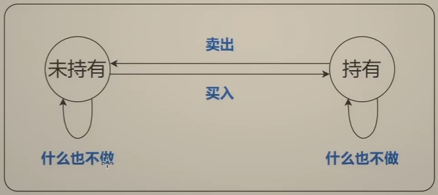
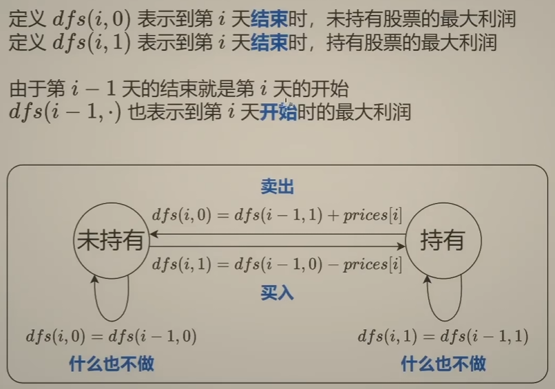
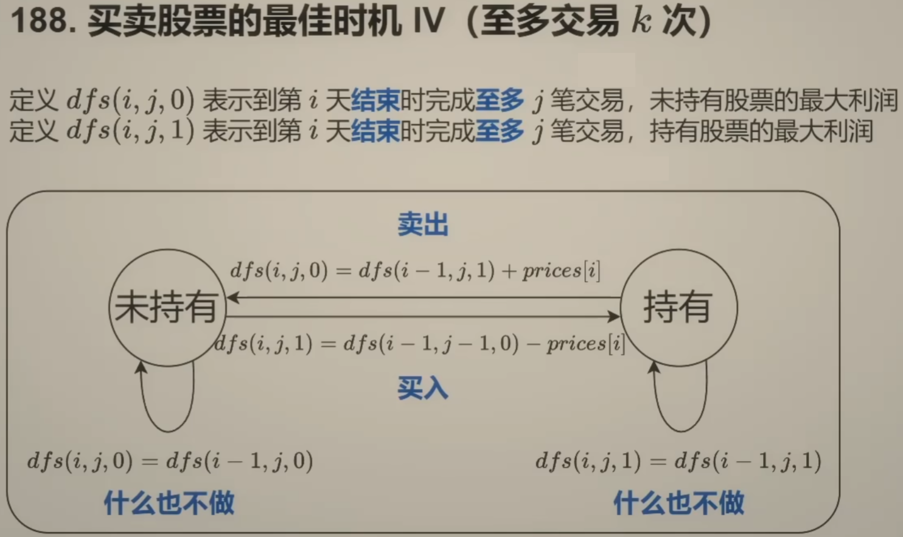
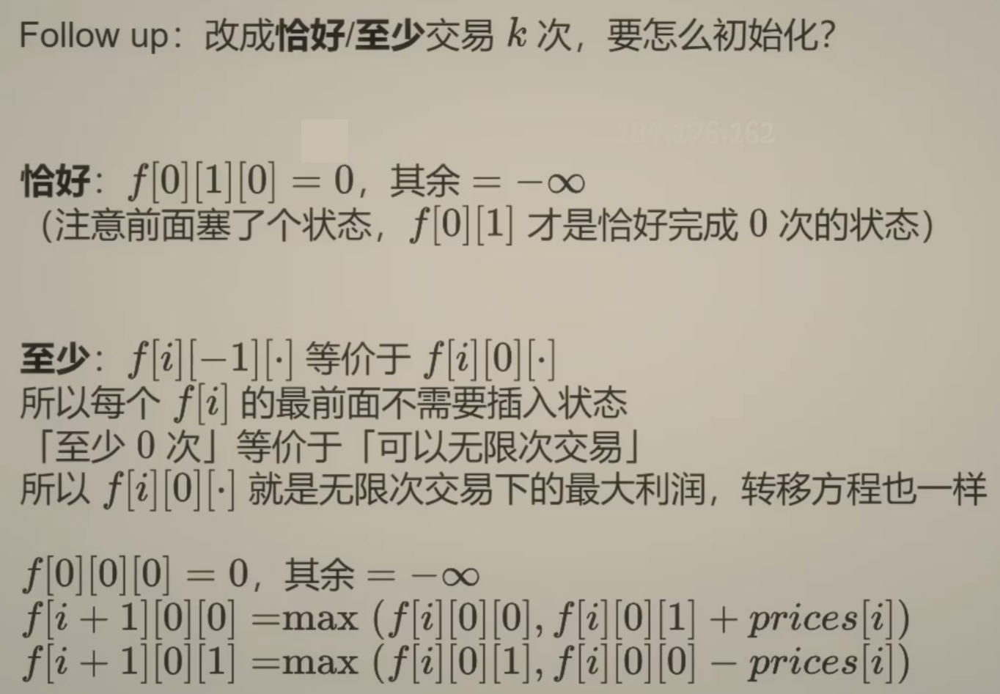

# 买卖股票的最佳时机
<style>
.answer {
  display: none;
  color: red;
  background-color: break;
  padding: 5px;
}

.question:hover .answer {
  display: block;
}
</style>

## 不限制交易次数
给你一个整数数组 prices ，其中 prices[i] 表示某支股票第 i 天的价格。

在每一天，你可以决定是否购买和/或出售股票。你在任何时候 最多 只能持有 一股 股票。你也可以先购买，然后在 同一天 出售。

返回 你能获得的 最大 利润 。

### 启发思路
prices = [7,1,5,3,6,4]

<div class="question" onmouseover="showAnswer(this)" onmouseout="hideAnswer(this)">
<b>思考:</b> 最后一天发生了什么?
  <div class="answer">
    从第 0 天到第 5 天结束获得的利润 = 从第 0 天到第 4 天结束获得的利润 + 第5天的利润
  </div>
</div>

**关键词:** 天数, 是否持有股票

```
子问题? 到第 i 天结束, 持有/未持有股票的最大利润
    |
    | 当前操作? (下图)
    |
    V
下一个子问题? 到第 i - 1 天结束, 持有/未持有股票的最大利润
```

| ##container## |
|:--:|
||
|这种描述状态之间关系的图, 叫做状态机|

故有:

| ##container## |
|:--:|
||


```C++
class Solution {
public:
    int maxProfit(vector<int>& prices) {
        // dp[day][bool]
        // day - 第x天可以获得的最大利润
        // bool 0 当前没有持有股票
        // bool 1 当前持有股票
        int len = prices.size();
        vector<vector<int>> dp(len, vector<int>(2));
        // --- 初始化 ---
        dp[0][0] = 0;          // 第一天没有买入
        dp[0][1] = -prices[0]; // 第一天买入
        
        // --- 动态规划 ---
        for (int i = 1; i < len; ++i) {
            dp[i][0] = max(dp[i - 1][0], dp[i - 1][1] + prices[i]);
            dp[i][1] = max(dp[i - 1][0] - prices[i], dp[i - 1][1]);
        }

        return dp[len - 1][0]; // 如果最后一天持有, 相当于亏了一个买入的钱, 所以 dp[len - 1][1] < dp[len - 1][0]
    }
};
```

## 含冷冻期
- (在上题条件中加上:) 卖出股票后，你无法在第二天买入股票 (即冷冻期为 1 天)。

处理思路同`打家劫舍`题目一样, 如果不能打劫相邻的房子, 那么状态转移就是这样: `dp[i] = max(dp[i - 1] /*不打劫当前*/, dp[i - 2] + arr[i] /*连续打劫*/)`

所以 买入, 只能在 第 i - 2 天 的卖出进行

```C++
class Solution {
public:
    int maxProfit(vector<int>& prices) {
        int len = prices.size();
        vector<vector<int>> dp(len, vector<int>(2));
        dp[0][0] = 0;
        dp[0][1] = -prices[0];
        if (len > 1) {
            // 值得注意的是这里, 依旧是特殊的 初状态 !
            // 因为 第一天的这个 dp[0][bool] 是不包含出现冷冻期的可能的, 故特殊处理
            dp[1][0] = max(dp[0][0], dp[0][1] + prices[1]);
            dp[1][1] = max(dp[0][0] - prices[1], dp[0][1]);
        }

        for (int i = 2; i < len; ++i) {
            dp[i][0] = max(dp[i - 1][0], dp[i - 1][1] + prices[i]);
            dp[i][1] = max(dp[i - 2][0] - prices[i], dp[i - 1][1]);
        }

        return dp[len - 1][0];
    }
};
```

## 含手续费
给定一个整数数组 prices，其中 prices[i]表示第 i 天的股票价格 ；整数 fee 代表了交易股票的手续费用。

你可以无限次地完成交易，但是你每笔交易都需要付手续费。如果你已经购买了一个股票，在卖出它之前你就不能再继续购买股票了。

返回获得利润的最大值。

注意：这里的一笔交易指买入持有并卖出股票的整个过程，每笔交易你只需要为支付一次手续费。

处理思路, 在购买或者卖出的时候把手续费也算进去即可

注意: 在哪扣除都是一样的，不过要注意买入时扣除的话，初始化的时候要记得也扣上

```C++
// 购买时要手续费
class Solution {
public:
    int maxProfit(vector<int>& prices, int fee) {
        // dp[day][bool]
        int len = prices.size();
        vector<vector<int>> dp(len, vector<int>(2));

        dp[0][0] = 0;
        dp[0][1] = -prices[0] - fee;

        for (int i = 1; i < len; ++i) {
            dp[i][0] = max(dp[i - 1][0], dp[i - 1][1] + prices[i]);
            dp[i][1] = max(dp[i - 1][1], dp[i - 1][0] - prices[i] - fee);
        }

        return dp[len - 1][0];
    }
};

// 出售时要手续费
class Solution {
public:
    int maxProfit(vector<int>& prices, int fee) {
        // dp[day][bool]
        int len = prices.size();
        vector<vector<int>> dp(len, vector<int>(2));

        dp[0][0] = 0;
        dp[0][1] = -prices[0];

        for (int i = 1; i < len; ++i) {
            dp[i][0] = max(dp[i - 1][0], dp[i - 1][1] + prices[i] - fee);
            dp[i][1] = max(dp[i - 1][1], dp[i - 1][0] - prices[i]);
        }

        return dp[len - 1][0];
    }
};
```

## 至多交易k次
| ##container## |
|:--:|
||
|既然有次数限制, 那我们就应当在递归中记录次数j, 故增加一个维度|

### dfs递归边界 / dp初状态
$
dfs(·, -1, ·) = -\infty; \\
dfs(-1, j, 0) = 0;\ \ \ \ \ 第 0 天开始未持有股票, 利润为 0 \\
dfs(-1, j, 1) = -\infty;\ 第 0 天开始不可能持有股票\\
\ \\
dp[0][0][0] = 0;\\
dp[0][0][1] = -prices[0];\\
dp[0][j][0] = dp[0][j][1] = -\infty;
$


```C++
class Solution {
    const int INF = 10000;
public:
    int maxProfit(int k, vector<int>& prices) {
        // dp[day][k][bool]
        int len = prices.size();
        vector<vector<vector<int>>> dp(len, vector<vector<int>>(k + 1, vector<int>(2)));

        // --- init ---
        dp[0][0][0] = 0;
        dp[0][0][1] = -prices[0];

        // --- k init ---
        for (int j = 1; j <= k; ++j) {
            dp[0][j][0] = -INF;
            dp[0][j][1] = -INF;
        }

        for (int i = 1; i < len; ++i) {
            dp[i][0][0] = dp[i - 1][0][0];
            dp[i][0][1] = max(dp[i - 1][0][1], dp[i - 1][0][0] - prices[i]);
            for (int j = 1; j <= k; ++j) {
                dp[i][j][0] = max(dp[i - 1][j][0], dp[i - 1][j - 1][1] + prices[i]);
                dp[i][j][1] = max(dp[i - 1][j][1], dp[i - 1][j][0] - prices[i]);
            }
        }

        return dp[len - 1][k][0];
    }
};
```

## 恰好交易k次
> 如果改成「恰好」完成 $k$ 笔交易要怎么做？

递归到 $i < 0$ 时, 只有 $j = 0$ 才是合法的, $j > 0$ 是不合法的

所以初始化时, 只有 $dp[0][1][0] = 0$, 其他为 $dp[i][j][k] = -\infty$

```python
# 恰好
class Solution:
    def maxProfit(self, k: int, prices: List[int]) -> int:
        # 递推
        n = len(prices)
        f = [[[-inf] * 2 for _ in range(k + 2)] for _ in range(n + 1)]
        f[0][1][0] = 0  # 只需改这里
        for i, p in enumerate(prices):
            for j in range(1, k + 2):
                f[i + 1][j][0] = max(f[i][j][0], f[i][j][1] + p)
                f[i + 1][j][1] = max(f[i][j][1], f[i][j - 1][0] - p)
        return f[-1][-1][0]

        # 记忆化搜索
        # @cache
        # def dfs(i: int, j: int, hold: bool) -> int:
        #     if j < 0:
        #         return -inf
        #     if i < 0:
        #         return -inf if hold or j > 0 else 0
        #     if hold:
        #         return max(dfs(i - 1, j, True), dfs(i - 1, j - 1, False) - prices[i])
        #     return max(dfs(i - 1, j, False), dfs(i - 1, j, True) + prices[i])
        # return dfs(n - 1, k, False)
'''
作者：灵茶山艾府
链接：https://leetcode.cn/problems/best-time-to-buy-and-sell-stock-iv/solutions/2201488/shi-pin-jiao-ni-yi-bu-bu-si-kao-dong-tai-kksg/
来源：力扣（LeetCode）
著作权归作者所有。商业转载请联系作者获得授权，非商业转载请注明出处。
'''
```
## 至少交易k次

| ##container## |
|:--:|
||


> 如果改成「至少」完成 $k$ 笔交易要怎么做？

递归到「至少 $0$ 次」时，它等价于「交易次数没有限制」，那么这个状态的计算方式和 [122. 买卖股票的最佳时机 II] 是一样的


```python
# 至少
class Solution:
    def maxProfit(self, k: int, prices: List[int]) -> int:
        # 递推
        n = len(prices)
        f = [[[-inf] * 2 for _ in range(k + 1)] for _ in range(n + 1)]
        f[0][0][0] = 0
        for i, p in enumerate(prices):
            f[i + 1][0][0] = max(f[i][0][0], f[i][0][1] + p)
            f[i + 1][0][1] = max(f[i][0][1], f[i][0][0] - p)  # 无限次
            for j in range(1, k + 1):
                f[i + 1][j][0] = max(f[i][j][0], f[i][j][1] + p)
                f[i + 1][j][1] = max(f[i][j][1], f[i][j - 1][0] - p)
        return f[-1][-1][0]

        # 记忆化搜索
        # @cache
        # def dfs(i: int, j: int, hold: bool) -> int:
        #     if i < 0:
        #         return -inf if hold or j > 0 else 0
        #     if hold:
        #         return max(dfs(i - 1, j, True), dfs(i - 1, j - 1, False) - prices[i])
        #     return max(dfs(i - 1, j, False), dfs(i - 1, j, True) + prices[i])
        # return dfs(n - 1, k, False)
'''
作者：灵茶山艾府
链接：https://leetcode.cn/problems/best-time-to-buy-and-sell-stock-iv/solutions/2201488/shi-pin-jiao-ni-yi-bu-bu-si-kao-dong-tai-kksg/
来源：力扣（LeetCode）
著作权归作者所有。商业转载请联系作者获得授权，非商业转载请注明出处。
'''
```

## 注解
### [1]
[买卖股票的最佳时机【基础算法精讲 21】](https://www.bilibili.com/video/BV1ho4y1W7QK) 的 学习笔记