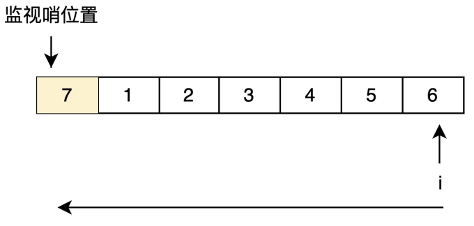
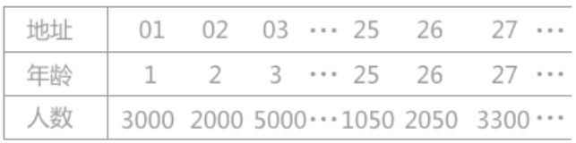
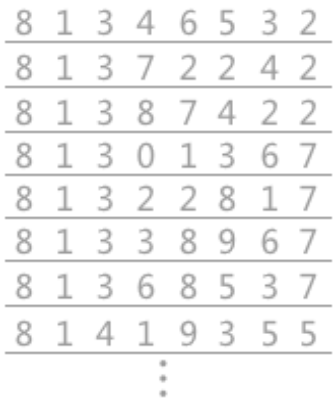
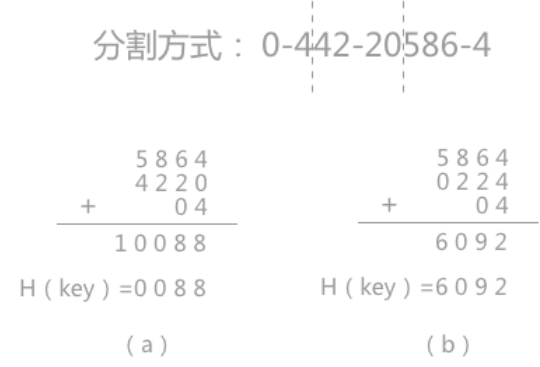
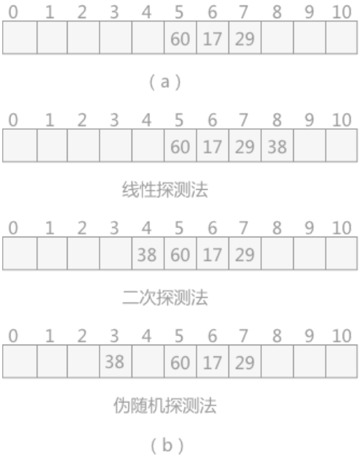
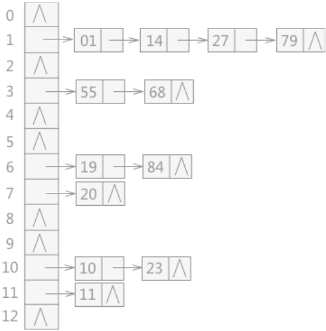

# 经典查找
## 1. 查找概念
在日常生活中，几乎每天都要进行一些查找的工作，在电话簿中查阅某个人的电话号码；在电脑的文件夹中查找某个具体的文件等等。本节主要介绍用于查找操作的数据结构一一查找表。

查找表是由同一类型的数据元素构成的集合。例如电话号码簿和字典都可以看作是一张查找表。

一般对于查找表有以下几种操作：
- 在查找表中查找某个具体的数据元素;
- 在查找表中插入数据元素；
- 从查找表中删除数据元素；

### 1.1 静态查找表和动态查找表
在查找表中**只做查找操作**，而不改动表中数据元素，称此类查找表为**静态查找表**；反之，在查找表中做查找操作的同时进行*插入数据*或者*删除数据*的操作，称此类表为**动态查找表**。

### 1.2 关键字
在查找表查找某个特定元素时，前提是需要知道这个元素的一些属性。例如，每个人上学的时候都会有自己唯一的学号，因为你的姓名、年龄都有可能和其他人是重复的，唯独学号不会重复。而学生具有的这些属性（学号、姓名、年龄等）都可以称为关键字。

关键字又细分为主关键字和次关键字。若某个关键字可以唯一地识别一个数据元素时，称这个关键字为主关键字，例如学生的学号就具有唯一性；反之，像学生姓名、年龄这类的关键字，由于不具有唯一性，称为次关键字。

### 1.3 如何进行查找
不同的查找表，其使用的查找方法是不同的。例如每个人都有属于自己的朋友圈，都有自己的电话簿，电话簿中数据的排序方式是多种多样的，有的是按照姓名的首字母进行排序，这种情况在查找时，就可以根据被查找元素的首字母进行顺序查找；有的是按照类别（亲朋好友）进行排序。在查找时，就需要根据被查找元素本身的类别关键字进行排序。

<div style="margin-top: 80px;">

---
</div>

## 2.顺序查找
静态查找表既可以使用顺序表表示，也可以使用链表结构表示。虽然一个是数组、一个链表，但两者在做查找操作时，基本上大同小异。

静态查找表用顺序存储结构表示时，顺序查找的查找过程为：从表中的最后一个数据元素开始，逐个同记录的关键字做比较，如果匹配成功，则查找成功；反之，如果直到表中第一个关键字查找完也没有成功匹配，则查找失败。

```C++
typedef struct{
    ElemType *elem; // 存放查找表中数据元素的数组
    int length;     // 记录查找表中数据的总数量
} SSTable;

// 初始化查找表
SSTable *initTable(int length）{
    SSTable *table = (SSTable *)malloc(sizeof(SSTable));
    table->length = length;
    table->elem = (ElemType *)malloc(sizeof(ElemType) * (length + 1));
    memset(table->elem, 0, sizeof(ElemType） * (length + 1));
    return table;
}

// 查找表查找的功能函数，其中key为关键字
int search_seq(SSTable *st, keyType key) {
    // 将关键字作为一个数据元素存放到查找表的第一个位置，起监视哨的作用
    st->elem[0].key = key;
    int i = st->length;
    // 从查找表的最后一个数据元素依次遍历，一直遍历到数组下标为0
    while (st->elem[i].key!=key） {
        i--;
    }
    // 如果i=0，说明查找失败；反之，返回的是含有关键字key的数据元素在查找表中的位置
    return i;
}
```

例如在查找表为{1,2,3,4,5,6}找到关键字为1的数据元素的位置，则运行效果为:
| ##container## |
|:--:|
||
|顺序表的一端添加用户用于搜索的关键字，称作“监视哨”|

*使用while进行一次判断, 比使用for + if else更好, 因为可以避免 CPU分支预测导致的负优化* 

-- 简单地说: 在cpu中, 会将`if (){}else{}`的内容进行预缓存, 并且因为还不知道()值的真假, 所以会预读取其中一个, 如果到时候不执行, 又要全部删除, 并且跳转/重新执行

<div style="margin-top: 80px;">

---
</div>

## 3.拆半查找
折半查找，也称**二分查找**，在某些情况下相比于顺序查找，使用折半查找算法的效率更高。但是该算法的使用的前提是静态查找表中的**数据必须是有序的**。

- 从零开始的学习视频: [【灵茶山艾府】二分查找 红蓝染色法](https://www.bilibili.com/video/BV1AP41137w7/)

```C++
int search_half(SSTable *st, keyType key)
{
    // 前提是 st->elem 本身是有序的!
    int l = 1, r = st->length;       // 注意这个是定制的, 就是 arr[length + 1] 这个数组
    int middle = l + ((r - l) >> 1); // 防止越界
    while (l <= r) // 不取等 就是当 l == r 有问题啊
    {
        if (st->elem[middle] > key)
        {
            r = middle - 1;
            middle = l + ((r - l) >> 1);
        }
        else if (st->elem[middle] < key)
        {
            l = middle + 1;
            middle = l + ((r - l) >> 1);
        }
        else
        {
            return middle;
        }
    }

    return 0;
}
```
<div style="margin-top: 80px;">

---
</div>

## 哈希查找
哈希表可以通过关键字直接找到数据的存储位置，**不需要进行任何的比较**，其查找的效率相较于前面所介绍的查找算法是更高的。

### 4.1 哈希表的构建
在初中的数学课本中学习过函数的相关知识，给定一个x，通过一个数学公式，只需要将x的值带入公式就可以求出一个新的值y。

哈希表的建立同函数类似，把函数中的x用查找记录时使用的关键字来代替，然后将关键字的值带入一个精心设计的公式中，就可以求出一个值，用这个值来表示记录存储的哈希地址。即：
> 数据的哈希地址 = f(关键字的值)
>
> 哈希地址只是表示在查找表中的存储位置，而不是实际的物理存储位置。f()是一个函数，通过这个函数可以快速求出该关键字对应的的数据的哈希地址，称之为“哈希函数”。

在构建哈希表时，最重要的是哈希函数的设计。例如设计电话簿案例中的哈希函数为：每个名字的姓的首字母的ASCII值即为对应的电话号码的存储位置。这时会发现，张三和赵六两个关键字的姓的首字母都是乙，最终求出的电话号码的存储位置相同，这种现象称为冲突。在设计哈希函数时，要尽量地避免冲突现象的发生。

- 对于哈希表而言，冲突只能尽可能地少，无法完全避免。

### 4.2 哈希函数的构造
常用的哈希函数的构造方法有6种: 直接定址法、数字分析法、平方取中法、折叠法、除留余数法和随机数法。

#### 4.2.1 直接定址法
其哈希函数为一次函数，即以下两种形式：
> $H(key）= key$ 或者 $H(key)=a * key + b$
>
> 其中 H(key) 表示关键字为 key 对应的哈希地址，a 和 b 都为常数。

例如有一个从 1岁到100岁的人口数字统计表，如下表所示:

| ##container## |
|:--:|
||

假设其哈希函数为第一种形式，其关键字的值表示最终的存储位置。若需要查找年龄为25岁的人口数量，将年龄 25 带入哈希函数中，直接求得其对应的哈希地址为 25（求得的哈希地址表示该记录的位置在查找表的第25位）。

#### 4.2.2 数字分析法
如果关键字由多位字符或者数字组成，就可以考虑**抽取其中的2位或者多位**作为该关键字对应的哈希地址，在取法上尽量选择变化较多的位，避免冲突发生。

例如下表中列举的是一部分关键字，每个关键字都是有8位十进制数组成:

| ##container## |
|:--:|
||

通过分析关键字的构成，很明显可以看到关键字的第1位和第2位都是固定不变的，而第3位不是数字3就是4，最后一位只可能取2、7和 5，只有中间的4位其取值近似随机，所以为了避免冲突，可以从4位中任意选取2位作为其哈希地址。

#### 4.2.3 平方取中法
是对关键字做平方操作，取中间得几位作为哈希地址。此方法也是比较常用的构造哈希函数的方法。例如关键字序列为{421，423，436}，对各个关键字进行平方后的结果为{177241，178929，190096}，则可以取中间的两位{72，89，00}作为其哈希地址。

#### 4.2.4 折叠法
是将关键字分割成位数相同的几部分（最后一部分的位数可以不同），然后取这几部分的叠加和（舍去进位）作为哈希地址。此方法适合关键字位数较多的情况。

例如，在图书馆中图书都是以一个10位的十进制数字为关键字进行编号的，若对其查找表建立哈希表时，就可以使用折叠法。

若某书的编号为：0-442-20586-4，分割方式如图1中所示，在对其进行折叠时有两种方式：一种是移位折叠，另一种是间界折叠：

移位折叠是将分割后的每一小部分，按照其最低位进行对齐，然后相加，如图1（a）；

间界折叠是从一端向另一端沿分割线来回折叠，如图1（b）。

| ##container## |
|:--:|
||

#### 4.2.5 除留余数法
若已知整个哈希表的最大长度 m，可以取一个不大于 m 的数 p，然后对该关键字 key 做取余运算，即: $H (key) = key\ \% \ p$。

在此方法中，对于 p 的取值非常重要，由经验得知 p 可以为不大于 m 的质数或者不包含小于 20 的质因数的合数。

### 4.3 处理冲突的方法
#### 4.3.1 开放地址法
当得出的哈希地址产生冲突时，选取以下 3 种方法中的一种获取d 的值，然后继续计算，直到计算出的哈希地址不在冲突为止，这3 种方法为：
- 线性探测法: $d=1，2，3，……，m-1$
- 二次探测法: $d=1²，-1²，2²，-2²， 3²$,
- 伪随机数探测法: $d=伪随机数$

例如，在长度为 11的哈希表中已填写好17、60 和 29 这 3个数据（如图 2（a）所示），其中采用的哈希函数为：H（key）=keyMOD 11，现有第4个数据38，当通过哈希函数求得的哈希地址为5，与60冲突，则分别采用以上3 种方式求得插入位置如图2（b）所示:

| ##container## |
|:--:|
||

> 线性探测法中，当遇到冲突时，从发生冲突位置起，每次+1，向右探测，直到有空闲的位置为止；
>
> 二次探测法中，从发生冲突的位置起，按照+1,2，－12，+22，...如此探测，直到有空闲的位置；
>
> 伪随机探测，每次加上一个随机数，直到探测到空闲位置结束。

##### 4.3.2 链地址法
将所有产生冲突的关键字所对应的数据全部存储在同一个线性链表中。

例如有一组关键字{19,14,23,01,68,20,84,27,55,11,10,79}，其哈希函数为：H(key)=key MOD 13，使用链地址法所构建的哈希表如图 3 所示:

| ##container## |
|:--:|
||
