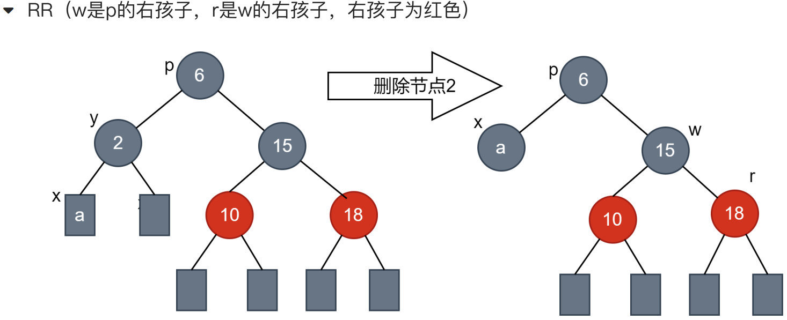

# 红黑树概述
## 什么是红黑树
- **红黑树(Red-Black Tree，简称R-B Tree)**，它一种特殊的二叉查找树。

> 红黑树是特殊的二叉查找树，意味着它满足二叉查找树的特征：任意一个节点所包含的键值，大于等于左孩子的键值，小于等于右孩子的键值。
>
> 除了具备该特性之外，红黑树还包括许多额外的信息。

- 红黑树的特性:
    1. 每个节点或者是黑色，或者是红色。
    2. 根节点是黑色。
    3. 每个叶子节点是黑色。[注意：这里叶子节点，是指为空的叶子节点!]
    4. 如果一个节点是红色的，则它的子节点必须是黑色的。[不存在两个相邻的红色节点]
    5. 从一个节点到该节点的子孙节点的所有路径上包含相同数目的黑节点。[黑高相同]

| ##container## |
|:--:|
||

*注: 红黑树的高度是指「<span style="color:yellow">黑高</span>」, 即 从当前结点(不包含自己)往下直到任意叶的 黑色结点的个数 (详见下文<<什么是一颗红黑树的黑高>>)*

| ##container## |
|:--:|
||

## 为什么要有红黑树
大多数二叉排序树BST的操作（查找、最大值、最小值、插入、删除等等）都是O(h)的时间复杂度，h 为树的高度。但对于斜树而言（BST极端情况下出现），BST的这些操作的时间复杂度将达到O(N)。为了保证BST的所有操作的时间复杂度的上限为O(logN），就要想办法把一颗BST树的高度一直维持在logN。

### 红黑树RBT与平衡二叉树AVL比较:
AVL树比红黑树更加平衡，但AVL树在插入和删除的时候也会存在大量的旋转操作。所以当你的应用涉及到频繁的插入和删除操作，切记放弃AVL树，选择性能更好的红黑树；当然，如果你的应用中涉及的插入和删除操作并不频繁，而是查找操作相对更频繁，那么就优先选择AVL树进行实现。

RBTree有着接近于AVL树的查找效率 $O(logN)$

但过优于AVL树的构建速度, 是一个优异的动态数据查找的好东西

- AVL树构建 --> 大量的旋转
- 红黑树构建 --> 着色 + 少量的旋转

## 一颗红黑树是如何保持平衡的
假设有3个节点的序列，那么在红黑树当中，不可能出现3个节点的单链表，如图:
| ##container## |
|:--:|
||
|1-3黑高不等, 4不能出现"红红"|

将根结点9涂黑色，其他结点分四种情况着色，结果都不满足红黑树的性质要求。唯一的办法就是调整树的高度和染色。

| ##container## |
|:--:|
||

## 什么是一颗红黑树的黑高
在一颗红黑树中，从某个结点×出发（不包含该结点）到达一个叶结点的任意一条简单路径上包含的黑色结点的数目称为黑高，记为 bh(x)。

例如下图的节点6的黑高和红色节点15的黑高是一样的，都是2。

| ##container## |
|:--:|
||

计算结点 6 的黑高，从结点 6 到结点 c 的路径是6→15→10→9→C，其中黑色结点为 6、10、C, 但是在计算黑高时，并不包含结点本身，所以从结点6 到结点c的路径上的黑色结点个数为2，那么bh(6)=2；从结点 15 到结点c 的路径为 15→10→9→C，其中黑色结点为 10、C，所以从结点 15 到结点c 的路径上黑色结点数目为 2，bh(15)=2 。

红黑树的黑高则为其根结点的黑高。根据红黑树的性质 4、5，一颗红黑树的黑高 $b_h >= h/2$。

> Number of nodes from a node to its farthest descendant leaf is no more than twice as the number of nodes to the nearest descendant leaf.
>
> 从一个结点到其最远的后代叶结点的顶点数目不会超过从该结点到其最近的叶结点的结点数目的两倍。

这句话的意思就是公式 $b_h >= h/2$，其中黑高 bh 就表示从根结点 6 到离它最近的叶结点 2 包含的结点数 2，而h 则表示从根结点 6 到其最远的叶结点 9所包含的结点数目 4，显然这一公式是合理的。

- 引理：一棵有n个内部结点的红黑树的高度 $h <= 2lg(n+1)$ 。

## 红黑树的应用
<span style="color:yellow">实际上, 工程中如果用到树, 那么一般都是红黑树!<span>

- 大多数自平衡BST(self-balancing BST）库函数都是用红黑树实现的，比如C++中的map 和 set (或者 Java 中的 TreeSet 和 TreeMap)

- 红黑树也用于实现 Linux 操作系统的 CPU 调度。完全公平调度（Completely Fair Scheduler）使用的就是红黑树。

- 红黑树也用于Linux提供的epoll多路复用的底层结构，便于快速增加、删除和查找网络连接的节点。([epoll模式](../../../../../002-程序语言/001-C++/002-tmp丶C++丶memo/004-C++网络编程/001-实践版本/009-epoll模式/index.md))

# 红黑树的插入
## 将红黑树当作一颗二叉查找树, 将节点插入
<span style="margin-left: 30px;">红黑树本身就是一颗二叉查找树，将节点插入后，该树仍然是一颗二叉查找树。也就意味着，树的键值仍然是有序的。此外，无论是左旋还是右旋，若旋转之前这棵树是二叉查找树，旋转之后它一定还是二叉查找树。这也就意味着，任何的旋转和重新着色操作，都不会改变它仍然是一颗二叉查找树的事实。

<span style="margin-left: 30px;">那接下来，我们就来想方设法的旋转以及重新着色，使这颗树重新成为红黑树！

## 将插入的节点着色为红色
为什么着色成红色，而不是黑色呢？为什么呢？再看红黑树的性质:

> 1. 每个节点或者是黑色，或者是红色。
> 2. 根节点是黑色。
> 3. 每个叶子节点是黑色。
> 4. 如果一个节点是红色的，则它的子节点必须是黑色的。
> 5. 从一个节点到该节点的子孙节点的所有路径上包含相同数目的黑节点。

<span style="margin-left: 30px;">将插入的节点着色为红色，不会违背"特性(5)"！少违背一条特性，就意味着我们需要处理的情况越少。接下来，就要努力的让这棵树满足其它性质即可；满足了的话，它就又是一颗红黑树了。

**如果插入节点是根节点，将该节点转换为黑色**。

## 通过一系列的旋转或着色等操作, 使之重新成为一颗红黑树

在第二步中插入红色节点不会违背`特性5`那么会违背那些特性呢?

显然, `特性4`有可能会被违背!

## 红黑树红红节点的处理
插入操作需要调整的情况，变为了`特性4`的违背后的调整了，那么，如何进行调整呢？

红红节点一定有叔叔节点，调整的核心就是看叔叔节点的颜色，分情况讨论。

一个是叔叔节点是红色，一个是叔叔节点是黑色。

### 叔叔节点是红色
| ##container## |
|:--:|
||

处理方法: ~~(*科学家发现的, 你不需要因为不是自己推理出来的而导致出现心理问题*)~~

第一步: 将 p 和 u 的颜色设置为 黑色<br>
第二步: 将 g 的颜色设置为红色<br>
第三步: 将 x = g, 对 g 重复执行算法框架<br>

> (01) 将“父节点”设为黑色。
> 
> (02) 将“叔叔节点”设为黑色。
> 
> (03) 将“祖父节点”设为“红色”。
> 
> (04) 将“祖父节点”设为“当前节点”；

| ##container## |
|:--:|
||

### 叔叔节点是黑色
当叔叔节点是黑色时，从LL,LR,RR,RL中进行考虑。
> 本文章只演示 LL, LR 情况, RR, RL 实际上同理!

#### LL
| ##container## |
|:--:|
||

> (01) 将“父节点”设为“黑色<br>
> (02) 将“祖父节点”设为“红色<br>
> (03) 以“祖父节点”为支点进行右旋<br>

#### LR
| ##container## |
|:--:|
||

> (01) 左旋p<br>
> (02) 重新标记x和p, 就成为LL的情况<br>

## 总结
~~自创的小诗?~~

<div style="color:yellow">
  
1. 插入位置在<b style="color:green">叶子</b>
2. 插入节点着<b style="color:red">红色</b>
3. 辨<b style="color:rgb(61,174,255)">叔</b>着色选对策
4. 如是<b style="color:rgb(61,174,255)">红色</b>就<b style="color:red">改色 (记得递归判红红)</b>
5. 如是<b style="color:rgb(61,174,255)">黑色</b>就<b style="color:red">旋转 (LL,LR,RL,RR)</b>

</div>

# 红黑树的删除
- 将红黑树内的某一个节点删除。需要执行的操作依次是：
    1. 将红黑树当作一颗二叉查找树，将该节点从二叉查找树中删除；
    2. 通过"旋转和重新着色"等一系列来修正该树，使之重新成为一棵红黑树。
详细描述如下：
    - 假设y是要删除的节点，x是用来替换的节点(当y是叶节点时，x是NULL节点，当做黑色节点处理)

1. 执行标准的BST删除操作

    在标准的`BST`删除操作中，我们最终都会以**删除一个叶子结点或者只有一个孩子的结点**而结束（对于内部节点，就是要删除结点左右孩子都存在的情况，最终都会退化到删除结点是叶子结点或者是只有一个孩子的情况）。所以我们仅需要处理被删除结点是叶结点或者仅有一个孩子的情况。

2. 简单情况: y或者x有一个是红色节点

    如果x或者y是红色，我们将替换结点y的结点x标记为黑色结点（这样黑高就不会变化）。

    *注意这里是x或者y是红色结点，因为在一棵红黑树中，是不允许有两个相邻的红色结点的，而结点y是结点x的父结点，因此只能是x或者y是红色结点。*

| ##container## |
|:--:|
||
|需要变色|
||
|直接删除Y即可(X是黑 标记为黑色==没有变色)|

3. 复杂情况: y和x都是黑色节点

    > [!TIP]
    > 双黑节点的定义：
    >
    > <span style="margin-left: 30px;">当要删除结点 y 和孩子结点 x 都是黑色结点，删除结点 y ，导致结点 x 变为双黑结点。
    >
    > <span style="margin-left: 30px;">当x变成双黑结点时，我们的主要任务将变成将该双黑结点 x 变成普通的单黑结点。一定要特别注意，NULL结点为黑色结点，所以删除黑色的叶子结点就会产生一个双黑结点。

    > ##yellow##
    > 3.1 当前节点x是双黑节点且不是根节点
    >
    > (a) x 的兄弟节点 w 是黑色且w的孩子节点至少有一个是红色的<br>
    > (b) x 的兄弟节点 w 是黑色且它的两个孩子都是黑色的<br>
    > (c) x 的兄弟节点 w 是红色<br>

    > 3.2 当前节点x是双黑节点且是根节点

## 当前节点x是双黑节点且不是根节点
### (a) x的兄弟节点w是黑色且w的孩子节点至少有一个红色
对于这种情况，需要对x的兄弟节点w进行旋转操作，将w的一个红色节点用r表示，x和w的父节点用p表示。

那么p，w和r将出现四种可能性（LL、LR、RR、RL)

##### LL
| ##container## |
|:--:|
||
||
||

##### LR
| ##container## |
|:--:|
||
||
|此时变为LL|

##### RR
练习一下:
| ##container## |
|:--:|
||

##### RL
> 404

#### 总结
对于兄弟是黑节点，兄弟节点的子孩子至少有一个红色节点的情况：

(1）其中LR想办法转为LL，RL想办法转为RR的形式。
- LR -->LL的方法：w的右孩子变为黑色，w变为红色，以w为节点进行左旋。
- RL -->RR的方法：w的左孩子变为黑色，w变为红色，以w为节点进行右旋。

(2）LL的调整方法，r节点(w的左孩子)变为黑色，w节点变为父节点颜色，父节点变为黑色，右旋父节点

(3）RR的调整方法，r节点(w的右孩子)变为黑色，w节点变为父节点颜色，父节点变为黑色，左旋父节点

### (b) x的兄弟节点w是黑色，且两个孩子节点都是黑色
对于这种情况需要递归地进行处理，如果删除结点后得到的双黑结点的父结点此时为黑色，则结点 u 变单黑，且结点 u 的父结点 p 变双黑，然后对结点 u 的父结点 p 继续进行处理，直到当前处理的双黑结点的父结点为红色结点，此时将双黑结点的父结点设置为黑色，双黑结点变为单黑结点 (红色 + 双黑 = 单黑)。

| ##container## |
|:--:|
||
|假设以 10 为根结点的子树为整棵树的左子树，删除结点 9 ，产生双黑结点 c 且其兄弟结点 12（s） 为黑色，兄弟结点的左右孩子均为黑色。|
||
|此时双黑结点的兄弟结点 12 变为红色结点，然后将 u 的父结点 10 变为双黑结点，一直向上判断。|

至于这一过程何时结束，我们再看下面一个例子。
| ##container## |
|:--:|
||
|删除下图中的结点 12 ，得到一个双黑结点 u ，双黑结点的兄弟结点 31 及兄弟结点的孩子结点均为黑色，且**双黑结点的父结点 19 为红色结点**，刚好是不再继续向上判断的情况。|
||
|此时**只需要将结点 u 的兄弟结点 31 的颜色变为红色，双黑结点 u 的父结点 19 由红色变为黑色结点，双黑结点 u 变为单黑结点**。|

### (c) x的兄弟节点w是红色节点
当前 x 的兄弟结点 W 是红色结点时，通过旋转操作将 x 当前的兄弟结点向上移动，并对 x 的父结点和其旋转前的兄弟结点重新着色，接着继续对结点 x 旋转后的兄弟结点W进行判断，确定相应的平衡操作。旋转操作将 x 的兄弟结点情况又会转换为前面的（a）和（b）的情况。

> (1) 将 w 设置为黑色<br>
> (2) 将 p 设置为红色<br>
> (3) 对父进行旋转(兄弟在左则右旋, 在右则左旋)<br>
> (4) 重新设置 w (变为a/b的情况)<br>

#### u 的兄弟结点 s 是父结点 p 的左孩子, 对结点 p 进行右旋操作
| ##container## |
|:--:|
||
|删除结点 18 ，产生一个双黑结点 u ，且 u 的兄弟结点 s 是红色，兄弟结点 s 是其父结点的左孩子，接着就是对其父结点 15 进行右旋操作。|
||
|对结点 15 进行右旋操作，并且对旋转前的 p 和 s 进行重新着色后，继续对双黑结点旋转后的兄弟结点进行判断，发现此时正好和3.2（b）的情况是一样，进行相应处理，如下图所示。|
||

##### u 的兄弟结点 s 是父结点 p 的左孩子, 对结点 p 进行左旋操作(这种情况与上面的是对称的)
自己练习一下
| ##container## |
|:--:|
||

*注: (b), (c)的图片来源和参考: [知乎: 图解: 红黑树删除篇(一文读懂)](https://zhuanlan.zhihu.com/p/145006031)*

## 总结

y 是要删除的节点, x 是用来替换的. (y为叶子, 可视x是NULL)

```markmap
# 红黑树的删除
## 1. 执行标准的BST删除操作
## 2. 简单情况: x 或 y 为红色节点
### 直接替换并且染色为黑
## 3. 复杂情况: x 和 y 都是黑色节点
### 3.1 当前 节点x 是双黑节点且不是根节点
#### (a) x的兄弟节点w是黑色且w的孩子节点至少有一个红色
##### LL
##### LR
##### RR
##### RL
#### (b) x的兄弟节点w是黑色，且两个孩子节点都是黑色
##### 递归上浮父节点, 直到父节点为红或者为根节点(3.2)
#### (c) x的兄弟节点w是红色节点
##### 变色+旋转 转化为 (a)/(b) 情况
### 3.2 当前 节点x 是双黑节点且是根节点
```

务必反复看图以便记忆!

| ##container## |
|:--:|
||
|可以结合[红黑树代码实现](../002-红黑树代码实现/index.md)的代码理解|