# B树
## 前言
前面学习了平衡二叉树和红黑树，我们知道了平衡的概念就是让树尽量的“胖”，让它的高度不会线性增长，那么我们这章，将结合数据存储设备的结构和再次优化查找效率的角度来学习B树和B+树。

之前我们学习的树，数据保存在内存上，而如果数据很大的话，往往数据是存储在硬盘的。硬盘是以块为单位进行管理的。

对于红黑树等二叉树, 一般是访问内存上面的内容, 所以io交互会比较快,
但如果是查找硬盘上面的内容, 就需要在硬盘上面查找, 而访问硬盘的速度远远不及内存的速度, 也就是说, 如果我们要访问一次硬盘, 可能需要经过100次内存运行单位时间, 那么这个时间内内存什么也没有干, 就只是等待数据, 这样即便是二叉树, 我们一次访问可以排除的数据量也很少,其次,内存访问是通过字节为单位的, 而硬盘访问的最小单位是「块/扇区(机械硬盘)」

|CPU|CPU x 级缓存|内存|硬盘|
|-|-|-|-|
|4GHz|~|5600MHz|1000Mb/s|

---> 速度逐渐下降

| ##container## |
|:--:|
||
|By GPT-3.5|

B树（又称B-树）和B+树其实差别不大，理解了B树，只需要了解他们之间的差异化即可。

## B-树的定义
B-树，又称多路平衡查找树，B树中所有结点的孩子个数的最大值称为B树的阶，通常用 m表示。当`m = 2`时，就是常见的二叉搜索树。

一颗 m 阶的 B树 定义如下:
1. 每个结点最多有 $m-1$ 个关键字;
2. 根节点最少可以只有 $1$ 个关键字;
3. 非根节点至少有 $ceil(m/2)-1$ 个关键字;
4. 每个节点中的关键字都按照从小到大的顺序排列，每个关键字的左子树的所有关键字都小于它, 而右子树中的所有关键字都大于它;
5. 所有叶子节点都位于同一层，或者说根节点到每个叶子节点的长度相同;

| ##container## |
|:--:|
|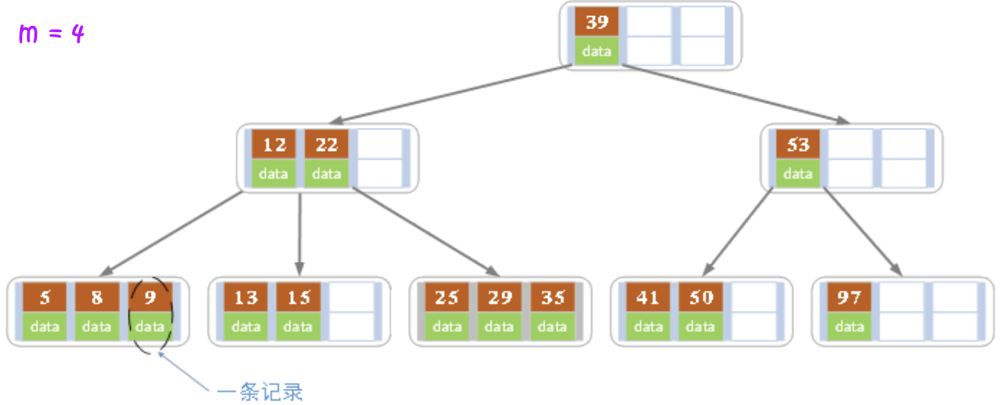|

<span style="margin-left: 30px;">上图是一颗阶数为 $4$ 的B树。在实际应用中的B树的阶数`m`都非常大（通常大于100），所以即使存储大量的数据，B树的高度仍然比较小。每个结点中存储了关键字（key）和关键字对应的数据（data），以及孩子结点的指针。我们将一个`key`和其对应的`data`称为一个`记录`。

## 为什么要有B树的结构
对于访问物理介质（如硬盘）所需的时间，希望越少越好，B树这种类型就是为了最小化磁盘访问次数，达到减少磁盘访问时间。

其他数据结构，例如二叉查找树、avI树、红黑树等，只能在一个节点中存储一个键值。如果必须存储大量的键值，那么这些树的高度就会变得非常大，访问时间也会增加。

但是，B-tree可以在单个节点中存储许多键，并且可以有多个子节点。这大大降低了高度，从而允许更快的磁盘访问。

# B-树的操作
## B-树的查找
B-树的查找操作与二叉排序树（BST）极为类似，只不过B-树中的每个结点包含多个关键字。从根节点开始，从上往下递归的遍历树。在每一层节点上，使用**二分查找法**匹配目标键，或者通过键的范围来确定子树。

- B-树查找的思路
    1. 先让查找值和B树的根节点的第一个关键字比较，若是匹配，则查找成功
    2. 若是匹配不成功继续和后面的关键字匹配，若是找到匹配，则匹配成功
    3. 若是找到一个大于查找值的关键字，那么就需要往这个关键字和前一个关键字之间的分支节点往下搜索，继续重复上面关键字匹配的操作
    4. 若是当前节点最后一个关键字比当前查找的值还小，那么就继续往该节点的最右分支往下继续搜索，重复上面的操作
    5. 若是节点查找到了空节点，那么说明查找失败

## B-树的中序遍历
B-树的中序遍历与二叉树的中序遍历也很相似，我们从最左边的孩子结点开始，递归地打印最左边的孩子结点，然后对剩余的孩子和关键字重复相同的过程。最后，递归打印最右边的孩子。

## B-树的插入操作
B树的插入操作一般分为`回溯法`和`主动插入法`，但原理是一样的，我们先看回溯法，这个是最好理解的。

### B-树的回溯法插入
先通过上面的定位操作定位到一个查找失败的节点，然后检查该节点的父节点的关键字个数，若是关键字个数小于`m - 1`，那么说明可以直接插入到该节点（叶子节点），否则的话插入后会引起节点的分裂。具体分裂的方法:
1. 取一个新节点，在插入key后的原节点，从中间位置`ceil(m/2)`将其中的关键字分为两部分

2. **左部分**包含的关键字放在原节点中，**右部分**包含的关键字放到新节点中，**中间位置**`ceil(m/2)`的节点插入原节点的父节点

3. 若此时导致其父节点的关键字个数也超过了上限，则继续进行这种分裂操作，直到这个过程传到根节点为止。当然B-树的高度也增加 (递归查找, 回溯往上)(注意会产生新的根)

| ##container## |
|:--:|
|如图所示:|
|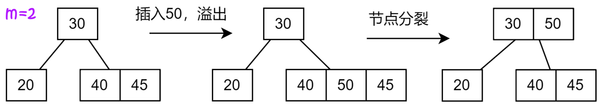|

### B-树主动插入法
```B-树主动插入伪代码
1. 初始化 x 作为根结点
2. 当 x 不是叶子结点，执行如下操作：
	a. 找到 x 的下一个要被访问的孩子结点 y
	b. 如果 y 没有满，则将结点 y 作为新的 x
	c. 如果 y 已经满了，拆分，结点 x 的指针指向结点y的两部分。
		如果 k 比y 中间的关键字小，则将的第一部分作为新的 x，
		否则将的第二部分作为新的 x，当将拆分后，将 中的一个关键字移动到它的父结点 x 当中。
3. 当 x 是叶子结点时，第二步结束；
	由于我们已经提前查分了所有结点，x 必定至少有一个额外的关键字空间，进行简单的插入即可。
```

事实上B-树的插入操作是一种主动插入算法，因为在插入新的关键字之前，我们会将所有已满的结点进行拆分，提前拆分的好处就是，我们不必进行回溯，遍历结点两次。如果我们不事先拆分一个已满的结点，而仅仅在插入新的关键字时才拆分它，那么最终可能需要再次从根结点出发遍历所有结点，比如在我们到达叶子结点时，将叶结点进行拆分，并将其中的一个关键字上移导致父结点分裂（因为上移导致父结点超出可存储的关键字的个数），父结点的分裂后，新的关键字继续上移，将可能导致新的父结点分裂，从而出现大量的回溯操作。但是B-树这种主动插入算法中，就不会发生级联效应。当然，这种主动插入的`缺点`也很明显，我们**可能进行很多不必要的拆分操作**。

#### 实例
| ##container## |
|:--:|
|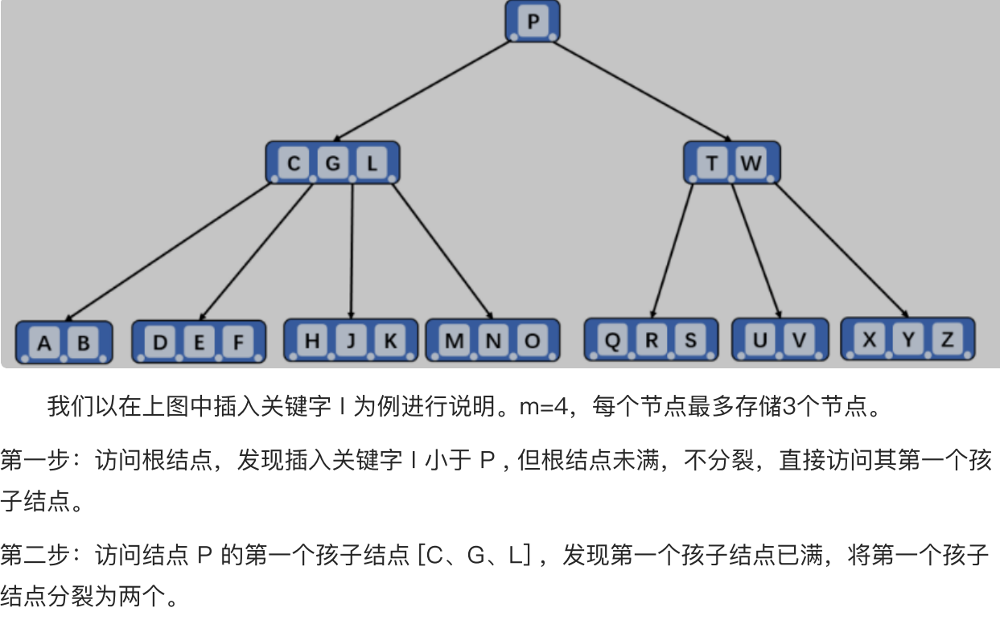<br>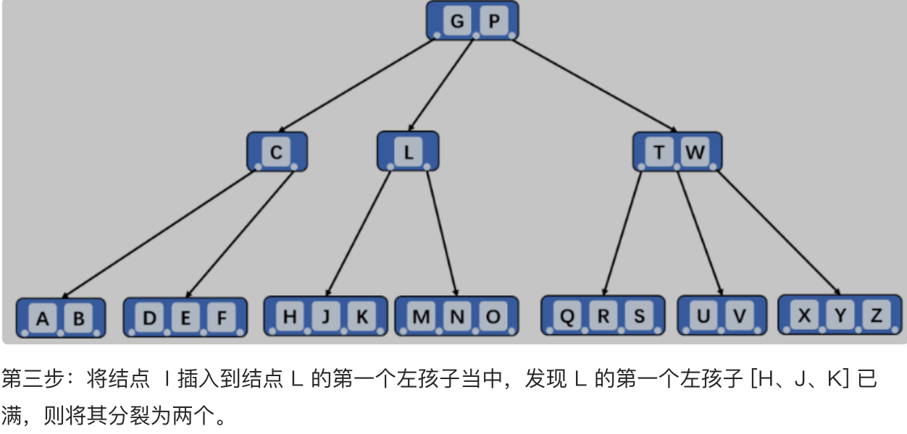<br>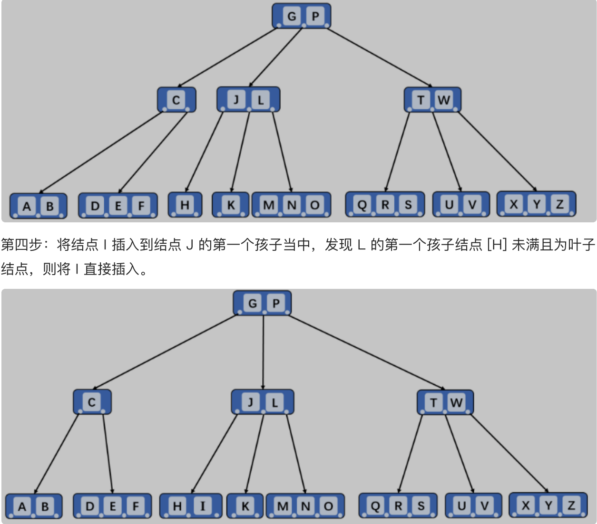|

## B-树的删除操作
B-树的删除就复杂的多了，分为下面几种情况:

### 删除叶子节点中的元素
1. 搜索要删除的元素
2. 如果它在叶子节点上，直接将其删除
3. 如果删除后产生了下溢出（键数小于最小值），则向其兄弟节点借元素。即将其父节点元素下移至当前节点，将兄弟节点中元素上移至父节点（若是左节点，上移最大元素；若是右节点，上移最小元素)
4. 若兄弟节点也达到下限，则合并兄弟节点与分割键。

### 删除内部节点中的元素
1. 内部节点中元素为其左右子节点的分割值，需要从左子节点最大元素或右子节点中最小元素中选一个新的分割符。被选中的分割符从原子节点中移除，作为新的分隔值替换掉被删除的元素。
2. 上一步中，若左右子节点元素均达到下限，则合并左右子节点
3. 若删除元素后，其中节点元素小于下限，则继续合并。

### 案例
5阶B-树删除案例<br>
5阶B树中，结点最多有4个key，最少有2个key。

| ##container## |
|:--:|
|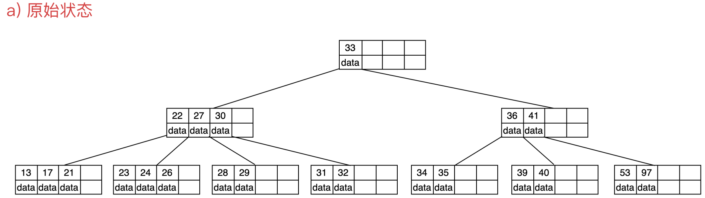|
|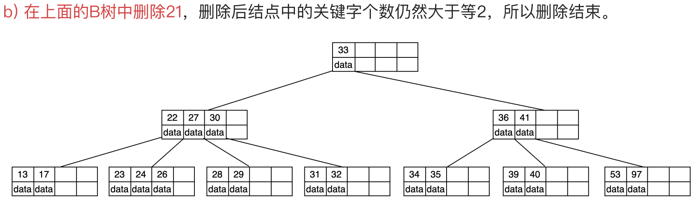|
|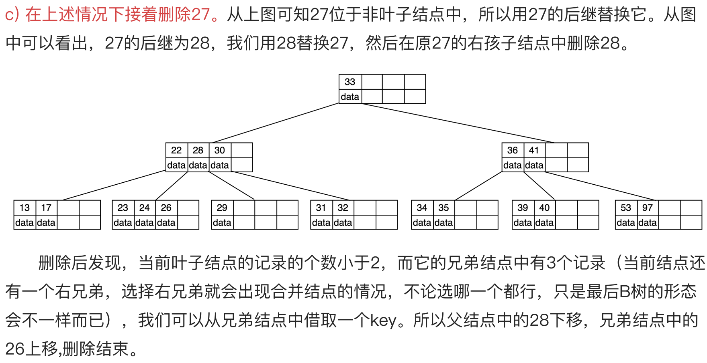|
|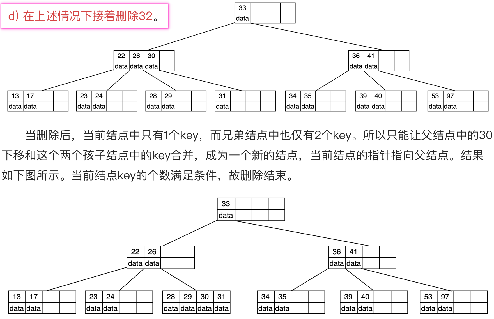|
|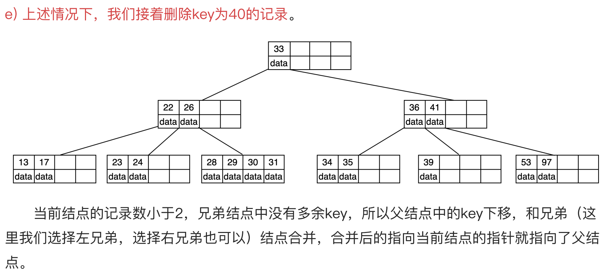|
|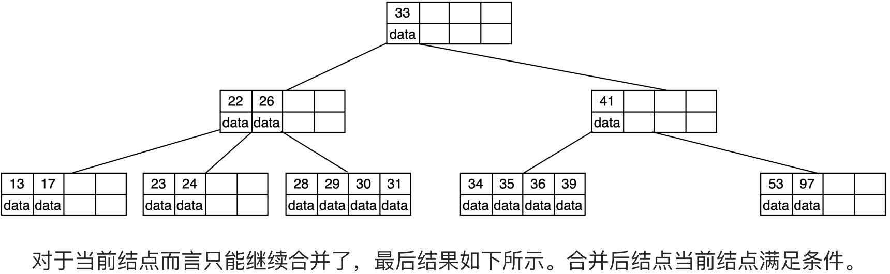|
|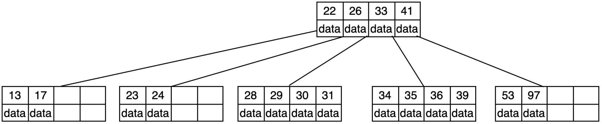|

## 代码实现

> 因为这个基本上是数据库才用得到, 手撕的机会就更少了 =-=

[B树代码实现](../002-B树代码实现/index.md)