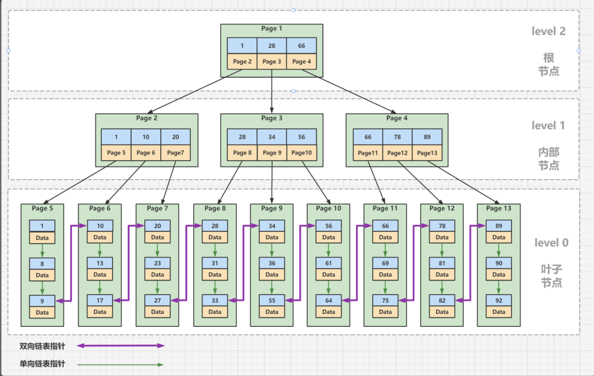

# B+树
## B-树和 B+树有什么不同呢？
1. B-树一个节点里存的是数据，而 B+树存储的是索引（地址），所以B-树里一个节点存不了很多个数据，但是B+树一个节点能存很多索引。这样可以更快的搜索，因为一次可以加载更多的索引到内存进行比较。
2. B+树叶子节点存所有的真实数据。在MySQL中，这里所说的真实数据，可能是行的全部数据（如InnoDB的聚簇索引），也可能只是行的主键（如InnoDB的辅助索引），或者是行所在的地址（如MyIsam的非聚簇索引）。
3. B-树中一条记录只会出现一次，不会重复出现，而B+树的键则可能重复重现：一定会在叶节点出现，也可能在非叶节点重复出现。
4. B-树中的非叶节点，记录数比子节点个数少1；而B+树中记录数与子节点个数相同。
5. B+树的叶子节点是数据阶段用了一个双向链表串联起来，便于范围查找。
6. B+树的叶子节点内部是一个单向链表。这样也便于插入数据。

图示:

| ##container## |
|:--:|
||

## 优势
由此，B+树与B-树相比，有以下优势：

1. 更少的IO次数：B+树的非叶节点只包含键，而不包含真实数据，因此每个节点存储的记录个数比B数多很多（即阶m更大），因此B+树的高度更低，访问时所需要的IO次数更少。此外，由于每个节点存储的记录数更多，所以对访问局部性原理的利用更好，缓存命中率更高。
2. 更适于范围查询：在B-树中进行范围查询时，首先找到要查找的下限，然后对B-树进行中序遍历，直到找到查找的上限；而B+树的范围查询，只需要对链表进行遍历即可。
3. 更稳定的查询效率：B-树的查询时间复杂度在1到树高之间(分别对应记录在根节点和叶节点)，而B+树的查询复杂度则稳定为树高，因为所有数据都在叶节点 **（虽然B-树的速度上线更高，但下线也更低，同时稳定性对于数据库而言更重要。）**

## B+树的劣势
由于键会重复出现，所以会占据更大的内存。