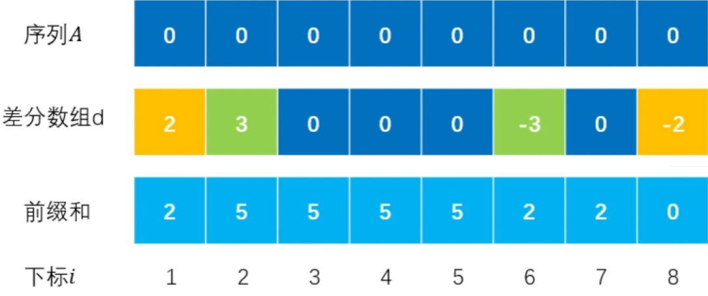

# 差分数组
## 例题
张三有如下操作:

- 对 $arr$ 数组的 $[a, b]$ 区间加上 $x$.
- 对 $arr$ 数组的 $[a, b]$ 区间减去 $x$.

输出最终的数组的样子. (会执行 $10^5$ 次操作, $arr.size() \le 10^5$ )

## 解决

对于区间 **加减**`同一个数`的操作 (注意不是赋值), 我们可以使用**差分数组**, 时间复杂度为:
- 区间加减: $O(1)$
- 区间查询: $O(n)$

而且比[普通线段树](../../010-【数据结构】线段树/001-普通线段树/index.md)的代码要轻量级得多! 当然对于特定的题目, 肯定也快得多!

## 原理

下面是原本是数组arr(即序列A)进行了修改:

- 下标i = [1, 7] 加 2
- 下标i = [2, 5] 加 3

| ##container## |
|:--:|
||

可以知道, 对 差分数组 使用一次前缀和就可以还原到修改后的数组! 查询的时间复杂度就是求前缀和的复杂度

以下是模版:

```C++
int n;
cin >> n;
vector<int> arr(n);

// 如果arr没有超过int, 那么差分理论上也不会超过int
// n + 1是防止 R + 1 时候的越界, 实际上求和的时候不会用到它
vector<int> dArr(n + 1);

// vector<int> sumArr(n + 1); // 可以没有

// 修改 [L, R] 区间的数 += x
void add(int L, int R, int x) {
    dArr[L] += x;
    dArr[R + 1] -= x;
}

// 得到最终结果
for (int i = 0, sum = 0; i < n; ++i) {
    sum += dArr[i];
    cout << i << ": " << arr[i] + sum << '\n';
}
```

## 练习

有时候需要按照题目要求区分边界, 不一定题目是修改 $[a, b]$, 有时候会是 $[a, b)$ 等哦~

- [2381. 字母移位 II](https://leetcode.cn/problems/shifting-letters-ii/description/)
- [1094. 拼车](https://leetcode.cn/problems/car-pooling/description/)
- [1109. 航班预订统计](https://leetcode.cn/problems/corporate-flight-bookings/description/)