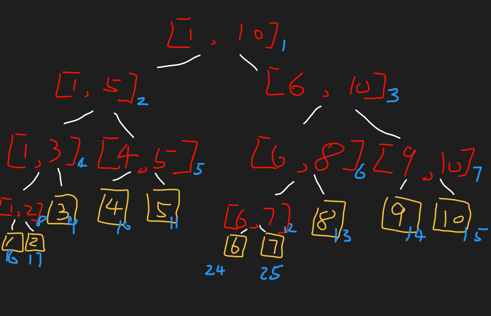

# 线段树
## 引入
现在我给你一道题:
1. $给你n个数, 给你m个范围, 要你求范围内的和. (n \le 10^6)$

    这不是很简单，不是小学生的 $IO$ 题, 秒杀.

再加强:

2. $给你n个数, 给你k个操作, 让你在[l,\ r]区间内加一个数, 或让你求区间内的和. (n \le 10^6)$

   前缀和已经无能为力了...

## 线段数的结构

所以人们就发明了 $线段树$, 图如下: (*示例是存储了 1 ~ 10 个数的线段树*)



其中:
- 红色是树的结点(实际的存值是 左右孩子的值的和),
- 黄色是叶子,
- 蓝色则是树的线性表示的数组下标(不妨称这个数组叫做`tree`)

## 单点修改线段树
### 建树

其中:
- 对于`tree[1]`即树的根结点, 表示的是 [1, 10] 这个区间的和
- `tree[1]` 的 左子树 `tree[1 * 2]` 则代表 [1, (1 + 10) / 2] 这个区间的和
- `tree[1]` 的 右子树 `tree[1 * 2 + 1]` 则代表 [(1 + 10) / 2 + 1, 10] 这个区间的和
- 以此类推

```C++
/** 对于构建时候, 会出现 l == r 的推导: (注: 为什么是0, 是因为这个对应的是arr(被构建的数组)的下标(具体请见完整代码))
 * 0, (n - 1) / 2
 * 0, (n - 1) / 4 
 * 0, (n - 1) / 8
 * 0, (n - 1) / 16
 * 0, (n - 1) / 32
 * 0, (n - 1) / 2^(n + 1)
 * 0, 下取整{(n - 1) / 2^(n + 1)} --> 0 即 l == r
 * */
```

- 直到 [l, r] 其中 `l == r` 时, 则为叶子结点.

直到全部的叶结点都已经初始化完毕, 我们就可以接收操作了:

1. 对区间(点) [t, t] 加上一个数 `k` (现在编写的是初级版本: 支持单点修改的线段树)
2. 查询 [l, r] 区间的和

### 单点修改
对于单点修改, 我们的步骤是:

1. 递归, 递: 查找到叶子结点[t, t], 对其加`k`
2. 递归, 归: (更新区间) `tree[i] = tree[i * 2] + tree[i * 2 + 1]`

完成!

### 区间查询
首先我们要找到查询的目标区间 [l, r]

在查询中我们就分成 3 种情况:

1. 当前查找 全部位于 左边
2. 当前查找 全部位于 右边
3. 当前查找 贯穿两边, 对策: return 左边部分 + 右边部分

完成!

### 代码

```C++
#include <cstdio>
#include <vector>
#include <iostream>

using namespace std;

// 构建线段树
// 初始化时传入: buildTree(arr, tree, 1, 0, n - 1);
void buildTree(vector<int>& arr, vector<int>& tree, int now_i, int l, int r) {
    if (l == r) {
        tree[now_i] = arr[l];
        return;
    }

    int mid = l + (r - l) / 2;
    buildTree(arr, tree, now_i * 2, l, mid); /** 显然再某个地方的递归会出现归中: l == r 的情况
                                              * 0, (n - 1) / 2
                                              * 0, (n - 1) / 4 
                                              * 0, (n - 1) / 8
                                              * 0, (n - 1) / 16
                                              * 0, (n - 1) / 32
                                              * 0, (n - 1) / 2^(n + 1)
                                              * 0, 下取整{(n - 1) / 2^(n + 1)} --> 0 即 l == r
                                              */
    buildTree(arr, tree, now_i * 2 + 1, mid + 1, r);

    tree[now_i] = tree[now_i * 2] + tree[now_i * 2 + 1];
}

/**
 * 对 [target, target] + k
 * now_i 当前节点
 * l 左边界
 * r 右边界
 * target 目标结点
 * k 需要增加的值
 * tree 线段树
 */
void addTree(int now_i, int l, int r, int target, int k, vector<int>& tree) {
    if (l == r) {
        tree[l] += k;
        return;
    }

    int mid = l + (r - l) / 2;
    if (target <= mid) { // 为什么和 mid 比?, 原理其实同上
        addTree(now_i * 2, l, mid, target, k, tree);
    }
    else {
        addTree(now_i * 2 + 1, mid + 1, r, target, k, tree);
    }

    tree[now_i] = tree[now_i * 2] + tree[now_i * 2 + 1];
}

/**
 * 查询 [L, R] 区间的和
 * now_i 当前节点
 * l 左边界
 * r 右边界
 * L 目标[L,R]
 * R 目标[L,R]
 * tree 线段树
 */
int findTree(int now_i, int l, int r, int L, int R, vector<int>& tree) {
    if (L <= l && r <= R)
        return tree[now_i];

    int mid = l + (r - l) / 2, res = 0;
    if (L <= mid) {
        res = findTree(now_i * 2, l, mid, L, R, tree);
    }
    
    if (R > mid) {
        res += findTree(now_i * 2 + 1, mid + 1, r, L, R, tree);
    }

    return res;
}

int main() {
    vector<int> arr{ 1,1,1,1,1,1, };

    int n = arr.size();

    // 构建线段树
    vector<int> tree(n * 4); // 4 倍空间足够
    buildTree(arr, tree, 1, 0, n - 1);

    addTree(1, 1, n, 3, 3, tree);

    // 支持单点增加(减), 区间查询的线段树
    int result = findTree(1, 0, n - 1, 1, 5, tree);
    cout << "区间 [1, 5] 的和：" << result << endl;

    return 0;
}
```
## 一些疑问的解决
### 为什么 [l, r] 和 mid 比较就可以确定叶结点/目标区间
本质の原因是: <span style="color:red">`mid` `[l, r]` 使用的索引是 原数组的(建树时使用的数组(`arr`))的索引, 而不是线段树(`tree`)的索引, 所以可以进行比较, 而比较过后, 作用的却是`tree`数组(使用`now_i`)</span>

前人的巧妙设计 awa...

## 区间修改线段树
### 建树
> 同上

### 区间修改
对区间 [l, r] 加上一个数 k

(显然我们可以执行 r - l 次 的分别对区间的单点进行修改, 但是显然这个时间复杂度为 $O((r - l) * logN)$, 某些情况下代价可能太大了: 对于N次对区间[0, N]的修改的时间复杂度直接就 $O(N^2logN)$ 了, (一下子就被卡了qwq))

所以人们又发明了`lazy`标记, 俗称懒标记
#### lazy标记
| ##container## |
|:--:|
|具体思路<sup>[1]</sup>|
||
||

### 代码
> 见练习

## 练习
### P3372 【模板】线段树 1

```C++
#include <cstdio>
#include <vector>
using namespace std;

typedef struct {
    long long var;
    long long lazy;
} STree;

// 构建线段树
// 初始化时传入: buildTree(arr, tree, 1, 0, n - 1);
void buildTree(vector<long long>& arr, vector<STree>& tree, int now_i, int l, int r) {
    if (l == r) {
        tree[now_i].var = arr[l];
        return;
    }

    int mid = l + (r - l) / 2;
    buildTree(arr, tree, now_i * 2, l, mid); /** 显然再某个地方的递归会出现归中: l == r 的情况
                                              * 0, (n - 1) / 2
                                              * 0, (n - 1) / 4
                                              * 0, (n - 1) / 8
                                              * 0, (n - 1) / 16
                                              * 0, (n - 1) / 32
                                              * 0, (n - 1) / 2^(n + 1)
                                              * 0, 下取整{(n - 1) / 2^(n + 1)} --> 0 即 l == r
                                              */
    buildTree(arr, tree, now_i * 2 + 1, mid + 1, r);

    tree[now_i].var = tree[now_i * 2].var + tree[now_i * 2 + 1].var;
}

// 下传懒标记
inline void playLazyToTree(int now_i, int l, int r, long long lazy, vector<STree>& tree) {
    tree[now_i].var += lazy * (r - l + 1); // 注意 [l, r] 区间, 则 += (r -  l + 1) 个 k 了
    tree[now_i].lazy += lazy;
}

/**
 * 对 [L, R] + k
 * now_i 当前节点
 * l 左边界
 * r 右边界
 * [L, R] 目标区间
 * k 需要增加的值
 * tree 线段树
 */
void addTree(int now_i, int l, int r, int L, int R, long long k, vector<STree>& tree) {
    if (L <= l && r <= R) {
        playLazyToTree(now_i, l, r, k, tree); // 参数一为now_i, 即对自己赋值
        return;
    }

    int mid = l + (r - l) / 2;
    // 懒标记下传
    if (tree[now_i].lazy != 0) {
        playLazyToTree(now_i * 2, l, mid, tree[now_i].lazy, tree);
        playLazyToTree(now_i * 2 + 1, mid + 1, r, tree[now_i].lazy, tree);
        tree[now_i].lazy = 0; // 清除当前的懒标记
    }

    // 搜索左右子区间
    if (L <= mid) {
        addTree(now_i * 2, l, mid, L, R, k, tree);
    }


    if (R > mid) {
        addTree(now_i * 2 + 1, mid + 1, r, L, R, k, tree);
    }

    tree[now_i].var = tree[now_i * 2].var + tree[now_i * 2 + 1].var;
}

/**
 * 查询 [L, R] 区间的和
 * now_i 当前节点
 * l 左边界
 * r 右边界
 * L 目标[L,R]
 * R 目标[L,R]
 * tree 线段树
 */
long long findTree(int now_i, int l, int r, int L, int R, vector<STree>& tree) {
    if (L <= l && r <= R)
        return tree[now_i].var;

    int mid = l + (r - l) / 2;
    // 懒标记下传
    if (tree[now_i].lazy != 0) {
        playLazyToTree(now_i * 2, l, mid, tree[now_i].lazy, tree);
        playLazyToTree(now_i * 2 + 1, mid + 1, r, tree[now_i].lazy, tree);
        tree[now_i].lazy = 0; // 清除当前的懒标记
    }

    long long res = 0;
    if (L <= mid) { // 为什么和 mid 比?, 见:
        res = findTree(now_i * 2, l, mid, L, R, tree);
    }

    if (R > mid) {
        res += findTree(now_i * 2 + 1, mid + 1, r, L, R, tree);
    }

    return res;
}

int main(void)
{
    int n, m;
    scanf("%d %d", &n, &m);
    vector<STree> tree(n * 4);
    {
        vector<long long> arr(n);
        for (int i = 0; i < n; ++i) {
            scanf("%lld", &arr[i]);
        }
        buildTree(arr, tree, 1, 0, n - 1);
    }

    for (int i = 0; i < m; ++i) {
        int j;
        scanf("%d", &j);
        if (j == 1) {
            int x, y;
            long long k;
            scanf("%d %d %lld", &x, &y, &k);
            addTree(1, 0, n - 1, x - 1, y - 1, k, tree);
        }
        else {
            int x, y;
            scanf("%d %d", &x, &y);
            printf("%lld\n", findTree(1, 0, n - 1, x - 1, y - 1, tree));
        }
    }
    
    return 0;
}
```

## 区间带乘
题目: [P3373 【模板】线段树 2](https://www.luogu.com.cn/problem/P3373)

注解: 再来个懒标记一下乘的即可, 思路同; 但是有坑

得先乘后加, 而且传递的时候, 乘要记得把 加的懒标记也乘上!!!

```C++
              8 + 3*4(x1, +4) // 注意, 现在正确的数就只有 tree[1] ((5 + 2 * 4) + (3 + 4) = 20)
              /        \
          5(x1, +0)     3(x2, +0)
          /    \
        2       3

全区间乘2
              20*2(x2, +4*2)
              /        \
          5(x1, +0)     3(x2, +0)
          /    \
        2       3
                  
查询 [1, 1]:
1. 下传 val=10 节点
              20*2(x2, +4*2)------\
              /                       \
          5*2 + 8*2(x2, +8)     3*2+8(x4, +8)
          /    \
        2       3

2. 再下传
              40(x2, +4*2)------\
              /                     \
          5*2 + 8*2(x2, +8)   14(x4, +8)
          /       \
        2*2+8   3*2+8

3. 验证没有问题
              40(x2, +4*2)------\
              /                     \
          26(x2, +1*2+8)   14(x4, +8)
          /       \
         12       14

可以验证确实需要在乘的时候把加的lazy标记也乘上对应的k

泛化问题: (其中 [i...j].len=2, 下方的[i, j]是先有乘再有加的)

      (i+j)*a+b*([i...j].len) {xa, +b} // 先*a, 再加b的
     /    \
    i      j

对于查询i (下传懒标记)

      (i+j)*a+b*([i...j].len) {x1, +0}
     /        \
    i*a+b      j*a+b

对[i,j]加c

      (i+j)*a+(b+c)*([i...j].len) {x1, +c}
     /        \
    i*a+b      j*a+b

对[i,j]乘d

      d*[(i+j)*a+(b+c)*([i...j].len)] {xd, +c*d} // 这样往正确的演示了: c 也得乘 d
     /        \
    i*a+b      j*a+b

对于查询i (下传懒标记)

      d*[(i+j)*a+(b+c)*([i...j].len)] {x1, +0}
     /                 \
    d*(i*a+b)+c*d     d*(j*a+b)+c*d

看到这里你应该明白了吧?!
d*[(i+j)*a+(b+c)*([i...j].len)] == d*(i*a+b)+c*d + d*(j*a+b)+c*d
                                == d*(i*a+b+c+j*a+b+c)
                                == d*[(i+j)*a + 2*(b+c)], 演示, 毕.
```

以后开ll早点开, scanf好多都没有调,,,!

注意: 乘的初始化要为1, (0*任何数 === 0)

```C++
#include <cstdio>
#include <vector>

using namespace std;

typedef struct {
    long long var;
    long long addL;
    long long cL;
} STree;

void initSTree(int now_i, int l, int r, vector<STree>& tree, const vector<long long>& arr) {
    if (l == r) {
        tree[now_i].var = arr[l];
        return;
    }

    int mid = l + (r - l) / 2;
    initSTree(now_i * 2, l, mid, tree, arr);
    initSTree(now_i * 2 + 1, mid + 1, r, tree, arr);

    tree[now_i].var = tree[now_i * 2].var + tree[now_i * 2 + 1].var;
}

inline void addLBJ(int now_i, int l, int r, long long k, long long m, vector<STree>& tree) {
    tree[now_i].var = (tree[now_i].var + k * (r - l + 1)) % m;
    tree[now_i].addL += k;
}

inline void cLBJ(int now_i, long long k, long long m, vector<STree>& tree) {
    tree[now_i].var = (tree[now_i].var * k) % m;
    tree[now_i].addL = (tree[now_i].addL * k) % m; // 为什么这一行???? 关键!!! 加上就AC了艹艹艹
    //tree[now_i].cL *= k;
    tree[now_i].cL = (tree[now_i].cL * k) % m;
}

void cSTree(int now_i, int l, int r, int L, int R, long long k, long long m, vector<STree>& tree) {
    if (L <= l && r <= R) {
        cLBJ(now_i, k, m, tree);
        return;
    }

    int mid = l + (r - l) / 2;
    if (tree[now_i].cL != 1) {
        // 清除乘法leze
        cLBJ(now_i * 2, tree[now_i].cL, m, tree);
        cLBJ(now_i * 2 + 1, tree[now_i].cL, m, tree);
        tree[now_i].cL = 1;
    }
    
    if (tree[now_i].addL) {
        // 清楚加法leze
        addLBJ(now_i * 2, l, mid, tree[now_i].addL, m, tree);
        addLBJ(now_i * 2 + 1, mid + 1, r, tree[now_i].addL, m, tree);
        tree[now_i].addL = 0;
    }

    if (L <= mid) {
        cSTree(now_i * 2, l, mid, L, R, k, m, tree);
    }

    if (mid < R) {
        cSTree(now_i * 2 + 1, mid + 1, r, L, R, k, m, tree);
    }

    tree[now_i].var = tree[now_i * 2].var + tree[now_i * 2 + 1].var;
}

void addSTree(int now_i, int l, int r, int L, int R, long long k, long long m, vector<STree>& tree) {
    if (L <= l && r <= R) {
        addLBJ(now_i, l, r, k, m, tree);
        return;
    }

    int mid = l + (r - l) / 2;
    if (tree[now_i].cL != 1) {
        // 清除乘法leze
        cLBJ(now_i * 2, tree[now_i].cL, m, tree);
        cLBJ(now_i * 2 + 1, tree[now_i].cL, m, tree);
        tree[now_i].cL = 1;
    }

    if (tree[now_i].addL) {
        // 清楚加法leze
        addLBJ(now_i * 2, l, mid, tree[now_i].addL, m, tree);
        addLBJ(now_i * 2 + 1, mid + 1, r, tree[now_i].addL, m, tree);
        tree[now_i].addL = 0;
    }

    if (L <= mid) {
        addSTree(now_i * 2, l, mid, L, R, k, m, tree);
    }
    
    if (mid < R){
        addSTree(now_i * 2 + 1, mid + 1, r, L, R, k, m, tree);
    }

    tree[now_i].var = tree[now_i * 2].var + tree[now_i * 2 + 1].var;
}

long long findSTree(int now_i, int l, int r, int L, int R, long long m, vector<STree>& tree) {
    if (L <= l && r <= R) {
        return tree[now_i].var;
    }

    int mid = l + (r - l) / 2;
    if (tree[now_i].cL != 1) {
        // 清除乘法leze
        cLBJ(now_i * 2, tree[now_i].cL, m, tree);
        cLBJ(now_i * 2 + 1, tree[now_i].cL, m, tree);
        tree[now_i].cL = 1;
    }

    if (tree[now_i].addL) {
        // 清楚加法leze
        addLBJ(now_i * 2, l, mid, tree[now_i].addL, m, tree);
        addLBJ(now_i * 2 + 1, mid + 1, r, tree[now_i].addL, m, tree);
        tree[now_i].addL = 0;
    }

    long long res = 0;
    if (L <= mid) {
        res = findSTree(now_i * 2, l, mid, L, R, m, tree);
        res %= m;
    }

    if (mid < R) {
        res += findSTree(now_i * 2 + 1, mid + 1, r, L, R, m, tree);
        res %= m;
    }

    return res % m;
}

int main(void)
{
    long long n, q, m;
    scanf("%lld %lld %lld", &n, &q, &m);
    vector<STree> tree(n * 4, {0LL, 0LL, 1LL});

    {
        vector<long long> arr(n);
        for (int i = 0; i < n; ++i) {
            scanf("%lld", &arr[i]);
        }

        initSTree(1, 0, n - 1, tree, arr);
    }

    for (int i = 0; i < q; ++i) {
        int j;
        scanf("%d", &j);
        switch (j)
        {
        case 1: {
            int x, y;
            long long k;
            scanf("%d %d %lld", &x, &y, &k);
            cSTree(1, 0, n - 1, x - 1, y - 1, k, m, tree);
            break;
        }
        case 2: {
            int x, y;
            long long k;
            scanf("%d %d %lld", &x, &y, &k);
            addSTree(1, 0, n - 1, x - 1, y - 1, k, m, tree);
            break;
        }
        case 3: {
            int x, y;
            scanf("%d %d", &x, &y);
            printf("%lld\n", findSTree(1, 0, n - 1, x - 1, y - 1, m, tree) % m);
            break;
        }
        default:
            break;
        }
    }
    
    return 0;
}
```

## 区间赋值和加法, 求区间最大值
题目: [P1253 扶苏的问题](https://www.luogu.com.cn/problem/P1253)

注意: 不能在有赋值的先赋值再加法, 这样关系会十分混乱

所以建议如果加法到有赋值的, 直接在赋值上加即可, 不需要赋值后, 再加, 因为这样lazy标记和tag会很混乱! 反正就是混乱!

---

在线段树中实现区间赋值和加法操作时，确实需要小心处理，以避免混乱和错误。让我们来看一下为什么直接先赋值再加法可能会导致问题，并讨论如何正确处理。

1. **直接先赋值再加法的问题**：
   - 如果先执行赋值操作，然后再进行加法操作，可能会导致混乱的标记状态。假设一个区间已经被赋值为某个值，然后又对这个区间执行加法操作，如果不小心处理，可能会导致赋值标记和加法标记混合，使得区间的状态变得模糊不清，难以正确维护。
   - 例如，如果先给一个区间赋值为2，然后再对这个区间执行加法操作，可能会导致一些节点的标记状态变得不一致，难以正确地计算区间的最大值。

2. **建议的解决方案**：
   - 在进行加法操作时，可以直接判断当前节点是否已经有赋值标记，如果有赋值标记，则在执行加法操作时直接将加法操作作用在赋值值上，而不是先赋值再加法。这样可以确保不会出现混乱的标记状态，同时保证了正确性。
   - 这种做法的优势在于简化了处理逻辑，不需要在加法操作前进行赋值操作，直接在加法操作中处理即可。

3. **其他地方的处理是否会麻烦一点**：
   - 在实现区间赋值和加法操作时，确实需要小心处理，但只要遵循正确的逻辑，其他地方的处理并不会因为这种做法而变得更加麻烦。相反，正确的处理方式可以简化代码逻辑，减少出错的可能性。

总的来说，直接在加法操作中处理赋值标记可以简化代码逻辑，并且确保了正确性，避免了混乱的标记状态。虽然需要小心处理，但只要遵循正确的逻辑，就可以确保代码的正确性和可维护性。<sup>By GPT-3.5</sup>

---

```C++
#include <cstdio>
#include <vector>

/**
 * 加法标记时: 如果有赋值标记, 则不lz加到赋值处, 而不用lz标记
 * 赋值标记: 清空加法标记
 */
using namespace std;
namespace _xds_005 {

    typedef struct {
        long long var;
        long long lazy;
        long long set; // 标记是否赋值
        bool tag; // 标记是否赋值(为set的值
    } STree;

    // 构建线段树
    // 初始化时传入: buildTree(arr, tree, 1, 0, n - 1);
    void buildTree(vector<long long>& arr, vector<STree>& tree, int now_i, int l, int r) {
        if (l == r) {
            tree[now_i].var = arr[l];
            return;
        }

        int mid = l + (r - l) / 2;
        buildTree(arr, tree, now_i * 2, l, mid);
        buildTree(arr, tree, now_i * 2 + 1, mid + 1, r);

        tree[now_i].var = max(tree[now_i * 2].var, tree[now_i * 2 + 1].var);
    }

    // 下传懒标记
    inline void playLazyToTree(int now_i, int l, int r, long long lazy, vector<STree>& tree) {
        tree[now_i].var += lazy; // 注意 [l, r] 区间, 则 += (r -  l + 1) 个 k 了
        tree[now_i].lazy += lazy;
    }

    // 下传赋值标记
    inline void playSetLazyToTree(int now_i, int l, int r, long long set, vector<STree>& tree) {
        tree[now_i].var = set; // 注意 [l, r] 区间, 则 += (r -  l + 1) 个 k 了
        tree[now_i].set = set;
        tree[now_i].tag = 1;
        tree[now_i].lazy = 0;
    }

    /**
     * 对 [L, R] + k
     * now_i 当前节点
     * l 左边界
     * r 右边界
     * [L, R] 目标区间
     * k 需要增加的值
     * tree 线段树
     */
    void addTree(int now_i, int l, int r, int L, int R, long long k, vector<STree>& tree) {
        if (L <= l && r <= R) {
            if (tree[now_i].tag) {
                playSetLazyToTree(now_i, l, r, tree[now_i].var + k, tree);
            }
            else
                playLazyToTree(now_i, l, r, k, tree); // 参数一为now_i, 即对自己赋值
            return;
        }

        int mid = l + (r - l) / 2;
        if (tree[now_i].tag) {
            playSetLazyToTree(now_i * 2, l, mid, tree[now_i].set, tree);
            playSetLazyToTree(now_i * 2 + 1, mid + 1, r, tree[now_i].set, tree);
            tree[now_i].tag = 0;
            tree[now_i].set = 0;
        }

        // 懒标记下传
        if (tree[now_i].lazy != 0) {
            playLazyToTree(now_i * 2, l, mid, tree[now_i].lazy, tree);
            playLazyToTree(now_i * 2 + 1, mid + 1, r, tree[now_i].lazy, tree);
            tree[now_i].lazy = 0; // 清除当前的懒标记
        }

        // 搜索左右子区间
        if (L <= mid) {
            addTree(now_i * 2, l, mid, L, R, k, tree);
        }


        if (R > mid) {
            addTree(now_i * 2 + 1, mid + 1, r, L, R, k, tree);
        }

        tree[now_i].var = max(tree[now_i * 2].var, tree[now_i * 2 + 1].var);
    }

    /**
     * 对 [L, R] 赋值都为 k
     * now_i 当前节点
     * l 左边界
     * r 右边界
     * [L, R] 目标区间
     * k 需要增加的值
     * tree 线段树
     */
    void setTree(int now_i, int l, int r, int L, int R, long long k, vector<STree>& tree) {
        if (L <= l && r <= R) {
            //playLazyToTree(now_i, l, r, k, tree); // 参数一为now_i, 即对自己赋值

            // 进行赋值
            /*_setTree(now_i, l, r, L, R, k, tree);*/

            playSetLazyToTree(now_i, l, r, k, tree);
            tree[now_i].lazy = 0;
            return;
        }

        int mid = l + (r - l) / 2;
        if (tree[now_i].tag) {
            playSetLazyToTree(now_i * 2, l, mid, tree[now_i].set, tree);
            playSetLazyToTree(now_i * 2 + 1, mid + 1, r, tree[now_i].set, tree);
            tree[now_i].tag = 0;
            tree[now_i].set = 0;
        }

        // 懒标记下传
        if (tree[now_i].lazy != 0) {
            playLazyToTree(now_i * 2, l, mid, tree[now_i].lazy, tree);
            playLazyToTree(now_i * 2 + 1, mid + 1, r, tree[now_i].lazy, tree);
            tree[now_i].lazy = 0; // 清除当前的懒标记
        }

        // 搜索左右子区间
        if (L <= mid) {
            setTree(now_i * 2, l, mid, L, R, k, tree);
        }


        if (R > mid) {
            setTree(now_i * 2 + 1, mid + 1, r, L, R, k, tree);
        }

        tree[now_i].var = max(tree[now_i * 2].var, tree[now_i * 2 + 1].var);
    }

    /**
     * 查询 [L, R] 区间的和
     * now_i 当前节点
     * l 左边界
     * r 右边界
     * L 目标[L,R]
     * R 目标[L,R]
     * tree 线段树
     */
    long long findTree(int now_i, int l, int r, int L, int R, vector<STree>& tree) {
        if (L <= l && r <= R)
            return tree[now_i].var;

        int mid = l + (r - l) / 2;
        if (tree[now_i].tag) {
            playSetLazyToTree(now_i * 2, l, mid, tree[now_i].set, tree);
            playSetLazyToTree(now_i * 2 + 1, mid + 1, r, tree[now_i].set, tree);
            tree[now_i].tag = 0;
            tree[now_i].set = 0;
        }

        // 懒标记下传
        if (tree[now_i].lazy != 0) {
            playLazyToTree(now_i * 2, l, mid, tree[now_i].lazy, tree);
            playLazyToTree(now_i * 2 + 1, mid + 1, r, tree[now_i].lazy, tree);
            tree[now_i].lazy = 0; // 清除当前的懒标记
        }

        long long res = -1e18;
        if (L <= mid) { // 为什么和 mid 比?, 见:
            res = findTree(now_i * 2, l, mid, L, R, tree);
        }

        if (R > mid) {
            res = max(findTree(now_i * 2 + 1, mid + 1, r, L, R, tree), res);
        }

        return res;
    }
}


int main(void)
{
    int n, m;
    scanf("%d %d", &n, &m);
    vector<_xds_005::STree> tree(n * 4);
    {
        vector<long long> arr(n);
        for (int i = 0; i < n; ++i) {
            scanf("%lld", &arr[i]);
        }
        _xds_005::buildTree(arr, tree, 1, 0, n - 1);
    }

    for (int i = 0; i < m; ++i) {
        int j;
        scanf("%d", &j);
        if (j == 1) {
            // 把区间 [l, r]全部修改为k
            int x, y;
            long long k;
            scanf("%d %d %lld", &x, &y, &k);
            _xds_005::setTree(1, 0, n - 1, x - 1, y - 1, k, tree);
        }
        else if (j == 2) {
            int x, y;
            long long k;
            scanf("%d %d %lld", &x, &y, &k);
            _xds_005::addTree(1, 0, n - 1, x - 1, y - 1, k, tree);
        }
        else {
            int x, y;
            scanf("%d %d", &x, &y);
            printf("%lld\n", _xds_005::findTree(1, 0, n - 1, x - 1, y - 1, tree));
        }
    }
    
    return 0;
}

```


## 注解
### [1]
引~~诱~~用 + 学习:
1. [【neko算法课】线段树 数据结构【6期】](https://www.bilibili.com/video/BV1yF411p7Bt)(懒标记的学习(~~本子喵~~))
2. [线段树入门【力扣双周赛 79】LeetCode](https://www.bilibili.com/video/BV18t4y1p736)(重新发明线段树(~~0x3f~~))