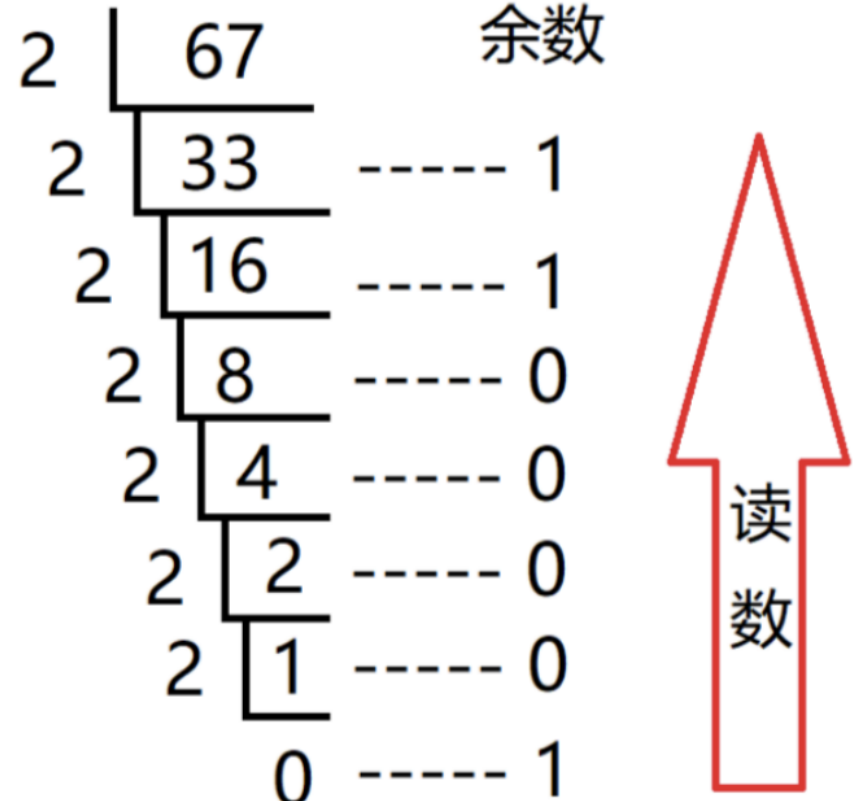

# 进制转化
## 十进制转 $X$ 进制

例如 $(666)_{10} = (?)_x$

```C 此处的除法是先下取整
  |666
n L_______
   | 666/n ->        666 % n
 n L_________
    | 666/n/n -> (666/n) % n
    L__________
      | ....
    n L__________ -> ...
        | 0
     n  L________ -> 结束

结果是 从下往上写
```

要将一个十进制数转换为 x 进制数，可以使用短除法。具体步骤如下：

- 用 x 除以该十进制数，得到商和余数。
- 将余数记录下来，将商作为新的十进制数。
- 如果商不为 0，重复步骤 1 和 2，直到商为 0，此时余数的倒序排列就是所求的 x 进制数。

以 $(666)_{10}$ 转换为 8 进制数为例：

666 ÷ 8 = 83 ... 2<br>
83 ÷ 8 = 10 ... 3<br>
10 ÷ 8 = 1 ... 2<br>
1 ÷ 8 = 0 ... 1<br>

因此， $(666)_{10} = (1232)_8$ 。

---

对于小数的转换，可以将小数部分单独进行转换。具体步骤如下：

将小数部分乘以 $X$，得到整数部分和余数。<br>
将余数记录下来，将整数部分作为新的小数部分。<br>
如果小数部分为 $0$ 或已经达到所需精度，转换结束，余数的正序排列就是小数部分的 $X$ 进制表示。

以$(666.666)_{10}$ 转换为 8 进制数为例：

将小数部分 0.666 乘以 8，得到 5.328，整数部分为 5，余数为 0.328。<br>
将余数 0.328 乘以 8，得到 2.624，整数部分为 2，余数为 0.064。<br>
将余数 0.064 乘以 8，得到 0.512，整数部分为 0，余数为 0.512。<br>
小数部分为 0.526，精度已达到所需，转换结束。<br>

| ##container## |
|:--:|
||

> 十进制转 $x$ 进制 ( $x < 17$ ), 并且需要使用ABC..EF表示 10,12..15
```C++
#include <cstdio>
#include <algorithm>
#include <string>

using namespace std;

int main() {
    string str = "0123456789ABCDEF";
    
    long long x;
    long long jz;
    scanf("%lld %lld", &x, &jz);
    
    string res;
    
    while (x) {
        res.push_back(str[x % jz]);
        x /= jz;
    }
    
    reverse(res.begin(), res.end());
    printf("%s\n", res.c_str());
    
    return 0;
}
```

10进制转-2进制:

- [1017. 负二进制转换](../../../../007-刷题日志/002-力扣/003-未分类题解/013-负二进制转换/index.md)

代码:

```C++
class Solution {
    // 需要保证 k != 0
    string baseK(int N, int K) {
        if (!N) 
            return "0";
        std::string res;
        while (N) {
            int r = N % K; // 获取余数
            if (r < 0) // 保证余数为正数
                r = (r + abs(K)) % abs(K);
            res = std::to_string(r) + res; // 前加就无需翻转
            N = (N - r) / K; // 使得其整除, 而不是向零取整
        }
        return std::move(res);
    }

public:
    string baseNeg2(int x) {
        return std::move(baseK(x, -2));
    }
};
```


## $K$ 进制转十进制
方法: 把 $K$ 进制数按权展开、相加即得十进制

示例:
用 1001 分别以二进制、八进制、十六进制转成十进制

- 二进制 1001 转十进制
    - $1 * 2^{0}+0 * 2^{1}+0 * 2^{2}+1 * 2^{3}$

- 八进制 1001 转十进制
    - $1 * 8^{0}+0 * 8^{1}+0 * 8^{2}+1 * 8^{3}$

- 十六进制 1001 转十进制
    - $1 * 16^{0}+0 * 16^{1}+0 * 16^{2}+1 * 16^{3}$

对于小数, 则是 $a * K^{-1} + a * K^{-2} + ...$

> 输入一个 $x$ 进制数, 把它转化为 十进制!

```C++
#include <iostream>
#include <string>

using namespace std;

int main() {
    string str;
    int jz;
    cin >> str >> jz;
    
    long long res = 0;
    long long k = 1;
    for (int i = str.size() - 1; i >= 0; --i) {
        if ('0' <= str[i] && str[i] <= '9') {
            res += (str[i] - '0') * k;
        } else {
            res += (10 + str[i] - 'A') * k;
        }
        k *= jz; // 类似于快速幂的思想
    }
    
    cout << res << endl;
    
    return 0;
}
```

## $x$ 进制转 $y$ 进制

一般以10进制作为中间桥梁, 但是C++需要高精度, 所以摊牌了, 再见!

```C++
#include <iostream>
#include <string>

using namespace std;

int main() {
    // 构造映射 
    string ys = "0123456789";
    {
        string tmp;
        for (int i = 0; i < 26; ++i) {
            ys += 'A' + i;
            tmp += 'a' + i;
        }
        ys += tmp;
    }
    int x, y;
    string s;
    cin >> x >> y >> s; // x 进制的 s 转化为 y 进制
    
    long long k = 1;
    long long jg = 0;
    string res;
    for (int i = s.size() - 1; i >= 0; --i) {
        if ('0' <= s[i] && s[i] <= '9') {
            jg += (s[i] - '0') * k;
        } else if ('A' <= s[i] && s[i] <= 'Z') {
            jg += (10 + s[i] - 'A') * k;
        } else {
            jg += (36 + s[i] - 'a') * k;
        }
        
        k *= x;
    }
    
    while (jg) {
        res.push_back(ys[jg % y]);
        jg /= y;
    }
    
    for (int i = res.size() - 1; i >= 0; --i)
        cout << res[i];
    
    return 0;    
}
```
