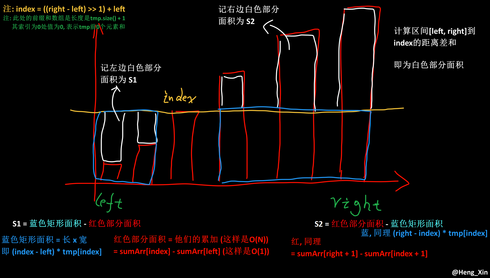

# 中位数贪心
## 问题
在一个一维数轴上, 分布有 n 个商店, 现在需要定一个货仓的位置, 使得 货仓到所有的商店的距离的和最小 (因为考虑到燃油等经济问题...), 请问货仓应该建造在哪里?

### 证明

不妨设如下场景 A ~ G 代表商店, H 代表货仓

```C++
  A      B          C        D  E    F       G
----------------------------------------------> x
```

不妨先随便给货仓一个位置先:
```C++
  A      B          C        D  E    F       G
----------------------------------------------> x
    H
```

- 如果此时 H 先左移动 1 个单位, 那么 它 与 A 的距离 - 1, 而与 B ~ G 的距离 + 1 (显然距离和变大了)

- 如果此时 H 先右移动 1 个单位, 那么 它 与 A 的距离 + 1, 而与 B ~ G 的距离 - 1 (显然距离和变小了(因为 距离减的数量 > 距离加的数量))

- 由上就可以发现: 如果`距离减的数量 > 距离加的数量`那么`距离和`就会减少
    - 所以我们继续往右移动移动移动...
```C++
  A      B          C        D  E    F       G
----------------------------------------------> x
    --> --> --> --> --> -->  H
```

当 `距离减的数量 == 距离加的数量` 时, 即 上面这种情况, 则为最佳位置(距离的和最小位置), (因为往左 那么`距离减的数量 < 距离加的数量`, 往右 也是`距离减的数量 < 距离加的数量`)

所以就得出<span style="color:yellow">`中位数贪心`</span>这个东西, 寻找的是`距离的和最小`并且没有限制, 所以是`贪心`, 而最终结果是在 中间这个仓库上, 所以 称为`中位数`.

**如果商店的数量不是奇数, 而是偶数呢?**
```C++
  A      B      C      D     E       F  G  Z
----------------------------------------------> x
                          H
```
还是中间, 不过是 `[D, E]` 位置之间.

何故なら, 「当`距离减的数量 == 距离加的数量`时, 满足`距离的和最小位置`」からである.

而 在 `[D, E]` 位置之间 正好满足 `距离减的数量 == 距离加的数量`, 所以直接选择在 D 或者 E 也是没问题的.

## 转化为代码
对于一个数组 `arr`, 其值只会为`0`或`1`, 记`1`是商店. 请在数组中选择一个`index`作为仓库的位置使得 其到 **最近** 的 `num` 个商店的 **距离和最小**(对于`arr[m] = 1`, `index`到`arr[m]`的距离为`abs(index - m)`(即索引的差)).

1. 由上面的偶数证明可以知道, 不一定选择`0`的位置才会使得 距离和最小.
2. 所以把全部值为`1`的`arr[i]`的索引记录到`tmp`数组中, 以减少遍历次数.

| ##container## |
|:--:|
|代码原理解释图|
||

注: *一定要保证`tmp`数组的值是从小到大排序的!*

```C++
class Text {
    int minDistanceSum(vector<int>& tmp, vector<int>& sumArr, int left, int index, int right) {
        int s1 = (index - left) * tmp[index] - (sumArr[index] - sumArr[left]);
        int s2 = (sumArr[right + 1] - sumArr[index + 1]) - (right - index) * tmp[index];
        return s1 + s2;
    }
    
public:
    int getMinDistanceSum(vector<int> arr, int num) {
        vector<int> tmp;
        for (int i = 0; i < arr.size(); ++i) {
            if (arr[i]) {
                tmp.push_back(i);
            }
        }

        // 计算前缀和 注意, 是 sumArr 下标为 [1] 对应 tmp[0]
        int n = tmp.size();
        vector<int> sumArr(n + 1);
        for (int i = 0; i < n; ++i)
            sumArr[i + 1] = sumArr[i] + tmp[i];

        // 计算 index 到 num 个 商店 距离和最小 (从 右边界开始算, 防止越界)
        int res = 1e9;
        for (int r = num; r < n; ++r) {
            int l = r - num;
            int index = ((r - l) >> 1) + l;
            res = min(res, minDistanceSum(tmp, sumArr, l, index, r));
        }
        return res;
    }
}
```

## 相关题目

[100227. 拾起 K 个 1 需要的最少行动次数](https://leetcode.cn/problems/minimum-moves-to-pick-k-ones/description/) (第 389 场周赛Q4困难)

视频讲解: [中位数贪心 货仓选址【力扣周赛 389】](https://www.bilibili.com/video/BV1RH4y1W7DP/)

题单：中位数贪心
- [462. 最小操作次数使数组元素相等 II](https://leetcode.cn/problems/minimum-moves-to-equal-array-elements-ii/description/)
- [2033. 获取单值网格的最小操作数 1672]
- [2448. 使数组相等的最小开销 2005]
- [2607. 使子数组元素和相等 2071]
- [2967. 使数组成为等数数组的最小代价 2116]
- [1478. 安排邮筒 2190]
- [2968. 执行操作使频率分数最大 2444]
- [1703. 得到连续 K 个 1 的最少相邻交换次数 2467]
- [LCP 24. 数字游戏]
- [296. 最佳的碰头地点 二维的情况（会员题）]