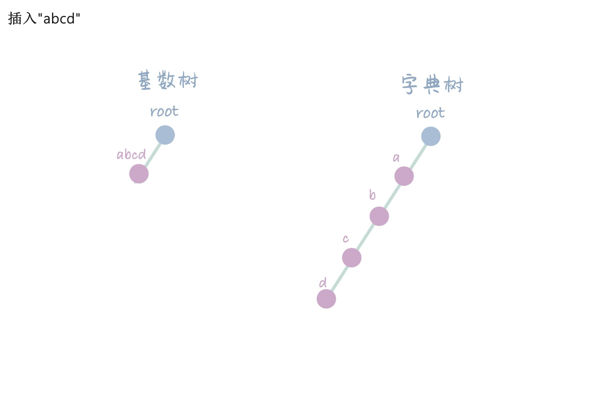
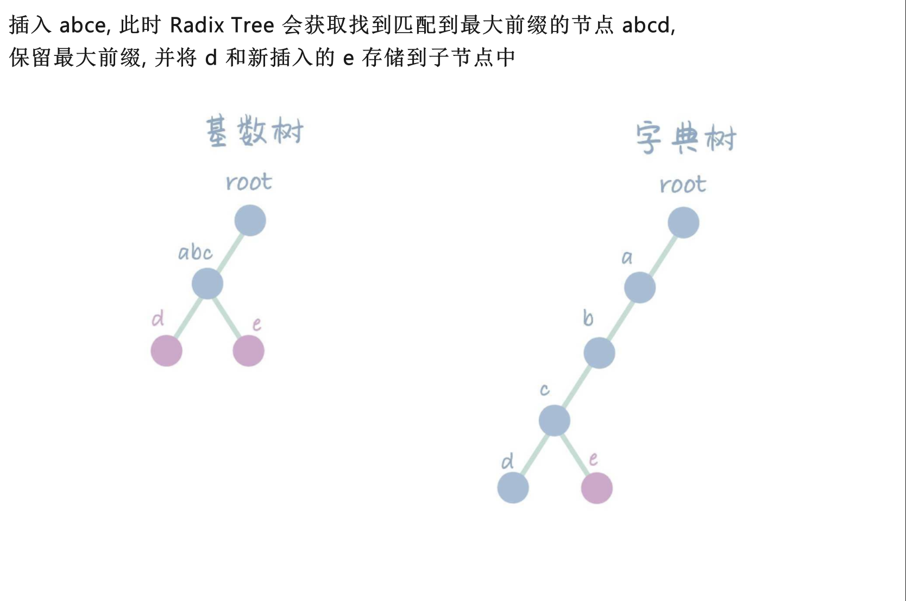
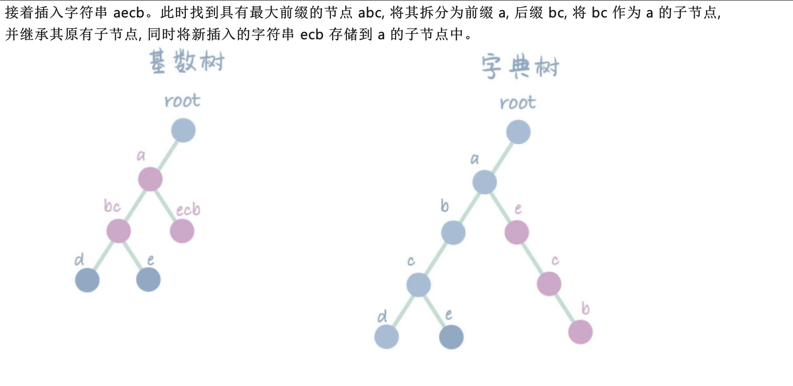
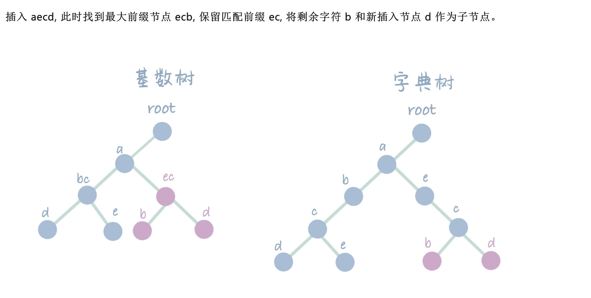
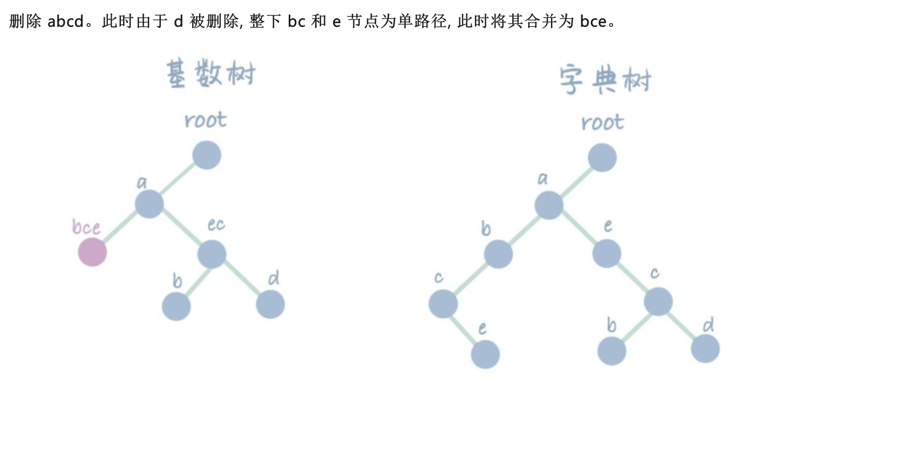
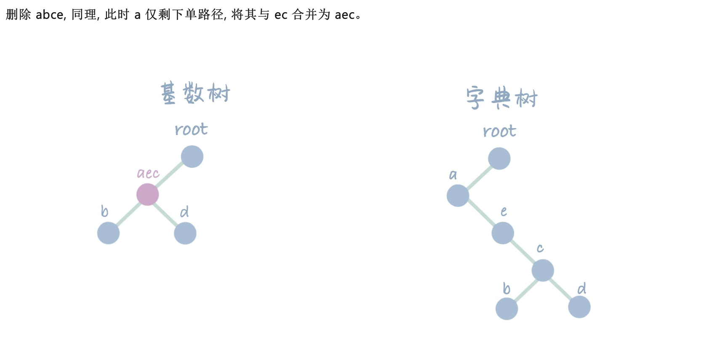
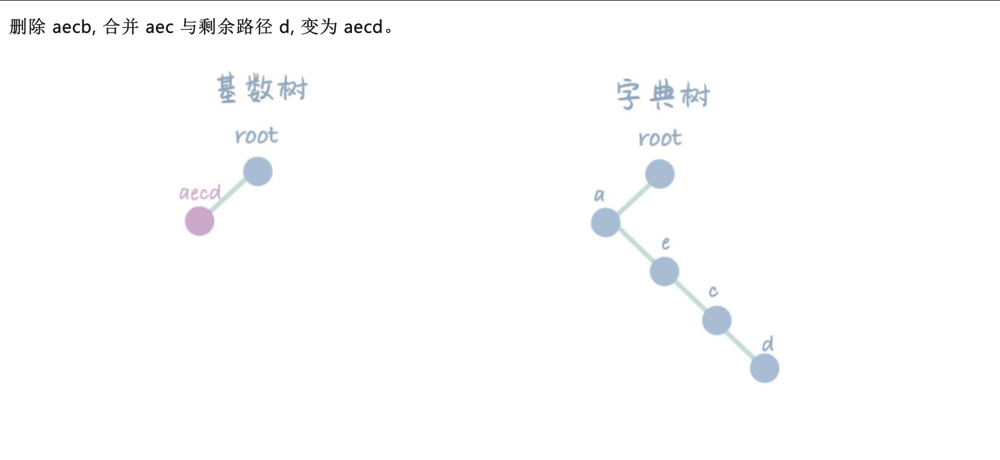

# 基数树 (Radix Tree)
## 一、基本概念
Radix Tree是一种基于 Trie（字典树）的数据结构，旨在解决字符串搜索和匹配的问题。它最早由 Fredkin 在 1960 年提出，并在之后被广泛应用于各种应用领域。其最大的特点就是在 Trie 的基础上，加入了路径压缩的逻辑，通过合并前缀的方式大大的减少了 Trie 中的节点冗余问题，不仅提高了查询效率，还减少了存储空间的使用。

### 1.1 对比字典树
- 下图来源: CSDN: [高级数据结构与算法 | 基数树（Radix Tree）](https://blog.csdn.net/qq_35423154/article/details/130119383)

| ##container## |
|:--:|
||
||
||
||
||
||
||
||
||

### 1.2 应用场景
由于 RadixTree 具有高效的字符串匹配能力以及空间效率，其被广泛应用于字符串搜索、匹配的场景，比较常见的几个用法如:

- 路由表、DNS 等网络设备的查找和匹配。~~(没错, 我就是为了实现`路由表`才来学的qwq)~~
- 编译器中预定义符号和关键词查找。
- Linux 的进程、线程管理，Page Cache 的搜索。
- 自然语言处理

## 二、代码实现

- 见上面的...qwq