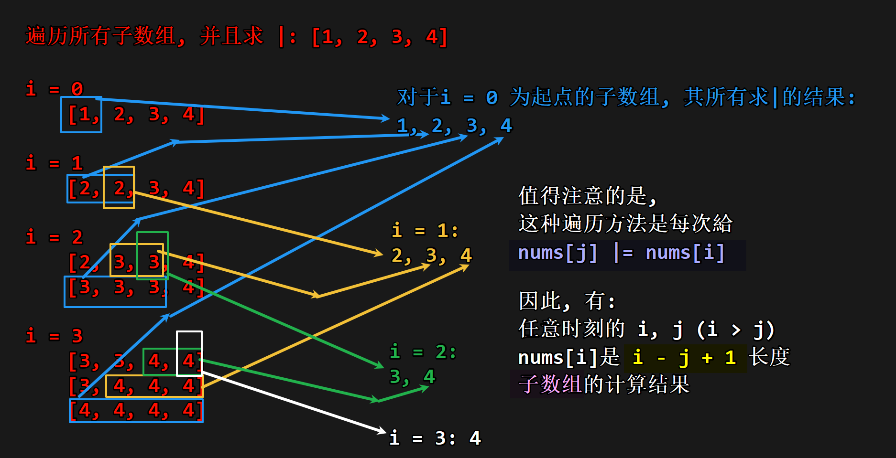

# LogTrick

>  问一个数组的 **所有子数组** 的元素 $AND/OR/lcm/gcd$ 的值为 $k$ (或者是某个可能含有子数组的表达式的值) 的最近元素/子数组个数(二分 $right-left$ /三分(滑窗))
>
> LogTrick利用AND/OR/lcm/gcd的性质, 使得时间复杂度为: $O(n\log{n})$

指导文章: 0x3f: [利用或运算的性质 + 通用模板（Python/Java/C++/Go）](https://leetcode.cn/problems/smallest-subarrays-with-maximum-bitwise-or/solutions/1830911/by-endlesscheng-zai1/)

## 例子一: 按位或最大的最小子数组长度

给你一个`nums`, 求最小长度的子数组, 有 **最大** 的 按位或运算值

其中, 返回的`res[i]`表示从 i 开始的 按位或运算结果最大，且 最短 子数组的长度

```C++
class Solution {
public:
    vector<int> smallestSubarrays(vector<int>& nums) {
        int n = nums.size();
        vector<int> res(n, 1);
        for (int i = 0; i < n; ++i) {
            int x = nums[i];
            for (int j = i - 1; j >= 0 && (nums[j] | x) != nums[j]; --j) {
                nums[j] |= x;
                res[j] = i - j + 1;
            }
        }
        return res;
    }
};
```

可以抽离板子:

```C++
class Solution {
public:
    auto logTrick(vector<int>& nums) {
        int n = nums.size();
        vector<int> res(n, 1); // 题目求的, 可以是单个变量然后max/min; 也可能是arr
        for (int i = 0; i < n; ++i) {
            int x = nums[i];
            for (int j = i - 1; j >= 0 && (nums[j] | x) != nums[j]; --j) {
                nums[j] |= x;
                // res[j] = i - j + 1;
                // 题目求的东西
            }
        }
        return res;
    }
};
```

> [!TIP]
> 特别小心: `|`的运算符优先级比`!=`低; 因此需要加括号.

### 板子可行性

为什么可以这样?

原因: 由于`AND/OR/lcm/gcd的性质`, 他们具有一种集合性质, 也就是把状态压在一起; 因此使用如上的遍历方式, 可以以 $O(n\log{n})$ 时间遍历其所有子数组.

```C++
for (int i = 0; i < n; ++i) {
    int x = nums[i];
    for (int j = i - 1; j >= 0 && (nums[j] | x) != nums[j]; --j) {
        nums[j] |= x;
    }
}
```

| ##container## |
|:--:|
||
|说明|

## 板子2.0

> TODO 待学习

该模板可以做到

- 求出所有子数组的按位或的结果，以及值等于该结果的子数组的个数。
- 求按位或结果等于任意给定数字的子数组的最短长度/最长长度。

```C++
class Solution {
public:
    vector<int> smallestSubarrays(vector<int> &nums) {
        int n = nums.size();
        vector<int> ans(n);
        vector<pair<int, int>> ors; // 按位或的值 + 对应子数组的右端点的最小值
        for (int i = n - 1; i >= 0; --i) {
            ors.emplace_back(0, i);
            ors[0].first |= nums[i];
            int k = 0;
            for (int j = 1; j < ors.size(); ++j) {
                ors[j].first |= nums[i];
                if (ors[k].first == ors[j].first)
                    ors[k].second = ors[j].second; // 合并相同值，下标取最小的
                else ors[++k] = ors[j];
            }
            ors.resize(k + 1);
            // 本题只用到了 ors[0]，如果题目改成任意给定数字，可以在 ors 中查找
            ans[i] = ors[0].second - i + 1;
        }
        return ans;
    }
};
```
