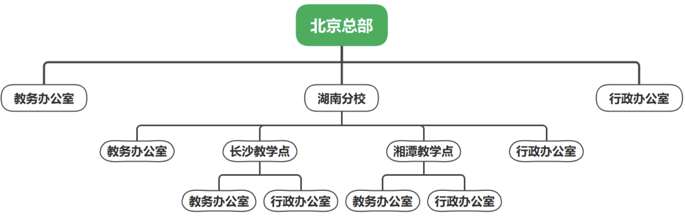

# 相关面试题

# 一

# 二
1. 说说工厂模式吧
2. 说说单例模式吧
3. 要求：实现一个图片读取器，在充分考虑开闭原则同时，支持读取各种类型的图片，如：GIF、JPG、PNG。

4. 要求：设计一个数据库操作系统，用户可以自定义数据库连接对象（Connection）和语句对象（Statement），可以针对不同的数据库（如：MySQL、Oracle、SQLSever等等）构建不同的连接对象和语句对象，也可以通过配置文件切换数据库类型。

5. 说说建造者模式吧

6. 某播放器软件包含多种界面模式，如完整模式、精简模式、记忆模式等等。在不同的界面模式下，界面组成元素不同。如完整模式会显示（菜单、播放列表、收藏列表、歌词写真、控制条），在精简模式下会显示（控制条），记忆模式会显示（收藏列表，控制条）。使用设计模式模拟设计界面构建过程.

# 三
1. 说说原型模式吧
2. 说说适配器模式吧
3. 使用适配器模式设计播放器
    - 要求：目前有几个常用的播放器`Windows Media Player`、`RealPlayer`以及`QQ影音播放器`，它们支持不同格式的媒体文件的播放，现在需要一个程序能够支持多种媒体文件播放。
4. 说说桥接模式吧
5. 说说组合模式吧
6. 使用桥接模式设计系统
    - 空客（Airbus）、波音（Boeing）和麦道（McDonnell-Douglas）都是飞机制造商，它们都能生产载人飞机（Passenger Plane）和载货飞机（Cargo Plane）。现在设计一个系统，描述飞机制造商和制造飞机之间的关系。
7. 使用组合模式设计系统
    - 某教育机构可以给各级办公室下发公文，其组织结构示意图如下图所示，请使用组合模式设计一套程序完成公文下发
    - 

# 四
1. 说说装饰模式吧
2. 说说外观模式吧
3. 说说代理模式吧
4. 说说享元模式吧
5. 使用装饰模式设计系统
    - 要求：现有一个简单的手机（SimplePhone），在接收到来电的时候只能`响铃`，现在需要给手机添加新功能，收到来电时候还能产生`振动`（JarPhone），还能再添加功能，除了响铃、振动外还能发出`灯光闪烁`的高级手机（ComplexPhone），请使用装饰器模式模拟该手机升级过程。
6. 使用外观模式设计系统
    - 要求：电脑主机（Mainframe）中只需按下主机的开机按钮（on）即可调用其他硬件设备和软件的启动，如内存（Memory）的自检（check）、CPU的运行（run）、硬盘（HardDisk）的读取（read）、操作系统（OS）的载入（load）等，如果某一个过程执行失败，电脑将启动失败。请使用外观模式模拟这一个过程。
7. 使用代理模式设计系统
    - 要求：在一个论坛中已注册的用户和游客权限不同，已注册的用户拥有发帖、修改注册信息、修改帖子信息等权限；游客只能浏览帖子，没有其他权限。请使用保护代理来是该权限管控。
8. 使用享元模式设计系统
    - 某软件公司要开发一个多功能文档编辑器，在文档编辑器中可以插入多种媒体资源(如：图片、视频、动画)。为了节约系统资源，相同的视频、动画、图片资源在同一个文档只保留一份，但可以重复出现在文档的不同位置、大小也可以调整。使用享元模式来设计系统

# 五
1. 说说职责链（责任链）模式吧
2. 说说命令模式吧
3. 说说解释器模式吧
4. 说说迭代器模式吧
5. 使用职责链模式设计系统
    - 假设某公司中的假条审批流程是这样的，如果员工请假小于3天部门主管可以审批；如果大于等于3天小于10天经理可以审批；如果大于等于10天小于30天总经理可以审批；如果大于等于30天，总经理也无法审批，表示拒绝。请使用职责链模式来设计系统。
6. 使用命令模式设计系统
    - 设计一个简单的日志记录程序，用于处理对配置文件的操作，能够将一组命令通过序列化写到日志文件中，并可以通过该日志文件执行批处理。
7. 使用迭代器模式设计系统
    - 设计一个逐页迭代器，每次返回指定条数的一页数据，并将该迭代器用于对数据进行分页处理
  
# 六
1. 说说中介者模式吧
2. 说说备忘录模式吧
3. 说说观察者模式吧
4. 说说状态模式吧
5. 使用中介者模式设计系统
    - 如下温度转换小程序，点击换算按钮后能够根据对应文本框输入的温度类型进行温度换算并更新其他文本框输入内容，重置按可以重置所有文本框，使用中介者模式设计系统。
    ```界面
    |摄氏度| 1 | [换算按钮]
    |开氏度| ? | [换算按钮]
    |华氏度| ? | [换算按钮]
         [重置按钮]
    ```
6. 使用备忘录模式设计系统
    - 使用备忘录模式，设计一个具有撤销功能的简单计算器。

7. 使用观察者设计系统
    - 某软件系统登录系统要求，新用户注册成功后，一方面要给用户发放优惠卷，另一方面发短信通知用户，使用观察者模式设计这个登录系统。

8. 使用状态模式设计系统
    - 在某纸牌游戏系统中人物角色分入门级、熟练级、高手级和骨灰级4种等级，角色的等级与其积分对应，游戏胜利获得积分，游戏失败扣除积分。入门级只具备基本的游戏功能，熟练级增加双倍积分场，高手级增加换牌功能，骨灰级增加记牌功能。使用状态模式设计系统。

# 七
1. 说说策略模式吧
2. 说说模板方法模式吧
3. 说说访问者模式吧
4. 使用策略模式设计系统
    - 某公司要开发一款飞机模拟系统，该系统主要模拟不同飞机种类的飞行特征与起飞特征，需要模拟的飞机种类和特征如下表。
| **种类** | **起飞特征** | **飞行特性** |
|---------|------------|------------|
| 直升机 (Helicopter) | 垂直起飞 (VerticalTakeOff) | 亚音速飞行 (SubSonicFly) |
| 客机 (AirPlane) | 长距离起飞 (LongDistanceTakeOff) | 亚音速飞行 (SubSonicFly) |
| 歼击机 (Fighter) | 长距离起飞 (LongDistanceTakeOff) | 超音速飞行 (SuperSonicFly) |
| 鹞式战斗机 (Harrier) | 垂直起飞 (VerticalTakeOff) | 超音速飞行 (SuperSonicFly) |
    - 为了将来能够模拟更多飞行特性，使用策略模式设计系统。

5. 使用模板方法模式设计系统
    - 银行办理业务是一般都包含，下面几个关键的步骤：取号排队->办理业务->对银行员工评分。无论是办理取款、存款还是转账，基本流程都是一样的，现在使用模板方法模式模拟这一过程。

6. 使用访问者模式设计系统
    - 顾客在超市进行购物是需要将选择商品放到购物车中，收银员需要根据购物车中的商品进行计价结算。对于顾客来说，需要关注商品的质量，对于收银员来说，需要关注商品的价格。对同一个商品不同的人访问点不同，使用访问者模式来模拟这个过程。