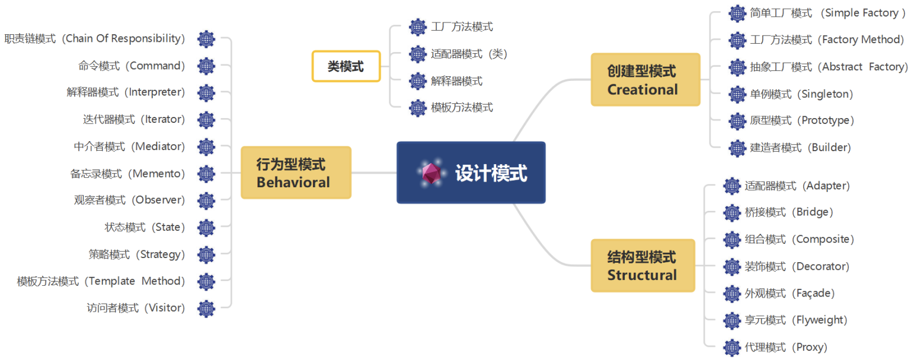

# 初识设计模式
## 历史
略
## 设计模式定义与分类
### 设计模式的定义
**设计模式(Design Pattern)** 是一套被反复使用、多数人知晓的、经过分类编目的、代码设计经验的总结，使用设计模式是为了可重用代码、让代码更容易被他人理解并且保证代码可靠性。

GoF对设计模式的定义如下：
> Design pattern are description of communicating objects and classes that are customized to solve general design problem in a particular context
>
> 设计模式是在特定环境下为解决某一软件设计问题提供的一套定制的解决方案，该方案描述了类与对象之间的相互作用

### 设计模式的基本要素
设计模式一般包含模式名称、问题、目的、解决方案、效果等组成要素，其中关键要素是模式名称、问题、解决方案和效果。

#### 模式名称(Pattern Name)
通过一两个词来描述模式的问题、解决方案和效果，以便更好地理解模式并方便开发人员之间的交流，绝大多数模式都是根据其功能或模式结构来命名的。

在学习设计模式的时候建议准确的记忆设计模式的中英文名称，因为有时候在代码实现的时候类名中就会出现模式名称的关键词（如：`XXXAdapter`，`XXXFactory`）。

#### 问题(Problem)
描述了应该在何时使用模式，它包含了设计中存在的问题以及问题存在的原因。

有时候，在模式问题描述中可能包含模式使用的一些先决条件，例如在使用组合模式的时候要求系统存在整体和部分的层次结构关系。

#### 解决方案(Solution)
描述了一个设计模式的组成成分，以及这些组成成分之间的相互关系，各自的职责和协作方式，通常解决方案通过`UML`类图和核心代码来进行描述。

对于每一个设计模式用户必须掌握其类图，理解类图中每个角色的意义以及他们之间的关系，同时需要掌握核心代码，以便在开发中使用。

#### 效果(Consequences)
描述了模式的优缺点以及在使用模式时应权衡的问题。

在评价效果的时候一般需要结合面向对象的设计原则来评估（如：是否符合单一原则、是否符合开闭原则等等）。

### 设计模式的分类
设计模式一般有两种分类方式。

#### 根据用途分类
可分为**创建型(Creational)**，**结构型(Structural)** 和**行为型(Behavioral)** 三种。
- 创建型模式：主要用于描述如何创建对象
- 结构型模式：主要用于描述如何实现类或对象的组合
- 行为型模式：主要用于描述类或对象怎样交互以及怎样分配职责

#### 根据范围分类
设计模式根据范围（模式主要是用于处理类之间的关系还是对象之间的关系）还可以分为类模式和对象模式。
- 类模式：处理类和子类之间的关系，这类关系通过继承实现，在编译时就确定下来的一种静态关系。
- 对象模式：处理对象之间的关系，这些关系在运行时变化，更具动态性。

我们经常将两种分类方式结合使用，如单例模式是对象创建型模式，模板方法模式是类行为型模式。

> [!TIP]
> TIP：有一个设计模式虽然不属于`GoF`23种设计模式，但一般在介绍设计模式时都会对它进行说明，它就是简单工厂模式，也许是太“简单”了，`GoF`并没有把它写到那本经典著作中。

| ##container## |
|:--:|
||

### 使用比较多的设计模式
工厂方法模式、抽象工厂模式、单例模式、建造者模式、适配器模式、组合模式、外观模式、代理模式、迭代器模式、观察者模式。(因人而异)

## 设计模式的优点
(1) 设计模式来源众多专家的经验和智慧，它们是从许多优秀的软件系统中总结出的成功的、能够实现**可维护性复用的设计方案**，使用这些方案将可以让我们避免做一些重复性的工作，也许我们冥思苦想得到的一个“自以为很了不起”的设计方案其实就是某一个设计模式。在时间就是金钱的今天，设计模式无疑会为**有助于我们提高开发和设计效率**，但它不保证一定会提高。

(2) 设计模式提供了**一套通用的设计词汇和一种通用的形式来方便开发人员之间沟通和交流**，使得设计方案更加通俗易懂。交流通常很耗时，任何有助于提高交流效率的东西都可以为我们节省不少时间。无论你使用哪种编程语言，做什么类型的项目，甚至你处于一个国际化的开发团队，当面对同一个设计模式时，你和别人的理解并无二异，因为设计模式是跨语言、跨平台、跨应用、跨国界的。

(3) 大部分设计模式都兼顾了系统的可重用性和可扩展性，这使得我们可以更好地重用一些已有的设计方案、功能模块甚至一个完整的软件系统，避免我们经常做一些重复的设计、编写一些重复的代码。此外，随着软件规模的日益增大，软件寿命的日益变长，系统的可维护性和可扩展性也越来越重要，许多设计模式将**有助于提高系统的灵活性和可扩展性**，让我们在不修改或者少修改现有系统的基础上增加、删除或者替换功能模块。如果一点设计模式都不懂，我想要做到这一点恐怕还是很困难的。

(4) 合理使用设计模式并对设计模式的使用情况进行文档化，将**有助于别人更快地理解系统**。如果某一天因为升职或跳槽等原因，别人接手了你的项目，只要他也懂设计模式，能够很快理解你的设计思路和实现方案。

(5) 最后一点对初学者很重要，学习设计模式将**有助于初学者更加深入地理解面向对象思想**，让你知道：
  - 如何将代码分散在几个不同的类中？
  - 为什么要有“接口”？
  - 何谓针对抽象编程？
  - 何时不应该使用继承？
  - 如果不修改源代码增加新功能？

同时还让你能够更好地阅读和理解现有类库（如JDK）与其他系统中的源代码，让你早点脱离面向对象编程的“菜鸟期”。

## 小结

  

    1. 模式是什么？
    

      模式是在特定环境下人们解决某类重复出现问题的一套成功或有效的解决方案。
    

  

  

    2. 软件模式是什么？
    

      软件模式是将模式的一般概念应用于软件开发领域，即软件开发的总体指导思路或参照样板。软件模式可以被认为是对软件开发这一特定“问题”的“解法”的某种统一表示，即软件模式是在一定条件下软件开发问题及其解法。
    

  

  

    3. 设计模式是什么？
    

      设计模式用于在特定的条件下为一些重复出现的软件设计问题提供合理的、有效的解决方案，该方案描述了对象和类之间的相互作用。
    

  

  

    4. 设计模式包括哪些基本要素？
    

      设计模式一般包含模式名称、问题、目的、解决方案、效果等组成要素，其中关键要素是模式名称、问题、解决方案和效果。
    

  

  

    5. 设计模式怎样分类的？
    

      根据用途分类：可分为创建型(Creational)，结构型(Structural)和行为型(Behavioral)三种。根据范围分类：可以分为类模式和对象模式。
    

  

*注: 鼠标移动到上面可以看到答案.*