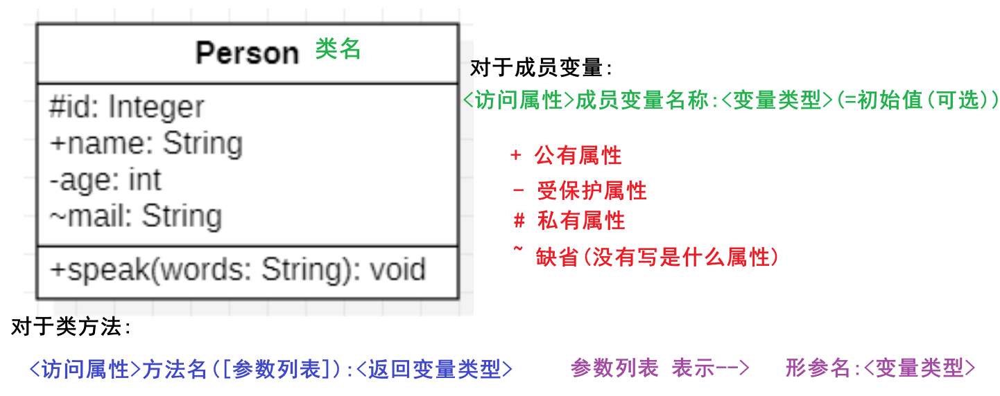
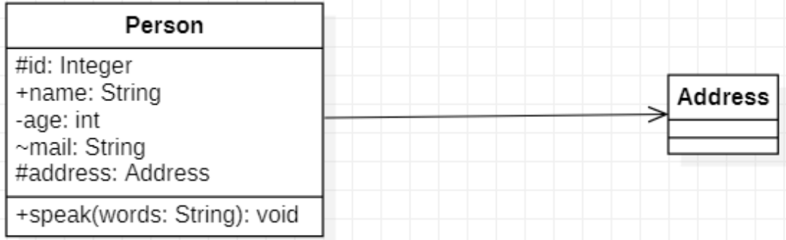
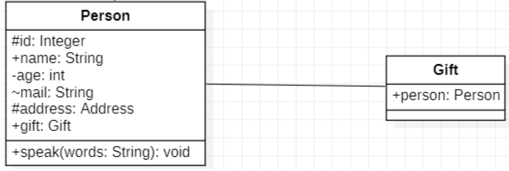
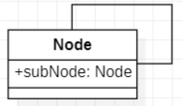
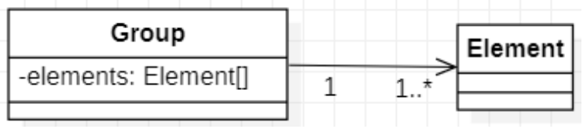
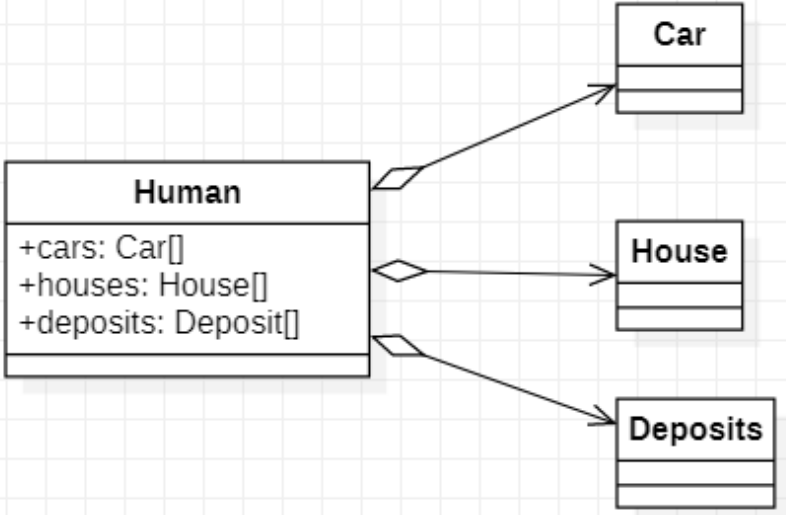
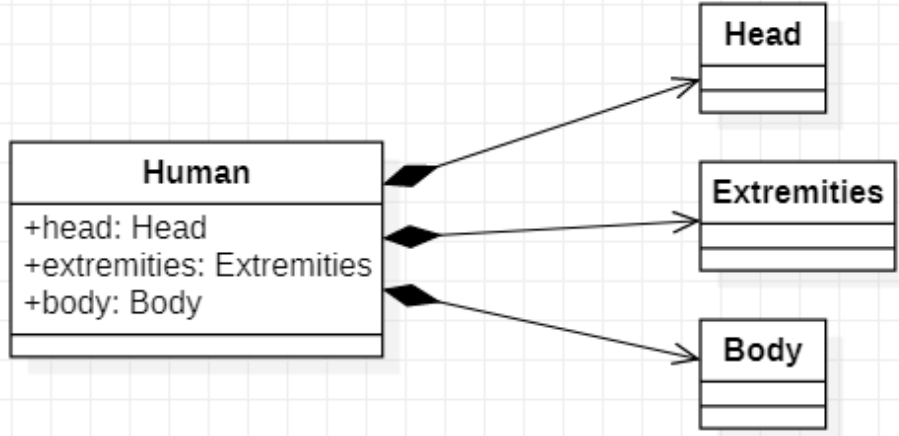
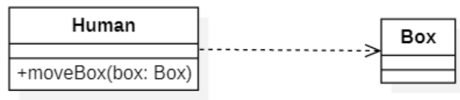
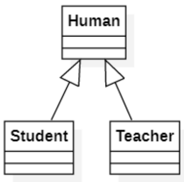
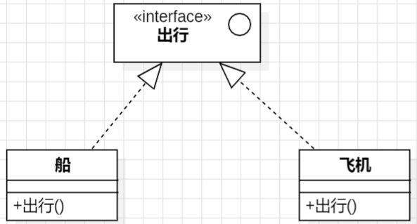

# UML
## UML概述
**统一建模语言（英语：Unified Modeling Language，缩写`UML`）** 是非专利的第三代建模和规约语言。

UML是一种开放的方法，用于说明、可视化、构建和编写一个正在开发的、面向对象的、软件密集系统的制品的开放方法。UML展现了一系列最佳工程实践，这些最佳实践在对大规模，复杂系统进行建模方面，特别是在软件架构层次已经被验证有效。
> 参考链接：[维基百科](https://zh.wikipedia.org/wiki/%E7%BB%9F%E4%B8%80%E5%BB%BA%E6%A8%A1%E8%AF%AD%E8%A8%80)

### 模型
在UML系统开发中有三个主要的模型：
- 功能模型：从用户的角度展示系统的功能，包括用例图。
- 对象模型：采用对象，属性，操作，关联等概念展示系统的结构和基础，包括类别图、对象图。
- 动态模型：展现系统的内部行为。包括序列图，活动图，状态图。

### 图
区分UML模型和UML图是非常重要的，UML图是模型中信息的图形表达方式，但是UML模型独立于UML图存在。

UML 2.2中一共定义了14种图示。
- 结构图示：
    1. 类图 (Class Diagram)
    2. 对象图 (Object Diagram)
    3. 组件图 (Component Diagram)
    4. 包图 (Package Diagram)
    5. 软件结构图 (Composite Structure Diagram)
- 行为图示：
    6. 用例图 (Use Case Diagram)
    7. 序列图 (Sequence Diagram)
    8. 协作图 (Collaboration Diagram)
    9. 状态图 (Statechart Diagram)
    10. 活动图 (Activity Diagram)
    11. 时间顺序图 (Timing Diagram)
    12. 交互概述图 (Interaction Overview Diagram)
    13. 通信图 (Communication Diagram)
- 部署图示：
    14. 部署图 (Deployment Diagram)

## 制图工具
StarUML<sup>[1]</sup>、Visio、ProcessOn

## 类图
类图是一切面向对象方法的核心建模工具。该图描述了系统中对象的类型以及它们之间存在的各种<span style="color:red">静态关系</span>。

| ##container## |
|:--:|
||

对应C++代码:

```C++
class Person
{
    string mail;
protected:
    int id;
public:
    string name;
    void speak(string words) {};
private:
    int age;
};
```

在UML中类图一般由3部分组成。
- 第一部分：**类名**，按照命名规范来定义。
- 第二部分：**属性(Attribute)**，属性通常值类的成员变量。

定义格式:

```UML
[可见性] 属性名:数据类型 [=默认值]
```

- 第三部分: **操作(Operation)**，操作通常指类的成员方法。

定义格式:

```UML
[可见性] 方法名([参数1:数据类型,参数2:数据类型,....]) [:返回值类型]
```

# 类之间的关系
## I 关联关系
**关联(Association)** 关系是一种结构化的关系，用于表示一个类对象与另一个类对象的之间的关系，在**代码中**<span style="color:red">被关联的对象以成员变量的方式体现</span>。

### 单向关联 [单向箭头]



```C++
class Person
{
// ...
protected:
    int id;
    Address address;
// ...
};
```

### 双向关联 [纯实线]



```C++
class Person
{
// ...
public:
    string name;
    void speak(string words) {};
    Gift gift;
// ...
};

class Gift
{
public:
    Person person;    
}
```

### 自关联



```C++
class Node {
public:
    Node* subNode;
};
```

### 多重性关联
多重性关联关系又称为重数性（Multiplicity）关联关系，表示关联对象之间存在数量关系。

数量关系符表示如下
- `1或1..1`：表示另一个类的一个对象只与该类的一个对象有关系
- `0..*`：表示另一个类的一个对象与该类的零个或多个对象有关系
- `1..*`：表示另一个类的一个对象与该类的一个或多个对象有关系
- `0..1`：表示另一个类的一个对象没有或只与该类的一个对象有关系
- `m..n`：表示另一个类的一个对象与该类最少m最多n个对象有关系（m ≤ n）



一个小组可以有1到多个成员，但是每个成员只属于一个组

```C++
class Element {};

class Group
{
private:
    vector<Element> elements;
};
```

## II 聚合关系 [空心+箭头]
**聚合（Aggregation）关系** 表示整体与部分的关系，在聚合中成员是整体对象的一部分，<span style="color:red">成员对象可以脱了整体对象而独立存在</span>。



```C++
class House {};
class Car {};
class Deposit {};

class Human
{
public:
    House* houses;
    Car* cars;
    Deposit* deposits;
};
```

## III 组合关系 [实心+箭头]
**组合（Composition）关系** 也表示整体与部分的关系，在组合中整体对象可以控制成员对象的生命周期，<span style="color:red">一旦整体对象消亡成员对象将消失</span>。




```C++
class Head {};
class Extremities {};
class Body {};

class Human
{
public:
    Head head;
    Extremities extremities;
    Body body;
};
```

## IV 依赖关系 [虚线箭头]
**依赖（Dependency）关系**是一种使用关系，在大多数情况下依赖关系体现<span style="color:red">在某个类方法参数上使用另一个类的对象作为方法参数</span>。



```C++
class Box {};

class Human
{
public:
    void move(Box box) {};
};
```

## V 泛化关系 [实线空心箭头]
**泛化（Generalization）关系**也就是<span style="color:red">继承关系</span>。



```C++
class Human {};
class Teacher :public Human {};
class Student :public Human {};
```
## VI 接口与实现关系 [虚线空心箭头]
**接口（Interface）** 之间也可以有与类之间关系类似的继承关系和依赖关系，接口与类之间同时还存在一种**实现（Realization）关系**，在这种关系中类实现了接口中所有的操作。



```C++
class Vehicle {};
class Car :public Vehicle {};
class Ship :public Vehicle {};
```

- 定义一个函数为`虚函数`，不代表函数为不被实现的函数。
- 定义他为虚函数是为了允许用基类的指针来调用子类的这个函数。
- 定义一个函数为`纯虚函数`，才代表函数没有被实现
- 定义纯虚函数是为了实现一个接口，起到一个规范的作用，规范继承这个类的程序员必须实现这个函数
- 参考: [C++ 接口（抽象类）](https://www.runoob.com/cplusplus/cpp-interfaces.html)
  ```C++
  // 基类
  class Shape 
  {
  public:
     // 提供接口框架的纯虚函数
     virtual int getArea() = 0;
     void setWidth(int w)
     {
        width = w;
     }
     void setHeight(int h)
     {
        height = h;
     }
  protected:
     int width;
     int height;
  };
   
  // 派生类
  class Rectangle: public Shape
  {
  public:
     int getArea()
     { 
        return (width * height); 
     }
  };
  
  class Triangle: public Shape
  {
  public:
     int getArea()
     { 
        return (width * height)/2; 
     }
  };
  ```


## 附件
### [1] StarUML 下载安装与汉化
自行百度

### [2] VS VX (番茄助手)
VS的插件, 爱国版请自行百度

### [3] vld 内存泄漏检测

[内存泄露检测工具VLD(Visual Leak Detector)使用说明](https://blog.csdn.net/devillixin/article/details/126196206)

[使用 VLD 检测内存泄漏](https://blog.csdn.net/lizhichao410/article/details/124493480)