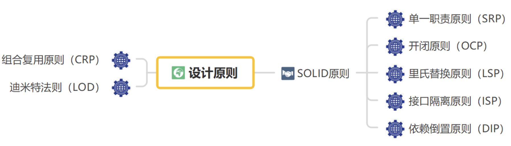

# 设计原则
<!--https://blog.hxloli.com/blog/#/articles?articleId= 博客兼容-->
> ##red##
> 🔴 面向对象设计原则为支持可维护性复用而诞生，这些原则蕴含在很多设计模式中，它们是从许多设计方案中总结出的指导性原则。

面向对象设计原则也是后续设计模式学习的基础，每一个设计模式都符合一个或多个设计原则，是评价设计模式使用效果的重要指标之一。

常见设计原则如下: ~请记住, 不然后续课程可能会云里雾里~

## 目录

1. [[SOLID]单一职责原则(`SRF`)](../002-【SOLID】单一职责原则/index.md)

2. [[SOLID]开闭原则(`OCP`)](../003-【SOLID】开闭原则/index.md)

3. [[SOLID]里氏替换原则(`LSP`)](../004-【SOLID】里氏替换原则/index.md)

4. [[SOLID]依赖倒置原则(`DIP`)](../005-【SOLID】依赖倒置原则/index.md)

5. [[SOLID]接口隔离原则(`ISP`)](../006-【SOLID】接口隔离原则/index.md)

6. [组合复用原则 (`CRP`)](../007-组合复用原则/index.md)

7. [迪米特法则 (`LOD`)](../008-迪米特法则/index.md)

## 小结

1. 面向对象设计原则的目标是什么？
2. 什么是单一职责原则？
3. 什么是开闭原则？
4. 什么是里氏替换原则？
5. 什么依赖倒置原则？
6. 什么是接口隔离原则？
7. 什么是组合复用原则？
8. 什么是迪米特法则？

### 答案
1. 提高软件的可维护性和可复用性，实现可维护性的复用。
2. 一个对象应该只包含单一的职责，并且该职责被完美的封装在一个类中。
3. 软件实体应对扩展开放，而对修改关闭。
4. 软件中所有引用基类（父类）的地方必须能透明地使用其子类的对象。
5. 高层模块不应该从低层模块导入任何东西，两者都应该依赖于抽象。抽象不应该依赖于细节，细节应当依 赖于抽象。即：针对接口编程，而不是针对实现编程。
6. 客户端不应该依赖哪些它不需要的接口。
7. 优先使用对象的组合，而不是使用继承来达到复用的目的。
8. 每一个软件单位对其他单位尽可能少的了解，而且局限于哪些与本单位密切相关的的软件。