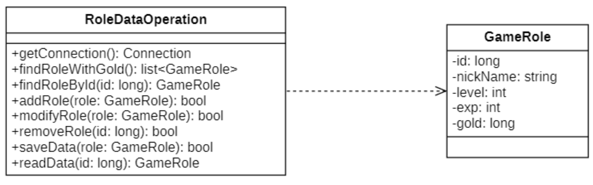
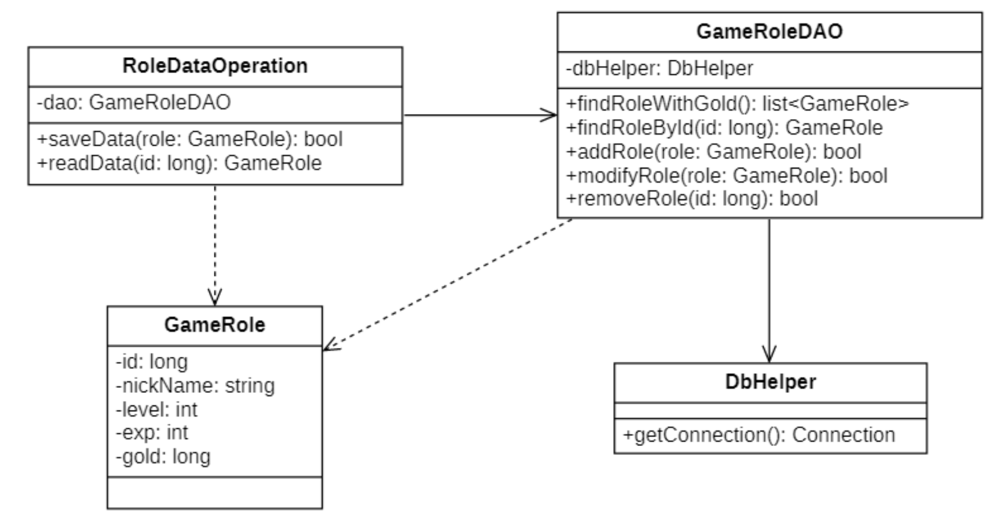

# 单一职责原则
## 介绍
> ##yellow##
> 🟡 **单一原则**（Single Responsibility Principle, `SRP`）是最简单的设计原则，它用来控制类的颗粒度大小。

> Every object should have a single responsibility, and that responsibility should be entirely encapsulated by the class.
>
> 一个对象应该只包含单一的职责，并且该职责被完美的封装在一个类中。

## 错误示例

`RoleDataOperation`类 承载了 数据库连接, 数据库数据操作, 存档数据业务操作的功能职责. $不符合单一职责$。

## 修改

|##container##|
|:--:|
|将其分成四个类, 并且满足"单一职责原则"|

1. RoleDataOperation 读写存档类
2. GameRoleDAO 数据库操作类<增删改查>
3. GameRole 游戏数据类
4. DbHelpre 数据库连接 `猜的`