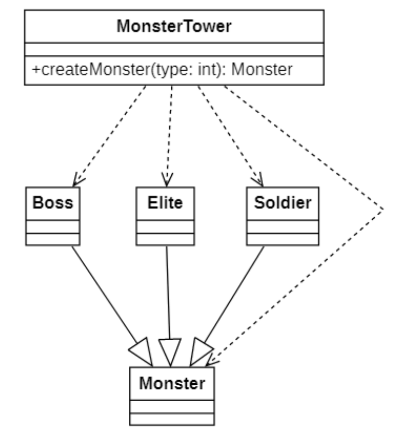
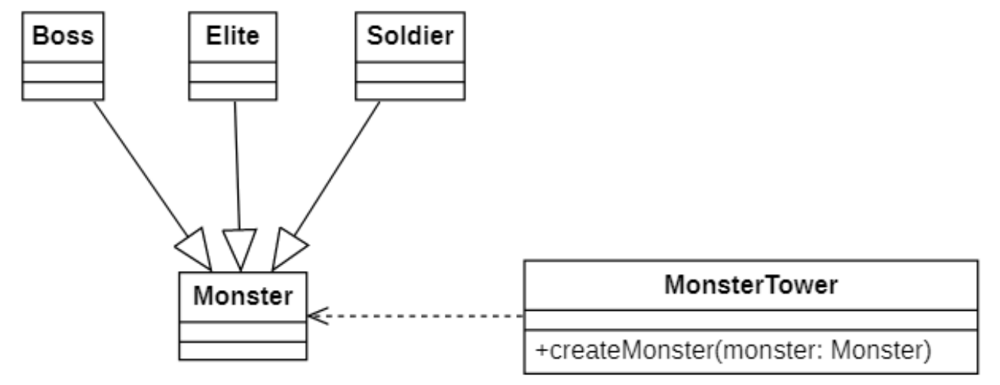

# 开闭原则
## 说明
> ##red##
> 🔴**开闭原则**(Open-Closed Principle , `OCP`)是面向对象的可复用设计的第一块基石，它是 $最重要$ 的面向对象设计原则。

开闭原则由Bertrand Meyer于1988年提出，其定义如下：
> Software entities should be open for extension, but close for modification.
>
> 软件实体应对扩展开放，而对修改关闭


> ##yellow##
> 🟡在开闭原则的定义中，
> > **软件实体可以指一个软件模块、一个由多个类组成的局部结构或一个独立的类**。
> > > ##red##
> > 开闭原则就是指软件实体尽量在不修改源码的情况下进行扩展。
> > 
> > > ##green##
> > > 开闭原则是评价基于某个设计模式设计的系统是否具备灵活性和可扩展性的重要依据。

$通俗的讲, 就是 你可以添加代码, 但你不能修改代码$

## 错误示例
以下模拟一个刷怪塔



`createMonster`为如下代码:
```C++
Monster monster;
if (type == 1)
{
    Boss boss;
    monster = boss;
    // Boss 扩展处理
}
else if (type == 2)
{
    Elite elite;
    monster = elite;
    // 精英怪 拓展处理
}
else if (type == 3)
{
    Soldier soldier;
    monster = solider;
    // 普通怪 拓展处理 
}
// 怪物对象通用处理
// ...
```

显然这样子, 如果增加新的怪物的话, 又需要修改 类 的代码, **不符合**开闭原则

## 修改



对`createMonster`的代码调整:

```C++
void MonsterTower::createMonster(Monster *monster)
{
    // 怪物对象通用处理
    // ...
}
```

把 刷怪方法的职责 修改了, 怪物不是被`createMonster`创建, 而是由外部创建, 比如在 Boss类中 有一个创建方法, 被创建后 以对象指针的方式, 被传入 `createMonster`, 从而进行一些诸如坐标计算/添加进入对象池等操作