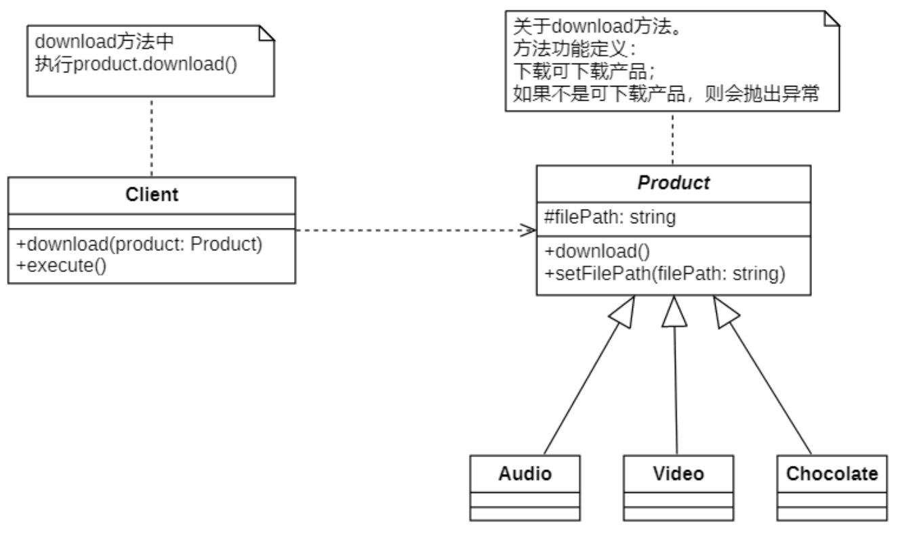

# 里氏替换原则
## 说明
**里氏代换原则**(Liskov Substitution Principle, `LSP`)由2008年图灵奖得主、美国第一位计算机科学女博士Barbara Liskov（芭芭拉·利斯科夫）教授和卡内基·梅隆大学Jeannette Wing（珍妮特·温）教授于1994年提出。

其严格表述如下:
> If for each object `o1` of type S there is an object `o2` of type T such that for all programs Pdefined in terms of T, the behavior of p is unchanged when `o1` is substituted for `o2` then S is asubtype of T.
>
> 如果对每一个类型为S的对象o1，都有类型为T的对象o2，使得以T定义的所有程序P在所有的对象o1代换o2时，程序P的行为没有变化，那么类型S是类型T的子类型。

这个定义比较拗口且难以理解，因此我们一般使用它的另一个通俗版定义:

> Functions that use pointers or references to base classes must be able to use objects of derived classes without knowing it.
>
> 所有引用基类（父类）的地方必须能透明地使用其子类的对象。
>
> [里氏替换原则 参考链接](https://medium.com/swlh/lsp-liskov-substitution-principle-24311d1f854)

里氏替换原则告诉我们:

**在软件中将一个`基类对象`替换成它的`子类对象`，程序将不会产生任何错误和异常，**

*反过来则不成立***，如果一个软件实体使用的是一个子类对象的话，那么它`不一定`能够使用基类对象。**

即:

```C++
class BaseClass {};                   // 基类
class SubClass : public BaseClass {}; // 子类

// 如果有一个方法是接受 父类对象的, 那么肯定可以 接受(替换为)子类对象
void Demo::fun(BaseClass& base);

// 如果一个方法是接受 子类对象的, 那么一般不能 接受(替换为)父类对象, 除非是重载方法
void Demo::method(SubClass& sub);
```

里氏代换原则是实现开闭原则的重要方式之一，由于使用基类对象的地方都可以使用子类对象，因此**在程序中尽量使用基类类型来对对象进行定义，而在运行时再确定其子类类型，用子类对象来替换父类对象。**

> 常见 实现里氏替换原则的方法:
```GPT-3.5
除了多态，还有一些其他方法来实现里氏代换原则。下面列举了几种常见的方法：

0. 多态

1. 继承：通过继承关系，子类可以替换父类的位置，并且可以使用父类的接口和功能。子类可以重写父类的方法以实现特定的行为，同时还可以添加新的方法或属性。

2. 接口实现：通过接口定义规范，子类可以实现相同的接口并提供自己的实现逻辑。这样，子类对象可以在不改变父类引用的情况下替换父类对象，并且调用相同的接口方法。

3. 抽象类和模板方法：抽象类是一种中间层，它定义了一组抽象方法和具体方法。子类继承该抽象类，并根据需要重写抽象方法，实现自己的特定行为，但不能改变模板方法的执行顺序。

4. 委托和组合：通过组合关系，将子类对象作为成员变量组合到父类对象中，然后通过委托调用子类对象的方法。这样，父类对象可以使用子类对象的功能，实现多态性。

需要注意的是，无论采用何种方法来实现里氏代换原则，都需要遵循父类和子类之间的约定和规范，确保子类对象能够完全替换父类对象并保持一致的行为。这样才能实现代码的可维护性、可扩展性和重用性。
```

## 错误示例


下面是依照UML图的关系, 写的业务代码
```C++
// 某个业务流程内...
void fun(void)
{
    /* 以下是 兼容LSP设计原则的execute方法 */
    // 创建Audio产品对象
    Product* audio = new Audio();
    audio→setFilePath("audio.mp3");

    // 创建Video产品对象
    Product* video = new Video();
    video→>setFilePath("video .mp4");

    // 呼叫下载方法下载不同的产品
    download(audio);
    download(video);

    /* 不兼容LSP设计原则 */
    // 创建Chocolate产品对象
    Product* chocolate = new Chocolate();
    chocolate→setFilePath("Chocolate can not be downloaded.");
    // 呼叫下载方法下载巧克力产品
    download(chocolate);
    // 显然这里就出现问题了 [!]
}
```

**那么:**
> 现在的问题是谁应该对违反`LSP`负责？
- 是download() 函数的创建者吗？
- 是产品类的创造者吗？
- 还是巧克力类的创造者？

```分析
有人可能会说它是download()函数的创建者。
因为Chocolate和 Product之间存在IS-A关系。

download()函数的创建者有权做出这样的假设，即download()函数仅维护可下载的产品。
另一方面，总的来说，巧克力类的创造者没有违反LSP。但是是谁从产品类别扩展了巧克力类别。

请注意，Product类的download()方法的文档块，它表示此方法将仅用于下载可下载的产品，如果产品不可下载，则抛出异常。
如果作者需要不同的下载逻辑，那么他/她可以在子类中做或实现全新的逻辑。

但是，如果作者实现的内容少于或多于基类的doc块所说的内容，那么这样做就违反了LSP。
```

### **TIP:** 常见的`LSP`违规

- **子类中的退化方法**: 如果基类有一个方法，但基类的*子类不需要该方法*，那么如果子类的作者**再次退化该方法**，这将是 $可替代的违规$。

- **从子类抛出异常**: `LSP`违规的另一种形式是向子类添加异常，而基类不希望这样。**因为那时基类 $不能$ 被子类替代**。

## 修改

上面的`职责界定`实际上就有点难搞了, 因为 这实际上是架构的锅 qwq...