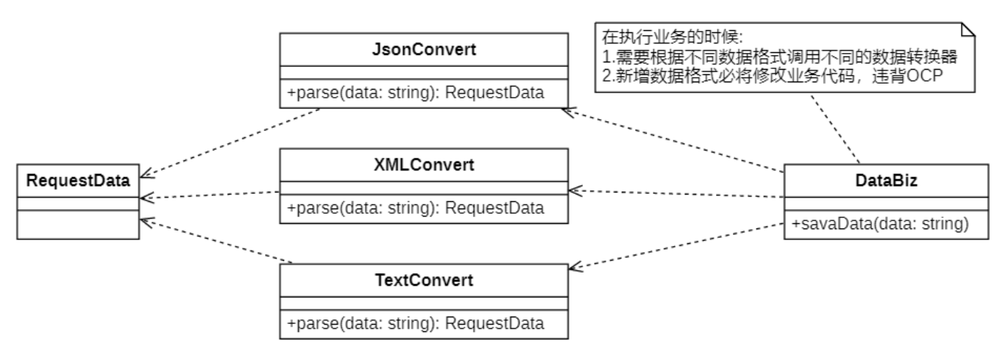
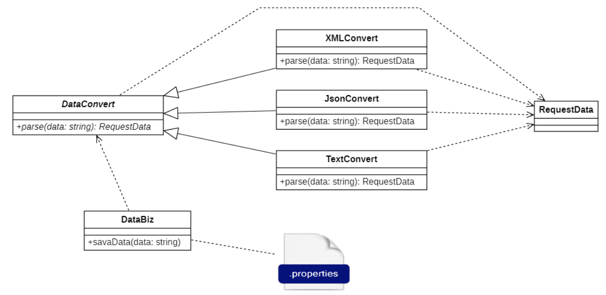

# 依赖倒置原则
## 说明
如果说开闭原则是面向对象设计的目标的话，那么**依赖倒置原则**（Dependence Inversion Principle,`DIP`）就是面向对象设计的主要实现机制之一，它是系统抽象化的具体实现。

依赖倒置原则定义如下：
> High-level modules should not import anything from low-level modules. Both should depend on abstractions . Abstractions should not depend on details. Details should depend on abstractions .
>
> 高层模块不应该从低层模块导入任何东西，两者都应该依赖于抽象。抽象不应该依赖于细节，细节应当依赖于抽象。
>
> Program to an interface, not an implementation.
> 
> **即：针对接口编程，而不是针对实现编程。**

> ##yellow##
> 🟡**依赖倒置原则要求我们在程序代码中传递参数时或在关联关系中，尽量引用层次高的抽象层类，即使用接口和抽象类进行变量类型声明、参数类型声明、方法返回类型声明，以及数据类型的转换等，而不要用具体类来做这些事情。**
>
> 为了确保该原则的应用，一个具体类应当只实现接口或抽象类中声明过的方法，而*不要给出多余的方法*，否则将无法调用到在子类中增加的新方法。<sup>[1] </sup>

```
在引入抽象层后，系统将具有很好的灵活性，在程序中尽量使用抽象层进行编程，而将具体类写在配置文件中，

这样一来，如果系统行为发生变化，只需要对抽象层进行扩展，并修改配置文件，而无须修改原有系统的源代码，在不修改的情况下来扩展系统的功能，满足开闭原则的要求。
```

在实现依赖倒置原则时，我们需要针对抽象层编程，而将具体类的对象通过**依赖注入(DependencyInjection, `DI`)** 的方式注入到其他对象中，**依赖注入是指当一个对象要与其他对象发生依赖关系时，通过抽象来注入所依赖的对象。**

常用的注入方式有三种，分别是：**构造注入，设值注入（Setter注入）和接口注入**。<sup>[2]</sup>

- `构造注入`是指通过`构造函数`来传入具体类的对象；
- `设值注入`是指通过`Setter方法`来传入具体类的对象；
- `接口注入`是指通过`在接口中声明的业务方法`来传入具体类的对象。

这些方法在定义时使用的是抽象类型，在运行时再传入具体类型的对象，由子类对象来覆盖父类对象。

> [依赖注入 参考](https://martinfowler.com/articles/injection.html)

> 实际上, 也不是全部都要这样干<sup>[3]</sup>.

## 错误举例


上面示例中`DataBiz`是典型的针对具体实现进行编程，因此在数据格式变更的时候就需要反复的修改代码。

## 修改


基于`依赖倒置原则`，新增一个抽象的转换器`DataConvert`，`DataBiz`针对`DataConvert`进行编程，然后根据里氏替换原则，程序运行时对父类进行替换，根据开闭原则，将运行对象指定设置到配置文件中。

在上述重构过程中，我们使用了开闭原则、里氏代换原则和依赖倒转原则，

在大多数情况下，这三个设计原则会同时出现，**开闭原则是目标，里氏代换原则是基础，依赖倒置原则是手段**，

它们相辅相成，相互补充，目标一致，只是分析问题时所站角度不同而已。

## 注解

### [1]
*具体示例见下*
```C++
// 抽象类或接口
class Animal
{
public:
    virtual void eat() = 0; // 纯虚函数
};

// 具体类
class Dog : public Animal
{
public:
    void eat() override
    {
        cout << "狗吃骨头" << endl;
    }

    void bark()
    {
        cout << "狗叫" << endl;
    }
};

// 使用示例
int main()
{
    Animal* animal = new Dog();
    animal->eat(); // 调用抽象类中声明的方法
    // animal->bark(); // 编译报错，无法调用子类中新增的方法

    delete animal;
    return 0;
}
```
<sup>注: 在 C++11 及以后的标准中，override 是一个关键字，用于显式地告诉编译器正在重写（覆盖）基类中的虚函数。当我们在派生类中重写基类的虚函数时，可以使用 override 关键字来确保该函数是基类中虚函数的覆盖，这样可以帮助我们在编译时捕获一些潜在的错误。</sup>

### [2]
依赖绑定的三种实现方法的代码.
```C++ By GPT-3.5
#include <iostream>

// 定义抽象接口
class Dependency
{
public:
    virtual void doSomething() = 0;
};

// 具体实现类
class ConcreteDependency : public Dependency
{
public:
    void doSomething() override
    {
        std::cout << "Doing something in ConcreteDependency." << std::endl;
    }
};

// 通过构造注入传入具体类的对象
class ConstructorInjection
{
private:
    Dependency* dependency;

public:
    ConstructorInjection(Dependency* dep) : dependency(dep) {}

    void useDependency()
    {
        dependency->doSomething();
    }
};

// 通过设值注入传入具体类的对象
class SetterInjection
{
private:
    Dependency* dependency;

public:
    void setDependency(Dependency* dep)
    {
        dependency = dep;
    }

    void useDependency()
    {
        dependency->doSomething();
    }
};

// 通过接口注入传入具体类的对象
class InterfaceInjection
{
public:
    virtual void setDependency(Dependency* dep) = 0;
    virtual void useDependency() = 0;
};

class InterfaceInjectionImpl : public InterfaceInjection
{
private:
    Dependency* dependency;

public:
    void setDependency(Dependency* dep) override
    {
        dependency = dep;
    }

    void useDependency() override
    {
        dependency->doSomething();
    }
};

int main()
{
    // 构造注入示例
    Dependency* dependency1 = new ConcreteDependency();
    ConstructorInjection constructorInjection(dependency1);
    constructorInjection.useDependency();

    // 设值注入示例
    Dependency* dependency2 = new ConcreteDependency();
    SetterInjection setterInjection;
    setterInjection.setDependency(dependency2);
    setterInjection.useDependency();

    // 接口注入示例
    Dependency* dependency3 = new ConcreteDependency();
    InterfaceInjection* interfaceInjection = new InterfaceInjectionImpl();
    interfaceInjection->setDependency(dependency3);
    interfaceInjection->useDependency();

    return 0;
}
```

### [3]

```GPT-3.5
依赖倒置原则确实要求我们尽量引用抽象层类而不是具体类，这可以提高代码的灵活性和可扩展性。
然而，在实践中，并非所有情况都需要完全遵循该原则。

关于构造函数和析构函数的性能消耗问题，实际上并不会因为使用抽象类或接口而导致过多的构造函数或析构函数。
构造函数和析构函数的调用只会发生一次，无论是使用具体类还是抽象类或接口作为参数类型声明。

另外，构造函数和析构函数的性能消耗通常是可以忽略不计的，特别是在现代的编译器和硬件环境下。
对于大部分应用程序来说，构造函数和析构函数的开销很小，并不会对整体性能产生显著影响。
如果确实存在性能敏感的场景，可以通过其他方式进行优化，而不是牺牲代码的可维护性和可扩展性。

总而言之，依赖倒置原则的目的是提高代码的灵活性和可维护性，对于大部分应用场景来说，并不会因为引用抽象层类而带来明显的性能消耗。
当然，在特定的性能敏感场景中，可以根据具体情况进行权衡和优化。
```