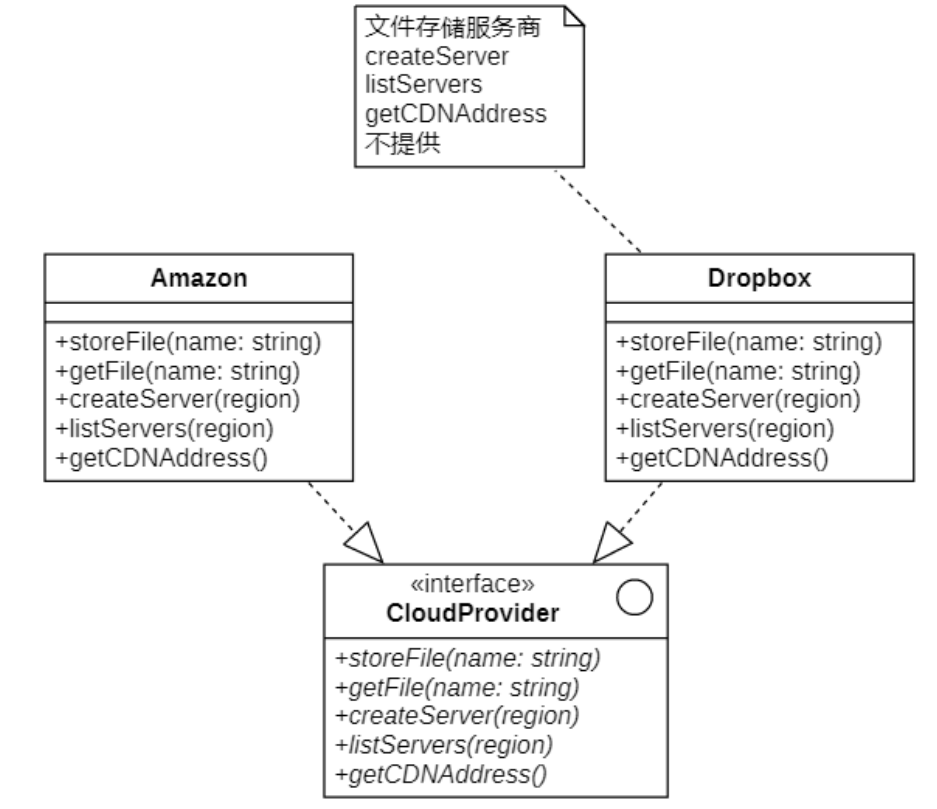
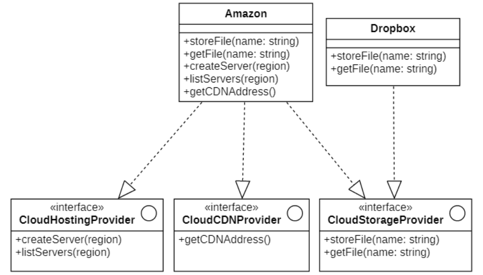

# 接口隔离原则
## 说明
**接口隔离原则(Interface Segregation Principle, `ISP`)**，其定义如下：
> Clients should not be forced to depend upon interfaces that they do not use.
>
> 客户端不应该依赖哪些它不需要的接口。

根据接口隔离原则，当一个接口太大时，我们需要将它分割成一些更细小的接口，使用该接口的客户端仅需知道与之相关的方法即可。

每一个接口应该承担一种相对独立的角色，不干不该干的事，该干的事都要干。

**“接口”两种不同的含义：**

- 一种是指一个类型所具有的方法特征的集合，仅仅是一种逻辑上的抽象。在`ISP`可以理解成一种角色，一个接口只能代表一种角色，此时也可以称之为 **“角色隔离原则”**；

- 一种是指某种语言具体的“接口”定义，有严格的定义和结构（如Java中的interface）。在`ISP`中表达的意思是指接口仅仅提供客户端需要的行为，客户端不需要的行为则隐藏起来，应当为客户端提供尽可能小的单独的接口，而不要提供大的总接口.

## 错误示例

> 图中的简单说明:
> 
> 通过 接口, 从不同的云服务里面进行对应的操作
>
> 但是, 有些云服务不是所有供应商都提供的

`问题`: 一个接口承担了太多任务

## 修改
根据接口隔离原则重构:

**在使用接口隔离原则时，我们需要注意控制接口的粒度:**

- **接口不能太小，如果太小会导致系统中接口泛滥，不利于维护；**

- **接口也不能太大，太大的接口将违背接口隔离原则，灵活性较差，使用起来很不方便。**

一般而言，接口中仅包含为某一类用户定制的方法即可，不应该强迫客户依赖于那些它们不用的方法