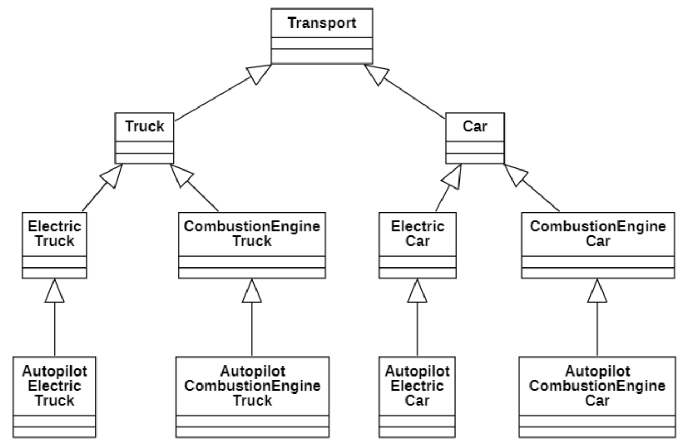
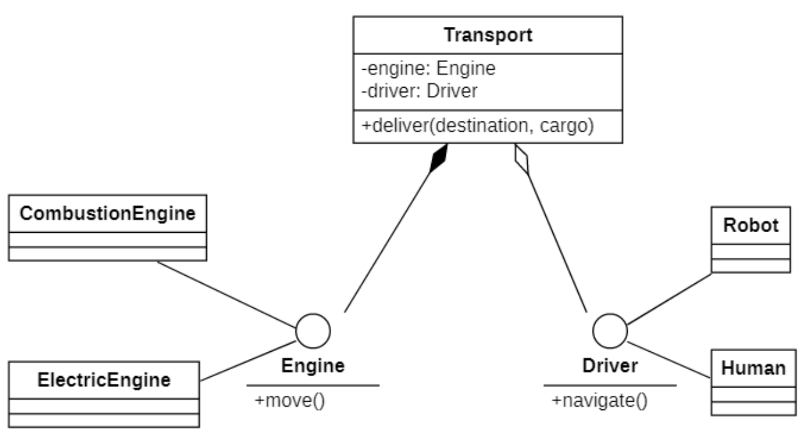

# 组合复用原则

## 说明
**组合复用原则**(Composite Reuse Principle, `CRP`)又称为*组合/聚合复用原则*(Composition/AggregateReuse Principle, `CARP`)，其定义如下:

> Favor composition of objects over inheritance as reuse mechanism.
>
> 优先使用对象的组合，而不是使用继承来达到复用的目的

在**面向对象设计**中，可以**通过两种方法**在不同的环境中**复用**已有的设计和实现，即通过**组合/聚合关系**或通过**继承**，但`首先应该考虑使用组合/聚合`。

组合/聚合可以使系统更加灵活，降低类与类之间的耦合度，一个类的变化对其他类造成的影响相对较少；

其次才考虑继承，在使用继承时，需要`严格遵循里氏替换原则`，有效使用继承会有助于对问题的理解，降低复杂度，而**滥用**继承反而会增加系统构建和维护的难度以及系统的复杂度，因此需要**慎重使用继承复用**。

```解释
通过继承来进行复用的主要问题在于继承复用会破坏系统的封装性，
因为继承会将基类的实现细节暴露给子类，由于基类的内部细节通常对子类来说是可见的，
所以这种复用又称“白箱”复用，如果基类发生改变，那么子类的实现也不得不发生改变；
从基类继承而来的实现是静态的，不可能在运行时发生改变，没有足够的灵活性；
而且继承只能在有限的环境中使用（如类没有声明为不能被继承）。

由于组合或聚合关系可以将已有的对象（也可称为成员对象）纳入到新对象中，使之成为新对象的一部分，
因此新对象可以调用已有对象的功能，这样做可以使得成员对象的内部实现细节对于新对象不可见，
所以这种复用又称为“黑箱”复用，相对继承关系而言，其耦合度相对较低，成员对象的变化对新对象的影响不大，可以在新对象中根据实际需要有选择性地调用成员对象的操作；
合成复用可以在运行时动态进行，新对象可以动态地引用与成员对象类型相同的其他对象。
```

一般而言，**如果两个类之间是“Has-A”的关系应使用组合或聚合，如果是“Is-A”关系可使用继承。**

## 错误示例


对于`交通方式`类, 被`卡车`与`小车`继承

而`卡车`与`小车`又有各自的运行方式: `电动` 与 `燃油`

又往下有 `导航`类 细分...

如果像这样细分下去:

在几个维度上扩展一个类 (货物类型 × 发动机类型 × 导航类型) 可能会导致子类的组合爆炸。

如您所见，每增加一个参数都会增加子类的数量。子类之间有很多重复的代码，因为一个子类不能同时继承两个类。

## 修改



这样是显而易见的. 这和日常生活中组装汽车相同, 按零部件组装.

也像DIY电脑一样, 不可能有人会把全部DIY的可能都组装出来卖.