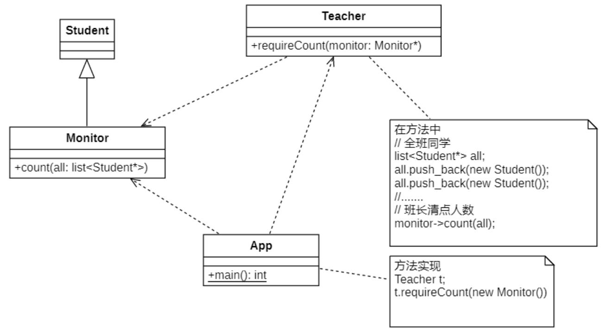
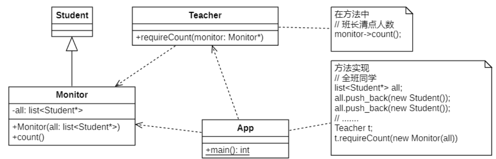
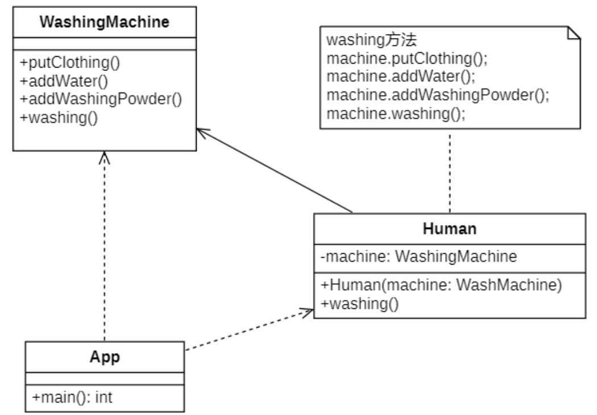
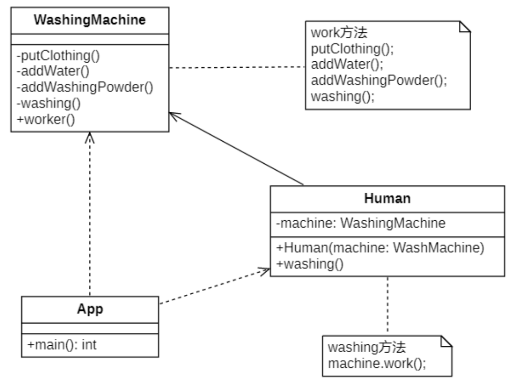

# 迪米特法则
## 说明
**迪米特法则**(Law Of Demeter, `LOD`)来自于1987年美国东北大学(Northeastern University)一个名为“Demeter”的研究项目。迪米特法则又称为**最少知识原则**(Least Knowledge Principle, `LKP`)，也就是说，一个对象应当对其他对象尽可能少的了解，其定义有如下几种形式：

> > Each unit should have only limited knowledge about other units: only units "closely" related to the current unit.
> >
> > 每一个软件单位对其他单位尽可能少的了解，而且局限于哪些与本单位密切相关的的软件。
> 
> > Each unit should only talk to its friends; don't talk to strangers.
> > 
> > 每个单位应该只和它的朋友们通信，不与陌生人通信。
> 
> > Talk only to your immediate friends.
> > 
> > 只和直接的朋友通信。

### 法则目标
如果一个系统符合迪米特法则，那么当其中某一个模块发生修改时，就会尽量少地影响其他模块，扩展会相对容易，这是对软件实体之间通信的限制，迪米特法则要求限制软件实体之间通信的宽度和深度。***迪米特法则可降低系统的耦合度，使类与类之间保持松散的耦合关系。***

### 狭义的迪米特法则
迪米特法则要求我们在设计系统时，**应该尽量减少对象之间的交互，如果两个对象之间不必彼此直接通信，那么这两个对象就不应当发生任何直接的相互作用，如果其中的一个对象需要调用另一个对象的某一个方法的话，可以通过第三者转发这个调用。**

简言之，<span style="color:red">就是通过引入一个合理的第三者来降低现有对象之间的耦合度。</span>

- 对于一个对象，其`直接朋友`包括以下几类：

  1. 当前对象`本身`(this)；
  2. 以`参数`形式传入到当前对象方法中的对象；(依赖关系)
  3. 当前对象的`成员对象`；(关联关系)
  4. 如果当前对象的`成员对象`是一个<span></span>$集合$，那么集合中的元素也都是朋友；(关联关系)
  5. 当前对象所创建的对象；(组合关系)

- 不是直接朋友的典型情况: $只出现在方法体内部的类对象$

**缺点：** 遵循类之间的迪米特法则会是一个系统的局部设计简化，因为每一个局部都不会和远距离的对象有直接的关联。但是，这也会造成系统的不同模块之间的`通信效率降低`，也会使系统的不同模块之间`不容易协调`。

### 广义的迪米特法则

- 在类的结构设计上，每一个类都应当尽量降低其成员变量和成员函数的访问权限；
- 在类的设计上，只要有可能，一个类型应当设计成不变类<sup>[1]</sup>；
- 在对其他类的引用上，一个对象对其他对象的引用应当降到最低。

## 错误举例
### 1. 与直接朋友通信
>
> 
>
> 解释: 老师需要清点班上的人数, 从老师类方法中调用班长类的方法, 让班长进行人数清点, 但是老师又把学生数据报给班长了
> 
> > 显然, 这样是违背了迪米特法则的: ~~感觉老师都做完了 all.size() 即可~~
> >
> >在Teacher中对非直接的朋友Student进行了通信
### 修改


### 2. 减少对朋友的了解

在一个类中，就是尽量减少一个类对外暴露的方法

如下图:

`washing`方法是人进行洗衣服操作,

但是调用有 打开洗衣机啊,放衣服啊,放水啊什么的 洗衣机的方法



`Human`需要调用许多`WashingMachine`提供的方法，同时还可能导致调用顺序错误，违背了`迪米特法则`，下面来对其进行重构。

### 修改

所以直接让洗衣机直接封装一个顺序已经规定好的接口(方法), 然后直接调用它不就行了?



### 使用注意事项

- 在类的划分上，应当创建弱耦合的类，类与类之间的耦合越弱，就越有利于实现可复用的目标。
- 在类的结构设计上，每个类都应该降低成员的访问权限。
- 在类的设计上，只要有可能，一个类应当设计成不变的类。
- 在对其他类的引用上，一个对象对其他类的对象的引用应该降到最低。
- 尽量限制局部变量的有效范围，降低类的访问权限。

## 注解
### [1]
对于不变类
```GPT-3.5
不变类是指其实例在创建后不能被修改的类。
这样的设计可以避免由于状态的变化引入的复杂性和错误。
不变类通常是线程安全的，并且对于并发编程有着重要的作用。
因此，在设计中，如果一个类型的实例在创建后不需要改变，就应该将其设计为不变类。
```

> 不变类是不满足开闭原则对吧, 因为扩展也是是禁止的? (针对: 上文的"不能被修改")

```GPT-3.5
是的，你说的很对。
不变类确实在某种程度上不符合开闭原则。
开闭原则要求软件实体（类、模块、函数等）应该对扩展开放，对修改关闭。
而不变类的特点是实例一旦创建就不能被修改，这会限制对类的扩展，因为无法向现有实例添加新的行为或状态。

因此，在设计不变类时，需要权衡开闭原则和不变性原则之间的关系。
一种方法是通过创建新的不变类来扩展现有的功能，而不是修改现有的不变类。
另一种方法是在不变类中允许一定程度的修改，
例如通过返回新的实例来表示修改后的状态，而不是直接修改现有实例。

在实际设计中，需要根据具体情况和需求综合考虑这些原则，并灵活应用。
```