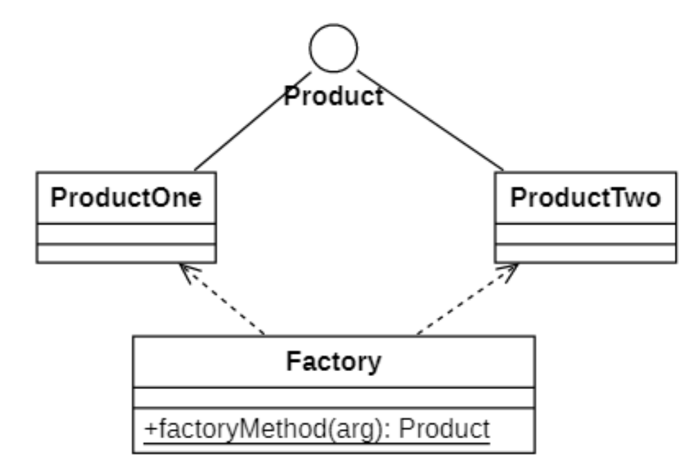
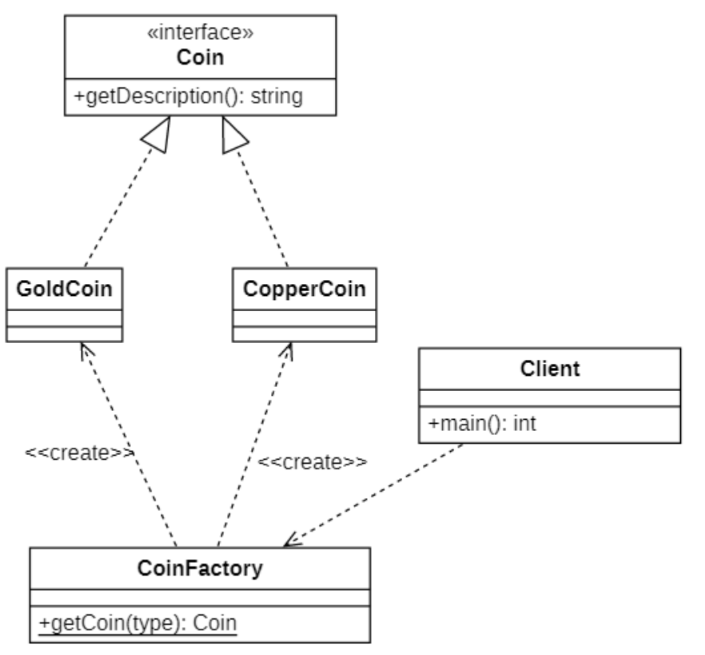
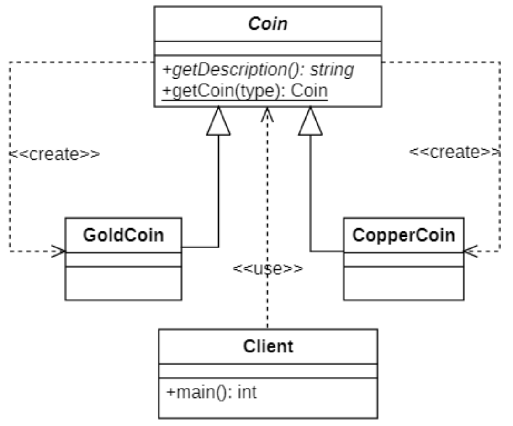

# 简单工厂模式
## 概述
**简单工厂模式**（Simple Factory Pattern）又叫做**静态工厂方法模式**（Static Factory Method Pattern），并不属于GoF的23种设计模式之一，但是是学习其他工厂模式的的基础。

其定义如下:

> Wikipedia says：Factory is an object for creating other objects – formally a factory is a function or method that returns objects of a varying prototype or class.
>
> 工厂是一个用于创建其他对象的对象——从形式上讲，工厂是一个函数或方法，它返回不同原型或类型的对象。
>
> Providing a static method encapsulated in a class called the factory, to hide the implementation logic and make client code focus on usage rather than initializing new objects.
> 
> 提供封装在名为工厂的类中的静态方法，以隐藏实现逻辑并使客户端代码专注于使用而不是初始化新对象。

## 结构



在简单工厂模式结构图中包含如下几个角色：

- **Factory（工厂角色）**：工厂角色即`工厂类`，它是简单工厂模式的核心，负责实现创建所有产品实例的内部逻辑；**工厂类可以被外界直接调用，创建所需的产品对象**；在工厂类中提供了静态的工厂方法`factoryMethod()`，它的返回类型为`抽象产品类型Product`。

- **Product（抽象产品角色）**：它是工厂类所创建的所有对象的`父类`，封装了各种产品对象的公有方法，它的引入将提高系统的灵活性，使得在工厂类中只需定义一个通用的工厂方法，因为所有创建的具体产品对象都是其子类对象。

- **ConcreteProduct（具体产品角色）**：它是简单工厂模式的创建目标，所有被创建的对象都充当这个角色的某个具体类的实例。每一个具体产品角色都继承了抽象产品角色，需要实现在抽象产品中声明的抽象方法

## 实现演示
下面我们来做一个简单示例来演示简单工厂模式的实现
### UML图设计

### 核心代码

定义接口
```C++
// CoinFactory.h
#ifndef _COINFACTORY_H_
#define _COINFACTORY_H_
#include "Coin.h"

namespace sfp {
    class CoinFactory
    {
    public:
          static Coin* getCoin(int type);
    };
}
#endif // _COINFACTORY_H_
```

接口方法声明
```C++
// CoinFactory.cpp
#include "CoinFactory.h"
#include "CopperCoin.h"
#include "GoldCoin.h"

sfp: Coin* sfp: CoinFactory: getCoin(int type)
{
    switch (type)
    {
    case 1:
        // 注意: 此处可能有你的某些初始化的代码
        return new CopperCoin();
    case 2:
        return new GoldCoin();
    default:
        // 报错
        throw std::string("没有对应的硬币");
    }
}
```

(用户)客户端代码:

```C++
//client.cpp
#include "CoinFactory.h"
#include <iostream>
#include "../../util/Properties.h"
using namespace sfp;

int main() {
    CREATE_PROPERTIESCprop, conf); // 读取配置文件
    int type = atoi(prop.getProperty("sfp").c-str());
    try
    {
        Coin* coin = CoinFactory::getCoin(type);
        cout << "你获得了一枚："<< coin-→getDescription();
        delete coin;
    }
    catch(string msg)
    {
        // 捕获错误
        cout << msg;
    }
    return 0;
}
```

### 简化
实际上可以将 `Coin`类 与 `CoinFactory`类 合并成一个接口, 这样可以少一层继承.



##  简单工厂模式的适用环境
### 主要优点
- 工厂类包含必要的判断逻辑，可以决定在什么时候创建哪一个产品类的实例，客户端可以免除直接创建产品对象的职责，而仅仅“消费”产品，简单工厂模式**实现了对象创建和使用的分离**。

- 客户端**无须知道所创建的具体产品类的类名，只需要知道具体产品类所对应的参数**即可，对于一些复杂的类名，通过简单工厂模式可以**在一定程度减少使用者的记忆量**。

- 通过引入配置文件，可以在不修改任何客户端代码的情况下更换和增加新的具体产品类，在**一定程度上提高了系统的灵活性**。

### 主要缺点
- 由于工厂类集中了所有产品的创建逻辑，**职责过重，一旦不能正常工作，整个系统都要受影响**。

- 使用简单工厂模式势必会增加系统中类的个数（引入了新的工厂类），**增加了系统的复杂度和理解难度**。
- 系统扩展困难，一旦添加新产品就不得不修改工厂逻辑，在产品类型较多时，有可能造成工厂逻辑过于复杂，不利于系统的扩展和维护。**（违背了开闭原则）**

- 简单工厂模式由于使用了静态工厂方法，造成工厂角色无法形成基于继承的等级结构。

### 适用环境

在以下情况下可以考虑使用简单工厂模式：

- 工厂类负责创建的对象比较少，由于创建的对象较少，不会造成工厂方法中的业务逻辑太过复杂。

- 客户端只知道传入工厂类的参数，对于如何创建对象并不关心。

# 省流版本

```markmap
# 简单工厂模式
## 实现
### 一个接口(依赖父类) + 一个抽象父类 + N个继承该父类的基类
## 局限
### 不符合`开闭原则`, 拓展类还需要修改接口处代码
### 如果采用简化版本, 就不满足`单一职责原则`
### 职责过重, 该类全部产品都由其创建, 有BUG就是致命的
## 应用场景
### 创建的对象比较少
### 对象的创建逻辑相对简单
```