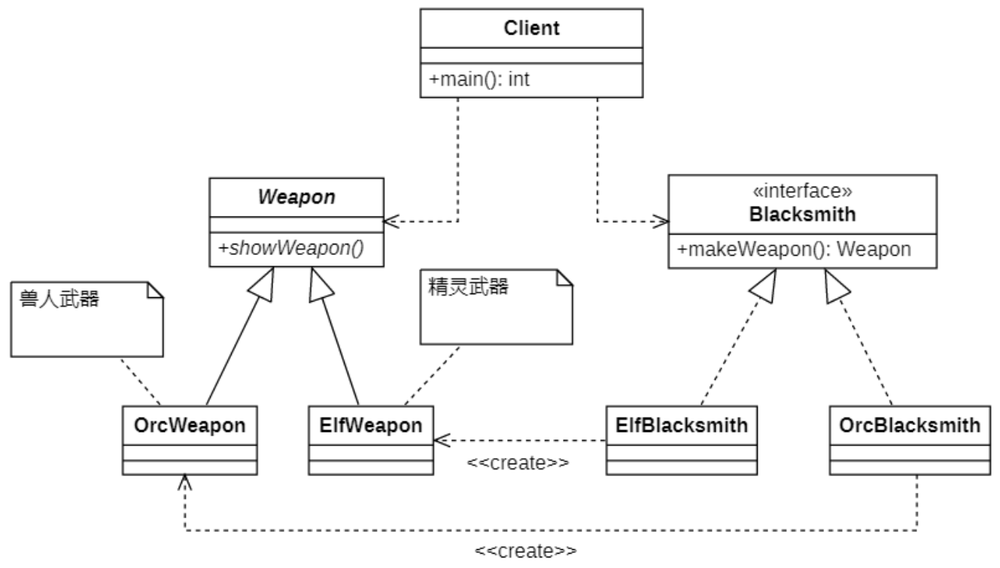

# 工厂方法模式
## 概述
简单工厂模式虽然简单，但存在一个很严重的问题，违背了开闭原则。**工厂方法模式（Factory Method Pattern）**，继承了简单工厂模式的优点，同时做出了修改以达到`符合开闭原则`的要求。

工厂方法模式也被称为虚拟构造器模式（Virtual Constructor Pattern）或多态工厂模式（Polymorphic Factory Pattern）。

其定义如下：
> Define an interface for creating an object, but let subclasses decide which class to instantiate. Factory Method lets a class defer instantiation to subclasses.
>
> 定义一个用于创建对象的接口，让子类决定将哪一个类实例化。工厂方法模式让一个类的实例化延迟到其子类。

在工厂方法模式中，**不再提供一个统一的工厂类来创建所有的产品对象，而是针对不同的产品提供不同的工厂，系统提供一个与产品等级结构对应的工厂等级结构**。

## 结构


在工厂方法模式结构图中包含如下几个角色：

- **Product（抽象产品）**：它是定义产品的接口，是工厂方法模式所创建对象的超类型，也就是产品对象的公共父类。

- **ConcreteProduct（具体产品）**：它实现了抽象产品接口，某种类型的具体产品由专门的具体工厂创建，具体工厂和具体产品之间一一对应。

- **Factory（抽象工厂）**：在抽象工厂类中，声明了工厂方法(Factory Method)，用于返回一个产品。抽象工厂是工厂方法模式的核心，所有创建对象的工厂类都必须实现该接口。

- **ConcreteFactory（具体工厂）**：它是抽象工厂类的子类，实现了抽象工厂中定义的工厂方法，并可由客户端调用，返回一个具体产品类的实例。

## 实现演示
### 类图演示



### 代码实现

定义抽象工厂
```C++
// Blacksmith.h
#ifndef _BLACKSMITH_H_
#define _BLACKSMITH_H_
#include "Weapon.h"

namespace fmp
{
    // 工厂抽象类
    class Blacksmith
    {
    public:
        virtual Weapon* makeWeapon() = 0;
    };
}
#endif // _BLACKSMITH_H_
```

具体工厂的实现

```C++
// OrcBlacksmith.h
#ifndef _ORCBLACKSMITH_H_
#define _ORCBLACKSMITH_H_
#include "Blacksmith.h"
#include "../../util/ClassHelper.h"

namespace fmp
{
    // 具体工厂类的声明
    class OrcBlacksmith : public Blacksmith
    {
        DECLARE_CLASS(fmp: OrcBlacksmith);    // 此处是用于读取配置文件的工具的宏
    public:
        Weapon* makeWeapon() override;
    };
}
#endif // _ORCBLACKSMITH_H_

// OrcBlacksmith.cpp
#include "OrcBlacksmith.h"
#include "OrcWeapon.h"

IMPLEMENT_CLASS(fmp::OrcBlacksmith);
fmp::Weapon* fmp::OrcBlacksmith::makeWeapon()
{
    return new fmp::OrcWeapon();
}
```

```C++
// ElfBlacksmith.h
#ifndef _ELFBLACKSMITH_H_
#define _ELFBLACKSMITH_H_

#include "Blacksmith.h"
#include "./util/ClassHelper.h"

namespace fmp {
    // 具体工厂类的声明
    class ElfBlacksmith : public Blacksmith
    {
        DECLARE_CLASS(fmp::ElfBlacksmith);
        
    public:
        Weapon* makeWeapon() override;
    };
}

#endif //_ELFBLACKSMITH_H_

// ElfBlacksmith.cpp
#include "ElfBlacksmith.h"
#include "ElfWeapon.h"

IMPLEMENT_CLASS(fmp::ElfBlacksmith)
fmp::Weapon* fmp::ElfBlacksmith::makeWeapon()
{
    return new fmp::ElfWeapon();
}
```

客户端代码


```C++
// Client
#include <iostream>
#include "Blacksmith.h"
#include "../../util/ClassHelper.h"
#include "../../util/Properties.h"
using namespace fmp;

int main()
{
    // 创建铁匠铺 (通过读取配置文件)
    CREATE_PROPERTIES(cp, conf);
    GET_INSTANCE_BY_NAME(Blacksmith*, smith, cp.getProperty("fmp"));
    //Blacksmith* smith = new ElfBlacksmith();
    // 打造武器
    Weapon* weapon = smith->makeWeapon();
    // 亮武器
    weapon->showWeapon();
    // 释放资源
    delete weapon;
    delete smith;
      
    return 0;
}
```

## 工厂方法模式的适用环境
### 主要优点
- 在工厂方法模式中，工厂方法用来创建客户所需要的产品，同时还向客户隐藏了哪种具体产品类将被实例化这一细节，**用户只需要关心所需产品对应的工厂，无须关心创建细节，甚至无须知道具体产品类的类名**(只需要知道工厂的类名)。

- 基于工厂角色和产品角色的**多态性设计**是工厂方法模式的关键。它**能够让工厂可以自主确定创建何种产品对象，而如何创建这个对象的细节则完全封装在具体工厂内部**。工厂方法模式之所以又被称为多态工厂模式，就正是因为所有的具体工厂类都具有同一抽象父类。

- 在系统中加入新产品时，无须修改抽象工厂和抽象产品提供的接口，无须修改客户端，也无须修改其他的具体工厂和具体产品，而只要添加一个具体工厂和具体产品就可以了，这样，系统的可扩展性也就变得非常好，**完全符合“开闭原则”**。

### 主要缺点

- 在添加新产品时，需要编写新的具体产品类，而且还要提供与之对应的具体工厂类，**系统中类的个数将成对增加，在一定程度上增加了系统的复杂度，有更多的类需要编译和运行，会给系统带来一些额外的开销**。

- 由于考虑到系统的可扩展性，需要引入抽象层，在客户端代码中均使用抽象层进行定义，**增加了系统的抽象性和理解难度，且在实现时可能需要用到配置文件、反射等技术，增加了系统的实现难度**。

### 适用环境
在以下情况下可以考虑使用工厂方法模式：

- **客户端不知道它所需要的对象的类**。在工厂方法模式中，客户端不需要知道具体产品类的类名，`只需要知道所对应的工厂`即可，具体的产品对象由具体工厂类创建，可将具体工厂类的类名存储在配置文件或数据库中。

- **抽象工厂类通过其子类来指定创建哪个对象**。在工厂方法模式中，对于抽象工厂类只需要提供一个创建产品的接口，而由其子类来确定具体要创建的对象，利用面向对象的多态性和里氏代换原则，在程序运行时，子类对象将覆盖父类对象，从而使得系统更容易扩展。
