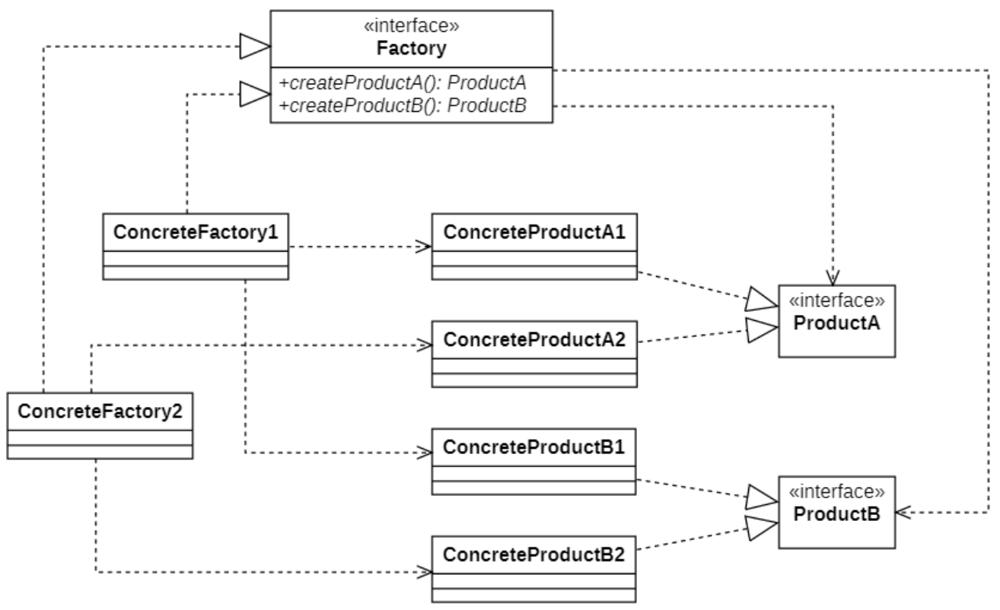
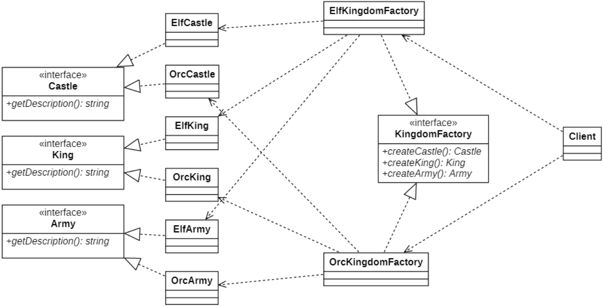

# 抽象工厂模式
## 概述
工厂方法模式通过引入工厂等级结构，解决了简单工厂模式中工厂类职责太重的问题，但由于工厂方法模式中的**每个工厂只生产一类产品**，可能会导致系统中存在大量的工厂类，势必会增加系统的开销。此时，我们可以考虑将一些相关的产品组成一个“产品族”，由同一个工厂来统一生产，这就是 **抽象工厂模式(Abstract Factory Pattern)** 的基本思想。

首先引入两个概念

- **产品等级结构**：产品等级结构即`产品的继承结构`，如一个抽象类是手机，其子类有三星、小米、华为，则抽象手机与具体品牌的手机之间构成了一个产品等级结构，抽象手机是父类，而具体品牌的手机是其子类。

- **产品族**：在抽象工厂模式中，产品族是指`由同一个工厂生产的，位于不同产品等级结构中的一组产品`，如小米手机位于手机产品等级结构中、小米笔记本位于笔记本产品等级结构中，小米路由位于路由产品等级结构中，这一系列电子产品就构成了一个产品族。

当系统所提供的工厂生产的具体产品并不是一个简单的对象，而是多个位于不同产品等级结构、属于不同类型的具体产品时就可以使用抽象工厂模式。

其定义如下:
> Wikipedia says: The abstract factory pattern provides a way to encapsulate a group of individual factories that have a common theme without specifying their concrete classes.
>
> 抽象工厂模式提供了一种方法来封装一组具有共同主题的单个工厂，而无需指定其具体类。
>
> Provide an interface for creating families of related or dependent objects without specifying their concrete classes.
>
> 提供一个创建一系列相关或相互依赖对象的接口，而无须指定它们具体的类。

> [!TIP]
> **`TIP:`抽象工厂模式是所有形式的工厂模式中最为抽象和最具一般性的一种形式。** 一般会考选择题.

当一个工厂等级结构可以创建出分属于不同产品等级结构的一个产品族中的所有对象时，抽象工厂模式比工厂方法模式更为简单、更有效率。

## 结构



在抽象工厂模式结构图中包含如下几个角色：

- **AbstractFactory（抽象工厂）**：它声明了一组用于创建一组产品的方法，每一个方法对应一种产品。

- **ConcreteFactory（具体工厂）**：它实现了在抽象工厂中声明的创建产品的方法，生成一组具体产品，这些产品构成了一个产品族，每一个产品都位于某个产品等级结构中。

- **AbstractProduct（抽象产品）**：它为每种产品声明接口，在抽象产品中声明了产品所具有的业务方法。

- **ConcreteProduct（具体产品）**：它定义具体工厂生产的具体产品对象，实现抽象产品接口中声明的业务方法。

## 实现演示
### UML图设计
要创建一个王国，我们需要具有共同组织的对象。精灵王国需要一个精灵国王，精灵城堡和精灵军队，而兽人王国需要一个兽人国王，兽人城堡和兽人军队。王国中的对象之间存在依赖关系。



### 核心代码

`创建王国接口` `KingdomFactory`抽象工厂类

```C++
#ifndef _KINGDOMFACTORY_H_
#define _KINGDOMFACTORY_H_
#include "Castle.h"
#include "King.h"
#include "Army.h"

namespace afp
{
    class KingdomFactory
    {
    public:
        virtual Castle* createCastle() = 0;
        virtual King* creatKing() = 0;
        virtual Army* createArmy() = 0;
    };
}

#endif // !_KINGDOMFACTORY_H_
```

子类工厂继承(泛化)父类, 具体的创建产品功能实现

```C++
// OrcKingdomFactory.h
#ifndef _ORCKINGDOMFACTORY_H_
#define _ORCKINGDOMFACTORY_H_
#include "../../util/ClassHelper.h"
#include "KingdomFactory.h"

namespace afp
{
    class OrcKingdomFactory : public KingdomFactory
    {
        DECLARE_CLASS(afp::OrcKingdomFactory);
    public:
        Castle* createCastle() override;
        King* creatKing() override;
        Army* createArmy() override;
    };
}

#endif // !_ORCKINGDOMFACTORY_H_

// OrcKingdomFactory.cpp
#include "OrcKingdomFactory.h"
#include "OrcKingdom.h"

IMPLEMENT_CLASS(afp::OrcKingdomFactory);

afp::Castle* afp::OrcKingdomFactory::createCastle()
{
    return new OrcCastle();
}

afp::King* afp::OrcKingdomFactory::creatKing()
{
    return new OrcKing();
}

afp::Army* afp::OrcKingdomFactory::createArmy()
{
    return new OrcArmy();
}
```

具体的产品的实现(继承 产品抽象类)

```C++
// OrcKingdom.h
#ifndef _ORCKINGDOM_H_
#define _ORCKINGDOM_H_
#include "Castle.h"
#include "King.h"
#include "Army.h"

namespace afp
{
    class OrcCastle : public Castle
    {
    public:
        string getDesc() override;
    };

    class OrcKing : public King
    {
    public:
        std::string getDesc() override;
    };

    class OrcArmy : public Army
    {
    public:
        std::string getDesc() override;
    };
}

#endif // !_ORCKINGDOM_H_

// OrcKingdom.cpp
#include "OrcKingdom.h"

std::string afp::OrcCastle::getDesc()
{
    return std::string("兽人城堡");
}

std::string afp::OrcKing::getDesc()
{
    return std::string("兽人国王");
}

std::string afp::OrcArmy::getDesc()
{
    return std::string("兽人军队");
}
```

客户端代码

```C++
#include "../../util/Properties.h"
#include "../../util/ClassHelper.h"
#include "KingdomFactory.h"
#include <iostream>
using namespace afp;

int main()
{
    // 创建王国工厂 (通过读取配置文件, 确认使用具体的工厂类)
    CREATE_PROPERTIES(cp, conf);
    GET_INSTANCE_BY_NAME(afp::KingdomFactory*, factory, cp.getProperty("afp"));
    // 生产王国设施
    King* king = factory->creatKing();
    Castle* castle = factory->createCastle();
    Army* army = factory->createArmy();
    // 输出王国信息
    std::cout << "2020年，推选了一位" << king->getDesc() << std::endl;
    std::cout << "2021年，组件了一支" << army->getDesc() << std::endl;
    std::cout << "2022年，建造了一座" << castle->getDesc() << std::endl;
    // 资源释放
    delete king;
    delete castle;
    delete army;
    delete factory;
      
    return 0;
}
```

**質問**:抽象工厂模式是否符合开闭原则？

## “开闭原则”的倾斜性

**在抽象工厂模式中，增加新的产品族很方便，但是增加新的产品等级结构很麻烦**，抽象工厂模式的这种性质称为 **“开闭原则”的倾斜性**。

对于涉及到多个产品族与多个产品等级结构的系统，其功能增强包括两方面：
- **增加产品族**：对于增加新的产品族，抽象工厂模式很好地支持了“开闭原则”，只需要增加具体产品并对应增加一个新的具体工厂，对已有代码无须做任何修改。

- **增加新的产品等级结构**：对于增加新的产品等级结构，需要修改所有的工厂角色，包括抽象工厂类，在所有的工厂类中都需要增加生产新产品的方法，`违背了“开闭原则”`。 ~~(但是这个是架构的问题吧? 设计的好应该就不会有了吧? 甲方: 额?(临时加功能...))~~

## 抽象工厂模式的适用环境
### 主要优点
- **抽象工厂模式隔离了具体类的生成，使得客户并不需要知道什么被创建**。由于这种隔离，更换一个具体工厂就变得相对容易，所有的具体工厂都实现了抽象工厂中定义的那些公共接口，因此只需改变具体工厂的实例，就可以在某种程度上改变整个软件系统的行为。

- 当一个**产品族中的多个对象被设计成一起工作**时，它能够保证客户端始终**只使用同一个产品族中的对象**。

- **增加新的产品族**很方便，无须修改已有系统，**符合“开闭原则”**。

### 主要缺点
- 增加新的产品等级结构麻烦，需要对原有系统进行较大的修改，甚至需要修改抽象层代码，这显然会带来较大的不便，**违背了“开闭原则”**。

### 适用环境

在以下情况下可以考虑使用抽象工厂模式：
- 一个系统不应当依赖于产品类实例如何被创建、组合和表达的细节，这对于所有类型的工厂模式都是很重要的，**用户无须关心对象的创建过程，将对象的创建和使用解耦**。

- **系统中有多于一个的产品族，而每次只使用其中某一产品族**。可以通过配置文件等方式来使得用户可以动态改变产品族，也可以很方便地增加新的产品族。

- **属于同一个产品族的产品将在一起使用，这一约束必须在系统的设计中体现出来**。同一个产品族中的产品可以是没有任何关系的对象，但是它们都具有一些共同的约束，如同一操作系统下的按钮和文本框，按钮与文本框之间没有直接关系，但它们都是属于某一操作系统的，此时具有一个共同的约束条件：操作系统的类型。

- **产品等级结构稳定**，设计完成之后，不会向系统中增加新的产品等级结构或者删除已有的产品等级结构。

