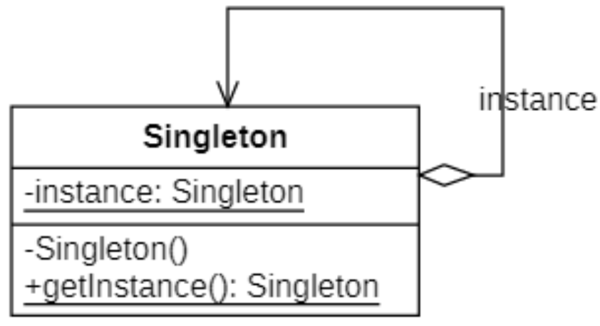

# 单例模式
## 概述
对于一个软件系统的某些类而言，我们无须创建多个实例。为了节约系统资源，有时需要确保系统中某个类只有唯一一个实例，当这个唯一实例创建成功之后，我们无法再创建一个同类型的其他对象，所有的操作都只能基于这个唯一实例。为了确保对象的唯一性，我们可以通过**单例模式（Singleton Pattern）** 来实现，这就是单例模式的动机所在。

其定义如下:

> `Wikipedia` says: In software engineering, the singleton pattern is a software design pattern that restricts the instantiation of a class to one object. This is useful when exactly one object is needed to coordinate actions across the system.
>
> 在软件工程中，单例模式是一种软件设计模式，它将类的实例化限制为一个对象。当需要一个对象来协调整个系统的操作时，这很有用。
> 
> Ensure a class only has one instance, and provide a global point of access to it.
>
> 确保某一个类只有一个实例，并提供一个全局的访问点来访问这个实例。

## 单例模式的结构
| ##container## |
|:--:|
||

单例模式结构图中只包含一个单例角色:

- **Singleton（单例）**: 在单例类的内部实现只生成一个实例，同时它提供一个静态的`getInstance()`工厂方法，让客户可以访问它的唯一实例；为了防止在外部对其实例化，将其构造函数设计为私有；在单例类内部定义了一个`Singleton`类型的静态对象，作为外部共享的唯一实例。

## 单例模式的实现

在C++中实现单例的时候需要保证单例对象不可被复制、不可被赋值、不可被实例化，所以一般需要对它进行如下操作:

```C++
private:
    // 构造私有化
    TypeName();
    // 禁止拷贝构造
    TypeName(const TypeName&) = delete;
    // 禁止赋值运算
    TypeName& operator=(const TypeName&) = delete;
```

基于此可以定义一个宏方便操作

```C++
/** 禁止 赋值/拷贝/构造 */
#define SINGLETON_HEPLER(TypeName) \
private: \
TypeName() {}; \
TypeName(const TypeName&) = delete; \
void operator=(const TypeName&) = delete;
```

### 饿汉模式

这种方式最简单，也没有并发问题和效率问题，但是在类加载时就初始化，有些**浪费内存**，因为有可能这个方法自始至终都不会被调用到，尤其是在一些对外提供的工具包或 `API` 时应该尽量避免这种方式。

#### 非局部静态实现

```C++
// h
namespace singleton
{
    class Singleton1
    {
        SINGLETON_HEPLER(Singleton1)
    private:
        static Singleton1 instance;
    public:
        static Singleton1* getInstance();
    };
}

// cpp
#include "Singleton.h"
singleton::Singleton1 singleton::Singleton1::instance;
singleton::Singleton1* singleton::Singleton1::getInstance()
{
    return &instance;
}
```

这种实现方式一般情况可以正常工作，但是在某种情况下存在一个问题，就是在C++中 ”非局部静态对象“的 ”初始化“ 顺序 的 ”不确定性“。

如果存在A、B两个单例类，在B的初始化过程中需要用到A类的实例，如果在使用A类实例的时候由于A类没有被初始化就会存在问题。

> [!TIP]
> 静态对象是指具有静态存储期限的对象，即从定义式开始，分配的内存空间一直保留到程序结束的对象，包括全局变量、定义于命名空间的对象以及使用`static`修饰符声明的对象。静态对象分为两类，**具有程序块作用域的`static`对象称为局部静态对象，其余的成为非局部静态对象**。

来看下面的演示:

```C++
class A {
private:
    int key;
public:
    A();
    int getKey() const;
};

extern A a;

// cpp
#include "A.h"
A::A()
{
    key = 2;
}

int A::getKey() const
{
    return key;
}
// A的全局变量a
A a;
```

```C++
// h
#include "A.h"
class B {
public:
    B();
};

// cpp
#include "B.h"
#include <iostream>
B::B()
{
    int key = a.getKey();
    std::cout << key << std::endl;
}

// B的全局变量
B b;
```

```C++
#include "A.h"

int main()
{
    return 0;  
}
```

下面我们来使用不同的编译顺序来编译代码:

```CMD
g++ -o main B.cpp A.cpp main.cpp
# 执行main.exe 结果为 2

g++ -o main A.cpp B.cpp main.cpp
# 执行main.exe 结果为 0
```

可见，尽管是`B.cpp`中调用`A`对象，但是不同的编译顺序会产生不同的输出结果。

对于在同一个编译单元（产生单一目标文件的源码，由单一源文件和其包含的头文件构成）定义的非局部静态对象，它们的初始化顺序是由其定义顺序决定的，而对于在不同编译单元定义的非局部静态对象，它们的初始化顺序却是未定义的，因此是不确定的。

#### 局部静态实现 (推荐)
单例对象作为静态局部变量，然后增加一个辅助类，并声明一个该辅助类的类静态成员变量，在该辅助类的构造函数中，初始化单例对象。

```C++
// demo.h
#ifndef DEMO_H
#define DEMO_H
#include <stdio.h>

// Demo 类是 单例模式, 会在程序一运行就存在它这个类的实例
class Demo {
public:
    static Demo& getDemoClass();

private:
    Demo() {
        printf("创建成功 类!\n");
    };

protected:
    // 工具类
    class Text {
    public:
        Text() {
            Demo::getDemoClass(); // 调用并且使其初始化
        }

    private:
        static Text text;
    };
};

#endif

// demo.cpp
#include "demo.h"

Demo& Demo::getDemoClass()
{
    static Demo s; // 局部静态类
    return s;
}

Demo::Text Demo::Text::text;
```

```C++
#include "demo.h"

int main()
{
    return 0; // 运行后会打印出 "创建成功 类!"
}
```

如果你没有尝试过, 可能会认为这个 `Text`工具类是多余的, 明明只需要有`getDemoClass`方法即可, 其实 $不是$ 的.

因为 如果你这么做的话, 是不会打印"创建成功 类!" 的, 因为没有人调用`getDemoClass`方法的话就不会对`静态变量 s`进行初始化!, 故工具类才帮你调用一次, 让它初始化!

### 懒汉模式

懒汉模式是在第一次使用单例对象时才完成初始化工作。因为此时可能存在多线程竞态环境，如不加锁限制会导致重复构造或构造不完全问题。

#### 有缺陷的懒汉模式

```C++
// h
namespace singleton
{
    class Singleton3
    {
        SINGLETON_HEPLER(Singleton3)
    private:
        static Singleton3* instance;
    public:
        static Singleton3* getInstance();
    };
}

// cpp
#include "Singleton.h"
singleton::Singleton3* singleton::Singleton3::instance = nullptr;
singleton::Singleton3* singleton::Singleton3::getInstance()
{
    if (!instance)
    {
        instance = new Singleton3();
    }
    return instance;
}
```

这种实现方式存在下面的问题:

1. `线程安全的问题`：当多线程获取单例时有可能引发竞态条件：第一个线程在if中判断 instance是空的，于是开始实例化单例;同时第2个线程也尝试获取单例，这个时候判断instance还是空的，于是也开始实例化单例;这样就会实例化出两个对象,这就是线程安全问题的由来(同时也发生了内存泄漏);
2. `内存泄漏`：注意到类中只负责new出对象，却没有负责delete对象；

#### 智能指针与加锁方式

```C++
// .h
namespace singleton
{
    class Singleton4 {
        SINGLETON_HEPLER(Singleton4);
    public:
        static Singleton4* getInstance();
    private:
        static std::shared_ptr<Singleton4> instance;
        static std::mutex m_mutex;
    };
}

// .cpp
std::shared_ptr<singleton::Singleton4> singleton::Singleton4::instance = nullptr;
std::mutex singleton::Singleton4::m_mutex;
singleton::Singleton4* singleton::Singleton4::getInstance()
{
    if (!instance)
    {
        std::lock_guard<std::mutex> lock(m_mutex);
        if (!instance)
        {
            instance = std::shared_ptr<Singleton4>(new Singleton4());
        }
    }
    return instance.get();
}
```

```C++
using namespace singleton;
Singleton4::Ptr instance1 = Singleton4::getInstance();
```

`shared_ptr`和`mutex`都是`C++11`的标准，以上这种方法的优点是:

- 基于 `shared_ptr`, 用了C++比较倡导的 **RAII思想**，用对象管理资源,当 `shared_ptr` 析构的时候，new 出来的对象也会被 delete 掉。以此避免内存泄漏。
- 加了锁，使用互斥量来达到线程安全。这里使用了两个 if 判断语句的技术称为**双检锁**；好处是，只有判断指针为空的时候才加锁，避免每次调用`getInstance`的方法都加锁，锁的开销毕竟还是有点大的。

注意：在某些平台下双检锁会失效，参考：https://www.drdobbs.com/cpp/c-and-the-perils-of-double-checked-locki/184405726

#### 局部静态实现（推荐）

这种方法又叫做 **Meyers' Singleton(Meyer's的单例)**, 是著名的写出《Effective C++》系列书籍的作者 Meyers 提出的。

所用到的特性是在C++11标准中的`Magic Static`特性：

> If control enters the declaration concurrently while the variable is being initialized, the concurrent execution shall wait for completion of the initialization.
> 
> 如果当变量在初始化的时候，并发同时进入声明语句，并发线程将会阻塞等待初始化结束。


```C++
// .h
namespace singleton
{
    class Singleton5
    {
        SINGLETON_HEPLER(Singleton5)
    public:
        static Singleton5& getInstance();
    };
}

// .cpp
#include "Singleton.h"

singleton::Singleton5& singleton::Singleton5::getInstance()
{
    static Singleton5 instance;
    return instance;
}
```

```C++
using namespace singleton;
Singleton5& instance1 = Singleton5::getInstance();
```

这种方式既保证了线程安全，实现方式也简单，也不存在内存泄漏。~~(这tm不是上面的饿汉模式的局部静态类实现的不用工具类的方式吗qwq...)~~

## 单例模式适用环境
单例模式作为一种目标明确、结构简单、理解容易的设计模式，在软件开发中使用频率相当高，在很多应用软件和框架中都得以广泛应用。

### 主要优点
- 单例模式提供了对唯一实例的受控访问。因为单例类封装了它的唯一实例，所以**它可以严格控制客户怎样以及何时访问它**。
  
- 由于在系统内存中只存在一个对象，因此**可以节约系统资源，对于一些需要频繁创建和销毁的对象单例模式无疑可以提高系统的性能**。

- **允许可变数目的实例（多例模式）**。基于单例模式我们可以进行扩展，使用与单例控制相似的方法来获得指定个数的对象实例，**既节省系统资源，又解决了单例对象共享过多有损性能的问题**。

### 主要缺点
- 由于单例模式中没有抽象层，因此**单例类的扩展有很大的困难**。

- **单例类的职责过重，在一定程度上违背了“单一职责原则”**。因为单例类既充当了工厂角色，提供了工厂方法，同时又充当了产品角色，包含一些业务方法，将产品的创建和产品的本身的功能融合到一起。

- 现在很多面向对象语言(如Java、C#)的运行环境都提供了自动垃圾回收的技术，因此，如果实例化的共享对象长时间不被利用，系统会认为它是垃圾，**会自动销毁并回收资源，下次利用时又将重新实例化，这将导致共享的单例对象状态的丢失**。

### 适用环境
在以下情况下可以考虑使用单例模式:

- 系统**只需要一个实例对象**，如系统要求提供一个唯一的序列号生成器或资源管理器，或者需要考虑资源消耗太大而只允许创建一个对象。

- **客户调用类的单个实例只允许使用一个公共访问点**，除了该公共访问点，不能通过其他途径访问该实例。