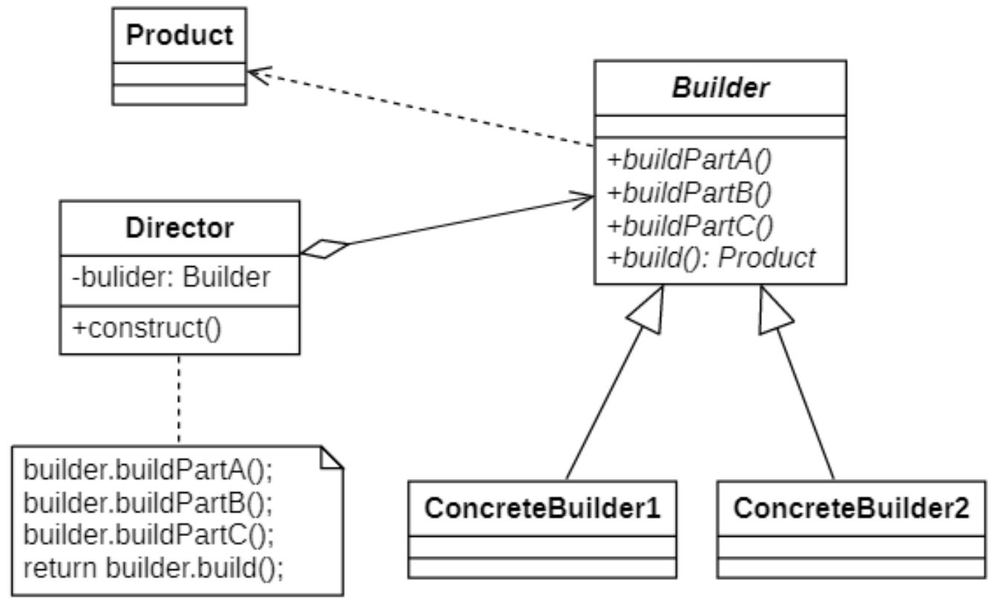
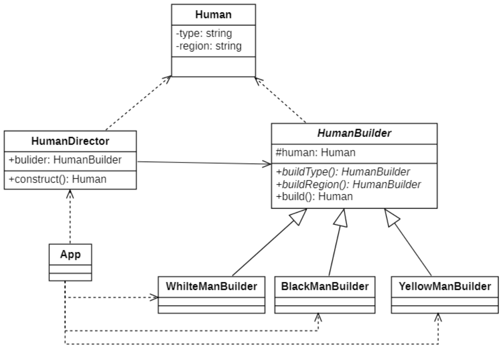
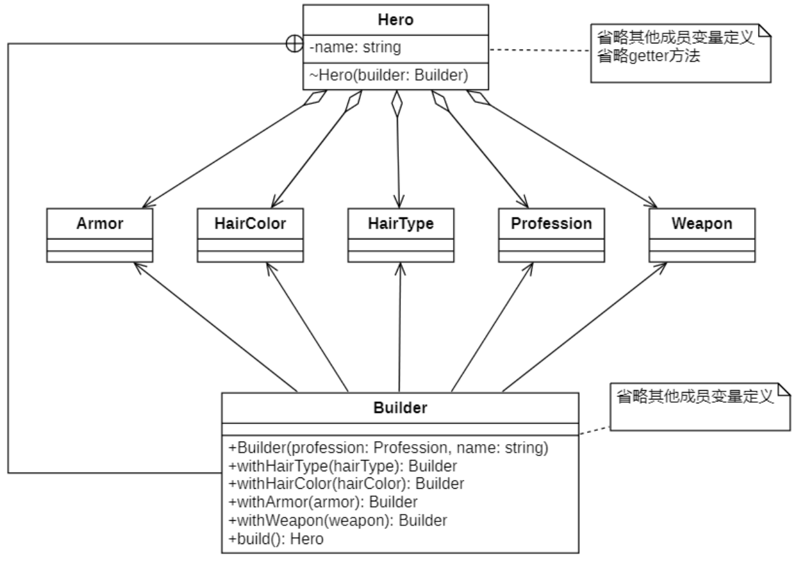

# 建造者模式
## 概述
建造者模式（Builder Pattern）定义如下：

> `Wikipedia` says: The builder pattern is an object creation software design pattern with the intentions of finding a solution to the telescoping constructor anti-pattern.
> 
> 建造者模式是一种对象创建软件设计模式，旨在找到伸缩构造器反模式的解决方案。
>
> *`伸缩性构造的反模式`：指通过构造器实现对象构建参数初始化，如果对象属性比较多，导致构造器的参数个数不可控。*
>
> Separate the construction of a complex object from its representation so that the same construction process can create different representations.
>
> 将一个复杂对象的构建与它的表示分离，使得同样的构建过程可以创建不同的表示。

## 建造者模式的结构

建造者模式一步一步创建一个复杂的对象，它允许用户只通过指定复杂对象的类型和内容就可以构建它们，用户不需要知道内部的具体构建细节。

| ##container## |
|:--:|
||

在建造者模式结构图中包含如下几个角色:

- **`Builder（抽象建造者）`**：它为创建一个产品`Product`对象的各个部件指定抽象接口，在该接口中一般声明两类方法，一类方法是`buildPartXXXX()`，它们用于创建复杂对象的各个部件；另一类方法是`build()`，它们用于返回复杂对象。`Builder`既可以是抽象类，也可以是接口。

- **`ConcreteBuilder（具体建造者）`**：它实现了`Builder`接口，实现各个部件的具体构造和装配方法，定义并明确它所创建的复杂对象，也可以提供一个方法返回创建好的复杂产品对象。

- **`Product（产品角色）`**：它是被构建的复杂对象，包含多个组成部件，具体建造者创建该产品的内部表示并定义它的装配过程。

- **`Director（指挥者）`**：指挥者又称为导演类，它负责安排复杂对象的建造次序，指挥者与抽象建造者之间存在关联关系，可以在其`construct()`建造方法中调用建造者对象的部件构造与装配方法，完成复杂对象的建造。客户端一般只需要与指挥者进行交互，在客户端确定具体建造者的类型，并实例化具体建造者对象（也可以通过配置文件和反射机制），然后通过指挥者类的构造函数或者`Setter`方法将该对象传入指挥者类中。

简单的说, 就是用户通过`Director`创建对象; 创建过程是由`Director::construct()`方法中规定死的, 而用户可以通过配置文件(或者反射)选择不同的`ConcreteBuilder`作为`Builder`, 进而通过多态传参进入`Director::construct()`然后按照`不同子类的不同buildPartXXXX()`进行构造, 然后返回.<sup>(实现1)</sup>

有时候为了更丰富的组合, 可以不使用`Director`类, 而是一起写在`Builder`, 让用户也可以指定调用初始化的顺序与选择使用哪些方法初始化.<sup>(实现2)</sup>

#### 建造者模式的实现1
##### 类图设计
| ##container## |
|:--:|
||

##### 代码实现

抽象建造者类
```C++
// .h
#ifndef _HUMANBUILDER_H_
#define _HUMANBUILDER_H_
#include "Human.h"

namespace builder
{
    class HumanBuilder
    {
        // 关联一个人种实例
        CC_SYNTHESIZE(Human, m_human, Human);
    public:
        virtual HumanBuilder* buildType() = 0;
        virtual HumanBuilder* buildRegion() = 0;
        // 将成变量实例创建出一个新的实例对象
        virtual Human* build() final;
    };
}

#endif // !_HUMANBUILDER_H_

// .cpp
#include "HumanBuilder.h"

builder::Human* builder::HumanBuilder::build()
{
    // 通过对象复制创建新的实例
    return new Human(m_human);
}
```

具体建造者类
```C++
// .h
#ifndef _YELLOWMANBUILDER_H_
#define _YELLOWMANBUILDER_H_
#include "../HumanBuilder.h"
#include "../../../util/ClassHelper.h"

namespace builder
{
    class YellowManBuilder : public HumanBuilder
    {
        DECLARE_CLASS(builder::YellowManBuilder);
    public:
        HumanBuilder* buildType() override;
        HumanBuilder* buildRegion() override;
    };
}

#endif // !_YELLOWMANBUILDER_H_

// .cpp
#include "YellowManBuilder.h"
IMPLEMENT_CLASS(builder::YellowManBuilder);

builder::HumanBuilder* builder::YellowManBuilder::buildType()
{
    m_human.setType("黄种人");
    return this;
}

builder::HumanBuilder* builder::YellowManBuilder::buildRegion()
{
    m_human.setRegion("华夏");
    return this;
}
```

导演类

```C++
#ifndef _HUMANDIRECTOR_H_
#define _HUMANDIRECTOR_H_
#include "HumanBuilder.h"

namespace builder
{
    class HumanDirector
    {
        CC_SYNTHESIZE_SET(HumanBuilder*, m_builder, Builder);
    public:
        Human* construct() {
            // 限制死了创建产品的顺序
            return m_builder->buildType()->buildRegion()->build();
        }
    };
}

#endif // !_HUMANDIRECTOR_H_
```

客户端代码

```C++
#include "../../util/Properties.h"
#include "../../util/ClassHelper.h"
#include "HumanBuilder.h"
#include "HumanDirector.h"
#include <iostream>
using namespace builder;
#include <vld.h>

int main()
{
    // 创建一个构建器(通过读取配置文件选择创建的实例使用的具体建造者)
    CREATE_PROPERTIES(prop, conf);
    string bcname = prop.getProperty("bp");
    GET_INSTANCE_BY_NAME(HumanBuilder*, builder, bcname);
    // 创建导演实例
    HumanDirector director;
    director.setBuilder(builder);
    Human* man = director.construct();
    std::cout << man->getType() << ":" << man->getRegion() << std::endl;
    // 释放内存
    delete builder;
    delete man;
    return 0;
}
```

#### 建造者模式的实现2
##### 类图设计
| ##container## |
|:--:|
||

##### 代码实现

抽象建造者类 (注意: 这里并没有演示具体建造者类的实现(因为就一个set, get, 构造需要写))
```C++
// .h
#ifndef _HERO_H_
#define _HERO_H_
#include <string>
#include "../../Macros.h"
#include "element/HairType.h"
#include "element/HairColor.h"

namespace builder
{
    class Hero
    {
        CC_SYNTHESIZE_GET(std::string, name, Name);
        CC_SYNTHESIZE_GET(HairType*, type, Type);
        CC_SYNTHESIZE_GET(HairColor*, color, Color);
    public:
        class Builder {
            friend class Hero;
        private:
            std::string name;
            HairType* type;
            HairColor* color;
        public:
            Builder();
            Hero* build();
            Builder* withName(std::string name);
            Builder* withHairType(HairType* type);
            Builder* withHairColor(HairColor* color);
        };
    private:
        Hero(Builder* builder);
    public:
        ~Hero();
        void show();
        static Hero::Builder build();
    };
}

#endif // !_HERO_H_

// .cpp
#include "Hero.h"
#include <iostream>

builder::Hero::Builder::Builder()
{
    this->name = "";
    this->color = nullptr;
    this->type = nullptr;
}

builder::Hero* builder::Hero::Builder::build()
{
    return new Hero(this);
}

builder::Hero::Builder* builder::Hero::Builder::withName(std::string name)
{
    this->name = name;
    return this;
}

builder::Hero::Builder* builder::Hero::Builder::withHairType(HairType* type)
{
    this->type = type;
    return this;
}

builder::Hero::Builder* builder::Hero::Builder::withHairColor(HairColor* color)
{
    this->color = color;
    return this;
}

builder::Hero::Hero(Builder* builder)
{
    this->name = builder->name;
    this->type = builder->type;
    this->color = builder->color;
}

builder::Hero::~Hero()
{
    if (type) delete type;
    if (color) delete color;
}

void builder::Hero::show()
{
    std::cout << this->name << std::endl;
    std::cout << "发型：";
    if (this->type)
        std::cout << type->getTypename();
    else
        std::cout << "无";
    std::cout << std::endl;
    std::cout << "发色：";
    if (this->color)
        std::cout << color->getColor();
    else
        std::cout << "无";
    std::cout << std::endl;
}

builder::Hero::Hero::Builder builder::Hero::build()
{
    return Hero::Builder();
}
```

值得注意的是, 上面的这种实现方法, `Builder`类的设置方法都是是返回`this`即(`Builder *`), 所以才可以像下面这样 `->->->`(因为返回的也是类指针(最后才是`build`方法返回产品`Hero *`))

客户端

```C++
#include "Hero.h"
using namespace builder;

int main()
{
    Hero* h1 = Hero::build()
        .withName("张飞")
        ->withHairType(new HairType("双马尾"))
        ->withHairColor(new HairColor("金黄色"))
        ->build();
    h1->show();

    Hero::Builder b;
    Hero* h2 = b.withName("赵云")->build();
    h2->show();

    delete h1;
    delete h2;
    return 0;
}
```

## 建造者模式适用场景
建造者模式的核心在于如何一步步构建一个包含多个组成部件的完整对象，使用相同的构建过程构建不同的产品，在软件开发中，如果我们需要创建复杂对象并希望系统具备很好的灵活性和可扩展性可以考虑使用建造者模式。

### 主要优点
- 在建造者模式中，**客户端不必知道产品内部组成的细节，将产品本身与产品的创建过程解耦，使得相同的创建过程可以创建不同的产品对象**。

- **每一个具体建造者都相对独立，而与其他的具体建造者无关，因此可以很方便地替换具体建造者或增加新的具体建造者，用户使用不同的具体建造者即可得到不同的产品对象**。由于指挥者类针对抽象建造者编程，增加新的具体建造者无须修改原有类库的代码，系统扩展方便，<b style="color:red">符合“开闭原则”</b>。

- **可以更加精细地控制产品的创建过程**。将复杂产品的创建步骤分解在不同的方法中，使得创建过程更加清晰，也更方便使用程序来控制创建过程。

### 主要缺点
- **建造者模式所创建的产品一般具有较多的共同点**，其组成部分相似，如果产品之间的差异性很大，例如很多组成部分都不相同，不适合使用建造者模式，因此其**使用范围受到一定的限制**。

- **如果产品的内部变化复杂，可能会导致需要定义很多具体建造者类来实现这种变化**，导致系统变得很庞大，增加系统的理解难度和运行成本。

### 适用环境
在以下情况下可以考虑使用建造者模式:

- 需要生成的产品对象有复杂的内部结构，这些产品对象通常包含多个成员属性。
- 需要生成的产品对象的属性相互依赖，需要指定其生成顺序。
- 对象的创建过程独立于创建该对象的类。在建造者模式中通过引入了指挥者类，将创建过程封装在指挥者类中，而不在建造者类和客户类中。
- 隔离复杂对象的创建和使用，并使得相同的创建过程可以创建不同的产品。