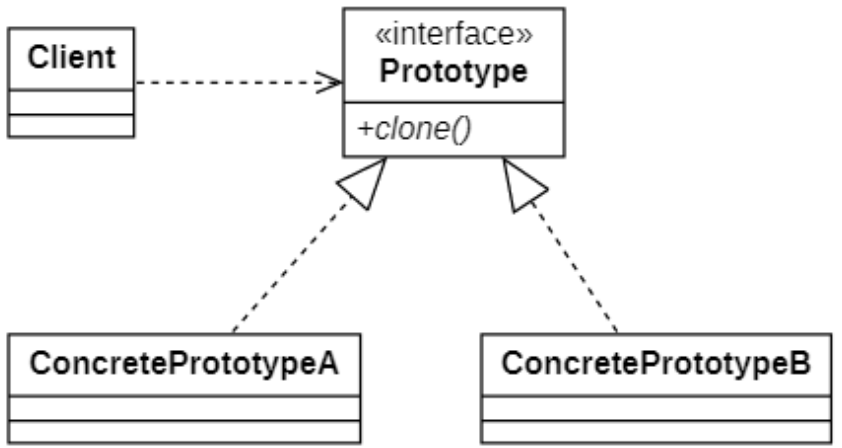
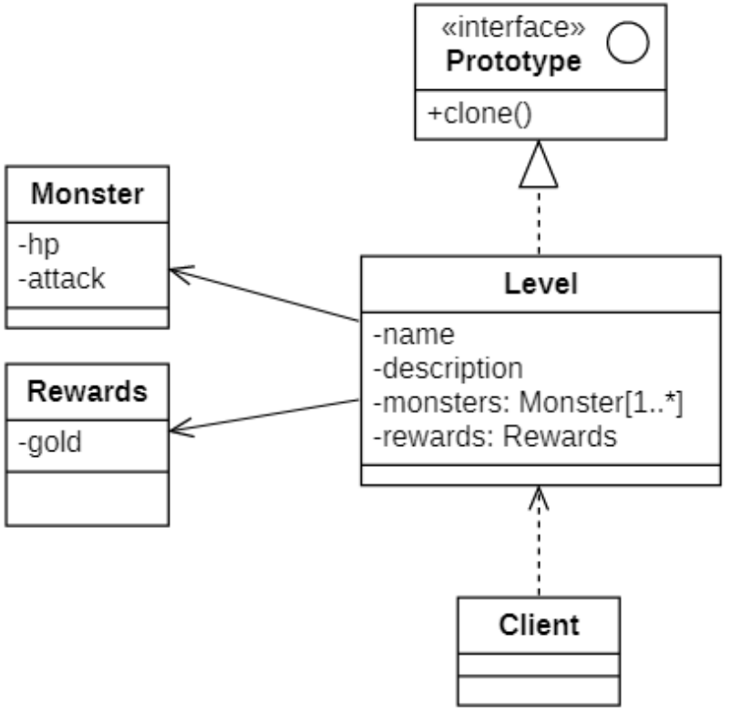

# 原型模式
## 概念
在玄幻小说中，经常会有身外化身一说：“通过本体复制出与本体一样的分身（分身具有本体一样特性）”，在面向对象系统中也会出现类似的需求，这就是**原型模式(Prototype Pattern)** 设计出来的目标。

其定义如下:

> `Wikipedia says`: The prototype pattern is a creational design pattern in software development. It is used when the type of objects to create is determined by a prototypical instance, which is cloned to produce new objects.
>
> 原型模式是软件开发中的一种创造设计模式。当要创建的对象类型由原型实例确定时使用，该实例被克隆以生成新对象。
>
> Specify the kinds of objects to create using a prototypical instance, and create new objects by copying this prototype.
>
> 使用原型实例指定要创建的对象的种类，并通过复制此原型来创建新对象。

首先，应该注意原型模式**不是用来获得性能优势**的。它仅用于从原型实例创建新对象。

## 原型模式的结构
| ##container## |
|:--:|
||

在原型模式结构图中包含如下几个角色：
- `Prototype（抽象原型类）`：它是声明克隆方法的接口，是所有具体原型类的公共父类，可以是抽象类也可以是接口，甚至还可以是具体实现类。

- `ConcretePrototype（具体原型类）`：它实现在抽象原型类中声明的克隆方法，在克隆方法中返回自己的一个克隆对象。

- `Client（客户类）`：让一个原型对象克隆自身从而创建一个新的对象，在客户类中只需要直接实例化或通过工厂方法等方式创建一个原型对象，再通过调用该对象的克隆方法即可得到多个相同的对象。由于客户类针对抽象原型类Prototype编程，因此用户可以根据需要选择具体原型类，系统具有较好的可扩展性，增加或更换具体原型类都很方便。

*注意：浅克隆（浅复制）和深克隆（深复制）之间的区别*

## 原型模式的实现
### 类图设计
| ##container## |
|:--:|
||

### 代码实现1 (浅拷贝)

```C++
#ifndef _PROTOTYPE_H_
#define _PROTOTYPE_H_

namespace proto
{
    class Prototyppe
    {
    public:
        virtual Prototyppe* clone() = 0;
    };
}

#endif // !_PROTOTYPE_H_
```


```C++
#ifndef _MONSTER_H_
#define _MONSTER_H_

namespace proto
{
    class Monster
    {
        /** 定义受保护的变量，并提供get、set方法 */
        CC_SYNTHESIZE(int, hp, Hp);
        CC_SYNTHESIZE(int, attack, Attack);
    public:
        Monster(int hp, int attack) {
            this->hp = hp;
            this->attack = attack;
        }
    };
}

#endif // !_MONSTER_H_
```

```C++
#ifndef _REWARDS_H_
#define _REWARDS_H_

namespace proto
{
    class Rewards
    {
        CC_SYNTHESIZE(int, gold, Gold);
    public:
        Rewards(int gold) {
            this->gold = gold;
        }
    };
}

#endif // !_REWARDS_H_
```

```C++
#ifndef _LEVEL_H_
#define _LEVEL_H_

namespace proto
{
    class Level : public Prototyppe
    {
        CC_SYNTHESIZE(std::string, name, Name);
        CC_SYNTHESIZE(std::string, descrip, Descrip);
        CC_SYNTHESIZE_CR_GET(std::vector<Monster*>, monsters, Monsters);
        CC_SYNTHESIZE(Rewards*, rew, Rew); // 注意这个是指针! 浅拷贝会有问题 (里面有 gold成员变量)
        CC_SYNTHESIZE_SET(bool, release, Release); // 使用bool标记, 防止重复释放
    public:
        Prototyppe* clone() override
        {
            // 使用默认拷贝构造进行浅克隆
            Level* copy = new Level(*this);
            // 浅拷贝: 对象是新的: 会存在两个Level对象(原来的和copy的), 但成员变量只是取其引用(指针指向了); 故会出现在各自的析构函数中二次释放成员变量
            copy->setRelease(false); // 浅拷贝的不用自动释放, 只只需要原本父本自动释放即可防止内存泄漏
            return copy;
        }
        Level() {
            release = true;
            this->rew = nullptr;
        }
        ~Level() {
            if (!release) return;
            if (this->rew) delete rew;
            for (auto one : monsters) {
                delete one;
            }
            monsters.clear();
        }
    };
}

#endif // !_LEVEL_H_
```

```C++
#include "Level.h"
#include <iostream>
using namespace proto;

int main()
{
    // 创建原型对象
    Level* proto = new Level();
    proto->setName("普通山庄");
    proto->setDescrip("这是一个比较危险的山庄，经常有山蜇出没.");
    proto->getMonsters().push_back(new Monster(10, 20));
    proto->getMonsters().push_back(new Monster(20, 20));
    proto->getMonsters().push_back(new Monster(30, 20));
    proto->setRew(new Rewards(10));
    // 实现克隆
    Level* copy = dynamic_cast<Level*>(proto->clone());
    copy->setDescrip("我修改了描述");
    std::cout << "proto:" << proto->getDescrip() << std::endl;
    std::cout << "copy:" << copy->getDescrip() << std::endl;
    copy->getRew()->setGold(30);
    std::cout << "proto:" << proto->getRew()->getGold() << std::endl; // 30
    std::cout << "copy:" << copy->getRew()->getGold() << std::endl;   // 30
    // 释放内存
    delete copy;
    delete proto;
    return 0;
}
```

- 浅拷贝只是指针指向了它, 所以数据被改就全部被改了; 并且存在二次释放的风险.

> 在C++中，如果拷贝构造函数只是简单地将一个对象的值复制到另一个对象中，那么改变子对象（例如成员变量）的值，其父对象（即包含该子对象的对象）的值不会改变。这是因为拷贝构造函数执行的是浅拷贝，只复制了对象的值，而不是复制了对象本身。
>
> 如果成员变量是指针类型，那么情况会有所不同。如果拷贝构造函数只是简单地将一个指针的值复制到另一个指针中，那么两个指针将指向同一块内存地址。因此，如果一个指针所指向的内存地址的值被改变，另一个指针所指向的内存地址的值也会被改变。为了避免这种情况，可以在拷贝构造函数中进行深拷贝，即复制指针所指向的对象，而不是复制指针本身。

[C++的四个默认函数（构造函数，析构函数，拷贝函数，赋值函数）](https://blog.csdn.net/Fdog_/article/details/113920661)

[【C/C++】拷贝构造函数——深拷贝和浅拷贝](https://blog.csdn.net/qq_34018840/article/details/106232090)

### 代码实现2 (深拷贝)
实现深克隆，需要处理拷贝构造和赋值运算符，然后可以自身管理内存了。

```C++
#ifndef _PROTOTYPE_H_
#define _PROTOTYPE_H_

namespace proto
{
    class Prototyppe
    {
    public:
        virtual Prototyppe* clone() = 0;
    };
}

#endif // !_PROTOTYPE_H_
```

```C++
#ifndef _MONSTER_H_
#define _MONSTER_H_

namespace proto
{
    class Monster
    {
        CC_SYNTHESIZE(int, hp, Hp);
        CC_SYNTHESIZE(int, attack, Attack);
    public:
        Monster(int hp, int attack) {
            this->hp = hp;
            this->attack = attack;
        }
    };
}
```

```C++
#ifndef _REWARDS_H_
#define _REWARDS_H_

namespace proto
{
    class Rewards
    {
        CC_SYNTHESIZE(int, gold, Gold);
    public:
        Rewards(int gold) {
            this->gold = gold;
        }
    };
}

#endif // !_REWARDS_H_
```

```C++
#ifndef _LEVEL_H_
#define _LEVEL_H_

namespace proto
{
    class Level : public Prototyppe
    {
        CC_SYNTHESIZE(std::string, name, Name);
        CC_SYNTHESIZE(std::string, descrip, Descrip);
        CC_SYNTHESIZE_CR_GET(std::vector<Monster*>, monsters, Monsters);
        CC_SYNTHESIZE(Rewards*, rew, Rew);
    private:
        void copy(const Level& l) {
            // 需要壹壹实现成员的深拷贝, 如果成员很多会很烦人(复杂)
            this->name = l.name;
            this->descrip = l.descrip;
            if (l.rew)
            {
                this->rew = new Rewards(*l.rew);
            }
            for (auto m : l.monsters)
            {
                this->monsters.push_back(new Monster(*m));
            }
        }
        void release() {
            if (this->rew) {
                delete rew;
                this->rew = nullptr;
            }
            for (auto one : monsters) {
                delete one;
            }
            monsters.clear();
        }
    public:
        Prototyppe* clone() override
        {
            // 使用拷贝构造进行克隆
            return new Level(*this);
        }
        Level() {
            this->rew = nullptr;
        }
        ~Level() {
            release();
        }
        // 重写拷贝构造
        Level(const Level& l) {
            copy(l);
        }
        // 重载赋值运算符
        Level& operator=(const Level& l) {
            // 先释放资源
            release();
            // 在进行复制
            copy(l);
            return *this;
        }
    };
}

#endif // !_LEVEL_H_
```

```C++
#include "Level.h"
#include <iostream>
// #include "vld.h"
using namespace proto;
int main()
{
    // 创建原型对象
    Level* proto = new Level();
    proto->setName("普通山庄");
    proto->setDescrip("这是一个比较危险的山庄，经常有山蜇出没.");
    proto->getMonsters().push_back(new Monster(10, 20));
    proto->getMonsters().push_back(new Monster(20, 20));
    proto->getMonsters().push_back(new Monster(30, 20));
    proto->setRew(new Rewards(10));
    // 实现克隆
    Level* copy = dynamic_cast<Level*>(proto->clone());
    copy->setDescrip("我修改了描述");
    std::cout << "proto:" << proto->getDescrip() << std::endl;
    std::cout << "copy:" << copy->getDescrip() << std::endl;
    // 对成员变量进行修改, 不会对父本也产生影响
    copy->getRew()->setGold(30);
    std::cout << "proto:" << proto->getRew()->getGold() << std::endl; // 10
    std::cout << "copy:" << copy->getRew()->getGold() << std::endl;   // 30
    // 使用赋值运算符copy
    Level cpy1;
    cpy1.setRew(new Rewards(1));
    cpy1 = *proto;
    // 释放内存
    delete copy;
    delete proto;
    return 0;
}
```

- 深拷贝会使得代码变得复杂

## 原型模式适用环境
### 主要优点
- **当创建新的对象实例较为复杂时，使用原型模式可以简化对象的创建过程**，通过复制一个已有实例可以提高新实例的创建效率。

- **扩展性较好**，由于在原型模式中提供了抽象原型类，在客户端可以针对抽象原型类进行编程，将具体原型实现类写在配置文件中，增加或减少产品类对原有系统都没有任何影响。

- 原型模式提供了简化的创建结构，工厂方法模式常常需要有一个与产品类等级结构相同的工厂等级结构，而原型模式就不需要这样，原型模式中产品的复制是通过封装在原型类中的克隆方法实现的，无须专门的工厂类来创建产品。

- 可以使用深克隆的方式保存对象的状态，使用原型模式将对象复制一份并将其状态保存起来，以便在需要的时候使用（如恢复到某一历史状态），可辅助实现撤销操作。

### 主要缺点
- 需要为每一个类配备一个克隆方法，而且该克隆方法位于一个类的内部，当对已有的类进行改造时，需要修改源代码，**违背了“开闭原则”**。

- 在实现深克隆时需要编写较为复杂的代码，而且当对象之间存在多重的嵌套引用时，为了实现深克隆，每一层对象对应的类都必须支持深克隆，实现起来可能会比较麻烦。

### 适用环境
在以下情况下可以考虑使用原型模式：

- 创建新对象成本较大（如初始化需要占用较长的时间，占用太多的CPU资源或网络资源），新的对象可以通过原型模式对已有对象进行复制来获得，如果是相似对象，则可以对其成员变量稍作修改。

- 如果系统要保存对象的状态，而对象的状态变化很小，或者对象本身占用内存较少时，可以使用原型模式配合备忘录模式来实现。

- 需要避免使用分层次的工厂类来创建分层次的对象，并且类的实例对象只有一个或很少的几个组合状态，通过复制原型对象得到新实例可能比使用构造函数创建一个新实例更加方便。
