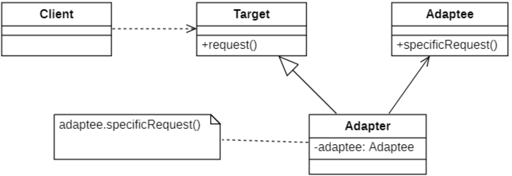
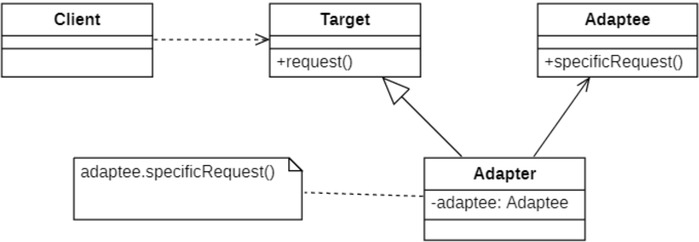
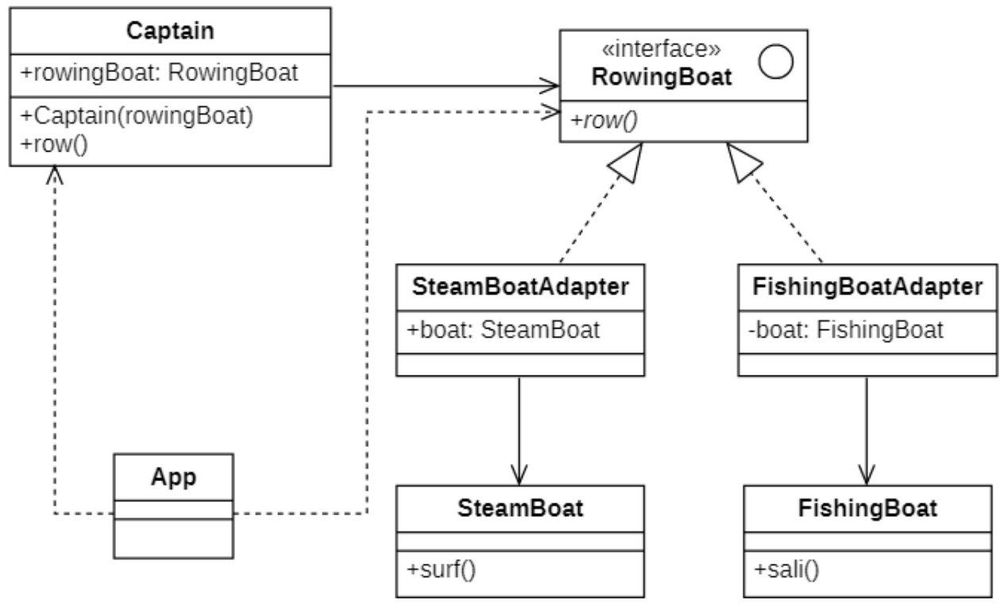
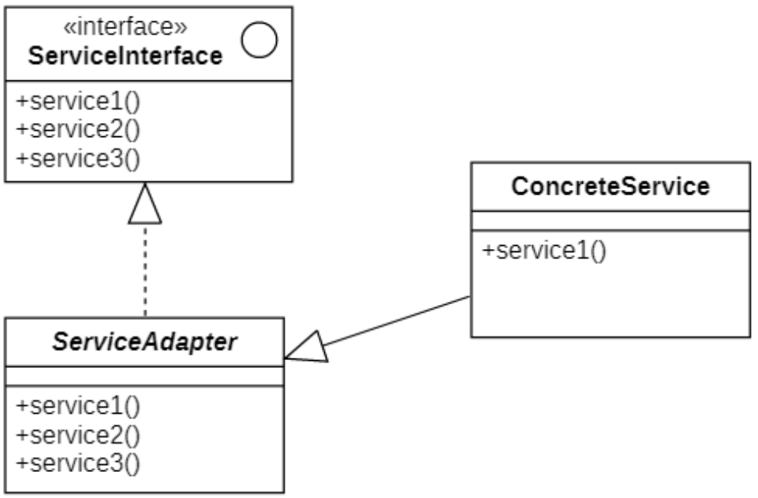

# 适配器模式
## 概述
> 我的笔记本电脑的工作电压是20V，而我国的家庭用电是220V，如何让20V的笔记本电脑能够在220V的电压下工作？
>
>答案是引入一个 **电源适配器(AC Adapter)**，俗称充电器或变压器，有了这个电源适配器，生活用电和笔记本电脑即可兼容。

**适配器模式(Adapter Pattern)** 可以将一个类的接口和另一个类的接口匹配起来，而无须修改原来的适配者接口和抽象目标类接口，适配器模式也叫**包装器(Wrapper)** 模式。

适配器模式定义如下：

> Wikipedia says: In software engineering, the adapter pattern is a software design pattern that allows the interface of an existing class to be used as another interface. It is often used to make existing classes work with others without modifying their source code.
>
> 在软件工程中，适配器模式是一种软件设计模式，它允许将现有类的接口用作另一个接口。它通常用于使现有类与其他类一起工作，而无需修改其源代码。
>
> Convert the interface of a class into another interface the clients expect. Adapter lets classes work together that couldn't otherwise because of incompatible interfaces.
>
> 将类的接口转换为客户端期望的另一个接口。适配器让那些接口不兼容的类可以一起工作。

> [!TIP]
> **TIP：在适配器模式定义中所提及的接口是指广义的接口，它可以表示一个方法或者方法的集合**

## 适配器模式的结构
根据适配器类与适配者类的关系不同，适配器模式可分为对象适配器和类适配器两种，**在对象适配器模式中，适配器与适配者之间是关联关系；在类适配器模式中，适配器与适配者之间是继承（或实现）关系**。

### 对象适配器结构
| ##container## |
|:--:|
||

在对象适配器模式结构图中包含如下几个角色：
- `Target（目标抽象类）`：目标抽象类定义客户所需接口，可以是一个抽象类或接口，也可以是具体类。

- `Adapter（适配器类）`：适配器可以调用另一个接口，作为一个转换器，对`Adaptee`和`Target`进行适配，适配器类是适配器模式的核心，在对象适配器中，它通过继承`Target`并关联一个`Adaptee`对象使二者产生联系。

- `Adaptee（适配者类）`：适配者即被适配的角色，它定义了一个已经存在的接口，这个接口需要适配，适配者类一般是一个具体类，包含了客户希望使用的业务方法，在某些情况下可能没有适配者类的源代码。

#### 对象适配的实现示例代码

```C++
class Adapter::public Target
{
private:
    Adaptee adaptee;
public:
    Adapter(Adaptee adaptee) {
        this->adaptee = adaptee;
    }

    void request() {
        // 转发调用
        adaptee.specificRequest();
    }
};
```

### 类适配器的结构
| ##container## |
|:--:|
||

在类适配器模式结构图中包含如下几个角色：

- `Target（目标抽象类）`：目标抽象类定义客户所需接口，如果语言不支持多继承，`Target`只能是接口类型。

- `Adapter（适配器类）`：适配器可以调用另一个接口，作为一个转换器，对`Adaptee`和`Target`进行适配，适配器类是适配器模式的核心，在类适配器中，它通过实现`Target`接口和继承`Adaptee`类来使二者产生联系。

- `Adaptee（适配者类）`：适配者即被适配的角色，它定义了一个已经存在的接口，这个接口需要适配，适配者类一般是一个具体类，包含了客户希望使用的业务方法，在某些情况下可能没有适配者类的源代码。

#### 类适配器实现的示例代码

```C++
class Adapter::public Adaptee, public Target
{
public:
    void request() {
        // 转发调用
        Adaptee::specificRequest();
    }
};
```

## 适配器模式的实现
### 类图设计
| ##container## |
|:--:|
||

### 代码实现

具体类(乱七八糟的接口(函数))
```C++
#ifndef _FISHINGBOAT_H_
#define _FISHINGBOAT_H_

namespace adapter
{
    class FishingBoat
    {
    public:
        void sali() {
            std::cout << "使用渔船打渔" << std::endl;
        }
    };
}

#endif // !_FISHINGBOAT_H_

///////////////////////////////////////////////////

#ifndef _STEAMBOAT_H_
#define _STEAMBOAT_H_

namespace adapter
{
    class SteamBoat
    {
    public:
        void surf() {
            std::cout << "使用汽艇冲浪" << std::endl;
        }
    };
}

#endif // !_STEAMBOAT_H_
```
具体的适配器: 适配乱七八糟的接口(函数), 使得调用的函数名称统一
```C++
// .h
#ifndef _STEAMBOATADAPTER_H_
#define _STEAMBOATADAPTER_H_

namespace adapter
{
    class SteamBoatAdapter : public RowingBoat
    {
        DECLARE_CLASS(adapter::SteamBoatAdapter);
    private:
        SteamBoat boat;
    public:
        void row() override;
    };
}

#endif // !_STEAMBOATADAPTER_H_

// .cpp
#include "SteamBoatAdapter.h"
IMPLEMENT_CLASS(adapter::SteamBoatAdapter);

void adapter::SteamBoatAdapter::row()
{
    boat.surf();
}
```

抽象适配器(接口)
```C++
#ifndef _ROWINGBOAT_H_
#define _ROWINGBOAT_H_

namespace adapter
{
    class RowingBoat
    {
    public:
        virtual void row() = 0;
    };
}

#endif // !_ROWINGBOAT_H_
```

用户实例类, 只需要调用接口
```C++
#ifndef _CAPTAIN_H_
#define _CAPTAIN_H_

namespace adapter
{
    class Captain
    {
    private:
        RowingBoat* boat;
    public:
        Captain(RowingBoat* boat) {
            this->boat = boat;
        }
        void row() {
            std::cout << "东东哥正在";
            boat->row();
        }
    };
}

#endif // !_CAPTAIN_H_
```

客户端, 使用用户实例类调用对应接口即可, 调用什么接口写在配置文件中
```C++
#include "../util/Properties.h"
#include "../util/ClassHelper.h"
#include "RowingBoat.h"
#include "Captain.h"
using namespace adapter;

int main()
{
    // 创建适配器
    CREATE_PROPERTIES(prop, conf);
    std::string clsName = prop.getProperty("ap");
    GET_INSTANCE_BY_NAME(RowingBoat*, boat, clsName);
    // 创建船长
    Captain ca(boat);
    // 开船
    ca.row();
    // 内存释放
    delete boat;
    return 0;
}
```

## 缺省适配器
**缺省适配器模式(Default Adapter Pattern)** 是适配器模式的一种变体，其应用也较为广泛。

当不需要实现一个接口所提供的所有方法时，可先设计一个抽象类实现该接口，并为接口中每个方法提供一个默认实现（空方法），那么该抽象类的**子类可以选择性地覆盖**父类的某些方法来实现需求，它适用于不想使用一个接口中的所有方法的情况，又称为单接口适配器模式。

其结构如类图所示

| ##container## |
|:--:|
||

在缺省适配器模式中，包含如下三个角色：
- `ServiceInterface（适配者接口）`：它是一个接口，通常在该接口中声明了大量的方法。

- `ServiceAdapter（缺省适配器类）`：它是缺省适配器模式的核心类，使用空方法的形式实现了在`ServiceInterface`接口中声明的方法。通常将它定义为抽象类，因为对它进行实例化没有任何意义。

- `ConcreteService（具体业务类）`：它是缺省适配器类的子类，在没有引入适配器之前，它需要实现适配者接口，因此需要实现在适配者接口中定义的所有方法，而对于一些无须使用的方法也不得不提供空实现。在有了缺省适配器之后，可以直接继承该适配器类，根据需要有选择性地覆盖在适配器类中定义的方法。

## 适配器模式适用环境
### 主要优点
无论是对象适配器模式还是类适配器模式都具有如下优点：
- **将目标类和适配者类解耦**，通过引入一个适配器类来重用现有的适配者类，无须修改原有结构。

- **增加了类的透明性和复用性**，将具体的业务实现过程封装在适配者类中，对于客户端类而言是透明的，而且提高了适配者的复用性，同一个适配者类可以在多个不同的系统中复用。

- **灵活性和扩展性都非常好**，通过使用配置文件，可以很方便地更换适配器，也可以在不修改原有代码的基础上增加新的适配器类，**完全符合“开闭原则”**。

- 类适配器模式还有如下优点：
    - 由于适配器类是适配者类的子类，因此可以在**适配器类中置换一些适配者的方法，使得适配器的灵活性更强**。

- 对象适配器模式还有如下优点：
    - 一个对象适配器**可以把多个不同的适配者适配到同一个目标**；
    - **可以适配一个适配者的子类**，由于适配器和适配者之间是关联关系，根据“里氏替换原则”，适配者的子类也可通过该适配器进行适配。

### 主要缺点
- 类适配器模式的缺点如下：
    - 对于Java、C#等不支持多重类继承的语言，一次最多只能适配一个适配者类，**不能同时适配多个适配者**；
    - **适配者类不能为最终类**，如在Java中不能为final类，C#中不能为sealed类；
    - 在Java、C#等语言中，**类适配器模式中的目标抽象类只能为接口，不能为类**，其使用有一定的局限性。

- 对象适配器模式的缺点如下：
    - 与类适配器模式相比，**要在适配器中置换适配者类的某些方法比较麻烦**。如果一定要置换掉适配者类的一个或多个方法，可以先做一个适配者类的子类，将适配者类的方法置换掉，然后再把适配者类的子类当做真正的适配者进行适配，实现过程较为复杂。
 
### 适用环境
在以下情况下可以考虑使用适配器模式：
- 系统需要使用一些现有的类，而这些类的接口（如方法名）不符合系统的需要，甚至没有这些类的源代码。

- 想创建一个可以重复使用的类，用于与一些彼此之间没有太大关联的一些类，包括一些可能在将来引进的类一起工作。