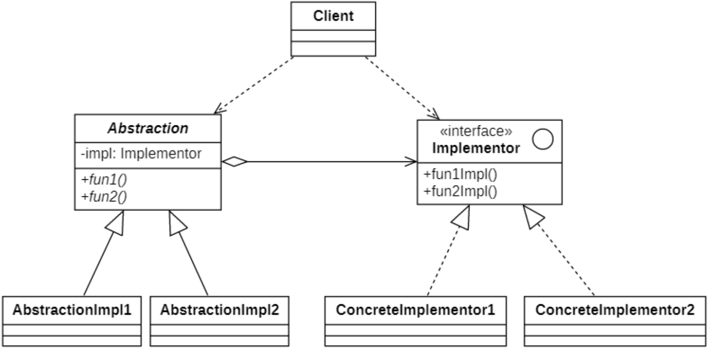
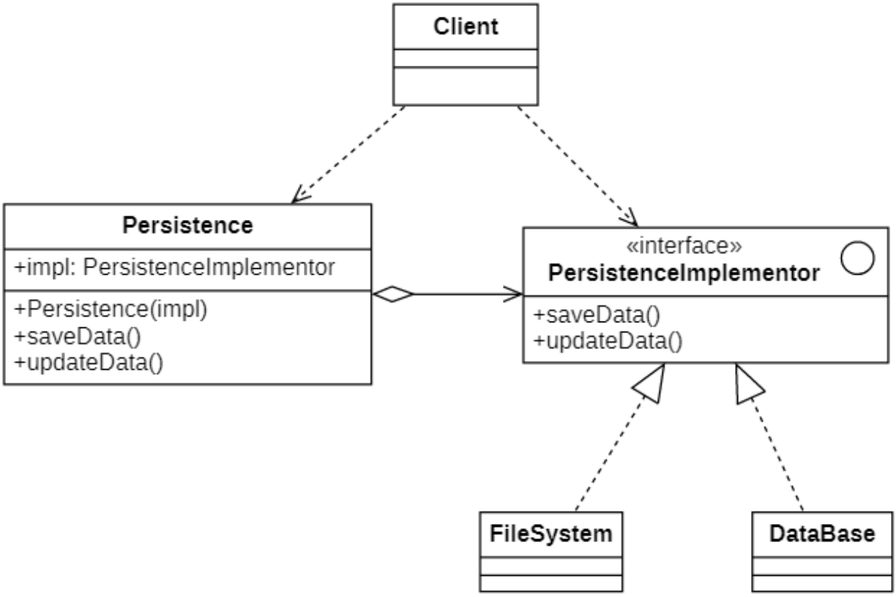

# 桥接模式
## 概念
**桥接模式(Bridge Pattern)** 是一种很实用的结构型设计模式，<span style="color:red">如果软件系统中某个类存在两个独立变化的维度，通过该模式可以将这两个维度分离出来，使两者可以独立扩展</span>，让系统更加符合“**单一职责原则**”。

> `Wikipedia` says: The bridge pattern is a design pattern used in software engineering that is meant to "**decouple an abstraction from its implementation so that the two can vary independently**"
>
> 桥接模式是软件工程中使用的一种设计模式，旨在 “**将抽象与其实现分离，以便两者可以独立变化**”

桥接模式又被称为**柄体模式(Handle And Body Pattern)**,桥接模式用一种巧妙的方式处理多层继承存在的问题，**用抽象关联取代了传统的多层继承**，将类之间的静态继承关系转换为动态的对象组合关系，使得系统更加灵活，并易于扩展，同时有效控制了系统中类的个数。

## 桥接模式的结构

| ##container## |
|:--:|
||

在桥接模式结构图中包含如下几个角色：

- `Abstraction（抽象类）`：用于定义抽象类的接口，它一般是抽象类而不是接口，其中定义了一个`Implementor(实现类接口)`类型的对象并可以维护该对象，它与`Implementor`之间具有关联关系，它既可以包含抽象业务方法，也可以包含具体业务方法。

- `AbstractionImpl（抽象类扩充）`：扩充由`Abstraction`定义的接口，通常情况下它不再是抽象类而是具体类，它实现了在`Abstraction`中声明的抽象业务方法，在`AbstractionImpl`中可以调用在`Implementor`中定义的业务方法。

- `Implementor（实现类接口）`：定义实现类的接口，这个接口不一定要与`Abstraction`的接口完全一致，事实上这两个接口可以完全不同，一般而言，`Implementor`接口仅提供基本操作，而`Abstraction`定义的接口可能会做更多更复杂的操作。`Implementor`接口对这些基本操作进行了声明，而具体实现交给其子类。通过关联关系，在`Abstraction`中不仅拥有自己的方法，还可以调用到`Implementor`中定义的方法，使用关联关系来替代继承关系。
  
- `ConcreteImplementor（具体实现类）`：具体实现`Implementor`接口，在不同的`ConcreteImplementor`中提供基本操作的不同实现，在程序运行时，`ConcreteImplementor`对象将替换其父类对象，提供给抽象类具体的业务操作方法。

桥接模式是一个非常有用的模式，在桥接模式中体现了很多面向对象设计原则的思想，包括“单一职责原则”、“开闭原则”、“组合复用原则”、“里氏代换原则”、“依赖倒转原则”等。

## 桥接模式与适配器模式的使用区别

**桥接模式**通常会于**开发前期进行设计**，**使你能够将程序的各个部分独立开来以便开发**。另一方面，**适配器模式**通常在**已有程序中使用，让相互不兼容的类能很好地合作**。

## 桥接模式的实现
下面以数据持久化操作来举例。

### 类图设计
| ##container## |
|:--:|
||

### 代码实现

抽象类
```C++
// .h
#ifndef _PERSISTENCE_H_
#define _PERSISTENCE_H_

namespace bp
{
    class PersistenceImplementor;
    class Persistence
    {
    private:
        PersistenceImplementor* impl;
    public:
        Persistence(PersistenceImplementor* impl);
        void saveData();
        void updateData();
    };
}

#endif // !_PERSISTENCE_H_

// .cpp
#include "Persistence.h"
#include "PersistenceImplementor.h"

bp::Persistence::Persistence(PersistenceImplementor* impl)
{
    this->impl = impl;
}

void bp::Persistence::saveData()
{
    impl->saveData();
}

void bp::Persistence::updateData()
{
    impl->updateData();
}
```

实现类的抽象类, 声明需要实现的函数, (可以扩充, 但使用基类指针只能看到下面两个)

```C++
#ifndef _PERSISTENCEIMPLEMENTOR_H_
#define _PERSISTENCEIMPLEMENTOR_H_

namespace bp
{
    class PersistenceImplementor
    {
    public:
        virtual void saveData() = 0;
        virtual void updateData() = 0;
    };
}

#endif // !_PERSISTENCEIMPLEMENTOR_H_
```

具体实现类(节选其中一个, 另一个也是一样的)(也可以实现其他的自己的方法)

```C++
// .h
#ifndef _DATABASE_H_
#define _DATABASE_H_

#include "../PersistenceImplementor.h"
#include "../../util/ClassHelper.h"

namespace bp
{
    class DataBase : public PersistenceImplementor
    {
        DECLARE_CLASS(bp::DataBase);
    public:
        void saveData() override;
        void updateData() override;
    };
}

#endif // !_DATABASE_H_

// .cpp
#include "DataBase.h"
#include <iostream>
IMPLEMENT_CLASS(bp::DataBase);


void bp::DataBase::saveData()
{
    std::cout << "成功保存到数据库" << std::endl;
}

void bp::DataBase::updateData()
{
    std::cout << "成功更新到数据库" << std::endl;
}
```

客户端使用
```C++
#include "../util/Properties.h"
#include "../util/ClassHelper.h"
#include "PersistenceImplementor.h"
#include "Persistence.h"
using namespace bp;

int main()
{
    // 创建一个持久化实现对象 (读取配置文件)
    CREATE_PROPERTIES(prop, conf);
    string cls = prop.getProperty("brp");
    GET_INSTANCE_BY_NAME(PersistenceImplementor*, impl, cls);
    // 创建一个持久化对象
    Persistence persistence(impl);
    // 完成持久化操作
    persistence.saveData();
    persistence.updateData();
    // 释放资源
    delete impl;
    return 0;
}
```

## 桥接模式的适用环境
桥接模式是设计Java虚拟机和实现JDBC等驱动程序的核心模式之一，应用较为广泛。在软件开发中如果一个类或一个系统有多个变化维度时，都可以尝试使用桥接模式对其进行设计。桥接模式为多维度变化的系统提供了一套完整的解决方案，并且降低了系统的复杂度。

### 主要优点
- **分离抽象接口及其实现部分**。桥接模式使用“对象间的关联关系”解耦了抽象和实现之间固有的绑定关系，使得抽象和实现可以沿着各自的维度来变化。

- **桥接模式可以取代多层继承方案**，多层继承方案违背了“单一职责原则”，复用性较差，且类的个数非常多，桥接模式是比多层继承方案更好的解决方法，它极大减少了子类的个数。

- **桥接模式提高了系统的可扩展性**，在两个变化维度中任意扩展一个维度，都不需要修改原有系统，符合“开闭原则”。

### 主要缺点
- 桥接模式的使用会**增加系统的理解与设计难度**，由于关联关系建立在抽象层，要求开发者一开始就针对抽象层进行设计与编程。

- 桥接模式要求正确识别出系统中两个独立变化的维度，因此其**使用范围具有一定的局限性**，如何正确识别两个独立维度也需要一定的经验积累。

### 适用环境
在以下情况下可以考虑使用桥接模式：
- 想要拆分或重组一个具有多重功能的庞杂类（例如能与多个数据库服务器进行交互的类）
- 希望在几个独立维度上扩展一个类
- 需要在运行时切换不同实现方法