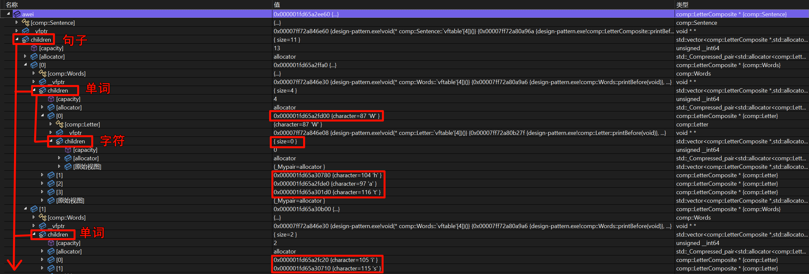

# 组合模式
## 概念
树形结构在软件中随处可见，例如操作系统中的目录结构、应用软件中的菜单、办公系统中的公司组织结构等等，如何运用面向对象的方式来处理这种树形结构是**组合模式(Composite Pattern)** 需要解决的问题。

其定义如下：

> `Wikipedia` says: The composite pattern describes that a group of objects is to be treated in the same way as a single instance of an object. The intent of a composite is to "compose" objects into tree structures to represent part-whole hierarchies. Implementing the composite pattern lets clients treat individual objects and compositions uniformly.
>
> 组合模式描述了在对待一组对象实例的时候，使用以单个对象实例相同的方式对待。
>
> 组合的目的是**将对象“组合”成树形结构，以表示部分-整体层次结构**。
>
> **通过实现组合模式，客户端可以统一对待各个对象与组合**。

组合模式又称为**部分-整体(Part-Whole)** 模式，它将对象组织到树形结构中，可以用来描述整体和部分的关系。

## 组合模式的结构
| ##container## |
|:--:|
||

在组合模式结构图中包含如下几个角色：

- `Component（抽象构件）`：它可以是接口或抽象类，为叶子构件和容器构件对象声明接口，在该角色中可以包含所有子类共有行为的声明和实现。在抽象构件中定义了访问及管理它的子构件的方法，如增加子构件、删除子构件、获取子构件等。

- `Leaf（叶子构件）`：它在组合结构中表示叶子节点对象，叶子节点没有子节点，它实现了在抽象构件中定义的行为。对于那些访问及管理子构件的方法，可以通过异常等方式进行处理。

- `Composite（容器构件）`：它在组合结构中表示容器节点对象，容器节点包含子节点，其子节点可以是叶子节点，也可以是容器节点，它提供一个集合用于存储子节点，实现了在抽象构件中定义的行为，包括那些访问及管理子构件的方法，在其业务方法中可以递归调用其子节点的业务方法。

**组合模式的关键是定义了一个抽象构件类，它既可以代表叶子，又可以代表容器，而客户端针对该抽象构件类进行编程，无须知道它到底表示的是叶子还是容器，可以对其进行统一处理**。同时容器对象与抽象构件类之间还建立一个聚合关联关系，在容器对象中既可以包含叶子，也可以包含容器，以此实现递归组合，形成一个树形结构。

## 组合模式的实现
每个句子都由单词组成，而单词又由字符组成。这些对象中的每一个都是可打印的，它们可以在它们之前或之后打印一些东西，就像句子总是以句号结尾，单词总是在前面有空格。

### 类图设计
| ##container## |
|:--:|
||

### 代码实现

抽象构件
```C++
#ifndef _LETTERCOMPOSITE_H_
#define _LETTERCOMPOSITE_H_

#include <vector>
#include <iostream>
using namespace std;

namespace comp
{
    class LetterComposite
    {
    protected:
        std::vector<LetterComposite*> children; // 容器构件
        virtual void printBefore() {}
        virtual void printAfter() {}
    public:
        void addChild(LetterComposite* comp) {
            children.push_back(comp);
        }
  
        size_t count() {
            return children.size();
        }
  
        void print() {
            printBefore();
            for (auto child : children)
            {
                child->print();
            }
            printAfter();
        }
  
        virtual ~LetterComposite() {
            for (auto child : children)
            {
                delete child;
            }
            children.clear();
        }
    };
}

#endif // !_LETTERCOMPOSITE_H_
```

具体构建

```C++
// 字符
#ifndef _LETTER_H_
#define _LETTER_H_
#include "../LetterComposite.h"

namespace comp
{
    class Letter : public LetterComposite
    {
    private:
        char character;
    public:
        Letter(char c) {
            this->character = c;
        }
    protected:
        void printBefore() override
        {
            cout << character;
        }
    };
}

#endif // !_LETTER_H_

// 单词
#ifndef _WORDS_H_
#define _WORDS_H_
#include "Letter.h"

namespace comp
{
    class Words : public LetterComposite
    {
    public:
        template<typename ... Rest>
        Words(Rest ... c) {
            // 展开可变参
            std::initializer_list<int>{([&] {
                auto letter = new Letter(c);
                this->addChild(letter);
                }(), 0)...};
        }
    protected:
        void printBefore() override
        {
            cout << " ";
        }
    };
}

#endif // !_WORDS_H_

// 句子
#ifndef _SENTENCE_H_
#define _SENTENCE_H_
#include "Words.h"

namespace comp
{
    class Sentence: public LetterComposite
    {
    public:
        template<typename ... Rest>
        Sentence(Rest ... words) {
            initializer_list<int>{(this->addChild(words), 0)...};
        }
    protected:
        void printAfter() override
        {
            cout << endl;
        }
    };
}

#endif // !_SENTENCE_H_
```

使用

```C++
#ifndef _MESSENGER_H_
#define _MESSENGER_H_
#include "comp/Sentence.h"

namespace comp
{
    class Messenger
    {
    public:
        LetterComposite* messageFromDdg()
        {
            //Hi awei , have you arrived at company yet ?
            return new Sentence(
                new Words('H', 'i'),
                new Words('a', 'w', 'e', 'i'),
                new Words(','),
                new Words('H', 'a', 'v', 'e'),
                new Words('y', 'o', 'u'),
                new Words('a', 'r', 'r', 'i', 'v', 'e', 'd'),
                new Words('a', 't'),
                new Words('c', 'o', 'm', 'p', 'a', 'n', 'y'),
                new Words('y', 'e', 't'),
                new Words('?')
            );
        }
        LetterComposite* messageFromAwei()
        {
            //What's the hurry ? I'm not up yet .
            return new Sentence(
                new Words('W', 'h', 'a', 't'),
                new Words('i', 's'),
                new Words('t', 'h', 'e'),
                new Words('h', 'u', 'r', 'r', 'y'),
                new Words('?'),
                new Words('I'),
                new Words('a', 'm'),
                new Words('n', 'o', 't'),
                new Words('u', 'p'),
                new Words('y', 'e', 't'),
                new Words('.')
            );
        }
    };
}

#endif // !_MESSENGER_H_

// main.cpp
#include "Messenger.h"
using namespace comp;
int main()
{
    Messenger msg;
    auto ddg = msg.messageFromDdg();
    auto awei = msg.messageFromAwei();
    // 也可以自己加
    ddg->addChild(new Words('h', 'e', 'l','l','o'));
    ddg->addChild(new Letter('c'));
    ddg->addChild(new Letter('c'));
    ddg->print();
    awei->print();

    delete ddg;
    delete awei;
    return 0;
}
```

### 如何理解 容器构件 使用多态指针

每一个类(句子, 单词, 字符)都有 自己的`容器构件`

| ##container## |
|:--:|
||

## 组合模式的适用环境
组合模式使用面向对象的思想来实现树形结构的构建与处理，描述了如何将容器对象和叶子对象进行递归组合，实现简单，灵活性好。

### 主要优点
- 组合模式可以清楚地定义分层次的复杂对象，表示对象的全部或部分层次，它让客户端忽略了层次的差异，方便对整个层次结构进行控制。

- 客户端可以一致地使用一个组合结构或其中单个对象，不必关心处理的是单个对象还是整个组合结构，简化了客户端代码。

- 在组合模式中增加新的容器构件和叶子构件都很方便，无须对现有类库进行任何修改，符合“开闭原则”。

- 组合模式为树形结构的面向对象实现提供了一种灵活的解决方案，通过叶子对象和容器对象的递归组合，可以形成复杂的树形结构，但对树形结构的控制却非常简单。

### 主要缺点
- **在增加新构件时很难对容器中的构件类型进行限制**。

    有时候我们希望一个容器中只能有某些特定类型的对象，例如在某个文件夹中只能包含文本文件，使用组合模式时，不能依赖类型系统来施加这些约束，因为它们都来自于相同的抽象层，在这种情况下，必须通过在运行时进行类型检查来实现，这个实现过程较为复杂。


### 适用环境
在以下情况下可以考虑使用组合模式：
- **如果你需要实现树状对象结构，可以使用组合模式**。

    组合模式为你提供了两种共享公共接口的基本元素类型： 简单叶节点和复杂容器。 容器中可以包含叶节点和其他容器。 这使得你可以构建树状嵌套递归对象结构。

- **如果你希望客户端代码以相同方式处理简单和复杂元素，可以使用该模式**。

    组合模式中定义的所有元素共用同一个接口。 在这一接口的帮助下， 客户端不必在意其所使用的对象的具体类。