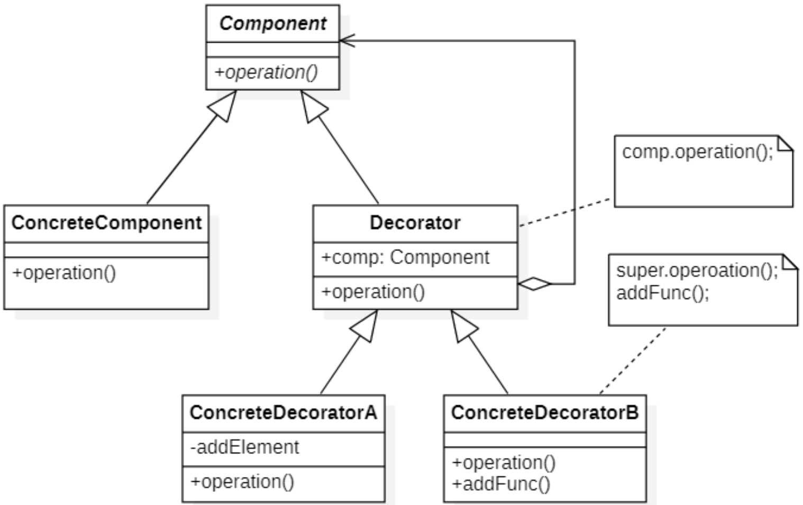
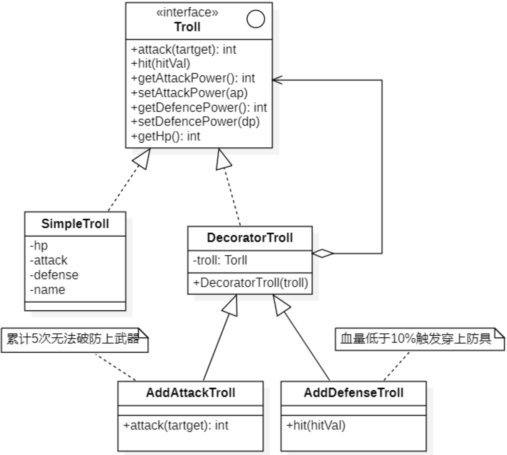

# 装饰模式
## 概念
装饰模式（Decorator Pattern）可以在不改变一个对象本身功能的基础上给对象增加额外的新行为，在现实生活中，这种情况也到处存在。

```
例如一张照片，我们可以不改变照片本身，给它增加一个相框，使得它具有防潮的功能，
而且用户可以根据需要给它增加不同类型的相框，甚至可以在一个小相框的外面再套一个大相框。
```

装饰模式是一种用于替代继承的技术，它通过一种无须定义子类的方式来给对象动态增加职责，使用对象之间的关联关系取代类之间的继承关系。在装饰模式中引入了装饰类，在装饰类中既可以调用待装饰的原有类的方法，还可以增加新的方法，以扩充原有类的功能。

装饰模式定义如下：

> `Wikipedia says`: In object-oriented programming, the decorator pattern is a design pattern that allows behavior to be added to an individual object, either statically or dynamically, without affecting the behavior of other objects from the same class. The decorator pattern is often useful for adhering to the Single Responsibility Principle, as it allows functionality to be divided between classes with unique areas of concern.
>
> 在面向对象编程中，装饰模式是一种设计模式，它允许将行为静态或动态地添加到单个对象中，而不会影响同一类中其他对象的行为。装饰器模式对于遵守单一责任原则通常是有用的，因为它允许将功能划分到具有独特关注区域的类之间。
>
> Attach additional responsibilities to an object dynamically. Decorators provide a flexible alternative to subclassing for extending functionality.
>
> 动态的给一个对象增加一些额外的职责。就扩展功能而言，装饰器模式提供了一种比使用子类更灵活的方式。

装饰模式也叫包装(**Wrapper**)模式，它可以在不创建更多子类的情况下让对象功能得以扩展。

## 装饰模式的结构
| ##container## |
|:--:|
||

在装饰模式结构图中包含如下几个角色：
- `Component（抽象构件）`：它是具体构件和抽象装饰类的共同父类，声明了在具体构件中实现的业务方法，它的引入可以使客户端以一致的方式处理未被装饰的对象以及装饰之后的对象，实现客户端的透明操作。
- `Concrete Component（具体构件）`：它是抽象构件类的子类，用于定义具体的构件对象，实现了在抽象构件中声明的方法，装饰器可以给它增加额外的职责（方法）。
- `Decorator（抽象装饰类）`：它也是抽象构件类的子类，用于给具体构件增加职责，但是具体职责在其子类中实现。它维护一个指向抽象构件对象的引用，通过该引用可以调用装饰之前构件对象的方法，并通过其子类扩展该方法，以达到装饰的目的。
- `Concrete Decorator（具体装饰类）`：它是抽象装饰类的子类，负责向构件添加新的职责。每一个具体装饰类都定义了一些新的行为，它可以调用在抽象装饰类中定义的方法，并可以增加新的方法用以扩充对象的行为。

## 装饰模式的实现
### 类图设计
通常情况下，巨魔是徒手战斗的，在某些情况下我们需要给它穿戴上武器或防具时候，不可能把巨魔杀了重新造一个吧。

| ##container## |
|:--:|
||

### 代码实现

巨魔抽象类
```C++
#ifndef _TROLL_H_
#define _TROLL_H_

namespace decorator
{
    class Troll
    {
    public:
        virtual int attackTarget(Troll* troll) = 0;
        virtual void hit(int hitval) = 0;
        virtual int getAp() = 0;
        virtual void setAp(int ap) = 0;
        virtual int getDp() = 0;
        virtual void setDp(int dp) = 0;
        virtual int getHp() = 0;
        virtual std::string getName() = 0;
    };
}

#endif // !_TROLL_H_
```

普通巨魔 (具体产品类)

```C++
// .h
#ifndef _SIMPLETROLL_H_
#define _SIMPLETROLL_H_

namespace decorator
{
    // final类(太监类), 不能再被继承
    class SimpleTroll final : public Troll
    {
    private:
        int hp;
        int attack;
        int defense;
        std::string name;
    public:
        SimpleTroll(std::string name, int hp, int ap, int dp);
        int attackTarget(Troll* troll) override;
        void hit(int hitval) override;
        int getAp() override;
        void setAp(int ap) override;
        int getDp() override;
        void setDp(int dp) override;
        int getHp() override;
        std::string getName() override;
    };
}

#endif // !_SIMPLETROLL_H_

// .cpp
#include "SimpleTroll.h"
#include <iostream>

decorator::SimpleTroll::SimpleTroll(std::string name, int hp, int ap, int dp)
{
    this->name = name;
    this->hp = hp;
    this->attack = ap;
    this->defense = dp;
}

int decorator::SimpleTroll::attackTarget(Troll* target)
{
    // 计算伤害值
    int hitval = this->attack - target->getDp();
    // 如果没有破防，强制伤害为1
    if (hitval <= 0)
    {
        hitval = 1;
    }
    // 伤害目标
    target->hit(hitval);
    return hitval;
}

void decorator::SimpleTroll::hit(int hitval)
{
    // 扣除生命值
    this->hp -= hitval;
    // 死亡判断
    if (this->hp <= 0)
    {
        std::cout << name << "被击杀" << std::endl;
    }
    else
    {
        std::cout << name << "受到了" << hitval << "点伤害，当前生命之为" << this->hp << std::endl;
    }
}

int decorator::SimpleTroll::getAp()
{
    return this->attack;
}

void decorator::SimpleTroll::setAp(int ap)
{
    this->attack = ap;
}

int decorator::SimpleTroll::getDp()
{
    return this->defense;
}

void decorator::SimpleTroll::setDp(int dp)
{
    this->defense = dp;
}

int decorator::SimpleTroll::getHp()
{
    return this->hp;
}

std::string decorator::SimpleTroll::getName()
{
    return this->name;
}
```

抽象装饰器类
- 其实现是直接转发, 交给`注入`的`抽象类的子类` (`Troll* troll;`)

```C++
// .h
#ifndef _DECORATORTROLL_H_
#define _DECORATORTROLL_H_

namespace decorator
{
    class DecoratorTroll : public Troll
    {
    private:
        Troll* troll;
    public:
        DecoratorTroll(Troll* troll);
        int attackTarget(Troll* troll) override;
        void hit(int hitval) override;
        int getAp() override;
        void setAp(int ap) override;
        int getDp() override;
        void setDp(int dp) override;
        int getHp() override;
        std::string getName() override;
    };
}

#endif // !_DECORATORTROLL_H_

//.cpp
#include "DecoratorTroll.h"

decorator::DecoratorTroll::DecoratorTroll(Troll* troll)
{
    this->troll = troll;
}

int decorator::DecoratorTroll::attackTarget(Troll* target)
{
    return troll->attackTarget(target);
}

void decorator::DecoratorTroll::hit(int hitval)
{
    troll->hit(hitval);
}

int decorator::DecoratorTroll::getAp()
{
    return troll->getAp();
}

void decorator::DecoratorTroll::setAp(int ap)
{
    troll->setAp(ap);
}

int decorator::DecoratorTroll::getDp()
{
    return troll->getDp();
}

void decorator::DecoratorTroll::setDp(int dp)
{
    troll->setDp(dp);
}

int decorator::DecoratorTroll::getHp()
{
    return troll->getHp();
}

std::string decorator::DecoratorTroll::getName()
{
    return troll->getName();
}
```

具体装饰器类

```C++
// .h
#ifndef _ADDDEFENSETROLL_H_
#define _ADDDEFENSETROLL_H_

namespace decorator
{
    class AddDefenseTroll : public DecoratorTroll
    {
    private:
        int percetHp;
        bool isAdd;
    public:
        AddDefenseTroll(Troll* troll);
        void hit(int hitval) override;
    };
}

#endif // !_ADDDEFENSETROLL_H_

// .cpp
#include "AddDefenseTroll.h"
#include <iostream>

decorator::AddDefenseTroll::AddDefenseTroll(Troll* troll) : DecoratorTroll(troll)
{
    this->isAdd = false;
    this->percetHp = (int)(getHp() * 0.1);
}

void decorator::AddDefenseTroll::hit(int hitval)
{
    // 受到伤害
    DecoratorTroll::hit(hitval);
    // 判断是否可以增加防御力
    if (getHp() > 0 && !isAdd && getHp() < percetHp)
    {
        setDp(getDp() + 100);
        std::cout << getName() << "穿上了黄金甲，获得了" << 100 << "点防御力" << std::endl;
        this->isAdd = true;
    }
}
```

使用

```C++
int main()
{
    // === 模拟普通巨魔对战附加防具的巨魔 ===
    // 半透明使用
    std::cout << "===东东哥 VS 图灵机===" << std::endl;
    SimpleTroll ddg2("东东哥", 900, 40, 5);
    SimpleTroll tlj("图灵机", 300, 40, 5);
    AddDefenseTroll adTlj(&tlj); // 直接注入
    AddAttackTroll apDdg(&ddg2);
    do 
    {
        apDdg.attackTarget(&adTlj);
        if (adTlj.getHp() <= 0)
        {
            break;
        }
        adTlj.attackTarget(&apDdg);
        if (ddg2.getHp() <= 0)
        {
            break;
        }
    } while (1);
    // 透明使用
    std::cout << "===东东哥 VS 图灵机===" << std::endl;
    Troll* ddg2 = new SimpleTroll("东东哥", 900, 40, 5);
    Troll* tlj = new SimpleTroll("图灵机", 300, 40, 5);
    DecoratorTroll* adTlj = new AddDefenseTroll(tlj);
    DecoratorTroll* apDdg = new AddAttackTroll(ddg2);
    do
    {
        apDdg->attackTarget(adTlj);
        if (adTlj->getHp() <= 0)
        {
            break;
        }
        adTlj->attackTarget(apDdg);
        if (ddg2->getHp() <= 0)
        {
            break;
        }
    } while (1);
    // 内存释放...
    return 0;
}
```

## 透明与半透明
### 透明装饰模式
在透明装饰模式中，要求客户端完全针对抽象编程，装饰模式的透明性要求客户端程序不应该将对象声明为具体构件类型或具体装饰类型，而应该全部声明为抽象构件类型。对于客户端而言，具体构件对象和具体装饰对象没有任何区别。也就是应该使用如下代码：

```C++
Component* c1 = new ConcreteComponent();
Component* c2 = new ConcreteDecorator(c1);
```

而不应该使用如下代码

```C++
ConcreteComponent* c1 = new ConcreteComponent();
ConcreteDecorator* c2 = new ConcreteDecorator(c1);
```

透明装饰模式可以让客户端透明地使用装饰之前的对象和装饰之后的对象，无须关心它们的区别，此外，还可以对一个已装饰过的对象进行多次装饰，得到更为复杂、功能更为强大的对象。

### 半透明装饰模式
透明装饰模式的设计难度较大，而且有时我们需要单独调用新增的业务方法。

为了能够调用到新增方法，我们不得不用具体装饰类型来定义装饰之后的对象，而具体构件类型还是可以使用抽象构件类型来定义，这种装饰模式即为半透明装饰模式。

也就是说，对于客户端而言，具体构件类型无须关心，是透明的；但是具体装饰类型必须指定，这是不透明的。

```C++
Component* c1 = new ConcreteComponent();
ConcreteDecorator* c2 = new ConcreteDecorator(c1);
c2.operation();
c2.addFunc();
```

半透明装饰模式可以给系统带来更多的灵活性，设计相对简单，使用起来也非常方便；但是其最大的缺点在于不能实现对同一个对象的多次装饰，而且客户端需要有区别地对待装饰之前的对象和装饰之后的对象。

## 装饰模式的适用环境
### 使用注意事项
- 尽量保持装饰类的接口与被装饰类的接口相同，这样，对于客户端而言，无论是装饰之前的对象还是装饰之后的对象都可以一致对待。这也就是说，在可能的情况下，我们应该尽量使用**透明装饰模式**。
- 尽量保持具体构件类`ConcreteComponent`是一个“轻”类，也就是说不要把太多的行为放在具体构件类中，我们可以通过装饰类对其进行扩展。
- 如果只有一个具体构件类，那么抽象装饰类可以作为该具体构件类的直接子类。

### 主要优点
- 对于扩展一个对象的功能，装饰模式比继承更加灵活性，不会导致类的个数急剧增加。
- 可以通过一种动态的方式来扩展一个对象的功能，通过配置文件可以在运行时选择不同的具体装饰类，从而实现不同的行为。
- 可以对一个对象进行多次装饰，通过使用不同的具体装饰类以及这些装饰类的排列组合，可以创造出很多不同行为的组合，得到功能更为强大的对象。
- 具体构件类与具体装饰类可以独立变化，用户可以根据需要增加新的具体构件类和具体装饰类，原有类库代码无须改变，符合“开闭原则”。

### 主要缺点
- 使用装饰模式进行系统设计时将产生很多小对象，这些对象的区别在于它们之间相互连接的方式有所不同，而不是它们的类或者属性值有所不同，大量小对象的产生势必会占用更多的系统资源，在一定程序上影响程序的性能。
- 装饰模式提供了一种比继承更加灵活机动的解决方案，但同时也意味着比继承更加易于出错，排错也很困难，对于多次装饰的对象，调试时寻找错误可能需要逐级排查，较为繁琐。

### 适用环境
- 在不影响其他对象的情况下，以动态、透明的方式给单个对象添加职责。
- 当不能采用继承的方式对系统进行扩展或者采用继承不利于系统扩展和维护时可以使用装饰模式。

    不能采用继承的情况主要有两类：
    - 第一类是系统中存在大量独立的扩展，为支持每一种扩展或者扩展之间的组合将产生大量的子类，使得子类数目呈爆炸性增长；
    - 第二类是因为类已定义为不能被继承（如final类）。
