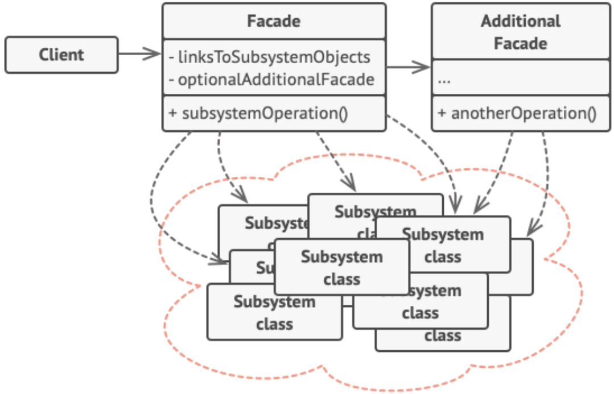
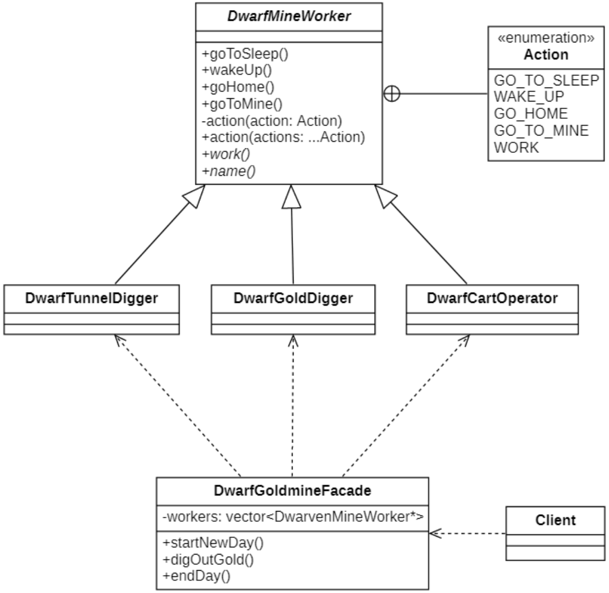

# 外观模式
## 概念
**外观模式(Facade Pattern)** 是一种使用频率非常高的结构型设计模式，它通过引入一个外观角色来简化客户端与子系统之间的交互，为复杂的子系统调用提供一个统一的入口，降低子系统与客户端的耦合度，且客户端调用非常方便。

其定义如下：

> Wikipedia says: A facade is an object that provides a simplified interface to a larger body of code, such as a class library.
>
> 外观是一个对象，它为更大的代码 (例如类库) 提供了简化的接口。
>
> Provide a unified interface to a set of interfaces in a subsystem. Facade defines a higher-level interface that makes the subsystem easier to use.
>
> 为子系统中的一组接口提供一个统一的入口。外观模式定义了一个高层接口，这个接口使得这一子系统更加容易使用。

外观模式又称为门面模式，它是一种对象结构型模式。外观模式是**迪米特法则**的一种具体实现，通过引入一个新的外观角色可以降低原有系统的复杂度，同时降低客户类与子系统的耦合度。

## 外观模式的结构
| ##container## |
|:--:|
||

外观模式包含如下两个角色：
- `外观（Facade）`：提供了一种访问特定子系统功能的便捷方式， 其了解如何重定向客户端请求，知晓如何操作一切活动部件。
- `附加外观 （Additional Facade）`：可以避免多种不相关的功能污染单一外观， 使其变成又一个复杂结构。 客户端和其他外观都可使用附加外观。
- `复杂子系统 （Complex Subsystem）`：由数十个不同对象构成。 如果要用这些对象完成有意义的工作， 你必须深入了解子系统的实现细节， 比如按照正确顺序初始化对象和为其提供正确格式的数据。子系统类不会意识到外观的存在， 它们在系统内运作并且相互之间可直接进行交互。
- `客户端 （Client）`：使用外观代替对子系统对象的直接调用。

## 外观模式的实现
下面是一个矮人挖金矿的过程，使用Facade模式来演示其流程

### 类图设计
| ##container## |
|:--:|
||

### 代码实现

抽象类-复杂子系统
```C++
// .h
#ifndef _DWARFMINEWORKER_H_
#define _DWARFMINEWORKER_H_

namespace facade
{
    class DwarfMineWorker
    {
    public:
        enum class Action
        {
            GO_TO_SLEEP,
            WAKE_UP,
            GO_HOME,
            GO_TO_MINE,
            WORK
        };
        virtual std::string name() = 0;
        virtual void wakeUp();
        virtual void goMine();
        virtual void work() = 0;
        virtual void goHome();
        virtual void gotoSleep();
        void execAction(Action act);
        template<class ... Rest>
        void execAction(Rest ... act)
        {
            std::initializer_list<int>{(this->execAction(act),0)...};
        }
    };
}

#endif // !_DWARFMINEWORKER_H_

// .cpp
#include "DwarfMineWorker.h"
#include <iostream>

void facade::DwarfMineWorker::wakeUp()
{
    std::cout << name() << "：可恶东东哥，就知道催，1个亿没有了" << std::endl;
}

void facade::DwarfMineWorker::goMine()
{
    std::cout << name() << "：别催了，路上堵车了，马上快到了。" << std::endl;
}

void facade::DwarfMineWorker::goHome()
{
    std::cout << name() << "：终于下班了，结束了呗东东哥剥削一天。" << std::endl;
}

void facade::DwarfMineWorker::gotoSleep()
{
    std::cout << name() << "：哈哈，彩票终于中了1个亿，我明天要当场辞职。" << std::endl;
}

void facade::DwarfMineWorker::execAction(Action act)
{
    switch (act)
    {
    case facade::DwarfMineWorker::Action::GO_TO_SLEEP:
        gotoSleep();
        break;
    case facade::DwarfMineWorker::Action::WAKE_UP:
        wakeUp();
        break;
    case facade::DwarfMineWorker::Action::GO_HOME:
        goHome();
        break;
    case facade::DwarfMineWorker::Action::GO_TO_MINE:
        goMine();
        break;
    case facade::DwarfMineWorker::Action::WORK:
        work();
        break;
    default:
        std::cout << name() << "：不加钱，想都不要！" << std::endl;
        break;
    }
}
```

子类

```C++
// .h
#ifndef _DWARFGOLDDIGGER_H_
#define _DWARFGOLDDIGGER_H_

namespace facade
{
    class DwarfGoldDigger : public DwarfMineWorker
    {
    public:
        std::string name() override;
        void work() override;
    };
}

#endif // !_DWARFGOLDDIGGER_H_

// .cpp
#include "DwarfGoldDigger.h"
#include <iostream>

std::string facade::DwarfGoldDigger::name()
{
    return "淘金者--图灵机";
}

void facade::DwarfGoldDigger::work()
{
    std::cout << name() << "：在小小的矿山里面挖呀挖呀挖，我要挖10个T。" << std::endl;
}
```

外观类 (对复杂子系统进行封装)
```C++
// .h
#ifndef _DWARFGOLDMINEFACADE_H_
#define _DWARFGOLDMINEFACADE_H_

namespace facade
{
    class DwarfGoldmineFacade
    {
    private:
        std::vector<DwarfMineWorker*> workers;
    public:
        DwarfGoldmineFacade();
        ~DwarfGoldmineFacade();
        void startNewDay();
        void work();
        void endDay();
    };
}

#endif // !_DWARFGOLDMINEFACADE_H_

// .cpp
#include "DwarfGoldmineFacade.h"
#include "subsys/DwarfTunnelDigger.h"
#include "subsys/DwarfCartOperator.h"
#include "subsys/DwarfGoldDigger.h"

facade::DwarfGoldmineFacade::DwarfGoldmineFacade()
{
    workers.emplace_back(new DwarfTunnelDigger);
    workers.emplace_back(new DwarfCartOperator);
    workers.emplace_back(new DwarfGoldDigger);
}

facade::DwarfGoldmineFacade::~DwarfGoldmineFacade()
{
    for (auto one : workers)
    {
        delete one;
    }
    workers.clear();
}

void facade::DwarfGoldmineFacade::startNewDay()
{
    for (auto one : workers)
    {
        one->execAction(DwarfMineWorker::Action::WAKE_UP, DwarfMineWorker::Action::GO_TO_MINE);
    }
}

void facade::DwarfGoldmineFacade::work()
{
    for (auto one : workers)
    {
        one->execAction(DwarfMineWorker::Action::WORK);
    }
}

void facade::DwarfGoldmineFacade::endDay()
{
    for (auto one : workers)
    {
        one->execAction(DwarfMineWorker::Action::GO_HOME, DwarfMineWorker::Action::GO_TO_SLEEP);
    }
}
```

客户端使用

```C++
#include "DwarfGoldmineFacade.h"

int main()
{
    facade::DwarfGoldmineFacade fa;
    fa.startNewDay();
    fa.work();
    fa.endDay();
    return 0;
}
```

> [!TIP]
> TIP: 在标准的外观模式结构图中，如果需要增加、删除或更换与外观类交互的子系统类，必须修改外观类或客户端的源代码，这将违背开闭原则，因此可以通过引入`抽象外观类`来对系统进行改进，在一定程度上可以解决该问题。

## 外观模式适用环境
> 在项目开发中, 如果我们需要一个其他人开发的类, 但是还没有开发好, 那么我们也可以使用外观类来写点测试数据先运行先, 等到其他人开发好后, 直接在外观类进行替换, 这样就不需要修改我们已经写好的代码了.

### 主要优点
- 它对客户端屏蔽了子系统组件，减少了客户端所需处理的对象数目，并使得子系统使用起来更加容易。通过引入外观模式，客户端代码将变得很简单，与之关联的对象也很少。
- 它实现了子系统与客户端之间的松耦合关系，这使得子系统的变化不会影响到调用它的客户端，只需要调整外观类即可。
- 一个子系统的修改对其他子系统没有任何影响，而且子系统内部变化也不会影响到外观对象。

### 主要缺点
- 不能很好地限制客户端直接使用子系统类，如果对客户端访问子系统类做太多的限制则减少了可变性和灵活性。
- 如果设计不当，增加新的子系统可能需要修改外观类的源代码，违背了开闭原则。

### 适用环境
在以下情况下可以考虑使用外观模式：
- 当要为访问一系列复杂的子系统提供一个简单入口时可以使用外观模式。
- 客户端程序与多个子系统之间存在很大的依赖性。引入外观类可以将子系统与客户端解耦，从而提高子系统的独立性和可移植性。
- 在层次化结构中，可以使用外观模式定义系统中每一层的入口，层与层之间不直接产生联系，而通过外观类建立联系，降低层之间的耦合度。
