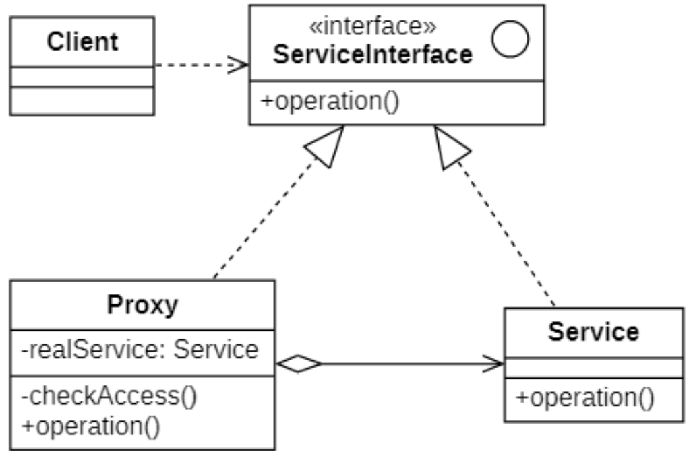
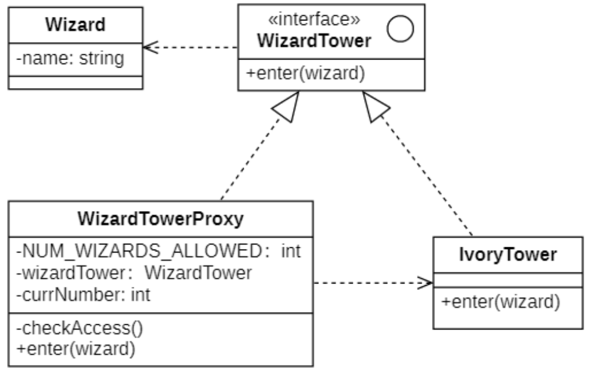
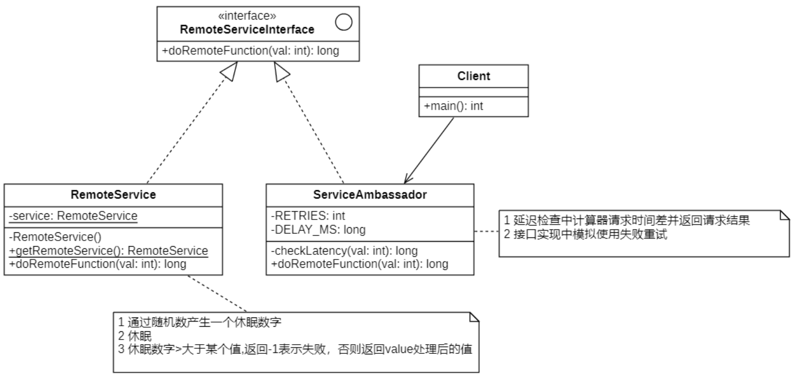
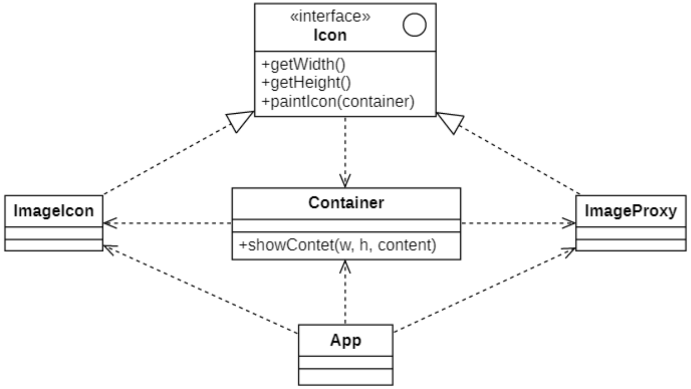
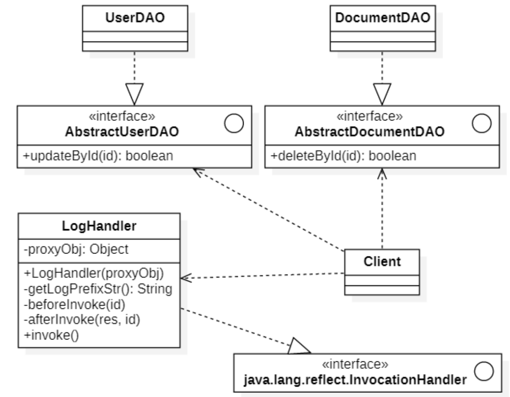

# 代理模式
## 概念
代理模式（Proxy Pattern）的定义如下：
> `Wikipedia says`: A proxy, in its most general form, is a class functioning as an interface to something else. A proxy is a wrapper or agent object that is being called by the client to access the real serving object behind the scenes. Use of the proxy can simply be forwarding to the real object, or can provide additional logic. In the proxy extra functionality can be provided, for example caching when operations on the real object are resource intensive, or checking preconditions before operations on the real object are invoked.
>
> 代理，以其最一般的形式，是一个类，用作其他东西的接口。**代理是一个包装器或代理对象，客户端正在调用它来访问幕后的真实服务对象。代理的使用可以简单地转发到真实对象，或者可以提供额外的逻辑**。在代理中，可以提供额外的功能，例如，当对真实对象的操作是资源密集型时缓存，或者在调用对真实对象的操作之前检查前提条件。
>
> Provide a surrogate or placeholder for another object to control access to it.
>
> 给某一对象提供一个代理或占位符，并由代理对象来控制对原对象的访问。

**控制对于某个对象的访问必要性**

比如有这样一个消耗大量系统资源的巨型对象，你只是偶尔需要使用它，并非总是需要。
- `使用延迟加载`：可以使用延迟加载的方式来解决，当需要用到的时候再初始化对象。
    - 如果这个对象的初始化过程非常麻烦，在不同的客户端都要去做这个初始化，操作非常不方便还会出现很多重复代码。
    - 理想状态将控制对象的代码植入到原始对象，但是如原始对象是第三方库就无能为力了。
- `使用代理对象`：新建一个与原服务对象接口相同的代理类，然后更新应用以将代理对象传递给所有原始对象客户端。代理类接收到客户端请求后会创建实际的服务对象，并将所有工作委派给它。

## 代理模式的结构

| ##container## |
|:--:|
||
代理模式包含如下三个角色：
- **Service Interface（服务接口）**：声明了服务接口（真实角色和代理角色共有接口）。这样一来在任何使用真实角色的地方都可以使用代理角色，客户端通常需要针对服务接口进行编程。
- **Service（服务）**：它定义了代理角色所代表的真实对象，在真实角色中实现了真实的业务操作，客户端可以通过代理角色间接调用真实角色中定义的操作。
- **Proxy（代理）**：包含一个指向服务对象的引用成员变量。代理完成其任务（例如延迟初始化、记录日志、 访问控制和缓存等）后会将请求传递给服务对象。通常情况下，代理会对其服务对象的整个生命周期进行管理。
- **Client（客户端）**：能通过同一接口与服务或代理进行交互，所以你可在一切需要服务对象的代码中使用代理。

## 与其他模式
- `适配器模式`能为被封装对象提供不同的接口，`代理模式`能为对象提供相同的接口，`装饰模式`则能为对象提供加强的接口。
- `外观模式`与`代理模式`的相似之处在于它们都缓存了一个复杂实体并自行对其进行初始化。`代理`与其服务对象遵循同一接口，使得自己和服务对象可以互换，在这一点上它与`外观`不同。
- `装饰模式`和`代理模式`有着相似的结构， 但是其意图却非常不同。 这两个模式的构建都基于组合原则， 也就是说一个对象应该将部分工作委派给另一个对象。 两者之间的不同之处在于`代理`通常自行管理其服务对象的生命周期， 而`装饰`的生成则总是由客户端进行控制。

## 代理模式的实现
### 类图设计
> 一开始设计了抽象类巫师塔, 但到了后来发现巫师塔人太多了不行, 需要一个限制条件, 塔满则不能进入. 现使用代理模式来实现, 通过构造注入一个 具体的巫师塔...

| ##container## |
|:--:|
||

### 代码实现

巫师类
```C++
#ifndef _WIZARD_H_
#define _WIZARD_H_

namespace proxy
{
    class Wizard
    {
        CC_SYNTHESIZE(std::string, name, Name);
    public:
        Wizard(std::string name) {
            this->setName(name);
        }
    };
}

#endif // !_WIZARD_H_
```

巫师塔抽象类
```C++
#ifndef _WIZARDTOWER_H_
#define _WIZARDTOWER_H_

namespace proxy
{
    class WizardTower
    {
    public:
        virtual void enter(Wizard* w) = 0;
        virtual ~WizardTower() = default;
    };
}

#endif // !_WIZARDTOWER_H_
```

具体巫师塔类
```C++
#ifndef _IVORYTOWER_H_
#define _IVORYTOWER_H_

namespace proxy
{
    class IvoryTower : public WizardTower
    {
    private:
        std::vector<Wizard*> wizards;
    public:
        void enter(Wizard* w) override
        {
            std::cout << w->getName() << "，进入了象牙塔" << std::endl;
            wizards.emplace_back(w);
        }
        ~IvoryTower() {
            for (auto one : wizards)
            {
                delete one;
            }
            wizards.clear();
        }
    };
}

#endif // !_IVORYTOWER_H_
```

巫师塔代理类
```C++
#ifndef _WIZARDTOWERPROXY_H_
#define _WIZARDTOWERPROXY_H_

namespace proxy
{
    class WizardTowerProxy : public WizardTower
    {
    private:
        const int NUM_MAX = 3;
        int currNumber = 0;
        WizardTower* wt;
        bool checkAccess() {
            return currNumber < NUM_MAX;
        }
    public:
        WizardTowerProxy(WizardTower* wt) {
            this->wt = wt;
        }
        ~WizardTowerProxy() {
            delete wt;
        }
        void enter(Wizard* w) override
        {
            // 判断是否能够进入
            if (!checkAccess())
            {
                std::cout << w->getName() << "不允许进入巫师塔" << std::endl;
                delete w;
                return;
            }
            // 可以进入
            wt->enter(w);
            currNumber++;
        }
    };
}

#endif // !_WIZARDTOWERPROXY_H_
```

客户端使用

```C++
int main()
{
    WizardTowerProxy pt(new IvoryTower());
    pt.enter(new Wizard("图灵机"));
    pt.enter(new Wizard("云海"));
    pt.enter(new Wizard("大超"));
    pt.enter(new Wizard("东东哥")); // 进入失败 (内部已经把ddg释放了awa...)
    return 0;
}
```

## 远程代理
**远程代理(Remote Proxy)** 是一种常用的代理模式，它使得客户端程序可以访问在远程主机上的对象，远程主机可能具有更好的计算性能与处理速度，可以快速响应并处理客户端的请求。

远程代理可以将网络的细节隐藏起来，使得客户端不必考虑网络的存在。客户端完全可以认为被代理的远程业务对象是在本地而不是在远程，而远程代理对象承担了大部分的网络通信工作，并负责对远程业务方法的调用。

远程代理又称为**大使(Ambassador)**。

### 类图设计
下面来模拟一下，网络请求。

| ##container## |
|:--:|
||

### 代码实现

抽象类
```C++
#ifndef _REMOTESERVICEINTERFACE_H_
#define _REMOTESERVICEINTERFACE_H_

namespace proxy
{
    class RemoteServiceInterface
    {
    public:
        virtual long doRemote(int val) = 0;
    };
}

#endif // !_REMOTESERVICEINTERFACE_H_
```

服务端(于远程服务器)
```C++
#ifndef _REMOTESERVICE_H_
#define _REMOTESERVICE_H_

namespace proxy
{
    class RemoteService : public RemoteServiceInterface
    {
        // 假设这个单例对象的获取就是网络连接的过程
        DECLARE_INSTANCE(RemoteService);
    public:
        long doRemote(int val) override
        {
            // 产生随机休眠数字
            RandomUtil rand;
            long waitTime = rand.nextInt(1000);
            // 休眠
            Sleep(waitTime);
            // 休眠数字如果大于500表示失败
            if (waitTime > 500) return -1;
            // 对val进行加密运算，并返回
            return val + 50;
        }
    };
}

#endif // !_REMOTESERVICE_H_
```

客户端 类
```C++
#ifndef _SERVICEAMBASSADOR_H_
#define _SERVICEAMBASSADOR_H_

namespace proxy
{
    class ServiceAmbassador : public RemoteServiceInterface
    {
    private:
        // 能够重试的总次数
        const int RETRIES = 3;
        // 重试请求的时间间隔ms
        const long DELAY_MS = 500;
        // 远程调用获得结果
        long checkLatency(int val)
        {
            // 请求远程服务器并显示消耗时间
            auto start = std::chrono::high_resolution_clock::now();
            long res = RemoteService::getInstance().doRemote(val);
            auto end = std::chrono::high_resolution_clock::now();
            auto dlt = std::chrono::duration_cast<std::chrono::milliseconds>(end - start).count();
            std::cout << "请求执行消耗时间为" << dlt << "ms" << std::endl;
            return res;
        }
    public:
        long doRemote(int val) override
        {
            int currTimes = 0;
            int res = -1;
            do
            {
                // 请求获得结果
                res = checkLatency(val);
                if (res != -1) break;
                // 有网络异常执行请求重试
                currTimes++;
                std::cout << "请求重试" << currTimes << std::endl;
                Sleep(DELAY_MS);
            } while (currTimes < RETRIES);
            return res;
        }

    };
}

#endif // !_SERVICEAMBASSADOR_H_
```

客户端使用
```C++
int main()
{
    ServiceAmbassador ambassdor;
    long res = ambassdor.doRemote(10);
    if (res == -1)
        std::cout << "数据加密失败" << std::endl;
    else
        std::cout << "数据加密成功：" << res << std::endl;
    return 0;
}
```

## 虚拟代理
**虚拟代理(Virtual Proxy)** 也是一种常见的代理模式，对于一些占用系统资源较多的或者加载时间长的对象，可以给系统提供一个虚拟代理。

- 如果加载时间过长，可以在虚拟代理对象中使用多线程执行异步加载；
- 如果系统资源过多，可以在虚拟代理对象中执行延迟加载，使用完成后也可以做资源释放。

### 类图设计
| ##container## |
|:--:|
||

### 代码实现

图片加载抽象类
```C++
#ifndef _ICON_H_
#define _ICON_H_

namespace proxy
{
    class Icon
    {
    public:
        virtual int getW() = 0;
        virtual int getH() = 0;
        virtual void paint(Container* c) = 0;
        virtual ~Icon() = default;
    };
}

#endif // !_ICON_H_
```

显示图片模块(工具类)

```C++
#ifndef _CONTAINER_H_
#define _CONTAINER_H_

namespace proxy
{
    class Container
    {
    public:
        void showContent(int w, int h, std::string tip)
        {
            std::cout << tip << std::endl;
            for (int i = 0; i < h; i++)
            {
                for (int j = 0; j < w; j++)
                {
                    std::cout << "*";
                }
                std::cout << std::endl;
            }
        }
    };
}

#endif // !_CONTAINER_H_
```

实际加载图片类

```C++
#ifndef _IMAGEICON_H_
#define _IMAGEICON_H_

namespace proxy
{
    class ImageIcon : public Icon
    {
    public:
        ImageIcon() {
            std::cout << "读取图片资源开始" << std::endl;
            Sleep(2000);
            std::cout << "读取图片资源完成" << std::endl;
        }
        int getW() override
        {
            return 6;
        }
        int getH() override
        {
            return 6;
        }
        void paint(Container* c) override
        {
            c->showContent(getW(), getH(), "真实图片");
        }
    };
}

#endif // !_IMAGEICON_H_
```

加载图片代理类(没有加载好先使用默认图片)

```C++
#ifndef _IMAGEICONPROXY_H_
#define _IMAGEICONPROXY_H_

namespace proxy
{
    class ImageIconProxy : public Icon
    {
    private:
        ImageIcon* icon;
        void loadImage(Container* c)
        {
            // 加载图片
            icon = new ImageIcon;
            // 刷新显示
            icon->paint(c);
        }
    public:
        ImageIconProxy() {
            icon = nullptr;
        }
        ~ImageIconProxy() {
            if (icon) delete icon;
        }
        int getW() override
        {
            if (icon) return icon->getW();
            return 2;
        }
        int getH() override
        {
            if (icon) return icon->getH();
            return 2;
        }
        void paint(Container* c) override
        {
            if (icon)
            {
                icon->paint(c);
                return;
            }
            // 先显现默认图标
            c->showContent(getW(), getH(), "默认图标");
            // 开始异步加载图片
            std::thread th(&ImageIconProxy::loadImage, this, c);
            th.detach();
        }
    };
}

#endif // !_IMAGEICONPROXY_H_
```

客户端

```C++
int main()
{
    // 创建显示容器
    Container c;
    // 创建代理对象
    Icon* icon = new ImageIconProxy();
    // 显示图片
    icon->paint(&c);
    // 阻塞主线程等等子线程执行
    getchar();
    // 释放资源
    delete icon;
    return 0;
}
```

## Java动态代理
在传统代理模式中，要求代理类和真实类是预先定义好的，这些类子啊编译后都会生成对应的class文件，这种方式称为**静态代理(Static Proxy)**。

**动态代理(Dynamic Proxy)** 可以让系统在运行时，根据具体实际需要来动态创建代理类，让同一个代理类能够代理多个不同的真实类而且可以代理不同的方法，它在事务管理、`AOP`等领域中发挥了重要作用。

`JDK1.3`开始就提供了对动态代理的支持，使用Java语言使用动态代理需要用到一些反射包下面的类。

### Proxy类
Proxy类提供了用于手动创建动态代理类和实例对象的方法，它是所创建代理类的父类。

常用方法如下：
- `getProxyClass`: 用于返回一个Class类型的代理类。
    - 在参数中需要提供类加载器和指定的代理接口数组（与真实类的接口一致）。
- `newProxyInstance`: 用于返回一个动态代理类实例，
    - 第一个参数表示代理类的类加载器；
    - 第二个参数表示代理类所实现的接口列表；
    - 第三个参数表示指派的调用处理程序类。

### InvocationHandler接口
代理程序处理接口，该接口作为代理实例的调用处理者的公共父类。

该接口声明的方法：
- invoke：该方法用于处理对代理类实例的方法调用并返回对应结果，当一个代理实例的方法被调用的时候将自动调用该方法。
    - 第一个参数表示代理类的实例；
    - 第二个参数表示需要代理的方法；
    - 第三个参数表示代理方法的参数数组。

动态代理类需要在运行时指定被代理的真实类的接口，客户端在调用动态代理对象的方法时调用请求会将请求自动转发给`InvocationHandler`对象的`invoke`方法，由`invoke`方法来实现对请求的统一处理。

下面来演示一下它的使用。
#### 类图设计
| ##container## |
|:--:|
||

#### 代码实现

```java
// --- 接口 声明 ---
public interface AbstractUserDAO {
    boolean updateById(int id);
}

public interface AbstractDocumentDAO {
    boolean deleteById(int id);
}

// --- 接口实现 ---
public class DocumentDAO implements AbstractDocumentDAO {
    @Override
    public boolean deleteById(int id) {
        return id == 996;
    }
}

public class UserDAO implements AbstractUserDAO {
    @Override
    public boolean updateById(int id) {
        return id == 7683;
    }
}

// --- 动态代理 ---
public class LogHandler implements InvocationHandler {
    private final Object proxyObj;

    public LogHandler(Object proxyObj) {
        this.proxyObj = proxyObj;
    }

    @Override
    public Object invoke(Object proxy, Method method, Object[] args) throws Throwable {
        beforeInvoke(args[0]);
        //转发调用
        Object res = method.invoke(proxyObj, args);
        afterInvoke(res, args[0]);
        return res;
    }

    private String getLogPrefixStr() {
        int h = Calendar.getInstance().get(Calendar.HOUR_OF_DAY);
        int m = Calendar.getInstance().get(Calendar.MINUTE);
        int s = Calendar.getInstance().get(Calendar.SECOND);
        return h + ":" + m + ":" + s + " " + proxyObj.getClass().getSimpleName() + " ";
    }

    private void beforeInvoke(Object id) {
        System.out.println(getLogPrefixStr() + "你正在对id为" + id + "的数据进行操作");
    }

    private void afterInvoke(Object res, Object id) {
        System.out.println(getLogPrefixStr() + "对id为" + id + "的数据操作结果为" + res);
    }
}
```

客户端使用

```java
public class Client {
    public static void main(String[] args) {
        //创建代理对象代理UserDAO
        AbstractUserDAO ud = new UserDAO();
        InvocationHandler logHandler = new LogHandler(ud);
        AbstractUserDAO udProxy = (AbstractUserDAO) Proxy.newProxyInstance(AbstractUserDAO.class.getClassLoader(), new Class[]{AbstractUserDAO.class}, logHandler);
        udProxy.updateById(1920);
        //创建代理对象代理DocumentDAO
        AbstractDocumentDAO dd = new DocumentDAO();
        logHandler = new LogHandler(dd);
        AbstractDocumentDAO ddProxy = (AbstractDocumentDAO) Proxy.newProxyInstance(AbstractDocumentDAO.class.getClassLoader(),new Class[]{AbstractDocumentDAO.class},logHandler);
        ddProxy.deleteById(996);
    }
}
```
通过使用动态代理可以实现对多个真实类的统一代理和集中控制。

JDK提供的动态代理只能代理一个或多个接口，如果需要动态代理具体类或抽象类，可以使用CGLib工具类，可以自行查阅资料了解。

## 其他代理模式
- `保护代理(Protect Proxy)`：控制对一个对象的访问，可以给不同的用户提供不同级别的使用权限。
- `缓冲代理(Cache Proxy)`：为某一个目标操作的结果提供临时的存储空间，以便多个客户端可以共享这些结果。
- `智能引用代理(Smart Reference Proxy)`：当一个对象被引用时，提供一些额外的操作，例如将对象被调用的次数记录下来等。

可以自行查询资料了解他们的使用。

## 代理模式的适用场景
代理模式是常用的结构型设计模式之一，它为对象的间接访问提供了一个解决方案，可以对对象的访问进行控制。代理模式类型较多，其中远程代理、虚拟代理、保护代理等在软件开发中应用非常广泛。在`Java RMI、EJB、WEB Service、Spring AOP`等技术和框架中都使用了代理模式。

### 主要优点
代理模式的共同优点如下：
- 能够协调调用者和被调用者，在一定程度上降低了系统的耦合度。
- 客户端可以针对抽象角色进行编程，增加和更换代理类无须修改源代码，符合开闭原则，系统具有较好的灵活性和可扩展性。

此外，不同类型的代理模式也具有独特的优点，例如：
- 远程代理为位于两个不同地址空间对象的访问提供了一种实现机制，可以将一些消耗资源较多的对象和操作移至性能更好的计算机上，提高系统的整体运行效率。
- 虚拟代理通过一个消耗资源较少的对象来代表一个消耗资源较多的对象，可以在一定程度上节省系统的运行开销。
- 缓冲代理为某一个操作的结果提供临时的缓存存储空间，以便在后续使用中能够共享这些结果，优化系统性能，缩短执行时间。
- 保护代理可以控制对一个对象的访问权限，为不同用户提供不同级别的使用权限。

### 主要缺点
- 由于在客户端和真实类之间增加了代理对象，因此有些类型的代理模式可能会造成请求的处理速度变慢，例如保护代理。
- 实现代理模式需要额外的工作，而且有些代理模式的实现过程较为复杂，例如远程代理。

### 适用环境
代理模式的类型较多，不同类型的代理模式有不同的优缺点，它们应用于不同的场合：
- 当客户端对象需要访问远程主机中的对象时可以使用远程代理。
- 当需要用一个消耗资源较少的对象来代表一个消耗资源较多的对象，从而降低系统开销、缩短运行时间时可以使用虚拟代理。
- 当需要为某一个被频繁访问的操作结果提供一个临时存储空间，以供多个客户端共享访问这些结果时可以使用缓冲代理。通过使用缓冲代理，系统无须在客户端每一次访问时都重新执行操作，只需直接从临时缓冲区获取操作结果即可。
- 当需要控制对一个对象的访问，为不同用户提供不同级别的访问权限时可以使用保护代理。
- 当需要为一个对象的访问（引用）提供一些额外的操作时可以使用智能引用代理