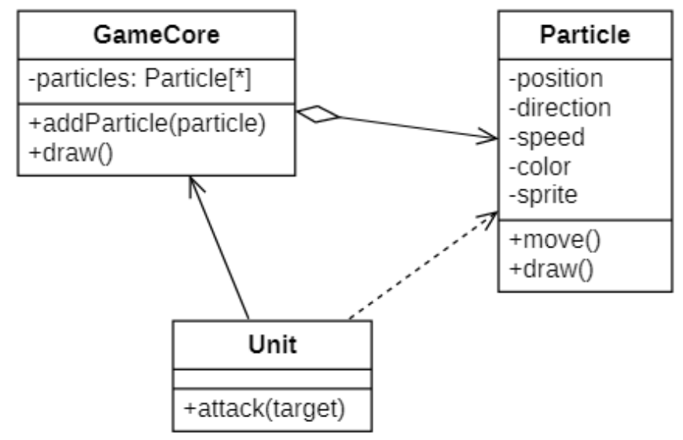
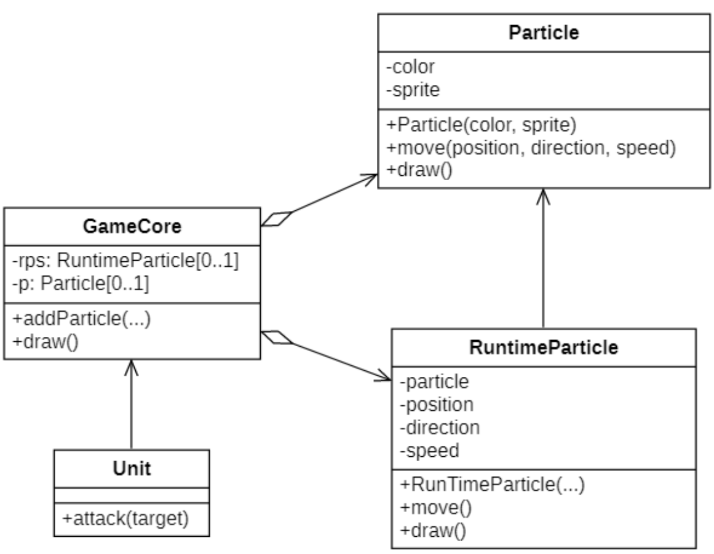
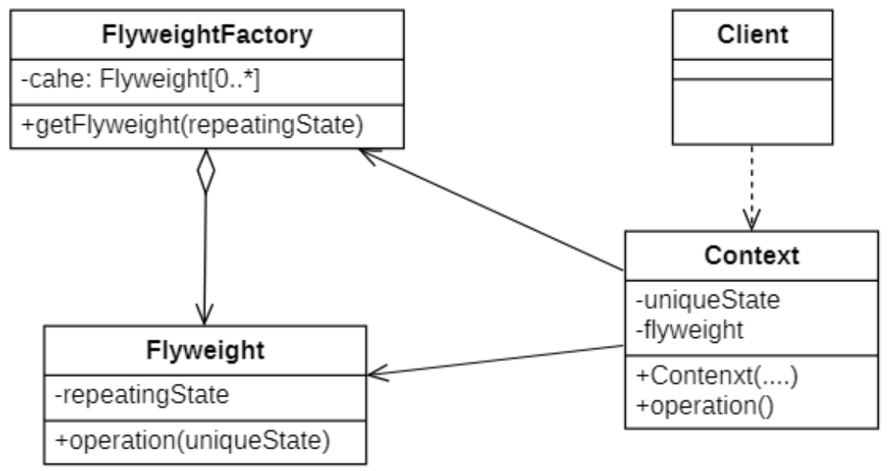
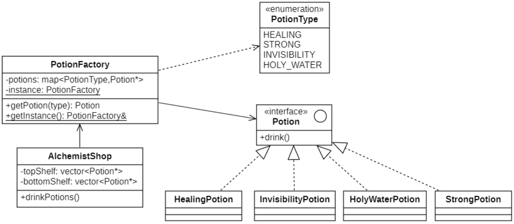
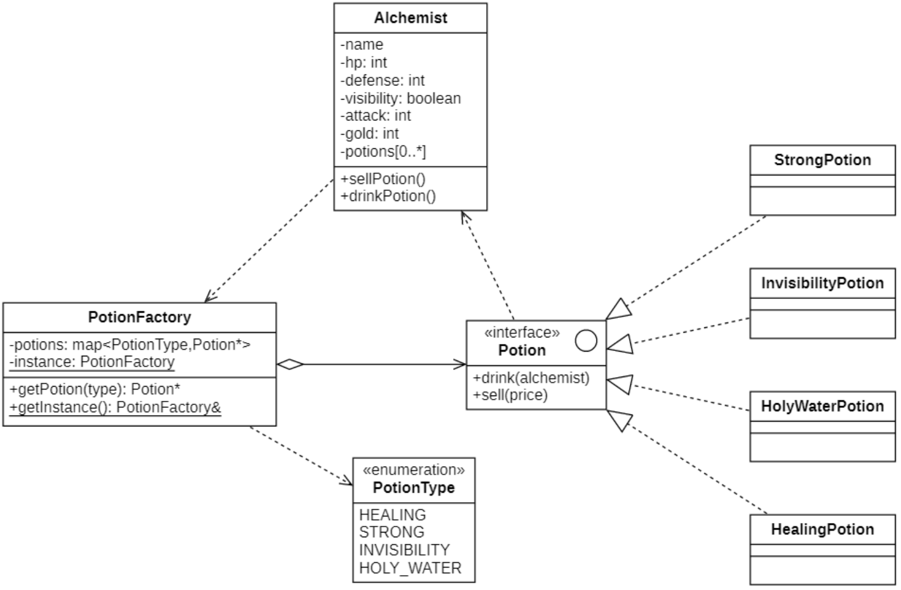
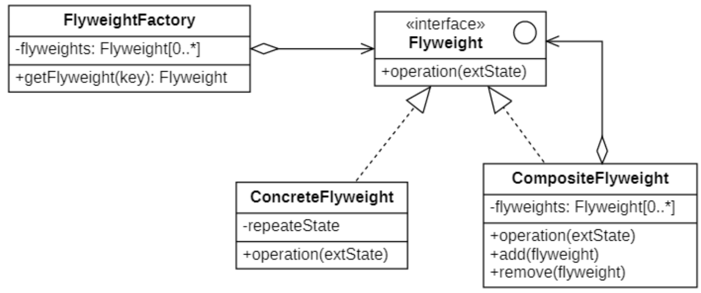

# 享元模式
## 概念
### 定义
当一个软件系统在运行时产生的对象数量太多，将导致运行代价过高，带来系统性能下降等问题。**享元模式(Flyweight Pattern)** 是一种解决方案，它通过共享技术实现相同或相似的细粒度的对象复用，从而节约内存空间，提高系统性能。

其定义如下：

> `Wikipedia says`: A flyweight is an object that minimizes memory use by sharing as much data as possible with other similar objects; it is a way to use objects in large numbers when a simple repeated representation would use an unacceptable amount of memory.
>
> 享元是一种通过与其他类似对象共享尽可能多的数据来最小化内存使用的对象；当简单的重复表示将使用不可接受的内存量时，这是一种使用大量对象的方法。
>
> Use sharing to support large numbers of fine-grained objects efficiently.
>
> 使用共享可以有效地支持大量细粒度对象。

### 举例说明
比如有如下 一个粒子系统

| ##container## |
|:--:|
||

在游戏运转的时候，战斗单位不断的产生粒子，会导致内存占用持续增加，因为一个粒子里面包好了非常占用内存的精灵图片，而不巧的是每个相同类型的粒子里面使用精灵图片是相同的，导致相同的资源重复占用内存资源，为了解决这个问题可以使用享元模式来解决。

通过观察Particle对象我们可以发现颜色和精灵是在同一个粒子对象里面都是一样的，对这些不变的量我们可以称之为**内在状态**，对于坐标、方向、速度这些在外部进行变动的我们称之为**外在状态**。

| ##container## |
|:--:|
||

从粒子类中抽出外在状态， 那么我们只需三个不同的对象 （子弹、导弹和弹片） 就能表示游戏中的所有粒子。

我们将这样一个**仅存储内在状态的对象**称为**享元**。

### 享元与不可变性
由于享元对象可在不同的情景中使用，你必须确保其状态不能被修改。享元类的状态只能由构造函数的参数进行一次性初始化，它不能对其他对象公开其设置器或公有成员变量。

### 享元工厂
为了能更方便地访问各种享元，你可以创建一个工厂方法来管理已有享元对象的缓存池。工厂方法从客户端处接收目标享元对象的内在状态作为参数， 如果它能在缓存池中找到所需享元，则将其返回给客户端；如果没有找到，它就会新建一个享元，并将其添加到缓存池中。

## 享元模式的结构
| ##container## |
|:--:|
||

在享元模式结构图中包含如下几个角色：
- **Flyweight (享元)**： 类包含原始对象中部分能在多个对象中共享的状态。同一享元对象可在许多不同情景中使用。享元中存储的状态被称为“内在状态”。传递给享元方法的状态被称为 “外在状态”。
- **Flyweight Factory (享元工厂)**： 会对已有享元的缓存池进行管理。有了工厂后，客户端就无需直接创建享元，它们只需调用工厂并向其传递目标享元的一些内在状态即可。工厂会根据参数在之前已创建的享元中进行查找，如果找到满足条件的享元就将其返回；如果没有找到就根据参数新建享元。
- **Context (情景)**： 类包含原始对象中各不相同的外在状态。情景与享元对象组合在一起就能表示原始对象的全部状态。
- **Client (客户端)**： 负责计算或存储享元的外在状态。在客户端看来，享元是一种可在运行时进行配置的模板对象，具体的配置方式为向其方法中传入一些情景数据参数。

## 享元模式的实现
### 无外在状态
#### 类图
| ##container## |
|:--:|
||

解释: 一个商店出售药水`Potion`, 药水有不同的种类, 也有不同的数量, 假如我们对每一格的药水都附上自己的图片, 显然有些是重复的, 所以我们可以共享相同的药水的材质

#### 代码实现
药水抽象类
```C++
#ifndef _POTION_H_
#define _POTION_H_

namespace fw
{
    enum class PotionType { HEALING, STRONG, INVISIBLITY, HOLY_WATER };
    class Potion
    {
    public:
        virtual void drink() = 0;
    };
}

#endif // !_POTION_H_
```

具体药水类(节选)

```C++
#ifndef _STRONGPOTION_H_
#define _STRONGPOTION_H_

namespace fw
{
    class StrongPotion : public Potion
    {
    public:
        void drink() override
        {
            cout << "你喝了强化药水(" << this << ")，身体防御力更强了！！！" << endl;
        }
    };
}

#endif // !_STRONGPOTION_H_
```

享元类: 只存放每种药水的一个实例, 可以复用; 初始化由自身控制

```C++
#ifndef _POTIONFACTORY_H_
#define _POTIONFACTORY_H_

namespace fw
{
    class PotionFactory
    {
        DECLARE_INSTANCE(PotionFactory);
    private:
        std::map<PotionType, Potion*> potions;
    public:
        ~PotionFactory() {
            auto iter = potions.begin();
            while (iter != potions.end())
            {
                delete iter->second;
                iter++;
            }
        }
        Potion* getPotion(PotionType type) {
            // 看缓存池里面是否存在药瓶
            auto iter = potions.find(type);
            if (iter != potions.end())
            {
                return iter->second;
            }
            // 创建药瓶并缓存
            Potion* one = nullptr;
            switch (type)
            {
            case fw::PotionType::HEALING:
                one = new HealingPotion;
                break;
            case fw::PotionType::STRONG:
                one = new StrongPotion;
                break;
            case fw::PotionType::INVISIBLITY:
                one = new InvisiblityPotion;
                break;
            case fw::PotionType::HOLY_WATER:
                one = new HolyWaterPotion;
                break;
            default:
                break;
            }
            if (one)
                potions.insert(make_pair(type, one));
            return one;
        }
    };
}

#endif // !_POTIONFACTORY_H_
```

药水商店类, 负责展示药水
```C++
#ifndef _ALCHEMISTSHOP_H_
#define _ALCHEMISTSHOP_H_

namespace fw
{
    class AlchemistShop
    {
    private:
        vector<Potion*> top;
        vector<Potion*> bot;
    public:
        AlchemistShop() {
            auto& factory = PotionFactory::getInstance();
            top.emplace_back(factory.getPotion(PotionType::INVISIBLITY));
            top.emplace_back(factory.getPotion(PotionType::HOLY_WATER));
            top.emplace_back(factory.getPotion(PotionType::INVISIBLITY));
            top.emplace_back(factory.getPotion(PotionType::INVISIBLITY));
            top.emplace_back(factory.getPotion(PotionType::HOLY_WATER));
            top.emplace_back(factory.getPotion(PotionType::HOLY_WATER));

            bot.emplace_back(factory.getPotion(PotionType::HEALING));
            bot.emplace_back(factory.getPotion(PotionType::STRONG));
            bot.emplace_back(factory.getPotion(PotionType::HEALING));
            bot.emplace_back(factory.getPotion(PotionType::HEALING));
            bot.emplace_back(factory.getPotion(PotionType::STRONG));
        }
        void drinkPotions() {
            cout << "顶层货架" << endl;
            for (auto one : top)
                one->drink();
            cout << "底层货架" << endl;
            for (auto one : bot)
                one->drink();
        }
    };
}

#endif // !_ALCHEMISTSHOP_H_
```

客户端

```C++
int main()
{
    // 创建商店
    fw::AlchemistShop shop;
    shop.drinkPotions();
    return 0;
}
```

当然, 上面只做到了材质/图片的共享; 但数值呢? 可以粗略见下:

### 有外在状态
#### 类图

| ##container## |
|:--:|
||

#### 代码实现
抽象药水类

```C++
#ifndef _POTION_H_
#define _POTION_H_

namespace fw
{
    class Alchemist;
    enum class PotionType { HEALING, STRONG, INVISIBLITY, HOLY_WATER };
    class Potion
    {
    public:
        virtual void drink(Alchemist* alch) = 0;
        virtual void sell(int price) = 0;
    };
}

#endif // !_POTION_H_
```

具体药水类

```C++
// .h
#ifndef _STRONGPOTION_H_
#define _STRONGPOTION_H_

namespace fw
{
    class StrongPotion : public Potion
    {
    public:
        void drink(Alchemist* alch) override;
        void sell(int price) override;
    };
}

#endif // !_STRONGPOTION_H_

// .cpp
void fw::StrongPotion::drink(Alchemist* alch)
{
    // 增加防御力
    int addval = 20;
    alch->setDefense(alch->getDefense() + addval);
    cout << "你喝了强化药水(" << this << ")，获得了" << addval << "点防御力" << endl;
}

void fw::StrongPotion::sell(int price)
{
    cout << "你出售了强化药水(" << this << ")，获得" << price << "点金币" << endl;
}
```

药水享元类
```C++
#ifndef _POTIONFACTORY_H_
#define _POTIONFACTORY_H_

namespace fw
{
    class PotionFactory
    {
        DECLARE_INSTANCE(PotionFactory);
    private:
        std::map<PotionType, Potion*> potions;
    public:
        ~PotionFactory() {
            auto iter = potions.begin();
            while (iter != potions.end())
            {
                delete iter->second;
                iter++;
            }
        }
        Potion* getPotion(PotionType type) {
            // 看缓存池里面是否存在药瓶
            auto iter = potions.find(type);
            if (iter != potions.end())
            {
                return iter->second;
            }
            // 创建药瓶并缓存
            Potion* one = nullptr;
            switch (type)
            {
            case fw::PotionType::HEALING:
                one = new HealingPotion;
                break;
            case fw::PotionType::STRONG:
                one = new StrongPotion;
                break;
            case fw::PotionType::INVISIBLITY:
                one = new InvisiblityPotion;
                break;
            case fw::PotionType::HOLY_WATER:
                one = new HolyWaterPotion;
                break;
            default:
                break;
            }
            if (one)
                potions.insert(make_pair(type, one));
            return one;
        }
    };
}

#endif // !_POTIONFACTORY_H_
```

精灵商人类 ~~(回复术士)~~

```C++
#ifndef _ALCHEMIST_H_
#define _ALCHEMIST_H_

namespace fw
{
    class Alchemist
    {
        CC_SYNTHESIZE(std::string, name, Name);
        CC_SYNTHESIZE(int, hp, Hp);
        CC_SYNTHESIZE(int, defense, Defense);
        CC_SYNTHESIZE(int, attack, Attack);
        CC_SYNTHESIZE(bool, visibility, Visibility);
        CC_SYNTHESIZE(int, gold, Gold);
    private:
        std::vector<Potion*> potions;
    public:
        Alchemist() {
            this->hp = 100;
            this->defense = 10;
            this->attack = 5;
            this->visibility = true;
            this->gold = 0;
            // 初始化一些药水
            auto& factory = PotionFactory::getInstance();
            potions.emplace_back(factory.getPotion(PotionType::STRONG));
            potions.emplace_back(factory.getPotion(PotionType::HEALING));
            potions.emplace_back(factory.getPotion(PotionType::HOLY_WATER));
            potions.emplace_back(factory.getPotion(PotionType::INVISIBLITY));
            potions.emplace_back(factory.getPotion(PotionType::STRONG));
            potions.emplace_back(factory.getPotion(PotionType::HEALING));
            potions.emplace_back(factory.getPotion(PotionType::HOLY_WATER));
            potions.emplace_back(factory.getPotion(PotionType::HOLY_WATER));
            potions.emplace_back(factory.getPotion(PotionType::INVISIBLITY));
        }
        void drinkPotions() {
            // 喝掉5瓶药水
            for (int i = 0; i < 5; i++)
            {
                auto iter = potions.begin();
                (*iter)->drink(this);
                potions.erase(iter);
            }
        }
        void sellPotions() {
            RandomUtil rand;
            for (auto potion : potions)
            {
                int price = rand.randInt(120, 150);
                potion->sell(price);
                this->gold += price;
            }
        }
        void print() {
            cout
                << name << "人物信息如下" << endl
                << "生命值：" << hp << endl
                << "防御力：" << defense << endl
                << "攻击力：" << attack << endl
                << "状  态：" << (visibility ? "正常" : "隐身") << endl
                << "金  币：" << gold << endl;
        }
    };
}

#endif // !_ALCHEMIST_H_
```

客户端

```C++
int main()
{
    // 创建精灵商人
    fw::Alchemist alch;
    alch.setName("图灵机");
    // 显示商人的信息
    alch.print();
    alch.drinkPotions();
    alch.sellPotions();
    // 显示商人的信息
    alch.print();
    return 0;
}
```

*感觉这个只是把药水数值作为内在状态, 然后和外在状态如hp等进行关联*

## 单纯享元与复合享元
标准的享元模式中既包含可以共享的具体享元类，也包含不可以共享的非共享具体享元类。

### 单纯享元模式
在单纯享元模式中，所有的具体享元类都是可以共享的，不存在非共享具体享元类。

### 复合享元模式
将一些单纯享元对象使用组合模式加以组合，还可以形成复合享元对象，这样的复合享元对象本身不能共享，但是它们可以分解成单纯享元对象，而后者则可以共享。

| ##container## |
|:--:|
||

通过复合享元模式，可以确保复合享元类`CompositeFlyweight`中所包含的每个单纯享元类`ConcreteFlyweight`都具有相同的外在状态，而这些单纯享元的内在状态往往可以不同。如果希望为多个内在状态不同的享元对象设置相同的外在状态，可以考虑使用复合享元模式。

### 与其他模式联用
通过前面的学习我们不难发现：
- 在享元模式的享元工厂类中通常提供一个静态的工厂方法用于返回享元对象，使用`简单工厂模式`来生成享元对象。
- 在一个系统中，通常只有唯一一个享元工厂，因此可以使用`单例模式`进行享元工厂类的设计。
- 享元模式可以结合`组合模式`形成复合享元模式，统一对多个享元对象设置外在状态。

## 享元模式适用环境
### 主要优点
- 如果程序中有很多相似对象， 那么你将可以节省大量内存。
- 享元模式的外在状态相对独立，而且不会影响其内在状态，从而使得享元对象可以在不同的环境中被共享。

### 主要缺点
- 享元模式使得系统变得复杂，需要分离出内在状态和外在状态，这使得程序的逻辑复杂化。
- 为了使对象可以共享，享元模式需要将享元对象的部分状态外部化，而读取外部状态将使得运行时间变长。

### 适用场景
- 一个系统有大量相同或者相似的对象，造成内存的大量耗费。
- 对象的大部分状态都可以外部化，可以将这些外部状态传入对象中。
- 在使用享元模式时需要维护一个存储享元对象的享元池，而这需要耗费一定的系统资源，因此，应当在需要多次重复使用享元对象时才值得使用享元模式。