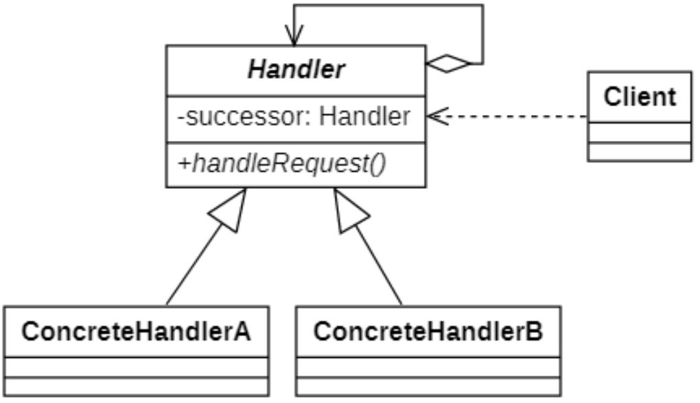
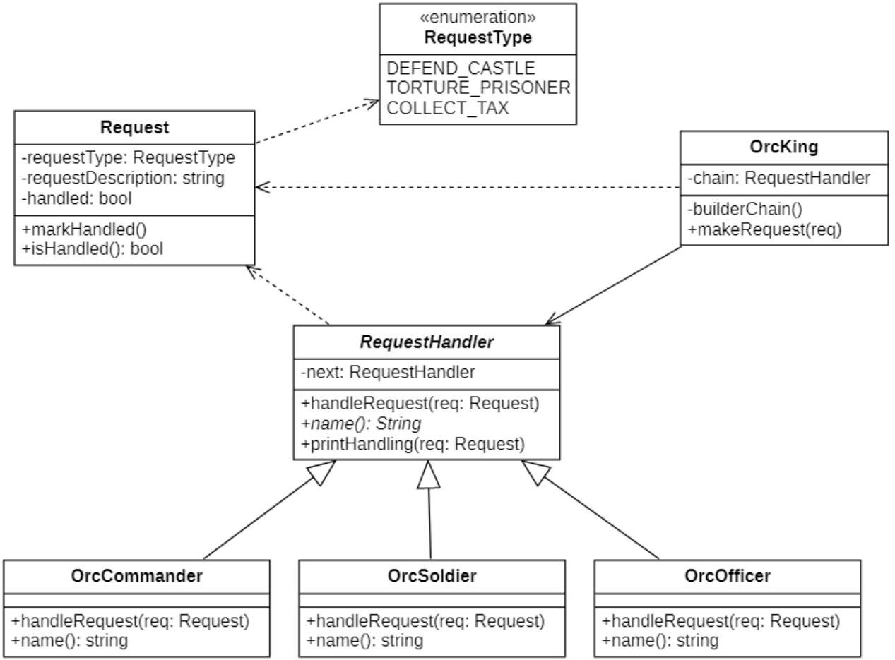

行为模式关注系统中对象之间的交互，研究系统在运行时对象之间的相互通信与协作，进一步明确对象的职责。

# 责任链模式
## 概念
在很多情况下处理某个请求的对象不止一个，例如大学里的奖学金审批，学长在向辅导员提交审批表之后首先是辅导员签字审批，然后交给系主任审批签字，接着院长审批，最后可能是校长来审批，在这个过程中奖学金申请表可以看出一个请求对象，而不同级别的审批者都可以处理该请求对象，除了辅导员外，学生不需要一一与其他审批者交互，等待结果即可。在审批过程中如果有一个审批者认为不符合，则请求终止；否则继续传递给下一个审批者，直到最后一个审批者来确定是否授予奖学金。

这一个过程构成了处理申请表的链式结构，申请表沿着这条链进行传递，这条链我们可以称为职责链。

职责链可以是直线型、环形也可以是树形结构，最常见的链式直线型。

**职责链模式(Chain of Responsibility Pattern)** 定义如下:

> `Wikipedia says`: the chain-of-responsibility pattern is a design pattern consisting of a source of command objects and a series of processing objects. Each processing object contains logic that defines the types of command objects that it can handle; the rest are passed to the next processing object in the chain.
>
> 责任链模式是一种设计模式，由一个命令对象源和一系列处理对象组成。每个处理对象都包含定义它可以处理的命令对象类型的逻辑；其余的被传递给链中的下一个处理对象。
>
> Avoid coupling the sender of a request to its receiver by giving more than one object a chance to handle the request. Chain the receiving objects and pass the request along the chain until an object handles it.
> 
> 避免一个请求对象的发送者与接收者耦合在一起，让多个对象都有机会处理请求。将接收请求的对象连接成一个链，并且沿着这条链传递请求，直到有一个对象能够处理它为止。

**你也可以将它翻译为责任链模式.**

## 职责链模式的结构
| ##container## |
|:--:|
||

在职责链模式结构图中包含如下几个角色：

- `Handler（抽象处理者）`：它**定义了一个处理请求的接口，一般设计为抽象类**，由于不同的具体处理者处理请求的方式不同，因此在其中定义了抽象请求处理方法。因为每一个处理者的下家还是一个处理者，因此在抽象处理者中定义了一个抽象处理者类型的对象（如结构图中的successor），作为其对下家的引用。通过该引用，处理者可以连成一条链。

- `ConcreteHandler（具体处理者）`：它是抽象处理者的子类，可以处理用户请求，在具体处理者类中实现了抽象处理者中定义的抽象请求处理方法，在处理请求之前需要进行判断，看是否有相应的处理权限，如果可以处理请求就处理它，否则将请求转发给后继者；在具体处理者中可以访问链中下一个对象，以便请求的转发。

在职责链模式里，很多对象由每一个对象对其下家的引用而连接起来形成一条链。请求在这个链上传递，直到链上的某一个对象决定处理此请求。发出这个请求的客户端并不知道链上的哪一个对象最终处理这个请求，这使得系统可以在不影响客户端的情况下动态地重新组织链和分配责任。

需要注意的是*职责链模式并不创建职责链，职责链的创建工作必须由系统的其他部分来完成，一般是在使用该职责链的客户端中创建职责链*。

## 职责链模式的实现
### 类图设计
| ##container## |
|:--:|
||

### 代码实现

抽象处理者
```C++
#ifndef _REQUESTHANDLER_H_
#define _REQUESTHANDLER_H_

namespace chain
{
    class RequestHandler
    {
    protected:
        std::shared_ptr<RequestHandler> next;
        virtual std::string name() = 0;
    public:
        RequestHandler() {
            next = nullptr;
        }
        void setNext(std::shared_ptr<RequestHandler> next) {
            this->next = next;
        }
        virtual void handleRequest(Request* req) {
            if (next)
            {
                next->handleRequest(req);
                return;
            }
            throw std::string("没有下一个执行者了，请检查是否发布错误命令");
        }
        virtual void printHandling(Request* req) {
            std::cout << name() << "，执行了" << req->getDescrip() << "命令" << std::endl;
        }
    };
}

#endif // !_REQUESTHANDLER_H_
```

具体处理者(节选)

```C++
#ifndef _ORCCOMMANDER_H_
#define _ORCCOMMANDER_H_

namespace chain
{
    class OrcCommander : public RequestHandler
    {
        
    protected:
        std::string name() override
        {
            return "兽人指挥官";
        }

    public:
        void handleRequest(Request* req) override
        {
            // 判断是否有权处理请求
            if (req->getType() == RequestType::DEFEND_CASTLE)
            {
                // 处理请求
                printHandling(req);
                return;
            }
            // 传递给下一个对象
            RequestHandler::handleRequest(req);
        }
    };
}

#endif // !_ORCCOMMANDER_H_
```

请求的封装
```C++
#ifndef _REQUEST_H_
#define _REQUEST_H_

namespace chain
{
    enum class RequestType{DEFEND_CASTLE,TORTURE_PRISONER,COLLECT_TAX,UNKNOWN};
    class Request
    {    // 提供get和set方法
        CC_SYNTHESIZE(RequestType, type, Type);
        CC_SYNTHESIZE(std::string, descrip, Descrip);
        CC_SYNTHESIZE(bool, handled, Handled);
    public:
        Request(RequestType type, std::string descrip) {
            this->type = type;
            this->descrip = descrip;
            this->handled = false;
        }
    };
}

#endif // !_REQUEST_H_
```

具体使用类 (构建职责链)

```C++
#ifndef _ORCKING_H_
#define _ORCKING_H_

namespace chain
{
    class OrcKing
    {
    private:
        // 职责链
        std::shared_ptr<RequestHandler> chain;
        void buildChain()
        {
            auto commander = new OrcCommander;
            auto officer = new OrcOffier;
            auto soldier = new OrcSoldier;
            commander->setNext(std::shared_ptr<RequestHandler>(officer));
            officer->setNext(std::shared_ptr<RequestHandler>(soldier));
            chain = std::shared_ptr<RequestHandler>(commander);
        }
    public:
        OrcKing() 
        {
            buildChain();
        }
        void makeCommand(Request* req) {
            chain->handleRequest(req);
        }
    };
}

#endif // !_ORCKING_H_
```

客户端使用

```C++
using namespace chain;
int main()
{
    Request req1(RequestType::COLLECT_TAX, "去收税");
    Request req2(RequestType::DEFEND_CASTLE, "斩杀来敌");
    Request req3(RequestType::TORTURE_PRISONER, "惩罚罪犯");
    OrcKing king;
    king.makeCommand(&req1);
    king.makeCommand(&req2);
    king.makeCommand(&req3);
  
    // 注意：这里违背纯职责链模式的，一个请求必须被某个handler处理的规则
    Request req4(RequestType::UNKNOWN, "半夜梦游去吃小龙虾");
    try {
        king.makeCommand(&req4);
    }
    catch (const std::string& msg) {
        std::cout << msg << std::endl;
    }
    return 0;
}
```

## 纯与不纯的职责链模式
职责链模式可以分为纯职责链模式和不存职责链模式两种.
### 纯的职责链模式
一个纯的职责链模式要求一个具体处理者对象只能在两个行为中选择一个：**要么承担全部责任，要么将责任推给下家，不允许出现某一个具体处理者对象在承担了一部分或全部责任后又将责任向下传递的情况**。

在纯的职责链模式中，要求**一个请求必须被某一个处理者对象所接收，不能出现某个请求未被任何一个处理者对象处理的情况**。在前面的实例中应用的是纯的职责链模式。

### 不纯的职责链模式
在一个不纯的职责链模式中**允许某个请求被一个具体处理者部分处理后再向下传递，或者一个具体处理者处理完某请求后其后继处理者可以继续处理该请求，而且一个请求可以最终不被任何处理者对象所接收**。

`Java AWT 1.0`中的事件处理模型应用的是不纯的职责链模式，其基本原理如下：

1. 由于窗口组件（如按钮、文本框等）一般都位于容器组件中，因此当事件发生在某一个组件上时，先通过**组件对象的`handleEvent()`方法将事件传递给相应的事件处理方法，该事件处理方法将处理此事件，然后决定是否将该事件向上一级容器组件传播**；
2. **上级容器组件在接到事件之后可以继续处理此事件并决定是否继续向上级容器组件传播**，如此反复，直到事件到达顶层容器组件为止；
3. **如果一直传到最顶层容器仍没有处理方法，则该事件不予处理**。

每一级组件在接收到事件时，都可以处理此事件，而不论此事件是否在上一级已得到处理，还存在事件未被处理的情况。显然，这就是不纯的职责链模式，早期的`Java AWT`事件模型(`JDK 1.0`及更早)中的这种事件处理机制又叫事件浮升(`Event Bubbling`)机制。从`Java.1.1`以后，JDK使用观察者模式代替职责链模式来处理事件。目前，在`JavaScript`中仍然可以使用这种事件浮升机制来进行事件处理（事件冒泡）。

## 职责链模式适用环境
职责链模式通过建立一条链来组织请求的处理者，请求将沿着链进行传递，请求发送者无须知道请求在何时、何处以及如何被处理，实现了请求发送者与处理者的解耦。在软件开发中，如果遇到有多个对象可以处理同一请求时可以应用职责链模式，例如在Web应用开发中创建一个过滤器(Filter)链来对请求数据进行过滤，在工作流系统中实现公文的分级审批等等，使用职责链模式可以较好地解决此类问题。

### 主要优点
- 职责链模式使得**一个对象无须知道是其他哪一个对象处理其请求，对象仅需知道该请求会被处理即可**，接收者和发送者都没有对方的明确信息，**且链中的对象不需要知道链的结构，由客户端负责链的创建，降低了系统的耦合度**。

- 请求处理对象仅需维持一个指向其后继者的引用，而不需要维持它对所有的候选处理者的引用，**可简化对象的相互连接**。

- 在给对象分派职责时，职责链可以给我们**更多的灵活性**，可以通过**在运行时对该链进行动态的增加或修改来增加或改变处理一个请求的职责**。

- 在系统中增加一个**新的具体请求处理者时无须修改原有系统的代码，只需要在客户端重新建链即可，从这一点来看是符合“开闭原则”的**。

### 主要缺点
- 由于一个请求没有明确的接收者，那么就**不能保证它一定会被处理**，该请求可能一直到链的末端都得不到处理；一个请求也可能因职责链没有被正确配置而得不到处理。

- 对于比较长的职责链，请求的处理可能涉及到多个处理对象，系统性能将受到一定影响，而且在进行代码调试时不太方便。

- 如果建链不当，可能会造成循环调用，将导致系统陷入死循环。

### 适用场景
- 有多个对象可以处理同一个请求，具体哪个对象处理该请求待运行时刻再确定，客户端只需将请求提交到链上，而无须关心请求的处理对象是谁以及它是如何处理的。

- 在不明确指定接收者的情况下，向多个对象中的一个提交一个请求。

- 可动态指定一组对象处理请求，客户端可以动态创建职责链来处理请求，还可以改变链中处理者之间的先后次序。