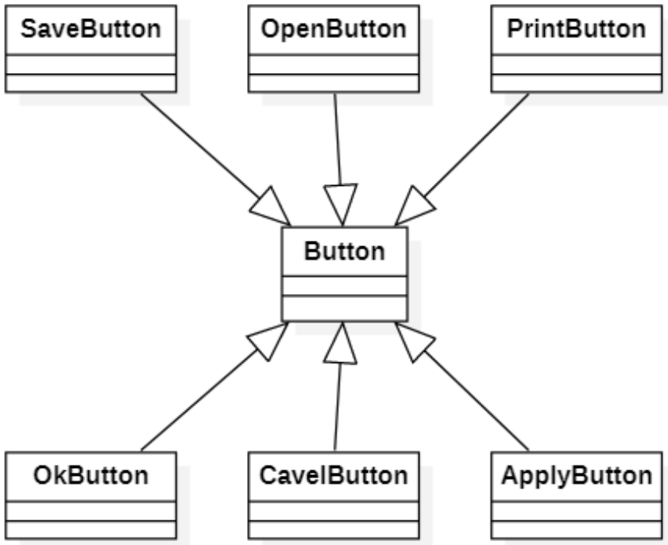
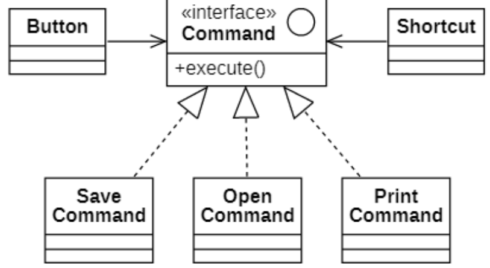
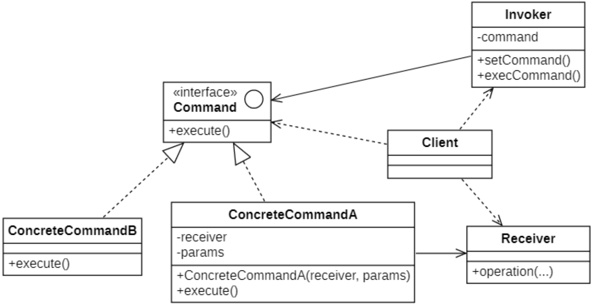
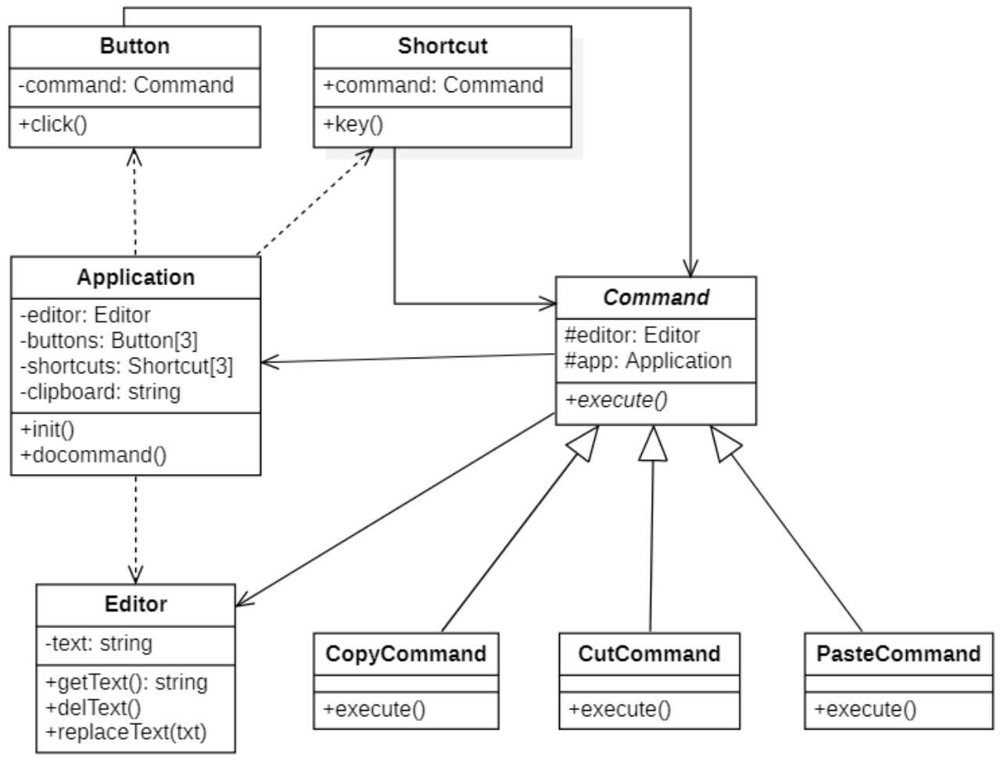
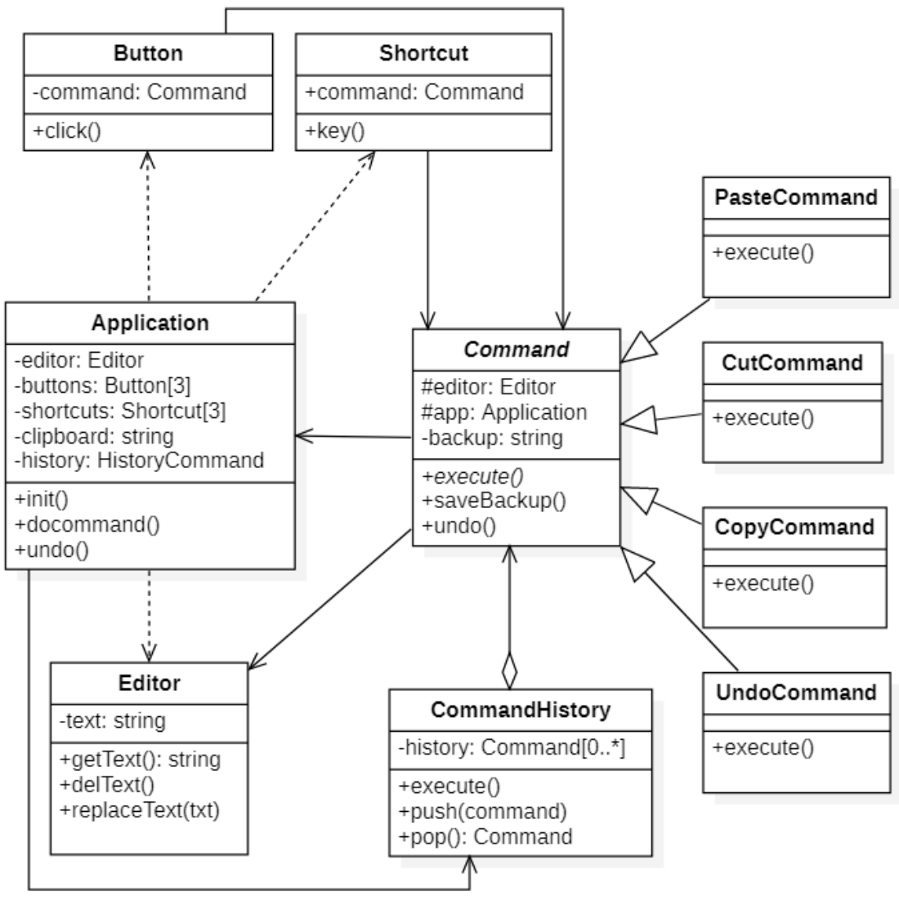

# 命令模式
## 概念
### 定义
在软件开发中，我们经常需要向某些对象发送请求（调用其中的某个或某些方法），但是并不知道请求的接收者是谁，也不知道被请求的操作是哪个，此时，我们特别希望能够以一种松耦合的方式来设计软件，**使得请求发送者与请求接收者能够消除彼此之间的耦合，让对象之间的调用关系更加灵活，可以灵活地指定请求接收者以及被请求的操作**。**命令模式(Command Pattern)** 为此类问题提供了一个较为完美的解
决方案。

其定义如下:

> `Wikipedia says`: The command pattern is a behavioral design pattern in which an object is used to encapsulate all information needed to perform an action or trigger an event at a later time.
>
> 命令模式是一种行为设计模式，其中对象用于封装执行操作或稍后触发事件所需的所有信息。
>
> Encapsulate a request as an object, thereby letting you parameterize clients with different requests, queue or log requests, and support `undoable` operations.
> 
> 将一个请求封装为一个对象，从而让我们可用不同的请求对客户进行参数化，对请求排队或者记录请求日志，以及支持可撤销的操作。

**命令模式**的别名为**动作(Action)模式**或**事务(Transaction)模式**.

### 举例说明
假如你正在开发一款新的文字编辑器，当前的任务是创建一个包含多个按钮的工具栏，并让每个按钮对应编辑器的不同操作。你创建了一个非常简洁的`按钮类`，它不仅可用于生成工具栏上的按钮，还可用于生成各种对话框的通用按钮。

尽管所有按钮看上去都很相似，但它们可以完成不同的操作（打开、保存、打印和应用等）。你可能使用继承去处理具体的按钮操作逻辑。
| ##container## |
|:--:|
||

这种方式有严重缺陷。首先，你创建了大量的子类，当每次修改基类`按钮`时，你都有可能需要修改所有子类的代码。再次，可能会存在多个类实现同一个功能的现象（如：保存按钮、保存菜单项按钮，保存快捷键等等），需要复制大量的代码。

怎么解决呢？那就是将GUI和业务逻辑功能剥离开来，通过传递数据参数完成交互。

命令模式建议 GUI 对象不直接提交这些请求。你应该将请求的所有细节（例如调用的对象、 方法名称和参数列表）抽取出来组成命令类，该类中仅包含一个用于触发请求的方法。

命令对象负责连接不同的 GUI 和业务逻辑对象。此后，GUI 对象无需了解业务逻辑对象是否获得了请求，也无需了解其对请求进行处理的方式。GUI 对象触发命令即可，命令对象会自行处理所有细节工作。如下面的设计方式。

| ##container## |
|:--:|
||

应用命令模式后，我们不再需要任何按钮子类来实现点击行为。我们只需在`按钮Button`基类中添加一个成员变量来存储对于命令对象的引用，并在点击后执行该命令即可。

## 命令模式的结构
| ##container## |
|:--:|
||

在命令模式结构图中包含如下几个角色：
- **Command（抽象命令类）**：抽象命令类一般是一个抽象类或接口，在其中声明了用于执行请求的`execute()`等方法，通过这些方法可以调用请求接收者的相关操作。

- **ConcreteCommand（具体命令类）**：具体命令类是抽象命令类的子类，实现了在抽象命令类中声明的方法，它对应具体的接收者对象，将接收者对象的动作绑定其中。在实现`execute()`方法时，将调用接收者对象的相关操作(Action)。

- **Invoker（调用者）**：调用者即请求发送者，它通过命令对象来执行请求。一个调用者并不需要在设计时确定其接收者，因此它只与抽象命令类之间存在关联关系。在程序运行时可以将一具体命令对象注入其中，再调用具体命令对象的`execute()`方法，从而实现间接调用请求接收者的相关操作。

- **Receiver（接收者）**：接收者执行与请求相关的操作，它具体实现对请求的业务处理。

## 命令模式的实现
### 类图设计
实现一个文本框, 可以复制内容/剪切内容/粘贴内容
| ##container## |
|:--:|
||

### 代码实现
抽象命令类

```C++
#ifndef _COMMAND_H_
#define _COMMAND_H_

namespace cmd
{
    class Editor;
    class Application;
    class Command {
    protected:
        Editor* editor;
        Application* app;
    public:
        virtual void execute() = 0;
        Command(Editor* editor, Application* app) {
            this->app = app;
            this->editor = editor;
        }
    };
}

#endif // !_COMMAND_H_
```

具体命令实现 (节选)

```C++
// .h
#ifndef _COPYCMD_H_
#define _COPYCMD_H_

namespace cmd
{
    class CopyCmd: public Command
    {
    public:
        CopyCmd(Editor* editor, Application* app);
        void execute() override;
    };
}

#endif // !_COPYCMD_H_

// .cpp
#include "CopyCmd.h"
#include "../Application.h"

cmd::CopyCmd::CopyCmd(Editor* editor, Application* app) : Command(editor, app)
{

}

void cmd::CopyCmd::execute()
{
    app->setClipboard(editor->getText());
}
```

控件类 (节选)

```C++
#ifndef _BUTTON_H_
#define _BUTTON_H_

namespace cmd
{
    class Button
    {
    private:
        Command* command;
    public:
        Button() {
            this->setCommand(nullptr);
        }
        Button(Command* command) {
            this->setCommand(command);
            // 初始化显示样式
        }
        ~Button() {
            if (command)
            {
                delete command;
                command = nullptr;
            }
        }
        void click() {
            getCommand()->execute();
        }
        Command* getCommand() const { return command; }
        void setCommand(Command* val) { command = val; }
    };
}

#endif // !_BUTTON_H_
```

具体应用 (界面类)

```C++
// .h
#ifndef _APPLICATION_H_
#define _APPLICATION_H_

namespace cmd
{
    class Application
    {
        CC_SYNTHESIZE(std::string, clipboard, Clipboard);
    private:
        // 文本框
        Editor* editor;
        // 功能按钮
        Button* btnCopy;
        Button* btnCut;
        Button* btnPaste;
        // 快捷键
        ShortCut* keyCopy;
        ShortCut* keyCut;
        ShortCut* keyPaste;
        // 界面初始化
        void init();
        // 界面刷新显示
        void refreshShow();
    public:
        Application();
        ~Application();
        void doCmd();
    };
}

#endif // !_APPLICATION_H_

// .cpp
#include "Application.h"
#include "command/CopyCmd.h"
#include "command/CutCmd.h"
#include "command/PasteCmd.h"
#include <iostream>

void cmd::Application::init()
{
    this->editor = new Editor;
    this->editor->replaceText("我是张三");

    this->btnCopy = new Button(new CopyCmd(editor, this));
    this->btnCut = new Button(new CutCmd(editor, this));
    this->btnPaste = new Button(new PasteCmd(editor, this));

    this->keyCopy = new ShortCut(new CopyCmd(editor, this));
    this->keyCut = new ShortCut(new CutCmd(editor, this));
    this->keyPaste = new ShortCut(new PasteCmd(editor, this));

    this->clipboard = "";
}

void cmd::Application::refreshShow()
{
    std::cout << "====================================================" << std::endl;
    std::cout << "文本框内容：" << editor->getText() << std::endl;
    std::cout << "剪切板内容：" << this->clipboard << std::endl;
    std::cout << "====================================================" << std::endl;
}

cmd::Application::Application()
{
    init();
}

cmd::Application::~Application()
{
    delete editor;
    delete btnCopy;
    delete btnCut;
    delete btnPaste;
    delete keyCopy;
    delete keyCut;
    delete keyPaste;
}

void cmd::Application::doCmd()
{
    // 模拟界面上面的操作
    refreshShow();
    // 使用剪切快捷键
    this->keyCut->key();
    refreshShow();
    // 使用粘贴按钮
    this->btnPaste->click();
    refreshShow();
    // 修改文本框内容
    this->editor->replaceText("我修改了内容");
    refreshShow();
    // 再用按钮复制一下
    this->btnCopy->click();
    refreshShow();
}
```

客户端使用

```C++
int main()
{
    cmd::Application app;
    app.doCmd();
    return 0;
}
```

## 命令队列
有时候我们需要**将多个请求排队，当一个请求发送者发送一个请求时，将不止一个请求接收者产生响应，这些请求接收者将逐个执行业务方法，完成对请求的处理**。此时，我们可以通过命令队列来实现。

命令队列的实现方法有多种形式，其中最常用、灵活性最好的一种方式是增加一个`CommandQueue`类，由该类来负责存储多个命令对象，而不同的命令对象可以对应不同的请求接收者，`CommandQueue`类的典型代码如下所示:

```C++
class CommandQueue
{
private:
    vector<Command*> commands;
public:
    void addCommand(Command* command) {
        commands.push_back(command);
    }
    void removeCommand(Command* command) {
        auto iter = std::find(commands.begin(), commands.end(), command);
        if (iter != commands.end()) {
            commands.erase(iter);
        }
    }
    void execute() {
        for (Command* command : commands)
            command->execute();
    }
}
```

`Invoker`(调用者)将针对`CommandQueue`编程

```C++
class Invoker
{
private:
    // 维持一个CommandQueue对象的引用
    CommandQueue* commandQueue;
public:
    Invoker(CommandQueue* commandQueue) {
        this->commandQueue = commandQueue;
    }
    // 调用CommandQueue类的execute()方法
    void call() {
        commandQueue->execute();
    }
};
```

## 撤销实现
### 类图设计
| ##container## |
|:--:|
||

### 代码实现
命令抽象类

```C++
// .h
#ifndef _COMMAND_H_
#define _COMMAND_H_

namespace cmd
{
    class Editor;
    class Application;
    class Command
    {
    protected:
        Editor* editor;
        Application* app;
        std::string backup;
    public:
        virtual void execute() = 0;
        virtual Command* clone();
        void saveBak();
        void undo();
        Command(Editor* editor, Application* app);
    };
}

#endif // !_COMMAND_H_

// .cpp
#include "Command.h"
#include "Application.h"

cmd::Command* cmd::Command::clone()
{
    return nullptr;
}

void cmd::Command::saveBak()
{
    this->backup = this->editor->getText();
}

void cmd::Command::undo()
{
    this->editor->replaceText(backup);
}

cmd::Command::Command(Editor* editor, Application* app)
{
    this->app = app;
    this->editor = editor;
    this->backup = "";
}
```

具体命令(撤销功能)类实现 (节选)

```C++
// .h
#ifndef _UNDOCMD_H_
#define _UNDOCMD_H_

namespace cmd
{
    class UndoCmd : public Command
    {
    public:
        UndoCmd(Editor* editor, Application* app);
        void execute() override;
        Command* clone() override;
    };
}

#endif // !_UNDOCMD_H_

// .cpp
#include "UndoCmd.h"
#include "../Application.h"

cmd::UndoCmd::UndoCmd(Editor* editor, Application* app) : Command(editor, app)
{

}

void cmd::UndoCmd::execute()
{
    app->undo();
}

cmd::Command* cmd::UndoCmd::clone()
{
    return new UndoCmd(*this);
}
```

命令队列类实现(记录)

```C++
#ifndef _CMDHISTORY_H_
#define _CMDHISTORY_H_

namespace cmd
{
    class CmdHistory
    {
    private:
        std::stack<Command*> history;
        std::vector<Command*> pops;
    public:
        void push(Command* cmd) {
            history.push(cmd->clone());
        }
        Command* pop() {
            if (history.empty())
            {
                return nullptr;
            }
            auto cmd = history.top();
            history.pop();
            pops.push_back(cmd);
            return cmd;
        }
        ~CmdHistory() {
            // 释放历史命令
            while (!history.empty())
            {
                auto one =  history.top();
                history.pop();
                delete one;
            }
            // 释放弹出命令
            for (auto one : pops)
            {
                delete one;
            }
            pops.clear();
        }
    };
}

#endif // !_CMDHISTORY_H_
```

控件类实现同上 (略)

界面类实现

```C++
// .h
#ifndef _APPLICATION_H_
#define _APPLICATION_H_

namespace cmd
{
    class Application
    {
        CC_SYNTHESIZE(std::string, clipboard, Clipboard);
    private:
        // 文本框
        Editor* editor;
        // 功能按钮
        Button* btnCopy;
        Button* btnCut;
        Button* btnPaste;
        // 快捷键
        ShortCut* keyCopy;
        ShortCut* keyCut;
        ShortCut* keyPaste;
        ShortCut* keyUndo;
        // 界面初始化
        void init();
        // 界面刷新显示
        void refreshShow();
        // 历史操作命令
        CmdHistory history;
    public:
        Application();
        ~Application();
        void doCmd();
        void undo();
    };
}

#endif // !_APPLICATION_H_

// .cpp
#include "Application.h"
#include "command/CopyCmd.h"
#include "command/CutCmd.h"
#include "command/PasteCmd.h"
#include <iostream>
#include "command/UndoCmd.h"

void cmd::Application::init()
{
    this->editor = new Editor;
    this->editor->replaceText("我是张三");

    this->btnCopy = new Button(new CopyCmd(editor, this));
    this->btnCut = new Button(new CutCmd(editor, this));
    this->btnPaste = new Button(new PasteCmd(editor, this));

    this->keyCopy = new ShortCut(new CopyCmd(editor, this));
    this->keyCut = new ShortCut(new CutCmd(editor, this));
    this->keyPaste = new ShortCut(new PasteCmd(editor, this));
    this->keyUndo = new ShortCut(new UndoCmd(editor, this));

    this->clipboard = "";
}

void cmd::Application::refreshShow()
{
    std::cout << "====================================================" << std::endl;
    std::cout << "文本框内容：" << editor->getText() << std::endl;
    std::cout << "剪切板内容：" << this->clipboard << std::endl;
    std::cout << "====================================================" << std::endl;
}

cmd::Application::Application()
{
    init();
}

cmd::Application::~Application()
{
    delete editor;
    delete btnCopy;
    delete btnCut;
    delete btnPaste;
    delete keyCopy;
    delete keyCut;
    delete keyPaste;
    delete keyUndo;
}

void cmd::Application::doCmd()
{
    // 模拟界面上面的操作
    refreshShow();
    // 使用剪切快捷键
    this->keyCut->key();
    history.push(this->keyCut->getCommand());
    refreshShow();
    // 使用粘贴按钮
    this->btnPaste->click();
    history.push(this->btnPaste->getCommand());
    refreshShow();
    // 修改文本框内容
    this->editor->replaceText("我修改了内容");
    refreshShow();
    // 再用按钮复制一下
    this->btnCopy->click();
    refreshShow();

    // 模拟撤销操作
    std::cout << std::endl;
    this->keyUndo->key();
    this->keyUndo->key();
    this->keyUndo->key();
    this->keyUndo->key();
    this->keyUndo->key();
    this->keyUndo->key();
    this->keyUndo->key();
    this->keyUndo->key();
    this->keyUndo->key();
}

void cmd::Application::undo()
{
    auto pop = history.pop();
    if (pop)
    {
        std::cout << "撤销前" << std::endl;
        refreshShow();
        pop->undo();
        std::cout << "撤销后" << std::endl;
        refreshShow();
    }
}
```

客户端

```C++
int main()
{
    cmd::Application app;
    app.doCmd();
    return 0;
}
```

## 命令模式适用环境
### 主要优点
- **降低系统的耦合度**。由于请求者与接收者之间不存在直接引用，因此请求者与接收者之间实现完全解耦，相同的请求者可以对应不同的接收者，同样，相同的接收者也可以供不同的请求者使用，两者之间具有良好的独立性。

- **新的命令可以很容易地加入到系统中**。由于增加新的具体命令类不会影响到其他类，因此增加新的具体命令类很容易，无须修改原有系统源代码，甚至客户类代码，满足“开闭原则”的要求。

- **可以比较容易地设计一个命令队列**。

- **为请求的撤销(Undo)和恢复(Redo)操作提供了一种设计和实现方案**。

### 主要缺点
*使用命令模式可能会导致某些系统有过多的具体命令类 (但比上面使用继承的方法, 类的数量要少得多)*。因为针对每一个对请求接收者的调用操作都需要设计一个具体命令类，因此在某些系统中可能需要提供大量的具体命令类，这将影响命令模式的使用。

### 适用场景
- 如果你需要通过操作来参数化对象，可使用命令模式。
    - 命令模式可将特定的方法调用转化为独立对象。这一改变也带来了许多有趣的应用： 你可以将命令作为方法的参数进行传递、将命令保存在其他对象中，或者在运行时切换已连接的命令等。

- 如果你想要将操作放入队列中、操作的执行或者远程执行操作，可使用命令模式。
    - 同其他对象一样，命令也可以实现序列化（序列化的意思是转化为字符串），从而能方便地写入文件或数据库中。一段时间后，该字符串可被恢复成为最初的命令对象。因此，你可以延迟或计划命令的执行。但其功能远不止如此！使用同样的方式，你还可以将命令放入队列、记录命令或者通过网络发送命令。

- 如果你想要实现操作回滚功能，可使用命令模式。
    - 为了能够回滚操作，你需要实现已执行操作的历史记录功能。命令历史记录是一种包含所有已执行命令对象及其相关程序状态备份的栈结构。