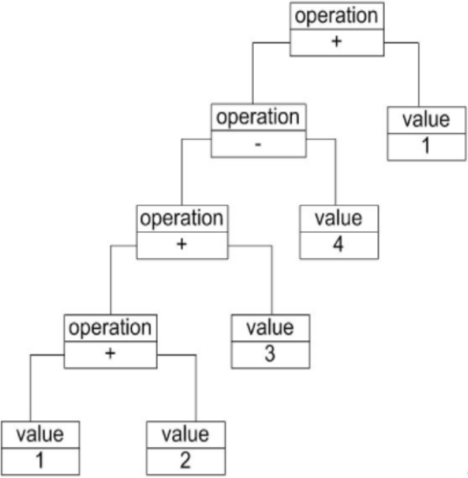
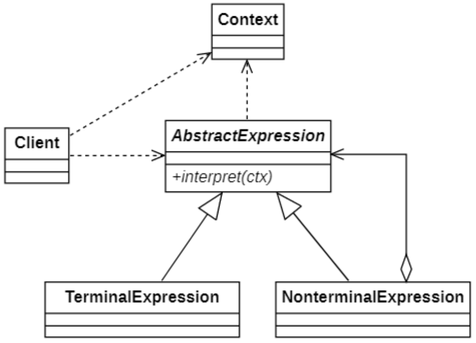
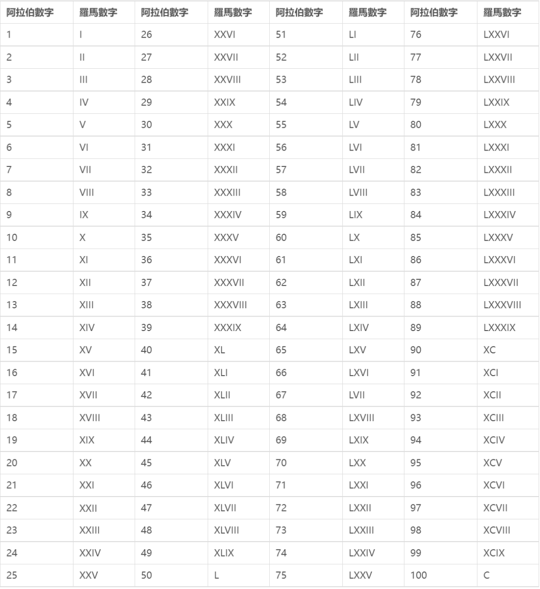
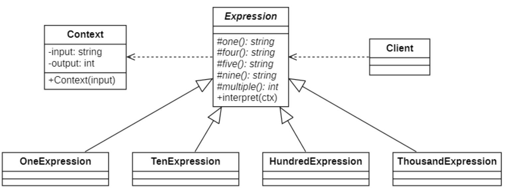
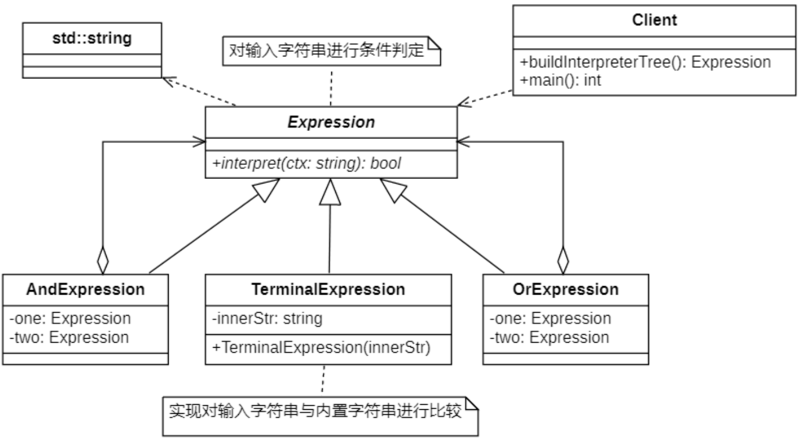

# 解释器模式
## 概念
**解释器模式（Interpreter Pattern）** 用于描述如何构成一个简单的语言解释器，主要应用于使用面向对象语言开发的解释器设计，所以在实际开发中很少使用到。

其定义如下：
> `Wikipedia says`: In computer programming, the interpreter pattern is a design pattern that specifies how to evaluate sentences in a language. The basic idea is to have a class for each symbol (terminal or nonterminal) in a specialized computer language. The syntax tree of a sentence in the language is an instance of the composite pattern and is used to evaluate (interpret) the sentence for a client.
> 
> 在计算机编程中，解释器模式是一种设计模式，它指定如何评估语言中的句子。基本思想是用专门的计算机语言为每个符号 (终端或非终端) 设置一个类。语言中句子的语法树是组合模式的实例，用于评估(解释) 客户端的句子。
>
> Given a language, define a representation for its grammar along with an interpreter that uses the representation to interpret sentences in the language.
>
> 给定一个语言，定义它的文法的一种表示，并定义一个解释器，这个解释器使用该表示来解释语言中的句子。

在解释器模式的定义中所指的"语言"是使用规定格式和语法的代码，就像C++、Java和C#等语言无法直接解释类似“1 + 2 + 3 – 4 + 1”这样的字符串（如果直接作为数值表达式时可以解释），我们必须自己定义一套文法规则来实现对这些语句的解释，即设计一个自定义语言。

## 文法规则和抽象语法树
**解释器模式描述了如何为简单的语言定义一个文法，如何在该语言中表示一个句子，以及如何解释这些句子**。在正式分析解释器模式结构之前，我们先来学习如何表示一个语言的文法规则以及如何构造一棵抽象语法树。

### 文法规则
在前面所提到的加法/减法解释器中，每一个输入表达式，例如“1 + 2 + 3 – 4 + 1”，都包含了三个语言单位，可以使用如下文法规则来定义：

```自定义文法
expression ::= value | operation
operation ::= expression '+' expression | expression '-' expression
value ::= an integer // 一个整数值
```

该文法规则包含三条语句：
- 第一条表示表达式的组成方式，其中`value`和`operation`是后面两个语言单位的定义，
- 每一条语句所定义的字符串如`operation`和`value`称为语言构造成分或语言单位，
- 符号“`::=`”表示“定义为”的意思，其左边的语言单位通过右边来进行说明和定义，语言单位对应终结符表达式和非终结符表达式。
- 如本规则中的`operation`是非终结符表达式，它的组成元素仍然可以是表达式，可以进一步分解，而`value`是终结符表达式，它的组成元素是最基本的语言单位，不能再进行分解。

### 抽象语法树
在计算机科学中，**抽象语法树（Abstract Syntax Tree，AST）** ，或简称 **语法树（Syntax tree）**，是源代码语法结构的一种抽象表示。

每一棵抽象语法树对应一个语言实例，如加法/减法表达式语言中的语句“1 + 2 + 3 – 4 + 1”，可以通过抽象语法树来表示：

| ##container## |
|:--:|
||

在该抽象语法树中，可以通过终结符表达式`value`和非终结符表达式`operation`组成复杂的语句，**每个文法规则的语言实例都可以表示为一个抽象语法树**，即每一条具体的语句都可以用类似上图所示的抽象语法树来表示，**在图中终结符表达式类的实例作为树的叶子节点，而非终结符表达式类的实例作为非叶子节点，它们可以将终结符表达式类的实例以及包含终结符和非终结符实例的子表达式作为其子节点**。

## 解释器模式的结构
| ##container## |
|:--:|
||

在解释器模式结构图中包含如下几个角色：
- `AbstractExpression`（**抽象表达式**）：在抽象表达式中声明了抽象的解释操作，它是所有终结符表达式和非终结符表达式的公共父类。

- `TerminalExpression`（**终结符表达式**）：终结符表达式是抽象表达式的子类，它实现了与文法中的终结符相关联的解释操作，在句子中的每一个终结符都是该类的一个实例。通常在一个解释器模式中只有少数几个终结符表达式类，它们的实例可以通过非终结符表达式组成较为复杂的句子。

- `NonterminalExpression`（**非终结符表达式**）：非终结符表达式也是抽象表达式的子类，它实现了文法中非终结符的解释操作，由于在非终结符表达式中可以包含终结符表达式，也可以继续包含非终结符表达式，因此其解释操作一般通过递归的方式来完成。

- `Context`（**环境类**）：环境类又称为上下文类，它用于存储解释器之外的一些全局信息，通常它临时存储了需要解释的语句。

在解释器模式中，每一种终结符和非终结符都有一个具体类与之对应，正因为使用类来表示每一条文法规则，所以系统将具有较好的灵活性和可扩展性。对于所有的终结符和非终结符，我们首先需要抽象出一个公共父类，即抽象表达式类，其典型代码如下所示:

```C++
class AbstractExpression {
public:
    virtual void interpret(Context ctx) = 0;
}
```

## 解释器模式的实现
### 案例1
> 实现一个罗马数字转换器
>
> 

#### 类图设计
| ##container## |
|:--:|
||

#### 代码实现

抽象表达式类

```C++
#ifndef _EXPRESSION_H_
#define _EXPRESSION_H_

namespace interpret
{
    class Expression
    {
    protected:
        virtual std::string one() = 0;    // I X C M
        virtual std::string four() = 0; // IV XL CD MMMMM
        virtual std::string five() = 0; // V L D 
        virtual std::string nine() = 0;    // IX XC CM
        virtual int multiple() = 0;     // 1 10 100 1000
    public:
        void interpect(Context* ctx) {
            // 非空判断
            std::string tmp = ctx->getInput();
            StringUtil::trim(tmp);
            if (tmp.empty()) return;

            // 判断是否包含特殊字符
            if (ctx->getInput().find(four()) == 0)
            {
                ctx->setOutput(ctx->getOutput() + 4 * multiple());
                ctx->setInput(ctx->getInput().substr(2));
            }
            else if (ctx->getInput().find(five()) == 0)
            {
                ctx->setOutput(ctx->getOutput() + 5 * multiple());
                ctx->setInput(ctx->getInput().substr(1));
            }
            else if (ctx->getInput().find(nine()) == 0)
            {
                ctx->setOutput(ctx->getOutput() + 9 * multiple());
                ctx->setInput(ctx->getInput().substr(2));
            }
            // 处理基本单位
            while (ctx->getInput().find(one()) == 0)
            {
                ctx->setOutput(ctx->getOutput() + multiple());
                ctx->setInput(ctx->getInput().substr(1));
            }
        }
    };
}

#endif // !_EXPRESSION_H_
```

具体表达式类
```C++
#ifndef _ONEEXP_H_
#define _ONEEXP_H_

namespace interpret
{
    class OneExp: public Expression
    {
    protected:
        std::string one() override
        {
            return "I";
        }
        std::string four() override
        {
            return "IV";
        }
        std::string five() override
        {
            return "V";
        }
        std::string nine() override
        {
            return "IX";
        }
        int multiple() override
        {
            return 1;
        }
    };
}

#endif // !_ONEEXP_H_
```

输入输出

```C++
#ifndef _CONTEXT_H_
#define _CONTEXT_H_

namespace interpret
{
    class Context
    {
        CC_SYNTHESIZE(std::string, input, Input);
        CC_SYNTHESIZE(int, output, Output);
    public:
        Context(std::string input) {
            this->input = input;
            this->output = 0;
        }
    };
}

#endif // !_CONTEXT_H_
```

客户端使用

```C++
using namespace interpret;
int main()
{
    // 构建解析树
    std::vector<std::shared_ptr<Expression>> tree;
    tree.emplace_back(std::make_shared<ThousandExp>());
    tree.emplace_back(std::make_shared<HundredExp>());
    tree.emplace_back(std::make_shared<TenExp>());
    tree.emplace_back(std::make_shared<OneExp>());
    // 构建场景
    Context ctx("XC II");
    // 开始解析
    for (auto exp : tree)
    {
        exp->interpect(&ctx);
    }
    // 输出解析结果
    std::cout << ctx.getOutput() << std::endl;
    return 0;
}
```

### 案例2
来实现一个字符验证案例，用于验证字符串是否符合词法规则。

#### 类图设计
| ##container## |
|:--:|
||

抽象表达式类

```C++
#ifndef _EXPRESSION_H_
#define _EXPRESSION_H_

namespace interpret
{
    class Expression
    {
    public:
        virtual bool interpret(std::string ctx) = 0;
        virtual ~Expression() = default;
    };
}

#endif // !_EXPRESSION_H_
```

具体非终结表达式类

```C++
#ifndef _ANDEXP_H_
#define _ANDEXP_H_

namespace interpret
{
    class AndExp :public Expression
    {
    private:
        Expression* one;
        Expression* two;
    public:
        AndExp(Expression* one, Expression* two) {
            this->one = one;
            this->two = two;
        }
        ~AndExp() {
            delete this->one;
            delete this->two;
        }
        bool interpret(std::string ctx) override
        {
            return one->interpret(ctx) && two->interpret(ctx);
        }
    };
}

#endif // !_ANDEXP_H_
```

具体终结表达式类

```C++
#ifndef _TERMINALEXP_H_
#define _TERMINALEXP_H_

namespace interpret
{
    class TerminalExp : public Expression
    {
    private:
        std::string compareStr;
    public:
        TerminalExp(std::string comapreStr) {
            this->compareStr = comapreStr;
        }
        bool interpret(std::string ctx) override
        {
            auto words = StringUtil::split(ctx, " ");
            auto iter = words.begin();
            while (iter != words.end())
            {
                if (compareStr == *iter++)
                {
                    return true;
                }
            }
            return false;
        }
    };
}

#endif // !_TERMINALEXP_H_
```

客户端使用

```C++
using namespace interpret;

int main()
{
    // 构建解析树
    // 构建终止符
    Expression* one = new TerminalExp("ddg");
    Expression* two = new TerminalExp("tlj");
    Expression* thr = new TerminalExp("yh");
    Expression* fou = new TerminalExp("dc");
    // 构建非终止符
    Expression* anexp = new AndExp(one, two);
    Expression* orexp = new OrExp(thr, fou);
    // 树
    Expression* tree = new AndExp(anexp, orexp);

    // 测试解析
    std::string ctx = "dc ddg ydddh tlj";
    std::cout << tree->interpret(ctx) << std::endl;
    // 释放资源
    delete tree;
    return 0;
}
```

## 解释器模式适用环境
解释器模式为自定义语言的设计和实现提供了一种解决方案，它用于定义一组文法规则并通过这组文法规则来解释语言中的句子。

虽然解释器模式的使用频率不是特别高，但是它在正则表达式、XML文档解释等领域还是得到了广泛使用。与解释器模式类似，目前还诞生了很多基于抽象语法树的源代码处理工具。

### 主要优点
- `易于改变和扩展文法`。由于在解释器模式中使用类来表示语言的文法规则，因此可以通过继承等机制来改变或扩展文法。
- `每一条文法规则都可以表示为一个类，因此可以方便地实现一个简单的语言`。
- `实现文法较为容易`。在抽象语法树中每一个表达式节点类的实现方式都是相似的，这些类的代码编写都不会特别复杂，还可以通过一些工具自动生成节点类代码。
- `增加新的解释表达式较为方便`。如果用户需要增加新的解释表达式只需要对应增加一个新的终结符表达式或非终结符表达式类，原有表达式类代码无须修改，符合“开闭原则”。

### 主要缺点
- `对于复杂文法难以维护`。在解释器模式中，每一条规则至少需要定义一个类，因此如果一个语言包含太多文法规则，类的个数将会急剧增加，导致系统难以管理和维护，此时可以考虑使用语法分析程序等方式来取代解释器模式。
- `执行效率较低`。由于在解释器模式中使用了大量的循环和递归调用，因此在解释较为复杂的句子时其速度很慢，而且代码的调试过程也比较麻烦。

### 适用场景
- 一个语言的文法较为简单。
- 对于复杂的语法，语法的类层次结构变得很大且无法管理。
- 执行效率不是关键问题。

    最有效的解释器通常不是通过抽象语法树来实现，而是首先将它们翻译成另一种形式。例如，正则表达式经常被转换为状态机。但是即使这样，翻译器也可以通过解释器模式来实现，所以该模式仍然适用。
