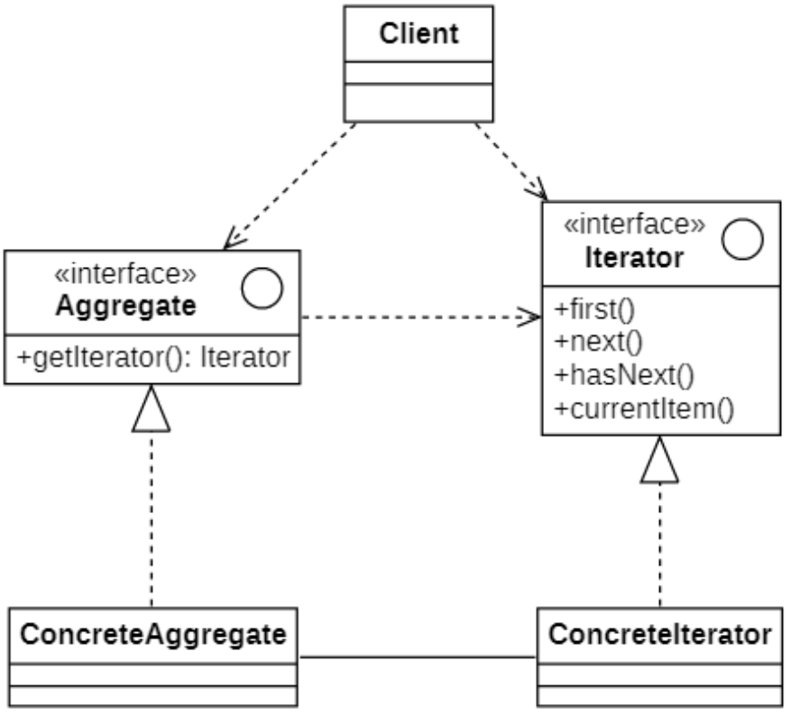
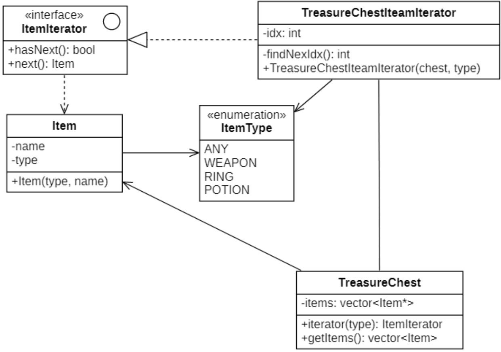

# 迭代器模式
## 概念
### 定义
**迭代器模式（Iterator Pattern）** 的定义如下：
> Wikipedia says: the iterator pattern is a design pattern in which an iterator is used to traverse a container and access the container's elements.
>
> 迭代器模式是一种设计模式，其中迭代器用于遍历容器并访问容器的元素。
> Provide a way to access the elements of an aggregate object sequentially without exposing its underlying representation.
>
> 提供一种方法顺序访问一个聚合对象中的各个元素，而又不用暴露该对象的内部表示。

迭代器模式又称为**游标（Cursor）模式**，可以让你能在不暴露集合底层表现形式 （列表、 栈和树等） 的情况下遍历集合中所有的元素。

### 举例说明
**集合中需要解决问题**

无论集合的构成方式如何，它都必须提供某种**访问元素的方式**，便于其他代码使用其中的元素。集合应提供一种能够**遍历元素的方式**，且保证它不会周而复始地访问同一个元素。

如果你的集合基于列表，遍历实现非常简单，如果是复杂的数据结构（如树），那就不是那么容易，比如：
- 今天需要深度优先算法来遍历树结构；
- 明天需要广度优先算法来遍历树结构；
- 下周则可能会需要其他方式 （比如随机存取树中的元素）。

不断向集合中添加遍历算法会模糊其 “高效存储数据” 的主要职责。 此外， 有些算法可能是根据特定应用订制的， 将其加入泛型集合类中会显得非常奇怪。

另一方面， 使用多种集合的客户端代码可能并不关心存储数据的方式。 不过由于集合提供不同的元素访问方式， 你的代码将不得不与特定集合类进行耦合。

解决方案：将集合的遍历行为抽取为单独的 *迭代器* 对象。

**类比现实世界**

比如大家想要去某个城市去旅游，这个城市有许多旅游景点，旅游方式可以采用下面的方法。

- 采用自由漫步的方式，一个景点一个景点的去旅游，中途可能会出现绕了很大一个圈子找不到某个旅游景点的情况；
- 也可以买一个便宜的智能虚拟导游程序；
- 还可以雇佣一个对本城市了如指掌的导游，帮你安排行程以及景点激动人心的故事讲解。

自由漫步、虚拟导游、真人导游就是这个由众多景点组合成的集合的迭代器。

## 迭代器模式的结构
| ##container## |
|:--:|
||

在迭代器模式结构图中包含如下几个角色：
- `Iterator`（**抽象迭代器**）：它定义了访问和遍历元素的接口，声明了用于遍历数据元素的方法，在具体迭代器中将实现这些方法。

- `Concrete Iterator`（**具体迭代器**）：它实现了抽象迭代器接口，完成对聚合对象的遍历，同时在具体迭代器中通过游标来记录在聚合对象中所处的当前位置，在具体实现时，游标通常是一个表示位置的非负整数。

- `Aggregate`（**抽象聚合类**）：它用于存储和管理元素对象，声明一个`getIterator()`方法用于创建一个迭代器对象，充当抽象迭代器工厂角色。

- `Concrete Aggregate`（**具体聚合类**）：它实现了在抽象聚合类中声明的`getIterator()`方法，该方法返回一个与该具体聚合类对应的具体迭代器`ConcreteIterator`实例。

## 迭代器模式的实现
使用迭代器实现对宝箱中物品的遍历
### 类图设计
| ##container## |
|:--:|
||

### 代码实现
迭代器接口

```C++
#ifndef _ITEMITERATOR_H_
#define _ITEMITERATOR_H_

namespace ite
{
    class ItemIterator
    {
    public:
        virtual bool hasNext() = 0;
        virtual Item* next() = 0;
    };
}

#endif // !_ITEMITERATOR_H_
```

迭代器接口具体实现

```C++
#ifndef _TREASURECHESTITERATOR_H_
#define _TREASURECHESTITERATOR_H_

namespace ite
{
    class TreasureChestIterator : public ItemIterator
    {
    private:
        size_t idx;
        TreasureChest* chest;
        ItemType type;

        int findNextIdx(bool isInit = false)
        {
            // 判断是否已经到最后一个元素了
            if (!isInit && idx >= chest->getItems()->size() - 1)
            {
                return (int)chest->getItems()->size();
            }

            // 如果是任意类型
            if (type == ItemType::ANY)
            {
                if (isInit) return 0;
                return (int)(idx + 1);
            }

            // 指定类型
            size_t nextIdx = chest->getItems()->size();
            size_t start = isInit ? 0 : idx + 1;
            for (size_t i = start; i < chest->getItems()->size(); i++)
            {
                if (chest->getItems()->at(i)->getType() == type)
                {
                    nextIdx = i;
                    break;
                }
            }
            return (int)nextIdx;
        }
    public:
        TreasureChestIterator(TreasureChest* chest, ItemType type)
        {
            this->chest = chest;
            this->type = type;
            this->idx = findNextIdx(true);
        }
        bool hasNext() override
        {
            return idx != chest->getItems()->size();
        }
        Item* next() override
        {
            // 获取当前项
            auto ptr = chest->getItems()->at(idx);
            // 更新idx
            idx = findNextIdx();
            return ptr.get();
        }
    };
}

#endif // !_TREASURECHESTITERATOR_H_
```

宝箱类

```C++
// .h
#ifndef _TREASURECHEST_H_
#define _TREASURECHEST_H_
#include <vector>
#include <memory>
#include "Item.h"
#include "ItemIterator.h"
namespace ite
{
    class TreasureChest
    {
    private:
        std::vector<std::shared_ptr<Item>> chest;
    public:
        ItemIterator* iterator(ItemType type);
        std::vector<std::shared_ptr<Item>>* getItems();
    };
}

#endif // !_TREASURECHEST_H_

// .cpp
#include "TreasureChest.h"
#include "TreasureChestIterator.h"

ite::ItemIterator* ite::TreasureChest::iterator(ItemType type)
{
    return new TreasureChestIterator(this, type);
}

std::vector<std::shared_ptr<ite::Item>>* ite::TreasureChest::getItems()
{
    return &chest;
}
```

物品类

```C++
#ifndef _ITEM_H_
#define _ITEM_H_

namespace ite
{
    enum class ItemType { ANY, WEAPON, RING, POTION };
    class Item
    {
        CC_SYNTHESIZE(std::string, name, Name);
        CC_SYNTHESIZE(ItemType, type, Type);
    public:
        Item(ItemType type, std::string name) {
            this->type = type;
            this->name = name;
        }
    };
}

#endif // !_ITEM_H_
```

客户端使用

```C++
using namespace ite;

int main()
{
    // 构建宝箱对象
    TreasureChest chest;
    chest.getItems()->emplace_back(std::make_shared<Item>(ItemType::POTION, "神圣药水"));
    chest.getItems()->emplace_back(std::make_shared<Item>(ItemType::RING, "青铜戒指"));
    chest.getItems()->emplace_back(std::make_shared<Item>(ItemType::WEAPON, "破旧长矛"));
    chest.getItems()->emplace_back(std::make_shared<Item>(ItemType::WEAPON, "生锈斧头"));
    chest.getItems()->emplace_back(std::make_shared<Item>(ItemType::POTION, "隐身药水"));
    chest.getItems()->emplace_back(std::make_shared<Item>(ItemType::POTION, "强化药水"));
    chest.getItems()->emplace_back(std::make_shared<Item>(ItemType::RING, "专属戒指"));
    chest.getItems()->emplace_back(std::make_shared<Item>(ItemType::RING, "火焰戒指"));
    chest.getItems()->emplace_back(std::make_shared<Item>(ItemType::WEAPON, "破旧斧头"));
    chest.getItems()->emplace_back(std::make_shared<Item>(ItemType::WEAPON, "生锈长矛"));
    // 演示迭代器的使用
    std::cout << "全部====================" << std::endl;
    auto iter1 = chest.iterator(ItemType::ANY);
    while (iter1->hasNext())
    {
        std::cout << iter1->next()->getName() << std::endl;
    }
    delete iter1;
    std::cout << "武器====================" << std::endl;
    auto iter2 = chest.iterator(ItemType::WEAPON);
    while (iter2->hasNext())
    {
        std::cout << iter2->next()->getName() << std::endl;
    }
    delete iter2;
    std::cout << "药水====================" << std::endl;
    auto iter3 = chest.iterator(ItemType::POTION);
    while (iter3->hasNext())
    {
        std::cout << iter3->next()->getName() << std::endl;
    }
    delete iter3;
    return 0;
}
```

## 迭代器模式适用环境
由于很多编程语言的类库都已经实现了迭代器模式，因此在实际开发中，我们只需要直接使用Java、C#等语言已定义好的迭代器即可，迭代器已经成为我们操作聚合对象的基本工具之一。

### 主要优点
- **它支持以不同的方式遍历一个聚合对象，在同一个聚合对象上可以定义多种遍历方式**。在迭代器模式中只需要用一个不同的迭代器来替换原有迭代器即可改变遍历算法，我们也可以自己定义迭代器的子类以支持新的遍历方式。
- **迭代器简化了聚合类**。由于引入了迭代器，在原有的聚合对象中不需要再自行提供数据遍历等方法，这样可以简化聚合类的设计。
- 在迭代器模式中，由于引入了抽象层，**增加新的聚合类和迭代器类都很方便，无须修改原有代码，满足“开闭原则”的要求**。

### 主要缺点
- 由于迭代器模式将存储数据和遍历数据的职责分离，增加新的聚合类需要对应增加新的迭代器类，类的个数成对增加，这在**一定程度上增加了系统的复杂性**。
- **抽象迭代器的设计难度较大，需要充分考虑到系统将来的扩展**，例如JDK内置迭代器`Iterator`就无法实现逆向遍历，如果需要实现逆向遍历，只能通过其子类`ListIterator`等来实现，而`ListIterator`迭代器无法用于操作`Set`类型的聚合对象。在自定义迭代器时，创建一个考虑全面的抽象迭代器并不是件很容易的事情。

### 适用场景
- 当集合背后为复杂的数据结构，且你希望对客户端隐藏其复杂性时（出于使用便利性或安全性的考虑），可以使用迭代器模式。
    - 迭代器封装了与复杂数据结构进行交互的细节，为客户端提供多个访问集合元素的简单方法。这种方式不仅对客户端来说非常方便，而且能避免客户端在直接与集合交互时执行错误或有害的操作，从而起到保护集合的作用。

- 想要减少程序中重复的遍历代码。
    - 重要迭代算法的代码往往体积非常庞大。当这些代码被放置在程序业务逻辑中时， 它会让原始代码的职责模糊不清，降低其可维护性。因此，将遍历代码移到特定的迭代器中可使程序代码更加精炼和简洁。

- 希望代码能够遍历不同的甚至是无法预知的数据结构，可以使用迭代器模式。
    - 该模式为集合和迭代器提供了一些通用接口。如果你在代码中使用了这些接口，那么将其他实现了这些接口的集合和迭代器传递给它时，它仍将可以正常运行。