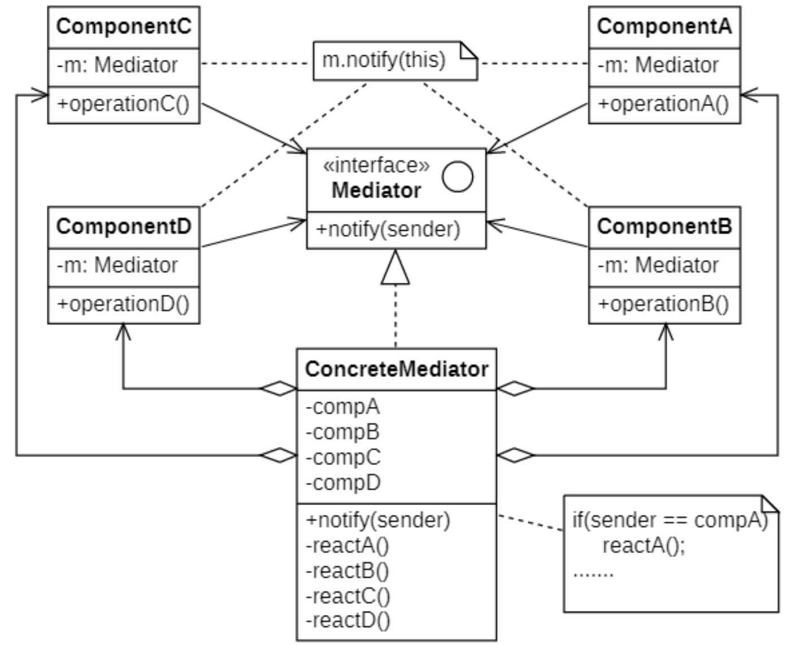
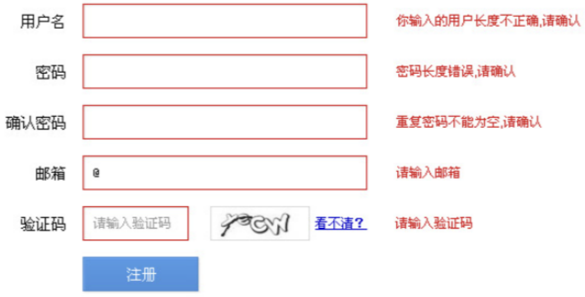
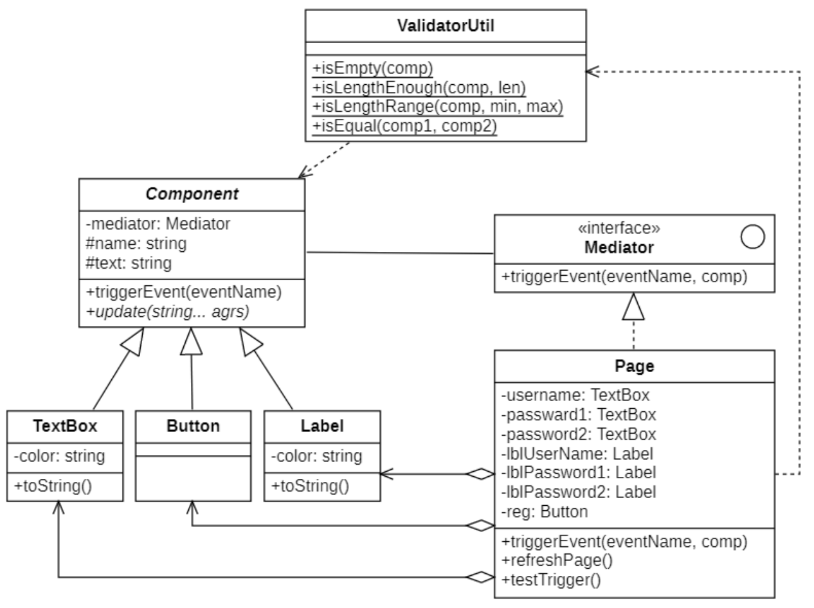

# 中介者模式
## 概念
### 定义
为了有一个好的面向对象的设计，我们必须创建许多相互交互的类。如果不应用某些原则，最终的框架将以一团糟而告终，**其中每个对象都依赖于许多其他对象才能运行**。为了避免紧密耦合的框架，我们需要一种机制来促进对象之间的交互，其方式是对象不知道其他对象的存在。

对于那些对象之间存在复杂交互关系的系统，**中介者模式(Mediator Pattern)** 提供了一种简单化复杂交互的解决方案。

其定义如下:
> `Wikipedia says`: The mediator pattern defines an object that encapsulates how a set of objects interact. With the mediator pattern, communication between objects is encapsulated within a mediator object. Objects no longer communicate directly with each other, but instead communicate through the mediator. This reduces the dependencies between communicating objects, thereby reducing coupling.
>
> 中介模式定义了一个对象，该对象封装了一组对象如何交互。使用中介模式，对象之间的通信被封装在中介对象中。对象不再直接相互通信，而是通过中介器进行通信。这减少了通信对象之间的依赖性，从而减少了耦合。
>
> Define an object that encapsulates how a set of objects interact. Mediator promotes loose coupling by keeping objects from referring to each other explicitly, and it lets you vary their interaction independently.
>
> 用一个中介对象（中介者）来封装一系列的对象交互，中介者使各对象不需要显式地相互引用，从而使其耦合松散，而且可以独立地改变它们之间的交互。

通过引入中介者来简化对象之间的复杂交互，中介者模式是“迪米特法则”的一个典型应用。

### 举例说明
> **表单验证问题**
> 
> 假如在修改用户资料页，有许多表单组件（如:文本框、复选框、列表框、按钮等），某些表单可能会存在联动（如：地址级联菜单、提交后会验证所有表单并显示错误信息），以表单验证为例，如果要完成验证提示功能，你按钮类需要关联页面所有表单元素，随着控件增多维护非常困难，控件之间的耦合度非常高，如果有重复逻辑，也无法复用。
>
> 使用中介者模式，来停止组件直接的直接交流。将页面本身作为中介者，页面知道自己所有的子组件，不需要新增依赖关系。之前，当用户点击按钮后，它必须对所有表单元素数值进行校验。 而现在它的唯一工作是将点击事件通知给对页面。收到通知后， 页面可以自行校验数值或将任务委派给各元素。这样一来， 按钮不再与多个表单元素相关联， 而仅依赖于页面类。
>
> 采用这种方式，中介者模式让你能在单个中介者对象中封装多个对象间的复杂关系网。 类所拥有的依赖关系越少，就越易于修改、扩展或复用。

> **类比现实世界**
>
> 交通拥挤的时候，通过交警来疏通。如果驾驶员直接相互协商车辆之间的行进顺序，那就是后果可能会打起来吧！

## 中介者模式的结构
| ##container## |
|:--:|
||

在中介者模式结构图中包含如下几个角色:
- `Mediator` **(中介者)**: 接口声明了与组件交流的方法，但通常仅包括一个通知方法。组件可将任意上下文（包括自己的对象）作为该方法的参数，只有这样接收组件和发送者类之间才不会耦合。

- `Component` **(组件)**: 是各种包含业务逻辑的类。每个组件都有一个指向中介者的引用，该引用被声明为中介者接口类型。组件不知道中介者实际所属的类，因此你可通过将其连接到不同的中介者以使其能在其他程序中复用。

- `Concrete Mediator` **(具体中介者)**: 封装了多种组件间的关系。具体中介者通常会保存所有组件的引用并对其进行管理，甚至有时会对其生命周期进行管理。

组件并不知道其他组件的情况。如果组件内发生了重要事件，它只能通知中介者。中介者收到通知后能轻易地确定发送者，这或许已足以判断接下来需要触发的组件了。

对于组件来说，中介者看上去完全就是一个黑箱。发送者不知道最终会由谁来处理自己的请求，接收者也不知道最初是谁发出了请求。

$質問$: 中介者模式和责任链模式有什么区别?<sup>[1]</sup>

## 中介者模式的实现
下面以处理`UI`组件之间的关联为例，下面是某个系统的注册页面
| ##container## |
|:--:|
||

页面上有许多组件（如：文本框、提示文本、注册按钮等等），在点击注册的时候我们需要去验证输入，并作出错误提示，**如果全部交给注册按钮去验证，将会耦合许多组件**。

### 类图设计
| ##container## |
|:--:|
||

### 代码实现
抽象中介者类 (实际上是一个接口)
```C++
#ifndef _MEDIATOR_H_
#define _MEDIATOR_H_
#include <string>
using namespace std;
namespace med
{
    class Component;
    class Mediator
    {
    public:
        virtual void triggerEvent(string evtname, Component* comp) = 0;
    };
}

#endif // !_MEDIATOR_H_
```

抽象控件类
```C++
#ifndef _COMPONENT_H_
#define _COMPONENT_H_
#include "../Macros.h"
#include "Mediator.h"
#include <vector>
#include <sstream>

namespace med
{
    class Component
    {    // 提供set和get方法
        CC_SYNTHESIZE(string, name, Name);
        CC_SYNTHESIZE(string, text, Text);
    private:
        Mediator* mediator;
    public:
        virtual void update(vector<string> args) = 0;
        // 构造传参: 控件名称, 关联的中介者
        Component(string name, Mediator* mediator) {
            this->name = name;
            this->text = "";
            this->mediator = mediator;
        }
        // 具体事件逻辑由中介者做
        void triggerEvent(string evtName) {
            mediator->triggerEvent(evtName, this);
        }
        virtual string to_string() {
            return "";
        }
    };
}

#endif // !_COMPONENT_H_
```

具体控件类 (节选)

```C++
#ifndef _TEXTBOX_H_
#define _TEXTBOX_H_

namespace med
{
    class TextBox : public Component
    {
    private:
        string color;
    public:
        TextBox(string name, Mediator* mediator) :Component(name, mediator) {
            this->color = "黑";
        }
        void update(vector<string> args) override
        {
            this->color = args[0];
        }
        string to_string() override
        {
            stringstream ss;
            ss << name << " " << text << "(" << color << ")\n";
            return ss.str();
        }
    };
}

#endif // !_TEXTBOX_H_
```

具体中介者 (此处使用界面作为中介者, 因为控件是创建在界面上的, 所以界面知道控件之间的关系很正常, 而单个控件要知道其他的控件这就违反了:[迪米特法则](../../005-面向对象设计原则/002-设计原则/008-迪米特法则/index.md)(知道得越少越好))


```C++
#ifndef _PAGE_H_
#define _PAGE_H_

namespace med
{
    class Page : public Mediator
    {
    private:
        shared_ptr<TextBox> txt_username;
        shared_ptr<TextBox> txt_password1;
        shared_ptr<TextBox> txt_password2;
        shared_ptr<Lablel> lbl_username;
        shared_ptr<Lablel> lbl_password1;
        shared_ptr<Lablel> lbl_password2;
        shared_ptr<Button> btn_reg;
        void triggerEvent(string evtname, Component* comp) override
        {
            // 只处理注册事件
            if (evtname != "reg") return;

            // 定义一个校验通过项的数量
            int count = 0;

            // 验证用户
            if (ValidatorUtil::isEmpty(txt_username.get()))
            {
                txt_username->update({ "红" });
                lbl_username->update({ "红","用户名不能为空" });
            }
            else if (!ValidatorUtil::isLenEnough(txt_username.get(), 8))
            {
                txt_username->update({ "红" });
                lbl_username->update({ "红","用户名长度小于8" });
            }
            else
            {
                count++;
                txt_username->update({ "黑色" });
                lbl_username->update({ "绿","验证通过" });
            }

            // 验证密码
            if (ValidatorUtil::isEmpty(txt_password1.get()))
            {
                txt_password1->update({ "红" });
                lbl_password1->update({ "红","密码不能为空" });
            }
            else if (!ValidatorUtil::isLenRange(txt_password1.get(), 6, 10))
            {
                txt_password1->update({ "红" });
                lbl_password1->update({ "红","密码长度范围6-8位" });
            }
            else
            {
                count++;
                txt_password1->update({ "黑色" });
                lbl_password1->update({ "绿","验证通过" });
            }

            // 确认密码
            if (ValidatorUtil::isEmpty(txt_password2.get()))
            {
                txt_password2->update({ "红" });
                lbl_password2->update({ "红","确认密码不能为空" });
            }
            else if (!ValidatorUtil::isEqual(txt_password1.get(), txt_password2.get()))
            {
                txt_password2->update({ "红" });
                lbl_password2->update({ "红","两次输入的密码不一致" });
            }
            else
            {
                count++;
                txt_password2->update({ "黑色" });
                lbl_password2->update({ "绿","验证通过" });
            }

            // 刷新显示
            refreshPage();

            // 如果所有校验项目通过
            if (count == 3)
                cout << "==========注册成功==========" << endl;
        }
        void refreshPage() {
            cout << "=============================" << endl;
            cout << "|" << txt_username->to_string() << endl;
            cout << "|" << lbl_username->to_string() << endl;
            cout << "|" << txt_password1->to_string() << endl;
            cout << "|" << lbl_password1->to_string() << endl;
            cout << "|" << txt_password2->to_string() << endl;
            cout << "|" << lbl_password2->to_string() << endl;
            cout << "=============================" << endl;
        }
    public:
        Page() {
            this->txt_username = make_shared<TextBox>("用户名", this);
            this->txt_password1 = make_shared<TextBox>("密码", this);
            this->txt_password2 = make_shared<TextBox>("确认密码", this);
            this->lbl_username = make_shared<Lablel>("用户名提示", this);
            this->lbl_password1 = make_shared<Lablel>("密码提示", this);
            this->lbl_password2 = make_shared<Lablel>("确认密码提示", this);
            this->btn_reg = make_shared<Button>("注册", this);
            refreshPage();
        }
        void testTrigger() {
            // 什么也不是输入点击注册按钮
            btn_reg->triggerEvent("reg");

            // 输入一些信息
            txt_username->setText("admin");
            btn_reg->triggerEvent("reg");

            txt_username->setText("admin01xq");
            txt_password1->setText("1234");
            btn_reg->triggerEvent("reg");

            txt_password1->setText("1234567890");
            txt_password2->setText("1234567891");
            btn_reg->triggerEvent("reg");
            
            // 输入正确的信息
            txt_password2->setText("1234567890");
            btn_reg->triggerEvent("reg");
        }
    };
}

#endif // !_PAGE_H_
```

还有工具类, 对某些东西进行判断

```C++
#ifndef _VALIDATORUTIL_H_
#define _VALIDATORUTIL_H_

namespace med
{
    class ValidatorUtil
    {
    public:
        static bool isEmpty(Component* comp) {
            // 去空格
            string txt = comp->getText();
            StringUtil::trim(txt);
            return txt.empty();
        }
        static bool isLenEnough(Component* comp, size_t len) {
            return comp->getText().length() >= len;
        }
        static bool isLenRange(Component* comp, size_t min, size_t max) {
            return comp->getText().length() >= min && comp->getText().length() <= max;
        }
        static bool isEqual(Component* comp1, Component* comp2) {
            return comp1->getText() == comp2->getText();
        }
    };
}

#endif // !_VALIDATORUTIL_H_
```

客户端使用 (实际上 `med::Page`也可以算是客户端写的了)
```C++
int main()
{
    med::Page page;     // 创建界面
    page.testTrigger(); // 执行测试
    return 0;
}
```

## 中介者模式适用环境
中介者模式在事件驱动类软件中应用较为广泛，特别是基于 **GUI(Graphical User Interface，图形用户界面)** 的应用软件，此外，在类与类之间存在错综复杂的关联关系的系统中，中介者模式都能得到较好的应用。

### 主要优点
- **中介者模式简化了对象之间的交互**，它用中介者和同事的一对多交互代替了原来同事之间的多对多交互，一对多关系更容易理解、维护和扩展，将原本难以理解的网状结构转换成相对简单的星型结构。

- **中介者模式可将各同事对象解耦**。中介者有利于各同事之间的松耦合，我们可以独立的改变和复用每一个同事和中介者，增加新的中介者和新的同事类都比较方便，更好地符合“开闭原则”。

- **可以减少子类生成**，中介者将原本分布于多个对象间的行为集中在一起，改变这些行为只需生成新的中介者子类即可，这使各个同事类可被重用，无须对同事类进行扩展。

### 主要缺点
- 一段时间后，中介者可能会演化成为[上帝对象](https://baike.baidu.com/item/%E4%B8%8A%E5%B8%9D%E5%AF%B9%E8%B1%A1)(即*超级大类*)。

### 适用场景
- **当一些对象和其他对象紧密耦合以致难以对其进行修改时，可使用中介者模式**。

    该模式让你将对象间的所有关系抽取成为一个单独的类，以使对于特定组件的修改工作独立于其他组件。
  
- **当组件因过于依赖其他组件而无法在不同应用中复用时，可使用中介者模式**。

    应用中介者模式后，每个组件不再知晓其他组件的情况。尽管这些组件无法直接交流，但它们仍可通过中介者对象进行间接交流。如果你希望在不同应用中复用一个组件，则需要为其提供一个新的中介者类。

- **如果为了能在不同情景下复用一些基本行为，导致你需要被迫创建大量组件子类时，可使用中介者模式**。

    由于所有组件间关系都被包含在中介者中，因此你无需修改组件就能方便地新建中介者类以定义新的组件合作方式。

## 注解
### [1] 中介者模式和责任链模式有什么区别?
我的认为:

- 中介者模式和责任链模式的区别就是 中介者模式需要寄生于一个场景,里面有各个控件的关系, 即每一层都要判断最终才OK(比如注册界面, 所有输入框控件必须合法, 注册按键才可以进行注册，否则会提示)

- 而责任链模式则需要人们自己构建责任链, 不一定需要一个场景(界面)

---

GPT-3.5的回答:

你对中介者模式和责任链模式的理解基本正确，但是我想指出一些细微的差异：

1. 中介者模式通常涉及到多个对象之间的复杂交互，这些对象可能代表系统中的不同部分或角色。中介者对象通过封装这些对象之间的通信，并协调它们的行为，以降低它们之间的耦合度。相比之下，责任链模式更关注于对象之间的处理链，其中每个对象都尝试处理请求，如果自己无法处理，则将请求传递给链中的下一个对象。

2. 在中介者模式中，中介者对象通常寄生于一个场景或系统中，管理该场景中各个对象之间的交互。而责任链模式中的责任链可以是显式构建的链条，也可以是动态创建的。责任链模式更加灵活，因为它允许用户自定义链条的顺序和内容，而不受特定场景的限制。

3. 在责任链模式中，每个处理者对象都有权力决定是否处理请求以及如何处理请求，而在中介者模式中，中介者对象通常负责协调对象之间的行为，但不对它们的具体行为做出决定。

总的来说，中介者模式用于管理对象之间的复杂交互，而责任链模式则用于构建对象之间的处理链，以便动态地处理请求。

---

GPT-4.0 (Copilot)的回答:

你的理解是正确的。中介者模式和责任链模式都是行为设计模式，它们在处理对象之间的交互和通信方面有所不同。

**中介者模式**主要用于处理多个对象之间的交互。在这种模式中，对象不直接与彼此交互，而是通过一个中介者对象进行交互。这样可以减少对象之间的依赖关系，降低耦合度。你提到的注册界面就是一个很好的例子，所有的输入框控件都通过中介者（可能是一个表单验证器）来判断是否可以进行注册。

而**责任链模式**则是通过构建一个对象链来处理请求，请求从链的一端传递到另一端，每个对象都有机会处理这个请求。如果一个对象不能处理这个请求，那么它就会将请求传递给链中的下一个对象。这种模式可以让多个对象都有处理请求的机会，而不需要知道哪个对象最终处理了这个请求。这种模式不需要一个特定的场景，只需要构建好责任链即可。

总的来说，这两种模式都有各自的优点和适用场景，选择使用哪种模式主要取决于具体的需求和设计考虑。希望这个解释对你有所帮助！

---