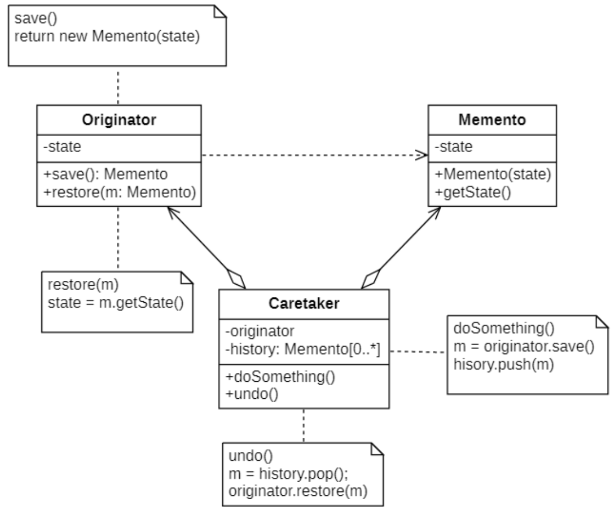
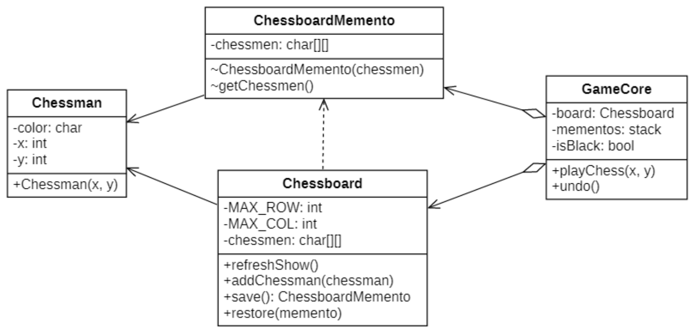

# 备忘录模式
## 概念
**备忘录模式(Memento Pattern)** 的定义如下:

> `Wikipedia says`: The memento pattern is a software design pattern that provides the ability to restore an object to its previous state (undo via rollback).
>
> 备忘录模式是一种软件设计模式，它提供了将对象恢复到其先前状态（通过回滚撤消）的能力。
>
> Without violating encapsulation, capture and externalize an object's internal state so that the object can be restored to this state later.
>
> 在不破坏封装的前提下捕获一个对象的内部状态，并在该对象之外保存这个状态，这样可以在以后将对象恢复到原先的状态。

备忘录模式提供了一种状态恢复的实现机制，使得用户可以方便地回到一个特定的历史步骤，当新的状态无效或者存在问题时，可以使用暂时存储起来的备忘录将状态复原，当前很多软件都提供了撤销(Undo)操作，其中就使用了备忘录模式。备忘录模式又称为**标记(Token)模式**。

## 备忘录模式的结构
| ##container## |
|:--:|
||

在备忘录模式结构图中包含如下几个角色:
- `Originator`(**原发器**): <span style="color:red">它是一个普通类</span>
，可以创建一个备忘录，并存储它的当前内部状态，也可以使用备忘录来恢复其内部状态，一般将需要保存内部状态的类设计为原发器。

- `Memento`(**备忘录**): 存储原发器的内部状态，根据原发器来决定保存哪些内部状态。备忘录的设计一般可以参考原发器的设计，根据实际需要确定备忘录类中的属性。需要注意的是，除了原发器本身与负责人类之外，备忘录对象不能直接供其他类使用，原发器的设计在不同的编程语言中实现机制会有所不同。

- `Caretaker`(**负责人**): 负责人又称为管理者，它负责保存备忘录，但是不能对备忘录的内容进行操作或检查。在负责人类中可以存储一个或多个备忘录对象，它只负责存储对象，而不能修改对象，也无须知道对象的实现细节。

### *注意*
在设计备忘录类时需要考虑其封装性，除了`Originator`类，不允许其他类来调用备忘录类`Memento`的构造函数与相关方法，如果不考虑封装性，允许其他类调用`setState()`等方法，将导致在备忘录中保存的历史状态发生改变，通过撤销操作所恢复的状态就不再是真实的历史状态，备忘录模式也就失去了本身的意义。

在使用Java语言实现备忘录模式时，一般通过将`Memento`类与`Originator`类定义在**同一个包**中来实现封装，在Java语言中可使用默认访问标识符来定义`Memento`类，即保证其包内可见。

## 备忘录模式的实现
> 下面案例来模拟五子棋中的悔棋效果。

### 类图设计
| ##container## |
|:--:|
||

### 代码实现

一个状态, 记录了一次下棋的操作
```C++
#ifndef _CHESSMAN_H_
#define _CHESSMAN_H_

namespace mem
{
    class Chessman
    {
        CC_SYNTHESIZE(int, x, X);
        CC_SYNTHESIZE(int, y, Y);
        CC_SYNTHESIZE(char, color, Color);
    public:
        Chessman(int x, int y) {
            this->x = x;
            this->y = y;
        }
    };
}

#endif // !_CHESSMAN_H_
```

负责人类 (负责保存操作, 以便悔棋)
```C++
#ifndef _GAMECORE_H_
#define _GAMECORE_H_
#include <stack>
namespace mem
{
    class GameCore
    {
    private:
        Chessboard board;
        stack<shared_ptr<Chessboard::ChessboardMemento>> mementos;
        bool isBlack;
    public:
        GameCore() {
            this->isBlack = true;
        }
        void playChess(int x, int y) {
            // 记录棋盘当前状态
            mementos.push(shared_ptr<Chessboard::ChessboardMemento>(board.save()));

            // 落子
            Chessman man(x, y);
            if(isBlack){
                man.setColor('$');
                cout << "黑方落子" << endl;
            }
            else
            {
                man.setColor('#');
                cout << "白方落子" << endl;
            }
            board.addChessman(&man);
            // 切换落子方
            isBlack = !isBlack;
        }
        void undo() 
        {
            if (mementos.empty())
            {
                cout << "不能再悔棋了" << endl;
                return;
            }

            // 切换落子方
            isBlack = !isBlack;

            // 执行悔棋
            cout << (isBlack ? "黑方" : "白方") << "悔棋" << endl;
            board.restore(mementos.top().get());
            mementos.pop();
        }
    };
}

#endif // !_GAMECORE_H_
```

棋盘类
```C++
// .h
#ifndef _CHESSBOARD_H_
#define _CHESSBOARD_H_
#include <vector>
#include "Chessman.h"
using namespace std;
namespace mem
{
    class Chessboard
    {
    private:
        const int MAX_ROW = 10;
        const int MAX_COL = 10;
        vector<vector<char>> chessmen;
    public:
        class ChessboardMemento {
            friend class Chessboard;
        private:
            vector<vector<char>> chessmen;
            ChessboardMemento();
        };
        Chessboard();
        void refrshShow();
        void addChessman(Chessman* man);
        ChessboardMemento* save();
        void restore(ChessboardMemento* memento);
    };
}

#endif // !_CHESSBOARD_H_

// .cpp
#include "Chessboard.h"
#include <iostream>

mem::Chessboard::ChessboardMemento::ChessboardMemento()
{

}

mem::Chessboard::Chessboard()
{
    chessmen = vector<vector<char>>(MAX_ROW, vector<char>(MAX_COL));
}

void mem::Chessboard::refrshShow()
{
    for (int row = 0; row < MAX_ROW; row++)
    {
        for (int col = 0; col < MAX_COL; col++)
        {
            char c = chessmen[row][col];
            if (c == '\0')
                cout << "*";
            else
                cout << c;
        }
        cout << endl;
    }
}

void mem::Chessboard::addChessman(Chessman* man)
{
    chessmen[man->getX() - 1][man->getY() - 1] = man->getColor();
    refrshShow();
}

mem::Chessboard::ChessboardMemento* mem::Chessboard::save()
{
    ChessboardMemento* memento = new ChessboardMemento;
    memento->chessmen = vector<vector<char>>(chessmen);
    return memento;
}

void mem::Chessboard::restore(ChessboardMemento* memento)
{
    this->chessmen = memento->chessmen;
    refrshShow();
}
```

客户端使用
```C++
int main()
{
    mem::GameCore core;
    core.playChess(1, 2); // 模拟下棋
    core.playChess(2, 2);
    core.undo();          // 进行悔棋
    core.playChess(2, 1);
    core.playChess(1, 3);
    core.undo();
    core.undo();
    core.undo();
    core.undo();
    core.undo();
    core.undo();
    core.undo();
    return 0;
}
```

## 备忘录模式适用环境
备忘录模式在很多软件的使用过程中普遍存在，但是在应用软件开发中，它的使用频率并不太高，因为现在很多基于窗体和浏览器的应用软件并没有提供撤销操作。

### 主要优点
- 它提供了一种状态恢复的实现机制，使得用户可以方便地回到一个特定的历史步骤，当新的状态无效或者存在问题时，可以使用暂时存储起来的备忘录将状态复原。

- 备忘录实现了对信息的封装，一个备忘录对象是一种原发器对象状态的表示，不会被其他代码所改动。备忘录保存了原发器的状态，采用列表、堆栈等集合来存储备忘录对象可以实现多次撤销操作。

### 主要缺点
- **资源消耗过大，如果需要保存的原发器类的成员变量太多**，就不可避免需要占用大量的存储空间，每保存一次对象的状态都需要消耗一定的系统资源。

### 适用场景
- 保存一个对象在某一个时刻的全部状态或部分状态，这样以后需要时它能够恢复到先前的状态，实现撤销操作。

- 防止外界对象破坏一个对象历史状态的封装性，避免将对象历史状态的实现细节暴露给外界对象。