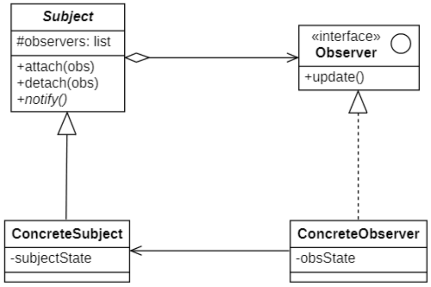
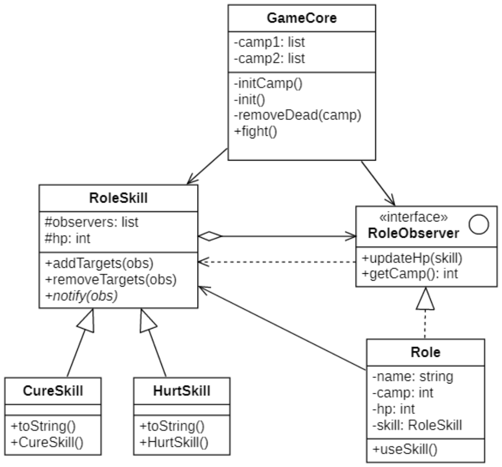
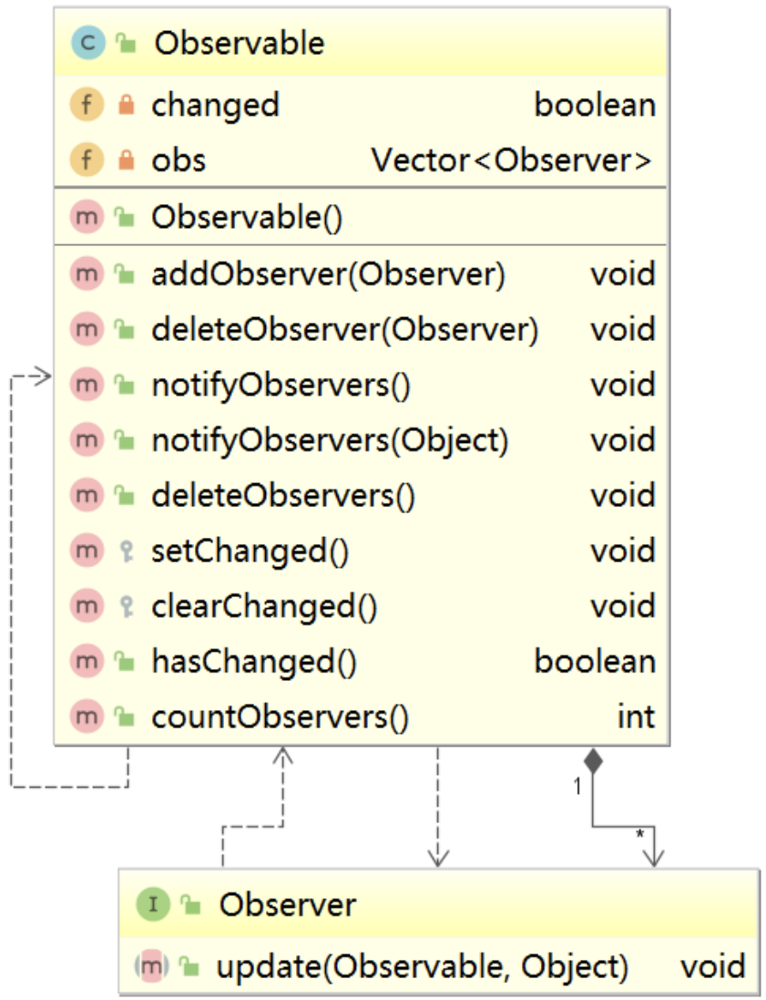

# 观察者模式
## 概念
在软件系统中对象并不是孤立存在的，一个对象行为的改变可能会导致一个或多个其他与之存在依赖关系行为发生改变，它们之间将会产生联动，“触一发而动百发”。为了更好的描述对象之间存在的这种一对多的联动，产生了**观察者模式(Observer Pattern)** 这一解决方案。

其定义如下:

> `Wikipedia says`: The observer pattern is a software design pattern in which an object, called the subject, maintains a list of its dependents, called observers, and notifies them automatically of any state changes, usually by calling one of their methods.
>
> 观察者模式是一种软件设计模式，其中一个称为主体的对象维护其依赖项列表，称为观察者，并通常通过调用其方法之一自动将任何状态更改通知它们。
>
> Define a one-to-many dependency between objects so that when one object changes state, all its dependents are notified and updated automatically.
>
> 定义对象之间的一种一对多的依赖关系，使得每当一个对象状态发生改变时其相关依赖对象都得到通知并被自动更新。

在观察者模式中，发生改变的对象称为观察目标，而被通知的对象称为观察者，一个观察目标可以对应多个观察者，而且这些观察者之间可以没有任何相互联系，可以根据需要增加和删除观察者，使得系统更易于扩展。

观察者模式的`别名`包括：**发布-订阅（Publish/Subscribe）模式**、**模型-视图（Model/View）模式**、**源监听器（Source/Listener）模式**、**从属者（Dependents）模式**。

## 观察者模式的结构
| ##container## |
|:--:|
||

在观察者模式结构图中包含如下几个角色：
- `Subject`（**目标**）：目标又称为主题，它是指被观察的对象。在目标中定义了一个观察者集合，一个观察目标可以接受任意数量的观察者来观察，它提供一系列方法来增加和删除观察者对象，同时它定义了通知方法`notify()`。目标类可以是接口，也可以是抽象类或具体类。

- `ConcreteSubject`（**具体目标**）：具体目标是目标类的子类，通常它包含有经常发生改变的数据，当它的状态发生改变时，向它的各个观察者发出通知；同时它还实现了在目标类中定义的抽象业务逻辑方法。如果无须扩展目标类，则具体目标类可以省略。

- `Observer`（**观察者**）：观察者将对观察目标的改变做出反应，观察者一般定义为接口，该接口声明了更新数据的方法`update()`，因此又称为抽象观察者。

- `Concrete Observer`（**具体观察者**）：在具体观察者中维护一个指向具体目标对象的引用，它存储具体观察者的有关状态，这些状态需要和具体目标的状态保持一致；它实现了在抽象观察者`Observer`中定义的`update()`方法。通常在实现时，可以调用具体目标类的`attach()`方法将自己添加到目标类的集合中或通过`detach()`方法将自己从目标类的集合中删除。

## 观察者模式的实现
> 使用`观察者模式`写一个游戏: 现在有两队角色
> - 一队角色使用技能, 技能会对另一对角色造成群体效果 (比如范围攻击, 范围回复)
> - 如何范围攻击一队的人, 进行效果计算?
>     - 可以使用 观察者模式 对一队的角色进行管理, 这样 是不是简单多了?

### 类图设计
| ##container## |
|:--:|
||

### 代码实现
抽象观察者(接口)

```C++
#ifndef _ROLEOBSERVER_H_
#define _ROLEOBSERVER_H_

namespace obs
{
    class RoleObserver
    {
    public:
        virtual void updateHp(RoleSkill* skill) = 0;
        virtual int getCamp() = 0;
    };
}

#endif // !_ROLEOBSERVER_H_
```

具体观察者

```C++
#ifndef _ROLE_H_
#define _ROLE_H_

namespace obs
{
    class Role : public RoleObserver
    {
        CC_SYNTHESIZE(int, hp, Hp);
        CC_SYNTHESIZE_SET(RoleSkill*, skill, Skill);
    private:
        int camp;
        std::string name;
    public:
        Role(std::string name, int hp, int camp) {
            this->hp = hp;
            this->name = name;
            this->camp = camp;
            this->skill = nullptr;
        }
        void useSkill() {
            // 无法释放技能的情况
            if (hp <= 0 || !skill) return;
            std::cout << name << "：使用了" << skill->toString() << std::endl;
            skill->notify(this);
            std::cout << std::endl;
        }
        void updateHp(RoleSkill* skill) override
        {
            // 如果已经死亡
            if (hp <= 0) return;
            // 更新血量
            hp += skill->getHp();
            if (skill->getHp() > 0)
                std::cout << name << "：获得了" << skill->getHp() << "点生命值(r" << hp << ")" << std::endl;
            else
                std::cout << name << "：受到了" << -skill->getHp() << "点伤害值(r" << hp << ")" << std::endl;
            // 死亡处理
            if (hp <= 0)
            {
                std::cout << name << "：啊，我被打死了" << std::endl;
            }
        }
        int getCamp() override
        {
            return camp;
        }
    };
}

#endif // !_ROLE_H_
```

抽象目标

```C++
// .h
#ifndef _ROLESKILL_H_
#define _ROLESKILL_H_
#include <vector>
namespace obs
{
    class RoleObserver;
    class RoleSkill
    {
        CC_SYNTHESIZE(int, hp, Hp);
    protected:
        std::vector<RoleObserver*> observers;
    public:
        void addTarget(RoleObserver* observer);
        void removeTarget(RoleObserver* observer);
        virtual void notify(RoleObserver* observer) = 0;
        virtual std::string toString() = 0;
    };
}

#endif // !_ROLESKILL_H_

// .cpp
#include "RoleSkill.h"

void obs::RoleSkill::addTarget(RoleObserver* observer)
{
    observers.emplace_back(observer);
}

void obs::RoleSkill::removeTarget(RoleObserver* observer)
{
    auto iter = std::find(observers.begin(), observers.end(), observer);
    if (iter != observers.end())
    {
        observers.erase(iter);
    }
}
```

具体目标类 (节选)

```C++
#ifndef _HURTSKILL_H_
#define _HURTSKILL_H_

namespace obs
{
    class HurtSkill : public RoleSkill
    {
    public:
        HurtSkill() {
            hp = -150;
        }
        void notify(RoleObserver* observer) override
        {
            for (auto sub : observers)
            {
                // 只伤害敌方阵营的敌人
                if (sub->getCamp() != observer->getCamp())
                {
                    sub->updateHp(this);
                }
            }
        }
        std::string toString() override
        {
            return "金系大宝剑";
        }
    };
}

#endif // !_HURTSKILL_H_
```

单个角色类

```C++
#ifndef _ROLE_H_
#define _ROLE_H_

namespace obs
{
    class Role : public RoleObserver
    {
        CC_SYNTHESIZE(int, hp, Hp);
        CC_SYNTHESIZE_SET(RoleSkill*, skill, Skill);
    private:
        int camp;
        std::string name;
    public:
        Role(std::string name, int hp, int camp) {
            this->hp = hp;
            this->name = name;
            this->camp = camp;
            this->skill = nullptr;
        }
        void useSkill() {
            // 无法释放技能的情况
            if (hp <= 0 || !skill) return;
            std::cout << name << "：使用了" << skill->toString() << std::endl;
            skill->notify(this);
            std::cout << std::endl;
        }
        void updateHp(RoleSkill* skill) override
        {
            // 如果已经死亡
            if (hp <= 0) return;
            // 更新血量
            hp += skill->getHp();
            if (skill->getHp() > 0)
                std::cout << name << "：获得了" << skill->getHp() << "点生命值(r" << hp << ")" << std::endl;
            else
                std::cout << name << "：受到了" << -skill->getHp() << "点伤害值(r" << hp << ")" << std::endl;
            // 死亡处理
            if (hp <= 0)
            {
                std::cout << name << "：啊，我被打死了" << std::endl;
            }
        }
        int getCamp() override
        {
            return camp;
        }
    };
}

#endif // !_ROLE_H_
```

建造游戏测试场所类

```C++
#ifndef _GAMECORE_H_
#define _GAMECORE_H_
#include <vector>
#include <memory>
#include <sstream>
#include "role/Role.h"
#include "skill/CureSkill.h"
#include "skill/HurtSkill.h"
#include "../util/RandomUtil.h"
namespace obs
{
    class GameCore
    {
    private:
        // 阵营列表（观察者）
        std::vector<std::shared_ptr<Role>> camp1;
        std::vector<std::shared_ptr<Role>> camp2;
        // 技能（目标）
        std::shared_ptr<CureSkill> cureSkill;
        std::shared_ptr<HurtSkill> hurtSkill;
        // 初始阵营
        void initCamp(std::vector<std::shared_ptr<Role>>& camps, int camp) {
            std::stringstream ss;
            std::string name;
            RandomUtil rand;
            bool isCure = false;
            for (size_t i = 0; i < 3; i++)
            {
                // 拼接名称
                ss.clear();
                ss << (camp == 1 ? "金" : "木") << "-" << i;
                ss >> name;
                ss.str("");
                // 创建角色
                auto role = std::make_shared<Role>(name, rand.randInt(400, 500), camp);
                // 设置技能
                if (rand.nextBool() && !isCure) {
                    role->setSkill(cureSkill.get());
                    isCure = true;
                }
                else
                    role->setSkill(hurtSkill.get());
                // 注册到目标对象
                hurtSkill->addTarget(role.get());
                cureSkill->addTarget(role.get());
                // 添加到阵营里面
                camps.emplace_back(role);
            }
        }
        // 初始化
        void init() {
            // 初始化技能
            cureSkill = std::make_shared<CureSkill>();
            hurtSkill = std::make_shared<HurtSkill>();
            // 初始化阵营
            initCamp(camp1, 1);
            initCamp(camp2, 0);
        }
        // 移除阵营中死亡目标
        void removeDead(std::vector<std::shared_ptr<Role>>& camps) {
            auto iter = camps.begin();
            while (iter != camps.end())
            {
                auto role = *iter;
                if (role->getHp() <= 0)
                {
                    cureSkill->removeTarget(role.get());
                    hurtSkill->removeTarget(role.get());
                    iter = camps.erase(iter);
                    continue;
                }
                iter++;
            }
        }
    public:
        GameCore() {
            init();
        }
        // 开始战斗
        void fight() {
            //定义攻击序列索引
            size_t idx1 = 0;
            size_t idx2 = 0;
            RandomUtil rand;
            do
            {
                // 按照攻击序列释放技能
                if (rand.nextBool())
                {
                    camp1.at(idx1)->useSkill();
                    camp2.at(idx2)->useSkill();
                }
                else
                {
                    camp2.at(idx2)->useSkill();
                    camp1.at(idx1)->useSkill();
                }
                //移除死亡角色
                removeDead(camp1);
                removeDead(camp2);
                //更新攻击序列
                idx1++;
                idx2++;
                if (idx1 >= camp1.size()) idx1 = 0;
                if (idx2 >= camp1.size()) idx2 = 0;
            } while (!camp1.empty() && !camp2.empty());
        }
    };
}

#endif // !_GAMECORE_H_
```

客户端 使用

```C++
int main()
{
    obs::GameCore core;
    core.fight();
    return 0;
}
```

## JDK对观察者模式的支持（了解）
观察者模式在 Java 语言中的地位非常重要。在`JDK`的`java.util`包中，提供了`Observable`类以及`Observer`接口，它们构成了`JDK`对观察者模式的支持。

| ##container## |
|:--:|
||

在`java.util.Observer`接口中只声明一个方法（`update`），它充当抽象观察者，当观察目标的状态发生变化时，该方法将会被调用。在`Observer`的子类中将实现`update()`方法，即具体观察者可以根据需要具有不同的更新行为。当调用观察目标类`Observable`的`notifyObservers()`方法时，将执行观察者类中的`update()`方法。

我们**可以直接使用`Observer`接口和`Observable`类来作为观察者模式的抽象层，再自定义具体观察者类和具体观察目标类**，通过使用`JDK`中的`Observer`接口和`Observable`类，可以更加方便地在Java语言中应用观察者模式。

## Java中的事件处理（了解）
`JDK 1.0`及更早版本的事件模型基于**职责链模式**，但是这种模型不适用于复杂的系统，因此在`JDK 1.1`及以后的各个版本中，事件处理模型采用基于**观察者模式的委派事件模型(Delegation Event Model, DEM)**，即**一个Java组件所引发的事件并不由引发事件的对象自己来负责处理，而是委派给独立的事件处理对象负责**。

在DEM模型中，目标角色（如界面组件）负责发布事件，而观察者角色（事件处理者）可以向目标订阅它所感兴趣的事件。当一个具体目标产生一个事件时，它将通知所有订阅者。事件的发布者称为**事件源(Event Source)**，而订阅者称为**事件监听器(Event Listener)**，在这个过程中还可以通过**事件对象(EventObject)** 来传递与事件相关的信息。**事件源对象、事件监听对象和事件对象构成了Java事件处理模型的三要素**。事件源对象充当观察目标，而事件监听对象充当观察者。

以按钮点击事件为例:

```java
JButton button = new JButton("注册");
button.addActionListener(new ActionListenerC) {
    @override
    public void actionPerformed(ActionEvent e) {}
);

protected void fireActionPerformed(ActionEvent event) {
    // Guaranteed to return a non-null array
    Object[] listeners = listenerList.getListenerList();
    ActionEvent e = null;
    // Process the listeners last to first, notifying
    // those that are interested in this event
    for （int i = listeners.length - 2; i >= 0; i -= 2) {
        if (listeners[i] == ActionListener.class) {
            // Lazily create the event:
            if (e == null) {
                String actionCommand = event.getActionCommandC);
                if(actionCommand == null) {
                    actionCommand = getActionCommand();
                }
                e = new ActionEvent(AbstractButton.this,
                                    ActionEvent.ACTION_PERFORMED,
                                    actionCommand,
                                    event.getwhen(),
                                    event.getModifiers());
            }
            ((ActionListener)listeners[i+l]).actionPerformed(e);
        }
    }
}
```

其事件处理流程如下：
1. 当用户单击按钮，将触发一个事件（此时以`ActionEvent`类型的动作事件为例），`JVM`将产生一个相应的`ActionEvent`类型的事件对象，在该事件对象中包含了有关事件和事件源的信息，此时按钮是事件源对象；

2. 将`ActionEvent`事件对象传递给事件监听对象（`ActionListener`），最终在`ActionListener`实现类的`actionPerformed()`方法中，对所发生事件做出相应的处理；

3. 开发人员将`ActionListener`接口的实现类对象注册到按钮中，可以通过按钮类的
`addActionListener()`方法来实现注册；

4. `JVM`在触发事件时将调用按钮的`fireActionPerformed()`方法，在该方法内部将调用注册到按钮中的事件处理对象的`actionPerformed()`方法，实现对事件的处理。

## 观察者模式适用环境
观察者模式是一种使用频率非常高的设计模式，无论是移动应用、Web应用或者桌面应用，观察者模式几乎无处不在，它为实现对象之间的联动提供了一套完整的解决方案，凡是涉及到一对一或者一对多的对象交互场景都可以使用观察者模式。

### 主要优点
- 观察者模式可以实现表示层和数据逻辑层的分离，定义了稳定的消息更新传递机制，并抽象了更新接口，使得可以有各种各样不同的表示层充当具体观察者角色。

- 观察者模式支持广播通信，观察目标会向所有已注册的观察者对象发送通知，简化了一对多系统设计的难度。

- 观察者模式满足“开闭原则”的要求，增加新的具体观察者无须修改原有系统代码，在具体观察者与观察目标之间不存在关联关系的情况下，增加新的观察目标也很方便。

### 主要缺点
- 如果一个观察目标对象有很多直接和间接观察者，通知所有的观察者会花费很多时间。

- 如果在观察者和观察目标之间存在循环依赖，观察目标会触发它们之间进行循环调用，可能导致系统崩溃。

- 观察者模式没有相应的机制让观察者知道所观察的目标对象是怎么发生变化的，而仅仅只是知道观察目标发生了变化。

### 适用场景
- 当一个对象状态的改变需要改变其他对象时，可使用观察者模式。

- 需要在系统中创建一个触发链，A对象的行为将影响B对象，B对象的行为将影响C对象……，可以使用观察者模式创建一种链式触发机制。