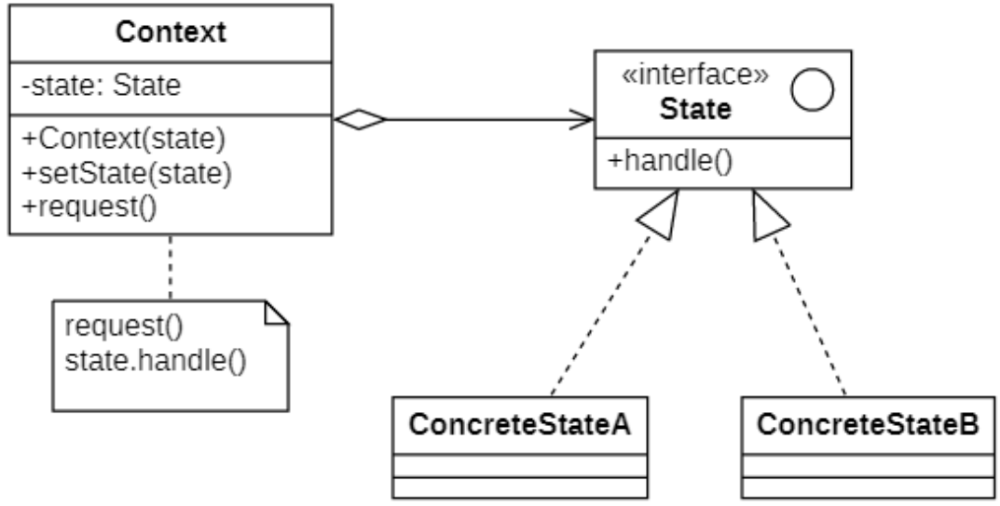
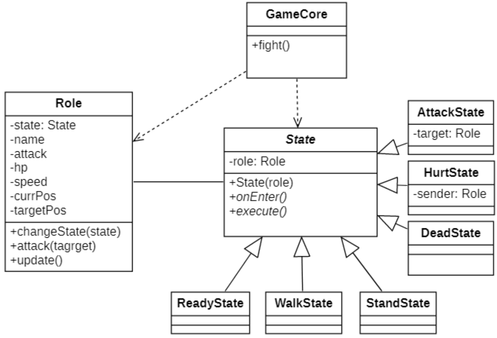

# 状态模式
## 概念
在软件系统中，有些对象也像水一样具有多种状态，这些状态在某些情况下能够相互转换，而且对象在不同的状态下也将具有不同的行为。如果使用复杂的条件判断语句（如if或switch）来进行状态的判断和转换操作，这会导致代码的可维护性和灵活性下降，特别是出现新状态的时候代码的扩展性很差，客户端代码也需要进行修改，违反开闭原则。为了更好地对这些具有多种状态的对象进行设计，我们可以使用一种被称之为**状态模式（State Pattern）** 的设计模式。

其定义如下:
> `Wikipedia says`: The state pattern is a behavioral software design pattern that allows an object to alter its behavior when its internal state changes. This pattern is close to the concept of finite-state machines. The state pattern can be interpreted as a strategy pattern, which is able to switch a strategy through invocations of methods defined in the pattern's interface.
>
> 状态模式是一种行为软件设计模式，它允许对象在其内部状态发生变化时改变其行为。这种模式接近于有限状态机的概念。状态模式可以解释为策略模式，它能够通过调用模式接口中定义的方法来切换策略。
>
> 有限状态机（FSM）：[wiki-有限状态机](https://zh.wikipedia.org/wiki/%E6%9C%89%E9%99%90%E7%8A%B6%E6%80%81%E6%9C%BA)
>
> Allow an object to alter its behavior when its internal state changes. The object will appear to change its class.
>
> 允许对象在其内部状态更改时更改其行为。对象将看起来像修改了它的类。

状态模式又名**状态对象（Object for States）**.

## 状态模式的结构
| ##container## |
|:--:|
||

在状态模式结构图中包含如下几个角色：
- `Context`（**环境类**）：环境类又称为上下文类，它是拥有多种状态的对象。由于环境类的状态存在多样性且在不同状态下对象的行为有所不同，因此将状态独立出去形成单独的状态类。在环境类中维护一个抽象状态类`State`的实例，这个实例定义当前状态，在具体实现时，它是一个`State`子类的对象。

- `State`（**抽象状态类**）：它用于定义一个接口以封装与环境类的一个特定状态相关的行为，在抽象状态类中声明了各种不同状态对应的方法，而在其子类中实现类这些方法，由于不同状态下对象的行为可能不同，因此在不同子类中方法的实现可能存在不同，相同的方法可以写在抽象状态类中。

- `Concrete State`（**具体状态类**）：它是抽象状态类的子类，每一个子类实现一个与环境类的一个状态相关的行为，每一个具体状态类对应环境的一个具体状态，不同的具体状态类其行为有所不同。

在状态模式的使用过程中，一个对象的状态之间还可以进行相互转换，通常有两种实现状态转换的方式:

- 统一由环境类来负责状态之间的转换
    ```C++
    public:
    void changeState() {
        // 判断属性值，根据属性值进行状态转换
        if (value == 0) {
            this->setState(new ConcreteStateA());
        }
        else if (value == 1) {
            this->setState(new ConcreteStateB());
        }
    }
    ```

- 由具体状态类来负责状态之间的转换

    ```C++
    public:
    void changeState(Context* ctx) {
        // 根据环境对象中的属性值进行状态转换
        if (ctx->getValue() == 1) {
            this->setState(new ConcreteStateA());
        }
        else if (ctx->getValue() == 2) {
            this->setState(new ConcreteStateB());
        }
    }
    ```

## 状态模式的实现
> 下面来模拟游戏角色状态切换。

### 类图设计
| ##container## |
|:--:|
||

### 代码实现
> 此处实现方式: 由具体状态类来负责状态之间的转换

抽象状态类

```C++
#ifndef _STATE_H_
#define _STATE_H_
#include <iostream>
using namespace std;
namespace st
{
    class State
    {
    protected:
        Role* self;
    public:
        State(Role* self) {
            this->self = self;
        }
        virtual void onEnter() = 0;
        virtual void execute() = 0;
    };
}

#endif // !_STATE_H_
```

具体状态类(节选)

```C++
#ifndef _ATTACKSTATE_H_
#define _ATTACKSTATE_H_

namespace st
{
    class AttackState : public State
    {
    private:
        Role* target;
    public:
        AttackState(Role* self, Role* target) :State(self) {
            this->target = target;
        }
        void onEnter() override
        {
            cout << self->getName() << "：进入了攻击状态" << endl;
        }
        void execute() override
        {
            cout << self->getName() << "：我正在收拾"<< target->getName() << endl;
            // 目标进入受伤状态
            auto hurt = make_shared<HurtState>(target, self);
            target->changeState(hurt);
            // 自己进入站立状态
            auto stand = make_shared<StandState>(self);
            self->changeState(stand);
        }
    };
}

#endif // !_ATTACKSTATE_H_
```

角色类

```C++
// .h
#ifndef _ROLE_H_
#define _ROLE_H_

namespace st
{
    class State;
    class Role
    {
        CC_SYNTHESIZE_GET(std::shared_ptr<State>, state, State);
        CC_SYNTHESIZE(std::string, name, Name);
        CC_SYNTHESIZE(int, ap, Ap);
        CC_SYNTHESIZE(int, hp, Hp);
        CC_SYNTHESIZE(int, speed, Speed);
        CC_SYNTHESIZE(int, cpos, Cpos);
        CC_SYNTHESIZE(int, tpos, Tpos);
    public:
        Role();
        Role(std::string name, int ap, int hp, int speed, int tpos);
        void changeState(std::shared_ptr<State> state);
        void attack(Role* target);
        void update();
    };
}

#endif // !_ROLE_H_

// .cpp
#include "Role.h"
#include "State.h"
#include "st/AttackState.h"

st::Role::Role()
{
    this->state = nullptr;
    this->ap = 0;
    this->hp = 0;
    this->tpos = 0;
    this->cpos = 0;
    this->speed = 0;
}

st::Role::Role(std::string name, int ap, int hp, int speed, int tpos)
{
    this->state = nullptr;
    this->name = name;
    this->ap = ap;
    this->hp = hp;
    this->speed = speed;
    this->tpos = tpos;
    this->cpos = 0;
}

void st::Role::changeState(std::shared_ptr<State> state)
{
    this->state = state;
    this->state->onEnter();
}

void st::Role::attack(Role* target)
{
    changeState(std::make_shared<AttackState>(this, target));
}

void st::Role::update()
{
    this->state->execute();
}
```

模拟游戏场景类 (text)

```C++
namespace st
{
    class GameCore
    {
    private:
        // 判断当前角色是否处于某个状态
        bool isState(Role* r, std::string sname) {
            stringstream ss;
            ss << "class st::" << sname;
            return strcmp(typeid(*(r->getState())).name(), ss.str().c_str()) == 0;
        }
    public:
        void fight() {
            // 初始化两个角色
            Role r1("东东哥", 100, 300, 5, 20);
            Role r2("图灵机", 90, 400, 4, 20);
            r1.changeState(std::make_shared<ReadyState>(&r1));
            r2.changeState(std::make_shared<ReadyState>(&r2));
            //模拟战斗
            bool isR1 = false;
            do 
            {
                // 判断双方是否到达战场
                if (isState(&r1,"StandState") && isState(&r2, "StandState"))
                {
                    if (isR1)
                        r1.attack(&r2);
                    else
                        r2.attack(&r1);
                    isR1 = !isR1;
                }
                // 更新显示
                r1.update();
                r2.update();
                // 短暂休眠
                Sleep(500);
            } while (!isState(&r1,"DeadState") && !isState(&r2, "DeadState"));
        }
    };
}

#endif // !_GAMECORE_H_
```

客户端使用

```C++
int main()
{
    st::GameCore core;
    core.fight();
    return 0;
}
```

## 状态模式适用环境
在实际开发中，状态模式具有较高的使用频率，在**工作流和游戏开发**中状态模式都得到了广泛的应用，例如公文状态的转换、游戏中角色状态切换等。

### 主要优点
- **封装了状态的转换规则**，在状态模式中可以将状态的转换代码封装在环境类或者具体状态类中，可以对状态转换代码进行集中管理，而不是分散在一个个业务方法中。

- **将所有与某个状态有关的行为放到一个类中**，只需要注入一个不同的状态对象即可使环境对象拥有不同的行为。

- **允许状态转换逻辑与状态对象合成一体，而不是提供一个巨大的条件语句块**，状态模式可以让我们避免使用庞大的条件语句来将业务方法和状态转换代码交织在一起。

- 可以**让多个环境对象共享一个状态对象**，从而减少系统中对象的个数。

### 主要缺点
- 状态模式的使用必然会**增加系统中类和对象的个数，导致系统运行开销增大**。

- 状态模式的结构与实现都较为复杂，如果使用不当将导致程序结构和代码的混乱，**增加系统设计的难度**。

- 状态模式**对“开闭原则”的支持并不太好**，
    - 增加新的状态类需要修改那些负责状态转换的源代码，否则无法转换到新增状态；
    - 修改某个状态类的行为也需修改对应类的源代码。

### 适用场景
- 如果对象**需要根据自身当前状态进行不同行为**，同时**状态的数量非常多且与状态相关的代码会频繁变更**的话，可使用状态模式。

- 如果某个类需要根据成员变量的当前值改变自身行为，从而**需要使用大量的条件语句**时，可使用该模式。

- 当**相似状态和基于条件的状态机转换中存在许多重复代码**时，可使用状态模式。