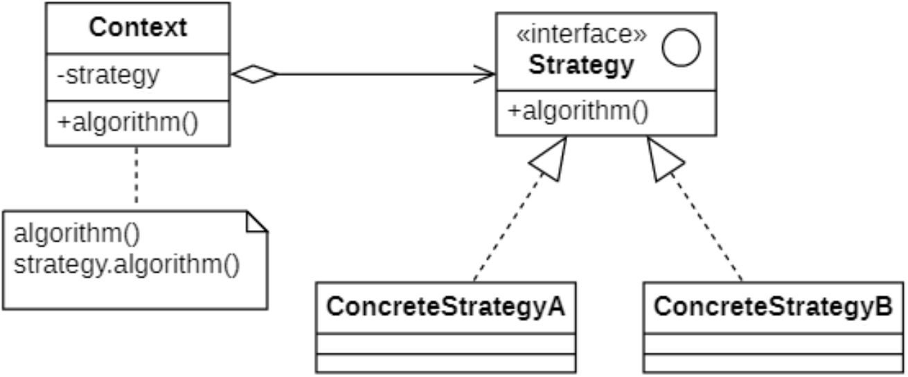
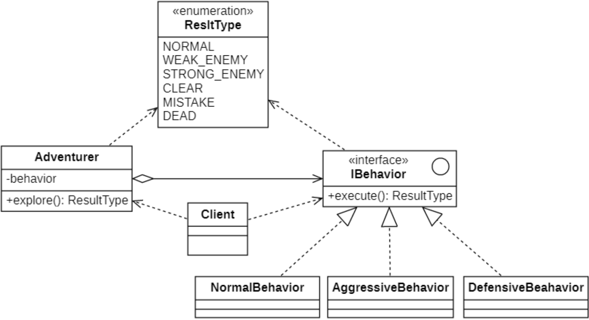

# 策略模式
## 概念
在很多情况下，实现某个目标的途径不止一条。比如我们要到一个地方去，可以选择交通方式（如：地铁、公交、骑行、步行等等）有很多种，考虑时间、距离、交通状况来决定那种方式。

在软件开发中，我们也常常会遇到类似的情况，实现某一个功能（如：排序、查找等）有多种算法，可以通过硬编码（**Hard Coding**）将多种算法集中在一个类中，然后通过下面两种方式来访问算法:
- 在类中提供多个方法来访问某个具体算法；
- 提供一个方法，通过条件语句进行算法选择。

此时如果新增一种算法必将修改算法类，也需要修改客户端代码来调用新的算法。在统一的算法类中封装了大量的算法，代码非常复杂，不易维护和扩展。此时我们可以使用一种设计模式来实现灵活地选择算法，还能方便的增加新的算法，**策略模式(Strategy Pattern)** 应运而生。

其定义如下：
> `Wikipedia says`: In computer programming, the strategy pattern (also known as the policy pattern) is a behavioral software design pattern that enables selecting an algorithm at runtime.
>
> 在计算机编程中，策略模式（也称为政策模式）是一种行为软件设计模式，可以在运行时选择算法。
>
> Define a family of algorithms, encapsulate each one, and make them interchangeable. Strategy lets the algorithm vary independently from the clients that use it.
>
> 定义一系列算法，将每一个算法封装起来，并让它们可以相互替换。策略模式让算法可以独立于使用它的客户端而变化。

每一个封装算法的类都可以称为一种策略，为了保证这些策略在使用时具有一致性，一般会提供一个抽象的策略类来做算法声明。

## 策略模式的结构
| ##container## |
|:--:|
||

在策略模式结构图中包含如下几个角色:

- `Context`（**环境类**）：环境类是使用算法的角色，它在解决某个问题（即实现某个方法）时可以采用多种策略。在环境类中维持一个对抽象策略类的引用实例，用于定义所采用的策略。

- `Strategy`（**抽象策略类**）：它为所支持的算法声明了抽象方法，是所有策略类的父类，它可以是抽象类或具体类，也可以是接口。环境类通过抽象策略类中声明的方法在运行时调用具体策略类中实现的算法。

- `Concrete Strategy`（**具体策略类**）：它实现了在抽象策略类中声明的算法，在运行时，具体策略类将覆盖在环境类中定义的抽象策略类对象，使用一种具体的算法实现某个业务处理。

策略模式是一个比较容易理解和使用的设计模式，策略模式是对算法的封装，它把算法的责任和算法本身分割开，委派给不同的对象管理。

## 策略模式的实现
> 模拟一个探险小游戏。
>
> 玩家可以进行 [探险, 攻击弱小的动物, 遇到厉害的怪物就穿上装备] 操作(`Behavior`)

### 类图设计
| ##container## |
|:--:|
||

### 代码实现
`Behavior`抽象类 即 抽象策略类

```C++
#ifndef _ADVENTURER_H_
#define _ADVENTURER_H_

namespace strat
{
    class Adventurer
    {
        CC_SYNTHESIZE_SET(shared_ptr<IBehavior>, behavior, Behavior);
    public:
        ResultType explore() {
            return this->behavior->execute();
        }
    };
}

#endif // !_ADVENTURER_H_
```

具体策略类 (节选)

```C++
#ifndef _AGGRESSIVEBEHAVIOR_H_
#define _AGGRESSIVEBEHAVIOR_H_

namespace strat
{
    class AggressiveBehavior : public IBehavior
    {
    public:
        ResultType execute() override
        {
            // 50%概率打赢
            if (RandomUtil().nextBool())
            {
                cout << "攻击模式：So Easy！！！" << endl;
                return ResultType::CLEAR;
            }
            cout << "攻击模式：好一头猪，专吃老虎，准备跑路吧！！！" << endl;
            return ResultType::MISTAKE;
        }
    };
}

#endif // !_AGGRESSIVEBEHAVIOR_H_
```

玩家(冒险者)类, 然后关联一个操作(策略)类指针

```C++
#ifndef _ADVENTURER_H_
#define _ADVENTURER_H_

namespace strat
{
    class Adventurer
    {
        CC_SYNTHESIZE_SET(shared_ptr<IBehavior>, behavior, Behavior);
    public:
        ResultType explore() {
            return this->behavior->execute();
        }
    };
}

#endif // !_ADVENTURER_H_
```

客户端, 模拟场景

```C++
int main()
{
    strat::Adventurer adv;
    adv.setBehavior(make_shared<strat::NormalBehavior>());
    do 
    {
        switch (adv.explore())
        {
        case strat::ResultType::STRONG_ENMY:
        case strat::ResultType::CLEAR:
            adv.setBehavior(make_shared<strat::NormalBehavior>());
            break;
        case strat::ResultType::DEAD:
            cout << "系统提示：探险者已经被抹杀！！！" << endl;
            return 0;
        case strat::ResultType::MISTAKE:
            adv.setBehavior(make_shared<strat::DefensiveBehavior>());
            break;
        case strat::ResultType::WEAK_ENMY:
            adv.setBehavior(make_shared<strat::AggressiveBehavior>());
            break;
        default:
            break;
        }
    } while (1);
    return 0;
}
```

## 策略模式适用环境
策略模式用于算法的自由切换和扩展，它是应用较为广泛的设计模式之一。策略模式对应于解决某一问题的一个算法族，允许用户从该算法族中任选一个算法来解决某一问题，同时可以方便地更换算法或者增加新的算法。只要涉及到算法的封装、复用和切换都可以考虑使用策略模式。

### 主要优点
- 你可以在运行时切换对象内的算法。
- 你可以将算法的实现和使用算法的代码隔离开来。
- 你可以使用组合来代替继承。
- 你无需对上下文进行修改就能够引入新的策略，符合开闭原则。
- 提供了一种算法的复用机制，由于将算法单独提取出来封装在策略类中，因此不同的环境类可以方便地复用这些策略类。
- 可以避免多重条件选择语句。

### 主要缺点
- **客户端必须知道所有的策略类，并自行决定使用哪一个策略类**。这就意味着客户端必须理解这些算法的区别，以便适时选择恰当的算法。
- **策略模式将造成系统产生很多具体策略类**，任何细小的变化都将导致系统要增加一个新的具体策略类。
- **无法同时在客户端使用多个策略类**，也就是说，在使用策略模式时，客户端每次只能使用一个策略类，不支持使用一个策略类完成部分功能后再使用另一个策略类来完成剩余功能的情况。

### 适用场景
- **一个系统需要动态地在几种算法中选择一种，那么可以将这些算法封装到一个个的具体算法类中，然后通过里氏替换原则进行动态切换**。
- **一个对象有很多的行为，如果不用恰当的模式，这些行为就只好使用多重条件选择语句来实现**。
- **不希望客户端知道复杂的、与算法相关的数据结构**，在具体策略类中封装算法与相关的数据结构，可以提高算法的保密性与安全性。