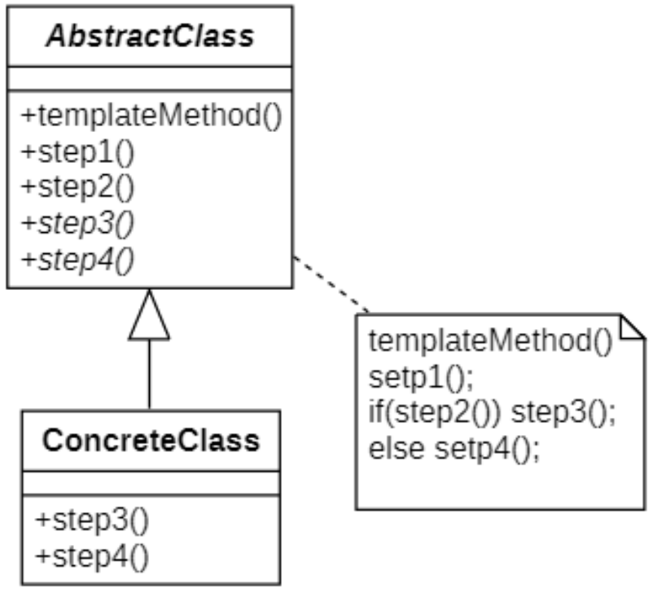
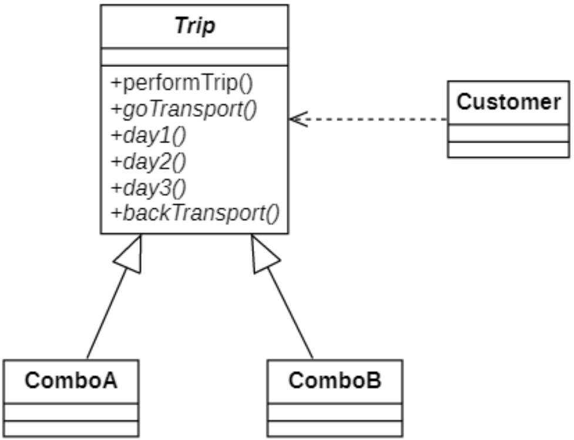

# 模板方法模式
## 概念
在生活中经常有请客到家了吃饭，大概经历的过程包括：邀请->接待->安座->开吃->送客这些步骤，某些步骤可能执行方式不同（如邀请可以通过电话、请帖、微信等），某些步骤执行方式几乎一致（如：接待、安座）。

在软件开发中，经常会类似的情况，某个方法的实现需要多个步骤，其中有些步骤是固定的，而有些步骤并不固定，存在可变性。为了提高代码的复用性和系统的灵活性，可以使用一种称之为**模板方法模式(Template Method Pattern)** 的设计模式来对这类情况进行设计。

其定义如下:
> `Wikipedia says`: The template method is a method in a superclass, usually an abstract superclass, and defines the skeleton of an operation in terms of a number of high-level steps. These steps are themselves implemented by additional helper methods in the same class as the template method.
>
> 模板方法是超类（通常是抽象超类）中的一种方法，并定义了一个对一系列高层步骤的操作框架。这些步骤本身是由与模板方法相同的类中的其他帮助程序方法实现的。
>
> Define the skeleton of an algorithm in an operation, deferring some steps to subclasses. Template Method lets subclasses redefine certain steps of an algorithm without changing the algorithm's structure.
>
> 定义一个操作中算法的框架，而将一些步骤延迟到子类中。模板方法模式使得子类可以不改变一个算法的结构即可重新定义该算法的某些特定步骤。

在模板方法模式中，将实现功能的每一个步骤所对应的方法称为基本方法（例如“邀请”、“接待”），而调用这些基本方法同时定义基本方法的执行次序的方法称为模板方法（例如“请客吃饭”）。通过使用模板方法模式，一方面提高了代码的复用性，另一方面还可以利用面向对象的多态性，在运行时选择一种具体子类，实现完整的“请客吃饭” 方法，提高系统的灵活性和可扩展性。

模板方法模式是一种***基于继承的代码复用技术***，它是一种**类行为型模式**。

## 模板方法模式的结构
### 结构
| ##container## |
|:--:|
||

在模板方法模式结构图中包含如下几个角色:
- `AbstractClass`(**抽象类**): 会声明作为算法步骤的方法， 以及依次调用它们的实际模板方法。算法步骤可以被声明为抽象类型， 也可以提供一些默认实现。

- `ConcreteClass`(**具体类**): 可以重写所有步骤， 但不能重写模板方法自身。

### 模板方法与基本方法
#### 模板方法
一个模板方法是定义在抽象类中的、把基本操作方法组合在一起形成一个总算法或一个总行为的方法。这个模板方法定义在抽象类中，并由子类不加以修改地完全继承下来。模板方法是一个具体方法，它给出了一个顶层逻辑框架，而逻辑的组成步骤在抽象类中可以是具体方法，也可以是抽象方法。由于模板方法是具体方法，**因此模板方法模式中的抽象层只能是抽象类，而不是接口**。

#### 基本方法
基本方法是实现算法各个步骤的方法，是模板方法的组成部分。基本方法又可以分为三种：抽象方法(**Abstract Method**)、具体方法(**Concrete Method**)和钩子方法(**Hook Method**)。
- 抽象方法：一个抽象方法由抽象类声明、由其具体子类实现。
- 具体方法：一个具体方法由一个抽象类或具体类声明并实现，其子类可以进行覆盖也可以直接继承。
- 钩子方法：一个钩子方法由一个抽象类或具体类声明并实现，而其子类可能会加以扩展。通常在父类中给出的实现是一个空实现作为默认实现。在模板方法模式中，钩子方法有两类：
    - 第一类钩子方法可以与一些**具体步骤“挂钩”**，以实现在不同条件下执行模板方法中的不同步骤，这类钩子方法的返回类型通常是布尔类型的，这类方法名一般为`isXXX()`，用于对某个条件进行判断，如果条件满足则执行某一步骤，否则将不执行，如下代码片段所示:
      
      ```java
      // 模板方法
      public void templateMethod() {
          open();
          display();
          // 通过钩子方法来确定某步骤是否执行,默认自动关闭
          if (isClose()) {
              close();
          }
      }
      
      // 钩子方法
      public bool isClose() {
          return true;
      }
      ```
    - 还有一类钩子方法就是**实现体为空的具体方法**，子类可以根据需要覆盖或者继承这些钩子方法

## 模板方法模式的实现
> 下面通过模板方法模式来模拟(三日游)旅行过程。
>
> 一般旅游都是以下步骤: 出发, 第一天, 第二天, 第三天, 回来
>
> 故, 实际上有一个顺序: 先出发, 再是第一天, 然后是... 这样 (所以可以有模板方法模式)

### 类图设计
| ##container## |
|:--:|
||

### 代码实现
抽象模版方法类

```C++
#ifndef _TRIP_H_
#define _TRIP_H_
#include <iostream>
using namespace std;
namespace tmpl
{
    class Trip
    {
    protected:
        virtual void goTrans() = 0;
        virtual void day1() = 0;
        virtual void day2() = 0;
        virtual void day3() = 0;
        virtual void backTrans() = 0;
    public:
        virtual void performTrip() final // 规定的事件的发生顺序, 并且不允许被子类重写
        {
            goTrans();
            day1();
            day2();
            day3();
            backTrans();
        }
    };
}

#endif // !_TRIP_H_
```

具体模版方法类 (节选)

```C++
// .h
#ifndef _COMBOA_H_
#define _COMBOA_H_

namespace tmpl
{
    class ComboA : public Trip
    {
        DECLARE_CLASS(tmpl::ComboA);
    protected:
        void goTrans() override;
        void day1() override;
        void day2() override;
        void day3() override;
        void backTrans() override;
    };
}

#endif // !_COMBOA_H_

// .cpp
#include "ComboA.h"

IMPLEMENT_CLASS(tmpl::ComboA);

void tmpl::ComboA::goTrans()
{
    cout << "乘坐汽车去目的地" << endl;
}

void tmpl::ComboA::day1()
{
    cout << "沙滩排球、游泳、看日出" << endl;
}

void tmpl::ComboA::day2()
{
    cout << "参观水族馆" << endl;
}

void tmpl::ComboA::day3()
{
    cout << "航海、孤岛" << endl;
}

void tmpl::ComboA::backTrans()
{
    cout << "坐船离开孤岛，乘坐飞机回家" << endl;
}
```

客户端使用

```C++
int main()
{
    // 读取配置文件
    CREATE_PROPERTIES(prop, conf);
    string cname = prop.getProperty("tmpl");
    // 创建套餐实例
    GET_INSTANCE_BY_NAME(tmpl::Trip*, trip, cname);
    // 去旅行
    trip->performTrip();
    // 释放资源
    delete trip;
    return 0;
}
```

## 模板方法模式适用环境
**模板方法模式是基于继承的代码复用技术**，它体现了面向对象的诸多重要思想，是一种使用较为频繁的模式。模板方法模式广泛应用于框架设计中，以确保通过父类来控制处理流程的逻辑顺序（如框架的初始化，测试流程的设置等）。

### 主要优点
- 在父类中形式化地定义一个算法，而由它的子类来实现细节的处理，在子类实现详细的处理算法时并不会改变算法中步骤的执行次序。
- 模板方法模式是一种代码复用技术，它提取了类库中的公共行为，将公共行为放在父类中，而通过其子类来实现不同的行为，它鼓励我们恰当使用继承来实现代码复用。
- 可实现一种反向控制结构，通过子类覆盖父类的钩子方法来决定某一特定步骤是否需要执。

### 主要缺点
- 模板方法中的步骤越多， 其维护工作就可能会越困难，此时，可结合[桥接模式](../../008-结构型模式/002-桥接模式/index.md)来进行设计。

### 适用场景
- 当你只希望客户端扩展某个特定算法步骤，而不是整个算法或其结构时。
- 当多个类的算法除一些细微不同之外几乎完全一样时。
- 各子类中公共的行为应被提取出来并集中到一个公共父类中以避免代码重复。