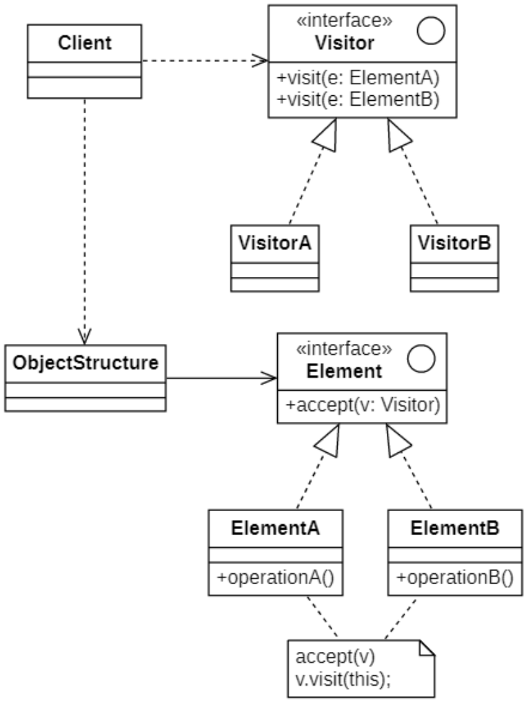
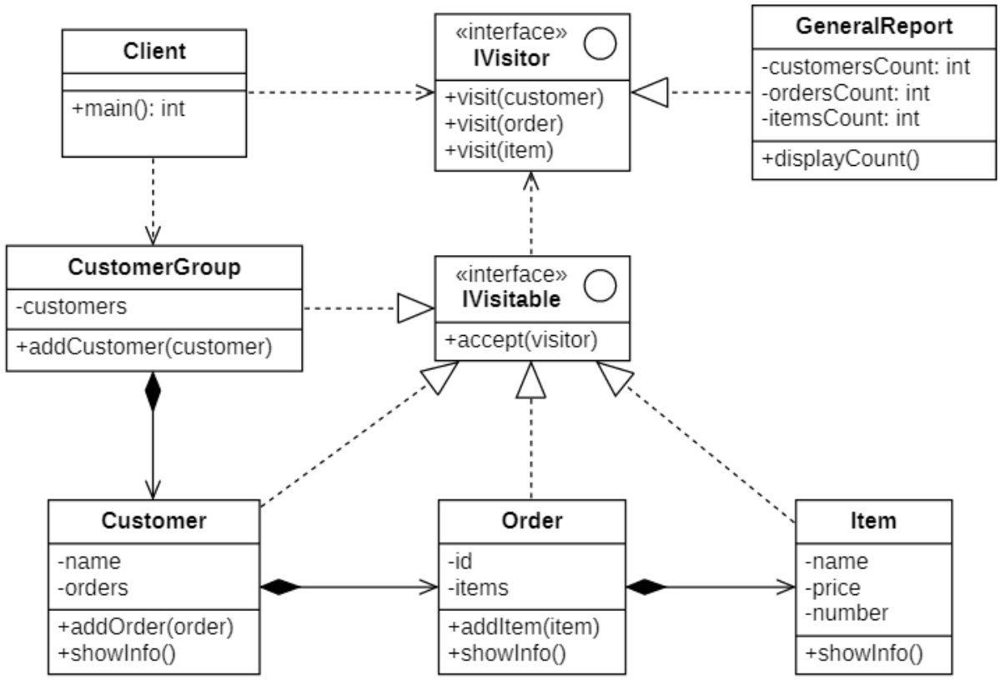

# 访问者模式
## 概念
集合是在面向对象编程中广泛使用的数据类型。通常，集合包含不同类型的对象，在这种情况下，必须在不知道类型的情况下对所有集合元素执行某些操作。

比如，我们想要操作某一类型的数据对象时，通常的做法是通过使用`instanceof`结合`if`来确定是否是想要的对象。这种方法 **不灵活** 且根本不是**面向对象的**，在这一点上，我们应该考虑**开闭原则**，我们可以用抽象类替换`if`块，并且每个具体类将实现自己的操作。

为了解决这类问题，就产生了**访问者模式(Visitor Pattern)**，其定义如下:
> `Wikipedia says`: The visitor design pattern is a way of separating an algorithm from an object structure on which it operates. A practical result of this separation is the ability to add new operations to existing object structures without modifying the structures.
>
> 访问者设计模式是一种将算法与其运行的对象结构分开的方法。这种分离的实际结果是能够在不修改结构的情况下向现有对象结构添加新操作。
>
> Represent an operation to be performed on the elements of an object structure. Visitor lets you define a new operation without changing the classes of the elements on which it operates.
>
> 提供一个作用于某对象结构中的各元素的操作表示，它使我们可以在不改变各元素的类的前提下定义作用于这些元素的新操作。

在使用访问者模式时，被访问元素通常不是单独存在的，它们存储在一个集合中，这个集合被称为“对象结构”，访问者通过遍历对象结构实现对其中存储的元素的逐个操作。

访问者模式在**遍历**对象结构的时候可以采用[迭代器模式](../004-迭代器模式/index.md)实现。

## 访问者模式的结构
| ##container## |
|:--:|
||

在访问者模式结构图中包含如下几个角色:
- `Visitor`(**抽象访问者**): 接口声明了一系列以对象结构的具体元素为参数的访问者方法。如果编程语言支持重载，这些方法的名称可以是相同的，但是其参数一定是不同的。

- `Concrete Visitor`(**具体访问者**): 实现了每个由抽象访问者声明的操作，每一个操作用于访问对象结构中一种类型的元素。

- `Element`(**抽象元素**): 接口声明了一个方法来 “接收” 访问者。该方法必须有一个参数被声明为访问者接口类型。

- `Concrete Element`(**具体元素**): 必须实现接收方法。该方法的目的是根据当前元素类将其调用重定向到相应访问者的方法。请注意，即使元素基类实现了该方法，所有子类都必须对其进行重写并调用访问者对象中的合适方法。

- `Object Structure`(**对象结构**): 对象结构是一个元素的集合，它用于存放元素对象，并且提供了遍历其内部元素的方法。它可以结合组合模式来实现，也可以是一个简单的集合对象，如一个List对象或一个Set对象。

其具体执行过程如下:
1. 调用具体元素类的`accept()`方法，并将`Visitor`子类对象作为其参数；
2. 在具体元素类`accept()`方法内部调用传入的`Visitor`对象的`visit()`方法，将当前具体元素类对象`this`作为参数，如`visitor.visit(this)`;
3. 执行`Visitor`对象的`visit()`方法，在其中还可以调用具体元素对象的业务方法，如`e.operation()`。

这种调用机制也称为“双重分派”，正因为使用了双重分派机制，使得增加新的访问者无须修改现有类库代码，只需将新的访问者对象作为参数传入具体元素对象的`accept()`方法，程序运行时将回调在新增`Visitor`类中定义的`visit()`方法，从而增加新的元素访问方式。

对象结构是一个集合，它用于存储元素对象并接受访问者的访问，其典型代码如下所示:
```C++
class Objectstructure {
private:
    // 定义一个集合用于存储元素对象
    vector<Element*> list;
public:
    void accept(Visitor* visitor) {
        // 遍历访问集合中的每一个元素
        for(Element* e : list) {
            e—→accept(visitor);
        }
    }
    
    void addElement(Element* element) {
        list.push_back(element);
    }
    
    void removeElement(Element* element) {
        auto iter = find(list.begin(),list.end(),element);
        if(iter ≠ list.end())
            list.earse(iter);
    }
};
```

## 访问者模式的实现
> 我们希望在应用程序中创建一个报告模块来统计一组用户信息，要求尽可能的详细。

### 类图设计
| ##container## |
|:--:|
||

### 代码实现
抽象访问者类

```C++
#ifndef _IVISITOR_H_
#define _IVISITOR_H_

namespace vis
{
    class Customer;
    class Order;
    class Item;
    class IVisitor
    {
    public:
        virtual void visit(Customer* cus) = 0;
        virtual void visit(Order* order) = 0;
        virtual void visit(Item* item) = 0;
        // 定义一个扩展接口，方便扩展操作
        virtual void extend() {};
    };
}

#endif // !_IVISITOR_H_
```

对象结构类(提供了一个存放obj的地方)
```C++
#ifndef _CUSTOMERGROUP_H_
#define _CUSTOMERGROUP_H_

namespace vis
{
    class CustomerGroup 
    {
    private:
        vector<shared_ptr<Customer>> customers;
    public:
        void addCustomer(Customer* customer) {
            customers.emplace_back(shared_ptr<Customer>(customer));
        }
        void accept(IVisitor* vistor) {
            for (auto cus : customers)
            {
                cus->accept(vistor);
            }
        }
    };
}

#endif // !_CUSTOMERGROUP_H_
```

抽象元素类
```C++
#ifndef _IVISITABLE_H_
#define _IVISITABLE_H_
#include "IVisitor.h"
#include <iostream>
using namespace std;
namespace vis
{
    class IVisitable
    {
    public:
        virtual void accept(IVisitor* visitor) = 0;
    };
}

#endif // !_IVISITABLE_H_
```

具体元素类(节选) 有运用(组合模式)

```C++
#ifndef _CUSTOMER_H_
#define _CUSTOMER_H_

namespace vis
{
    class Customer : public IVisitable
    {
        CC_SYNTHESIZE(string, name, Name);
    private:
        vector<shared_ptr<Order>> orders;
    public:
        void accept(IVisitor* visitor) {
            visitor->visit(this);
            // 访问所有的订单
            for (auto order : orders)
            {
                order->accept(visitor);
            }
        }
        void showInfo() {
            cout << endl;
            cout << "顾客：" << name << endl;
        }
        Customer(string name) {
            this->name = name;
        }
        Customer* addOrder(Order* order) {
            orders.emplace_back(shared_ptr<Order>(order));
            return this;
        }
    };
}

#endif // !_CUSTOMER_H_
```

计数类

```C++
// .h
#ifndef _GENERALREPORT_H_
#define _GENERALREPORT_H_

namespace vis
{
    class GeneralReport : public IVisitor
    {
    private:
        int cusCount = 0;
        int ordCount = 0;
        int iteCount = 0;
        void displayCount();
    public:
        void visit(Customer* cus) override;
        void visit(Order* order) override;
        void visit(Item* item) override;
        void extend() override;
    };
}

#endif // !_GENERALREPORT_H_

// .cpp
#include "GeneralReport.h"
#include "../elements/Customer.h"

void vis::GeneralReport::displayCount()
{
    cout << endl << "统计信息" << endl;
    cout << "=====================" << endl;
    cout << "客户数量：" << cusCount << endl;
    cout << "订单数量：" << ordCount << endl;
    cout << "项目数量：" << iteCount << endl;
    cout << "=====================" << endl;
}

void vis::GeneralReport::visit(Item* item)
{
    iteCount++;
    item->showInfo();
}

void vis::GeneralReport::visit(Customer* cus)
{
    cusCount++;
    cus->showInfo();
}

void vis::GeneralReport::visit(Order* order)
{
    ordCount++;
    order->showInfo();
}

void vis::GeneralReport::extend()
{
    displayCount();
}
```

客户端使用:

```C++
int main()
{
    Customer* one = new Customer("张三");
    one
        ->addOrder((new Order("N001"))
            ->addItem(new Item("青菜", 2, 10))
            ->addItem(new Item("白菜", 1, 10))
            ->addItem(new Item("芹菜", 3, 10)))
        ->addOrder((new Order("N002"))
            ->addItem(new Item("花菜", 2, 10))
            ->addItem(new Item("青椒", 1, 10))
            ->addItem(new Item("折耳根", 3, 10)));
    Customer* two = new Customer("张飞");
    two
        ->addOrder((new Order("N003"))
            ->addItem(new Item("烤羊肉", 8, 10))
            ->addItem(new Item("烤牛肉", 9, 10))
            ->addItem(new Item("烤猪蹄", 6, 10)))
        ->addOrder((new Order("N004"))
            ->addItem(new Item("红烧肉", 4, 10))
            ->addItem(new Item("回锅肉", 3, 10))
            ->addItem(new Item("粉蒸肉", 3, 10)));
    // 加入到消费组
    CustomerGroup group;
    group.addCustomer(one);
    group.addCustomer(two);
    // 构建访问者
    auto vistor = make_shared<GeneralReport>();
    group.accept(vistor.get());
    // 呼叫扩展逻辑用于显示统计信息
    vistor->extend();
    return 0;
}
```

## 访问者模式适用环境
由于访问者模式的使用条件较为苛刻，本身结构也较为复杂，因此在实际应用中使用频率不是特别高。当系统中存在一个较为复杂的对象结构，且不同访问者对其所采取的操作也不相同时，可以考虑使用访问者模式进行设计。在XML文档解析、编译器的设计、复杂集合对象的处理等领域访问者模式得到了一定的应用。

### 主要优点
- **增加新的访问操作很方便**。使用访问者模式，增加新的访问操作就意味着增加一个新的具体访问者类，实现简单，无须修改源代码，符合“开闭原则”。

- **将有关元素对象的访问行为集中到一个访问者对象中，而不是分散在一个个的元素类中**。类的职责更加清晰，有利于对象结构中元素对象的复用，相同的对象结构可以供多个不同的访问者访问。

- **让用户能够在不修改现有元素类层次结构的情况下，定义作用于该层次结构的操作**。

### 主要缺点
- **增加新的元素类很困难**。在访问者模式中，每增加一个新的元素类都意味着要在抽象访问者角色中增加一个新的抽象操作，并在每一个具体访问者类中增加相应的具体操作，这违背了“开闭原则”的要求。

- **破坏封装**。访问者模式要求访问者对象访问并调用每一个元素对象的操作，这意味着元素对象有时候必须暴露一些自己的内部操作和内部状态，否则无法供访问者访问。

### 适用场景
- **一个对象结构包含多个类型的对象，希望对这些对象实施一些依赖其具体类型的操作**。在访问者中针对每一种具体的类型都提供了一个访问操作，不同类型的对象可以有不同的访问操作。

- **需要对一个对象结构中的对象进行很多不同的并且不相关的操作，而需要避免让这些操作“污染”这些对象的类，也不希望在增加新操作时修改这些类**。访问者模式使得我们可以将相关的访问操作集中起来定义在访问者类中，对象结构可以被多个不同的访问者类所使用，将对象本身与对象的访问操作分离。

- **对象结构中对象对应的类很少改变，但经常需要在此对象结构上定义新的操作**。