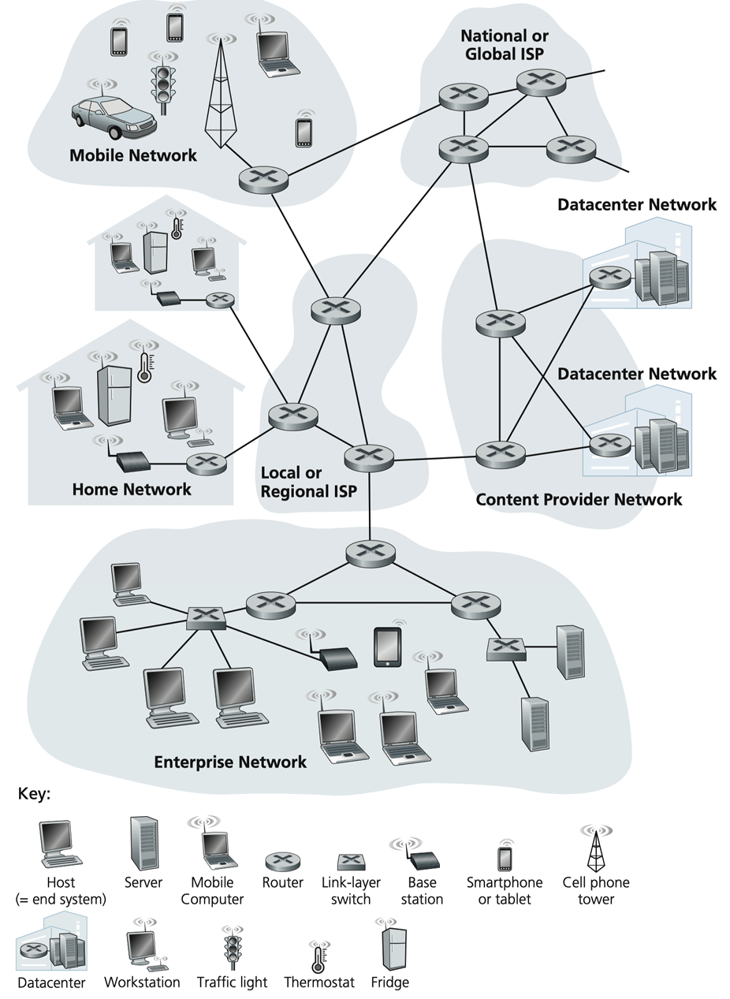

# 一、计算机网络基础
## 1.1 计算机网络的基本构成
| ##container## |
|:--:|
||

> - 主机(host）、端系统(end system)
> - 端系统通过通信链路（communicatelink）和分组交换机（packet switch）的网络连接在一起
> - 通信链路，不同的物理媒介组织的传输数据，以传输速率bit/s进行度量
> - 分组交换机主要由路由器（router）和链路层交换机（link-layer switch)

`计算机网络由若干节点和链接这些节点的链路组成`，网络中的节点可以是计算机、交换器、集线器或者路由器等能够进行网络通信的终端设备，链路是一个节点到另外一个节点所走过的物理路线。这些节点和链路彼此连接可以形成各种不同范围的网络，通过网络覆盖范围的大小，可以分为局域网、城域网和广域网。

- 局域网：一般指的是范围在几百到几公里办公楼或者校园内计算机相互连接成的计算机网络，一般用在狭小区域内的网络，一个社区、一栋楼、办公室经常使用局域网。

- 城域网：一个城市中的计算机所相互连接形成的计算机网络。城域网是介于广域网与局域网之间的一种高速网络。城域网设计的目标是要满足几千米范围内的大量企业、机关、公司的多个局域网互联的需求，以实现大量用户之间的数据、语音、图形与视频等多种信息的传输功能。

- 广域网：广域网中的计算机所形成的连接范围就更大了，常常是一个国家或是一个洲。其目的是为了让分布较远的各局域网互联。

## 1.2 计算机网络的历史

> 略

第⼀台网络交换机实现了在 ARPANET上的, 第⼀次数据传输，这标志着互联网的正式诞生。

> 我们经常在某篇⽂章结尾引⽤.rfc 或者与某⼈沟通，他提出了他不求甚解的 idea，然后你继续 追问他，他就让你⾃⼰查 RFC ⽂档，说的就是介个。
>
> 官⽅⼀点解释 RFC 就是描述互联⽹和互联⽹系统的⽅法、⾏为、研究或者创新的官⽅⽂档。
>
> 通俗⼀点就是：互联网协议的官方文档。

RFC（Request for Comments）最初是指互联网工程任务组（IETF）对于某项技术规范的草案发出⼀个评论请求，以便在该规范被发布前进行集体讨论和修订。随着时间的推移，RFC成为了⼀种广泛接受的互联⽹技术标准。

- https://www.rfc-editor.org/

## 1.3 互联网协议
<span style="color:gold">网络协议就是网络中（包括互联网）传递、管理信息的一些规范。如同人与人之间相互交流是需要遵循一定的规矩一样，计算机之间的相互通信需要共同遵守一定的规则，这些规则就称为网络协议。</span>

|网络体系结构|协议|主要用途|
|-|-|-|
|TCP/IP|HTTP、SMTP、TELNET、IP、ICMP、TCP、UDP等|主要用于互联网、局域网|
|IPX/SPX|IPX、NPC、SPX|主要用于个人电脑局域网|
|AppleTalk|AEP、ADP、DDP|苹果公司现有产品互联|

### 1.3.1 OSI标准模型
#### 1.3.1.1 需求分析
如今我们需要一个统一的协议, 解决计算机与计算机之间通信的问题.

- 保证主机到主机之间 数据无差错、数据身份正确、数据无丢失

1. 首先是最底层的硬件协议(电气协议), 比如多少电压是高/低电瓶, 这需要一个统一的协议. 这一层, 我们称为是`物理层`.

2. 然后是在物理层的基础上, 我们需要保证传输的数据无差错, 然后可以还需要身份识别(跟组网方式有关), 这是保证识别那些数据是我的, 那些数据是别人的, 从而只向上传递属于我们的数据. 这一层, 我们称为`数据链路层`.

3. `物理层`和`数据链路层`都是属于硬件层, 但是当时不同的厂商的硬件提供的身份结构可能不一致(历史问题), 因此我们加一个中间层: `把数据链路上不同身份转为同一个身份结构, 为上层提供统一的接口`. 这一层, 我们称为`网络层`.

4. 现在信息已经安全的传输到我们计算机上了; 但是我们计算机上运行着不止一种程序, 我们需要区分这个数据到底是给哪一个程序的. 即数据到应用层的分类、端到端的通信; 但是数据只是安全到达, 不是完整到达, 因此这一层还需要保证让`数据无丢失`(当然这个是**可选的**!!!). 这一层, 我们称为是`传输层`.

5. 综上现在数据已经安全的、完整的传输到计算机上了, 然后信息就可以被计算机上的各种程序进行解析处理了. 这一层, 我们称为`应用层`(不关心组网).

而上面的`1. 物理层`、`2. 数据链路层`实际上就是网卡嘛, 我们把它合并为一层, 叫做`物理接口层`.

而这四层, 就是大名鼎鼎的`TCP/IP`协议模型的四层!

```C++
应用层
传输层
网络层
物理接口层
```

而后面又来了个ISO的やつ, 说应用层这样不行.

又添加了两层:

- 会话层: 也就是进程管理

- 表示层: 就是数据加密解密的

> [!TIP]
> 实际上这两层完全可以由`应用层`负责...

然后ISO又把`物理接口层`展开了, 这个就是ISO 7层模型:

```C++
应用层
表示层
会话层
传输层
网络层
数据链路层
物理层
```

> [!NOTE]
> 值得注意的是, 上面的一些说法不是正确的!!! 只是暂时方便理解!!!